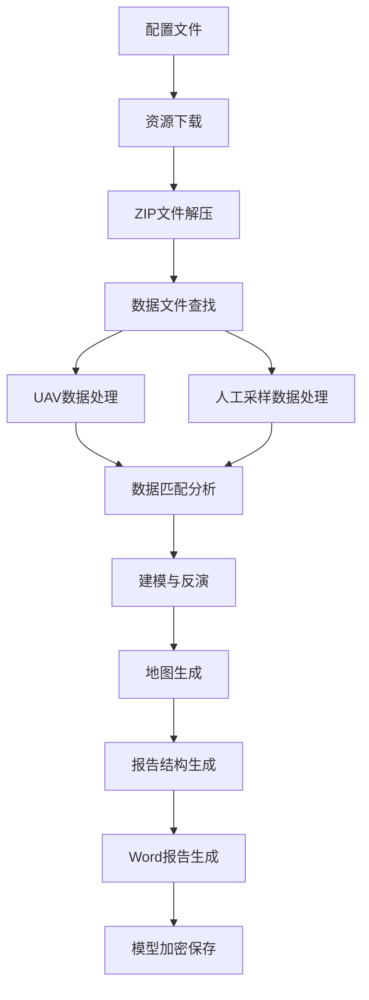

# AutoReportV3项目详细分析报告

## 1. 项目概述

AutoReportV3是一个专为AeroSpot机载光谱指数分析基站设计的自动化报告生成工具。该项目主要功能是处理无人机采集的光谱数据和人工采样数据，生成完整的水质监测分析报告。

### 1.1 项目基本信息
- **项目名称**: AeroSpot自动化报告生成工具V3
- **版本**: 3.0.0
- **开发语言**: Python 3.7+
- **架构模式**: 模块化架构
- **主要依赖**: python-docx, pandas, numpy, matplotlib, scikit-learn

### 1.2 核心功能
1. **数据下载与管理**: 从远程服务器下载数据资源，包括ZIP文件、图像和CSV数据
2. **数据处理与分析**: 处理无人机光谱数据和人工采样数据，进行匹配分析
3. **地图可视化**: 生成多种类型的水质分布图和插值热力图
4. **报告生成**: 自动生成包含图表、表格和分析内容的Word格式报告
5. **模型加密保存**: 将水质分析模型加密保存为二进制文件

## 2. 项目目录结构分析

```
AutoReportV3/
├── src/autoreport/          # 核心源代码包
│   ├── config/              # 配置管理模块
│   ├── document/            # 文档生成模块
│   ├── processor/           # 数据处理模块
│   ├── resources/           # 资源文件
│   ├── utils/               # 工具函数
│   ├── main.py              # 主程序入口
│   ├── generator.py         # 报告生成器
│   └── resource_manager.py  # 资源管理器
├── AutoReportResults/       # 输出结果目录
├── global_cache/           # 全局缓存目录
├── run.py                  # 运行入口文件
├── test.json               # 配置文件示例
└── pyproject.toml          # 项目配置文件
```

## 3. 核心模块分析

### 3.1 主程序模块 (main.py)

**核心类**: `AeroSpotReportGenerator`

**主要功能**:
- 初始化报告生成器，设置输出目录和配置
- 协调各个模块的执行流程
- 错误处理和日志记录

**执行流程**:
```
配置加载 → 资源下载 → 数据处理 → 地图生成 → 配置生成 → 报告生成 → 模型保存
```

**存在问题**:
- 方法过长，缺乏适当的拆分
- 错误处理依赖装饰器，可能掩盖具体错误信息
- 硬编码的超时和重试逻辑

### 3.2 数据处理模块 (processor/)

#### 3.2.1 数据处理器 (processor.py)
**主要功能**:
- 数据标准化和清洗
- 统计信息计算
- 航测数据与人工采样数据的匹配分析

**优点**:
- 模块化设计，职责清晰
- 支持多种数据格式

**问题**:
- 依赖外部库 `autowaterqualitymodeler`，增加了项目的复杂性
- 错误处理不够细粒度

#### 3.2.2 地图生成器 (maps.py)
**主要功能**:
- 生成散点分布图
- 创建插值热力图
- 生成国标等级分布图
- 支持透明背景和多种格式输出

**技术亮点**:
- 实现了Alpha Shape边界检测算法
- 支持PNG和SVG两种输出格式
- 集成国标GB 3838-2002水质分级标准

**问题**:
- 文件过长（1300+行），功能过于集中
- 缺少单元测试
- 硬编码的配置参数

### 3.3 配置管理模块 (config/)

#### 3.3.1 配置生成器 (config.py)
**功能**: 根据数据动态生成报告结构配置

**优点**:
- 支持动态章节生成
- 灵活的配置结构

**问题**:
- 配置逻辑复杂，难以维护
- 缺少配置模板和验证

#### 3.3.2 配置验证器 (config_validator.py)
**功能**: 验证配置文件的完整性和正确性

**问题**:
- 验证规则不够完善
- 错误只记录警告，不强制验证

### 3.4 文档生成模块 (document/)

**主要功能**:
- Word文档生成
- 样式管理
- 图表和表格插入

**优点**:
- 模块化的文档生成
- 支持复杂的格式设置

**问题**:
- 依赖python-docx库的特定版本
- 缺少文档模板管理

### 3.5 资源管理模块 (resource_manager.py)

**主要功能**:
- 资源下载和缓存
- 缓存过期管理
- 资源类型识别

**优点**:
- 实现了智能缓存机制
- 支持多种资源类型

**问题**:
- 缓存策略相对简单
- 缺少并发下载支持

## 4. 数据处理流程分析

### 4.1 数据流程图



### 4.2 关键算法

1. **Alpha Shape边界检测**: 用于生成复杂水域形状的边界
2. **RBF插值**: 实现空间数据的插值处理
3. **最近邻匹配**: 匹配航测点与人工采样点
4. **国标分级算法**: 根据GB 3838-2002标准进行水质等级划分

## 5. 架构设计问题识别

### 5.1 代码质量问题

1. **单一职责原则违反**
   - `main.py`中的`AeroSpotReportGenerator`类承担过多职责
   - `maps.py`文件过长，包含多个不相关的功能

2. **硬编码问题**
   - 配置参数散布在各个模块中
   - 魔法数字和字符串未提取为常量

3. **错误处理不统一**
   - 部分模块使用装饰器处理错误
   - 异常信息不够详细

### 5.2 性能问题

1. **内存使用**
   - 大型数据集处理时可能导致内存溢出
   - 缺少数据分块处理机制

2. **计算效率**
   - 插值算法在高分辨率下计算量大
   - 缺少并行处理支持

### 5.3 可维护性问题

1. **依赖管理**
   - 依赖外部库`autowaterqualitymodeler`
   - 缺少依赖版本锁定

2. **测试覆盖**
   - 缺少单元测试
   - 缺少集成测试

3. **文档不足**
   - API文档不完整
   - 缺少用户手册

## 6. 优化建议

### 6.1 架构重构建议

1. **模块化重构**
   ```python
   # 建议的新架构
   src/autoreport/
   ├── core/              # 核心业务逻辑
   ├── data/              # 数据处理
   ├── visualization/     # 可视化
   ├── report/            # 报告生成
   ├── config/            # 配置管理
   └── utils/             # 工具函数
   ```

2. **职责分离**
   - 将`AeroSpotReportGenerator`拆分为多个专门的服务类
   - 实现命令模式处理不同的操作

3. **依赖注入**
   - 使用依赖注入容器管理组件依赖
   - 降低模块间的耦合度

### 6.2 代码质量改进

1. **配置管理优化**
   ```python
   # 建议使用配置类
   @dataclass
   class ProcessingConfig:
       grid_resolution: int = 400
       interpolation_method: str = 'linear'
       cache_ttl: int = 86400
   ```

2. **错误处理统一**
   ```python
   # 建议的错误处理模式
   class ErrorHandler:
       @staticmethod
       def handle_data_error(error: Exception, context: str):
           logger.error(f"数据处理错误 [{context}]: {error}")
           raise DataProcessingError(f"处理失败: {context}")
   ```

3. **异步处理支持**
   ```python
   # 建议添加异步支持
   async def download_resources_async(self, urls: List[str]):
       tasks = [self.download_single_resource(url) for url in urls]
       return await asyncio.gather(*tasks)
   ```

### 6.3 性能优化建议

1. **内存优化**
   - 实现数据流式处理
   - 添加内存使用监控

2. **计算优化**
   - 使用多进程处理大数据集
   - 实现GPU加速的插值算法

3. **缓存优化**
   - 实现分级缓存策略
   - 添加缓存预热机制

### 6.4 扩展性改进

1. **插件化架构**
   ```python
   # 建议的插件接口
   class DataProcessorPlugin:
       def process(self, data: pd.DataFrame) -> pd.DataFrame:
           raise NotImplementedError
   ```

2. **配置模板化**
   - 支持多种报告模板
   - 实现模板继承机制

3. **国际化支持**
   - 添加多语言支持
   - 实现本地化的数据格式

## 7. 测试策略建议

### 7.1 单元测试
```python
# 建议的测试结构
tests/
├── unit/
│   ├── test_data_processor.py
│   ├── test_map_generator.py
│   └── test_config_validator.py
├── integration/
│   ├── test_report_generation.py
│   └── test_data_pipeline.py
└── fixtures/
    ├── sample_data.csv
    └── test_config.json
```

### 7.2 集成测试
- 端到端测试覆盖完整的处理流程
- 性能测试验证大数据集处理能力
- 兼容性测试确保跨平台运行

## 8. 部署和运维建议

### 8.1 容器化部署
```dockerfile
# 建议的Dockerfile
FROM python:3.9-slim
WORKDIR /app
COPY requirements.txt .
RUN pip install -r requirements.txt
COPY src/ ./src/
CMD ["python", "-m", "autoreport.main"]
```

### 8.2 监控和日志
- 实现结构化日志
- 添加性能指标监控
- 实现健康检查接口

## 9. 总结

AutoReportV3项目在功能实现上较为完整，能够满足基本的水质监测报告生成需求。但在代码质量、架构设计和可维护性方面存在较多改进空间：

**优势**:
- 功能完整，覆盖数据处理到报告生成的完整流程
- 技术栈选择合理，Python生态丰富
- 实现了复杂的地图可视化功能

**主要问题**:
- 代码结构需要重构，模块职责不够清晰
- 缺少测试覆盖，可维护性有待提高
- 性能优化空间较大，特别是大数据处理方面

**改进优先级**:
1. **高优先级**: 模块重构、错误处理统一、添加单元测试
2. **中优先级**: 性能优化、配置管理改进、文档完善
3. **低优先级**: 插件化架构、国际化支持、容器化部署

通过系统性的重构和优化，该项目可以发展成为一个高质量、可维护的水质监测报告生成平台。

---

*本分析报告基于AutoReportV3项目的当前代码状态生成，旨在为项目的进一步优化和重构提供参考。*