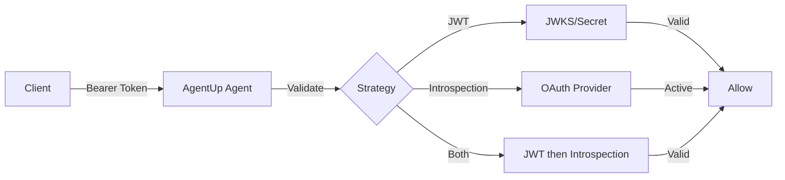

# OAuth2 Authentication

**Enterprise-grade authentication for production environments**

This comprehensive guide covers OAuth2 authentication in AgentUp, from basic JWT validation to advanced token introspection with popular OAuth2 providers.

## Table of Contents

- [Overview](#overview)
- [When to Use OAuth2](#when-to-use-oauth2)
- [Quick Setup](#quick-setup)
- [Configuration Options](#configuration-options)
- [Validation Strategies](#validation-strategies)
- [Popular Providers](#popular-providers)
- [Security Considerations](#security-considerations)
- [Troubleshooting](#troubleshooting)

## Overview

OAuth2 authentication in AgentUp provides enterprise-grade security with support for:

- **JWT Token Validation** with symmetric or asymmetric keys
- **Token Introspection** for real-time validation
- **JWKS Integration** for dynamic key management
- **Scope-Based Authorization** for fine-grained access control
- **Popular Provider Support** (Google, Auth0, Azure AD, GitHub)

### How It Works



## When to Use OAuth2

Choose OAuth2 authentication when you need:

| Scenario | OAuth2 Benefits |
|----------|-----------------|
| **Enterprise Integration** | Leverage existing OAuth2 infrastructure |
| **Third-Party Access** | Allow external applications to access your agent |
| **Fine-Grained Authorization** | Scope-based permissions (read, write, admin) |
| **Token Expiration** | Automatic token lifecycle management |
| **Audit Requirements** | Detailed user and scope tracking |
| **Multi-Tenant Systems** | Per-tenant authentication and authorization |

## Quick Setup

### Prerequisites

- An OAuth2 provider (or test setup)
- JWT token or introspection endpoint
- 10 minutes for setup

### Method 1: JWT Validation (Recommended)

For most use cases, JWT validation provides the best performance and security:

```yaml
security:
  enabled: true
  type: "oauth2"
  oauth2:
    validation_strategy: "jwt"
    jwks_url: "https://your-provider.com/.well-known/jwks.json"
    jwt_algorithm: "RS256"
    jwt_issuer: "https://your-provider.com"
    jwt_audience: "your-agent-id"
    required_scopes: ["agent:read"]
```

### Method 2: Token Introspection

For dynamic token validation or when you don't have access to JWT keys:

```yaml
security:
  enabled: true
  type: "oauth2"
  oauth2:
    validation_strategy: "introspection"
    client_id: "${OAUTH_CLIENT_ID}"
    client_secret: "${OAUTH_CLIENT_SECRET}"
    introspection_endpoint: "https://your-provider.com/oauth/introspect"
    required_scopes: ["api:access"]
```

### Testing Your Setup

1. **Start your agent**:
   ```bash
   uv run uvicorn src.agent.main:app --reload --port 8000
   ```

2. **Get an access token** from your OAuth2 provider

3. **Test authentication**:
   ```bash
   curl -H "Authorization: Bearer YOUR_ACCESS_TOKEN" \
        http://localhost:8000/agent/card
   ```

## Configuration Options

### Complete Configuration Reference

```yaml
security:
  enabled: true
  type: "oauth2"
  oauth2:
    # Validation Strategy (required)
    validation_strategy: "jwt"  # Options: jwt, introspection, both

    # JWT Validation (for jwt/both strategies)
    jwt_secret: "your-secret-key"  # For symmetric algorithms (HS256)
    jwks_url: "https://provider.com/.well-known/jwks.json"  # For asymmetric (RS256)
    jwt_algorithm: "RS256"  # HS256, HS384, HS512, RS256, RS384, RS512, ES256, ES384, ES512
    jwt_issuer: "https://your-oauth-provider.com"  # Token issuer validation
    jwt_audience: "your-agent-id"  # Token audience validation

    # Token Introspection (for introspection/both strategies)
    client_id: "${OAUTH_CLIENT_ID}"
    client_secret: "${OAUTH_CLIENT_SECRET}"
    introspection_endpoint: "https://provider.com/oauth/introspect"

    # Authorization (optional)
    required_scopes: ["agent:read", "agent:write"]  # Must have all these scopes
    allowed_scopes: ["agent:read", "agent:write", "agent:admin"]  # Scope whitelist
```

### Environment Variables

For security, use environment variables for sensitive values:

```bash
# .env file
OAUTH_CLIENT_ID=your-client-id
OAUTH_CLIENT_SECRET=your-client-secret
JWT_SECRET=your-jwt-secret
```

```yaml
# agent_config.yaml
security:
  enabled: true
  type: "oauth2"
  oauth2:
    client_id: "${OAUTH_CLIENT_ID}"
    client_secret: "${OAUTH_CLIENT_SECRET}"
    jwt_secret: "${JWT_SECRET:default-secret}"
```

## Validation Strategies

### 1. JWT Validation (`validation_strategy: "jwt"`)

**Best for**: High-performance applications, offline validation

**How it works**:
1. Receives Bearer token in Authorization header
2. Verifies JWT signature using JWKS or shared secret
3. Validates issuer, audience, and expiration
4. Extracts user ID and scopes from claims

**Performance**: Fastest (no external calls)
**Security**: High (cryptographic verification)

```yaml
oauth2:
  validation_strategy: "jwt"
  jwks_url: "https://provider.com/.well-known/jwks.json"  # Recommended
  # OR
  jwt_secret: "shared-secret-key"  # For HS256 algorithms
```

### 2. Token Introspection (`validation_strategy: "introspection"`)

**Best for**: Real-time token status, revocation support

**How it works**:
1. Receives Bearer token in Authorization header
2. Calls provider's introspection endpoint
3. Validates token is active and not revoked
4. Extracts user information from response

**Performance**: Slower (external API call)
**Security**: Highest (real-time validation)

```yaml
oauth2:
  validation_strategy: "introspection"
  client_id: "your-client-id"
  client_secret: "your-client-secret"
  introspection_endpoint: "https://provider.com/oauth/introspect"
```

### 3. Hybrid (`validation_strategy: "both"`)

**Best for**: Balance of performance and security

**How it works**:
1. First tries JWT validation (fast)
2. Falls back to introspection if JWT fails
3. Provides best of both approaches

**Performance**: Fast with fallback
**Security**: High with real-time backup

```yaml
oauth2:
  validation_strategy: "both"
  jwks_url: "https://provider.com/.well-known/jwks.json"
  client_id: "your-client-id"
  client_secret: "your-client-secret"
  introspection_endpoint: "https://provider.com/oauth/introspect"
```

## Popular Providers

### Google OAuth2

```yaml
security:
  enabled: true
  type: "oauth2"
  oauth2:
    validation_strategy: "jwt"
    jwks_url: "https://www.googleapis.com/oauth2/v3/certs"
    jwt_algorithm: "RS256"
    jwt_issuer: "https://accounts.google.com"
    jwt_audience: "your-google-client-id.apps.googleusercontent.com"
    required_scopes: ["openid", "email"]
```

**Getting tokens**: Use Google's OAuth2 flow or service account keys.

### Auth0

```yaml
security:
  enabled: true
  type: "oauth2"
  oauth2:
    validation_strategy: "jwt"
    jwks_url: "https://YOUR_DOMAIN.auth0.com/.well-known/jwks.json"
    jwt_algorithm: "RS256"
    jwt_issuer: "https://YOUR_DOMAIN.auth0.com/"
    jwt_audience: "your-auth0-api-identifier"
    required_scopes: ["read:agents", "write:agents"]
```

**Setup**: Create an API in Auth0 dashboard and configure scopes.

### Microsoft Azure AD

```yaml
security:
  enabled: true
  type: "oauth2"
  oauth2:
    validation_strategy: "jwt"
    jwks_url: "https://login.microsoftonline.com/TENANT_ID/discovery/v2.0/keys"
    jwt_algorithm: "RS256"
    jwt_issuer: "https://login.microsoftonline.com/TENANT_ID/v2.0"
    jwt_audience: "your-azure-app-id"
    required_scopes: ["api://your-app-id/Agent.Read"]
```

**Setup**: Register your app in Azure AD and configure API permissions.

### GitHub Apps (Introspection)

```yaml
security:
  enabled: true
  type: "oauth2"
  oauth2:
    validation_strategy: "introspection"
    client_id: "${GITHUB_CLIENT_ID}"
    client_secret: "${GITHUB_CLIENT_SECRET}"
    introspection_endpoint: "https://api.github.com/applications/${GITHUB_CLIENT_ID}/token"
```

**Note**: GitHub uses a custom introspection format. Scopes are managed through app permissions.

## Security Considerations

### Best Practices

1. **Use HTTPS Only**: OAuth2 tokens must be transmitted over HTTPS in production
2. **Short Token Lifetimes**: Configure tokens to expire within 1-24 hours
3. **Scope Minimization**: Only request and accept minimum required scopes
4. **Secure Storage**: Never log or store access tokens
5. **Rate Limiting**: Implement rate limiting for token validation endpoints

### AgentUp Security Features

- **Constant-Time Comparison**: All token comparisons use `secrets.compare_digest()`
- **Generic Error Messages**: All auth failures return "Unauthorized" (no information leakage)
- **Audit Logging**: All authentication attempts are logged for monitoring
- **Input Validation**: Comprehensive validation of all OAuth2 configuration parameters

### Common Security Pitfalls

| Don't Do | Do Instead |
|-------------|---------------|
| Use HTTP in production | Always use HTTPS |
| Log access tokens | Log only token metadata (user ID, scopes) |
| Accept any scope | Define and validate required scopes |
| Use weak JWT secrets | Use strong, randomly generated secrets |
| Skip token expiration | Validate `exp` claim in JWT tokens |

## Troubleshooting

### Common Issues

#### Issue: "Unauthorized" with Valid Token

**Possible Causes**:
- JWT signature verification failed
- Token expired
- Incorrect issuer or audience
- Missing required scopes

**Debug Steps**:
1. Check agent logs for specific error details
2. Verify token with [jwt.io](https://jwt.io)
3. Confirm JWKS URL is accessible
4. Validate issuer and audience match configuration

#### Issue: "Invalid JWT key not found in JWKS"

**Solution**:
- Verify JWKS URL is correct and accessible
- Check that token `kid` (key ID) exists in JWKS
- Ensure token algorithm matches JWKS key algorithm

#### Issue: Token Introspection Failing

**Possible Causes**:
- Incorrect client credentials
- Wrong introspection endpoint
- Network connectivity issues

**Debug Steps**:
1. Test introspection endpoint manually:
   ```bash
   curl -u "client_id:client_secret" \
        -d "token=YOUR_TOKEN" \
        https://provider.com/oauth/introspect
   ```
2. Verify client credentials are correct
3. Check network connectivity and firewall rules

### Debug Configuration

Enable debug logging to troubleshoot OAuth2 issues:

```python
import logging
logging.getLogger("src.agent.security").setLevel(logging.DEBUG)
```

### Testing Tools

#### Generate Test JWT Tokens

```python
# test_jwt.py
import time
from authlib.jose import jwt

payload = {
    "sub": "test-user",
    "iss": "https://test-provider.com",
    "aud": "test-agent",
    "iat": int(time.time()),
    "exp": int(time.time()) + 3600,
    "scope": "agent:read agent:write"
}

token = jwt.encode({"alg": "HS256", "typ": "JWT"}, payload, "test-secret")
print(token)
```

#### Validate Configuration

```bash
# Test configuration validation
uv run python -c "
from src.agent.security import validate_security_config
config = {
    'enabled': True,
    'type': 'oauth2',
    'oauth2': {
        'validation_strategy': 'jwt',
        'jwt_secret': 'test-secret'
    }
}
try:
    validate_security_config(config)
    print('Configuration valid')
except Exception as e:
    print(f'Configuration error: {e}')
"
```

## Next Steps

### Advanced Configuration
- **[Multiple Authentication Types](../configuration/security.md#multiple-auth)**
- **[Custom Scope Validation](../reference/custom-auth.md#scopes)**
- **[Token Caching Strategies](../configuration/middleware.md#caching)**

### Integration Examples
- **[Google Workspace Integration](../examples/google-workspace.md)**
- **[Microsoft 365 Integration](../examples/microsoft-365.md)**
- **[Multi-Tenant SaaS](../examples/multi-tenant.md)**

### Production Deployment
- **[Environment Configuration](../examples/enterprise-agent.md#oauth2)**
- **[Monitoring and Alerts](../configuration/middleware.md#monitoring)**
- **[High Availability Setup](../examples/ha-deployment.md)**

---

**Quick Links:**
- [Authentication Overview](quick-start.md)
- [Provider Examples](providers.md)
- [Troubleshooting Guide](../troubleshooting/authentication.md)
- [Configuration Reference](../reference/config-schema.md#oauth2)