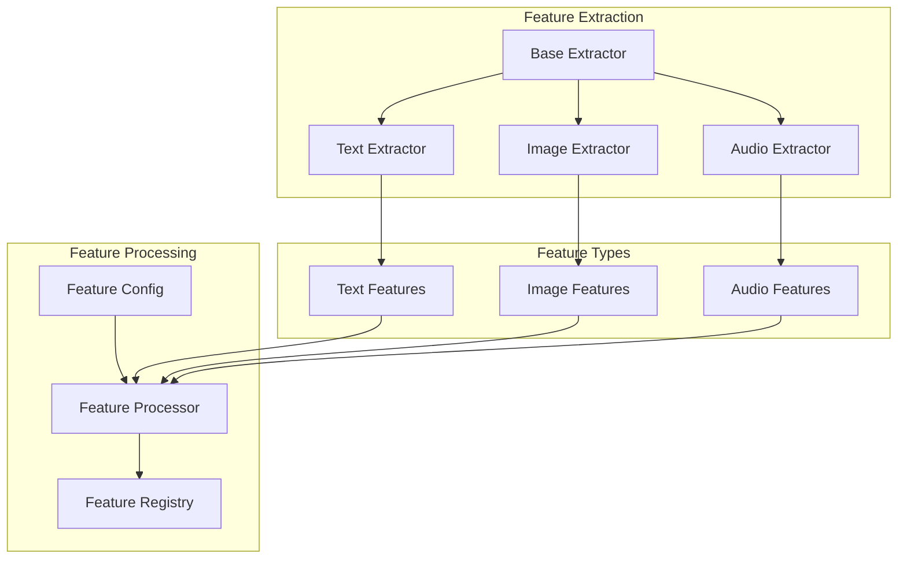
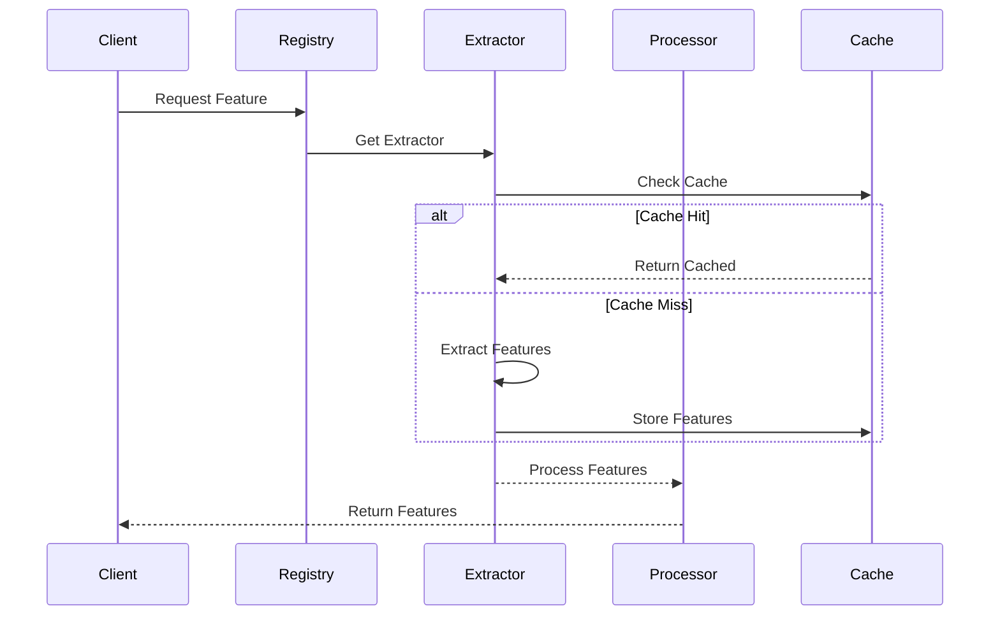
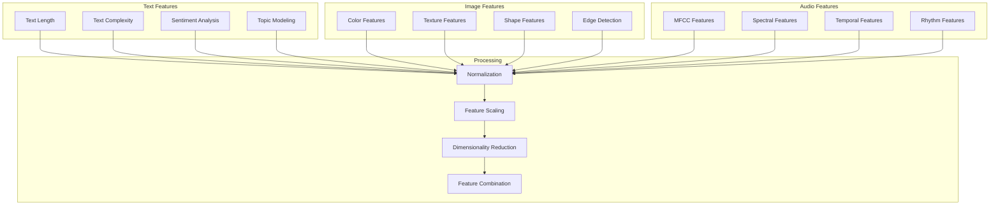
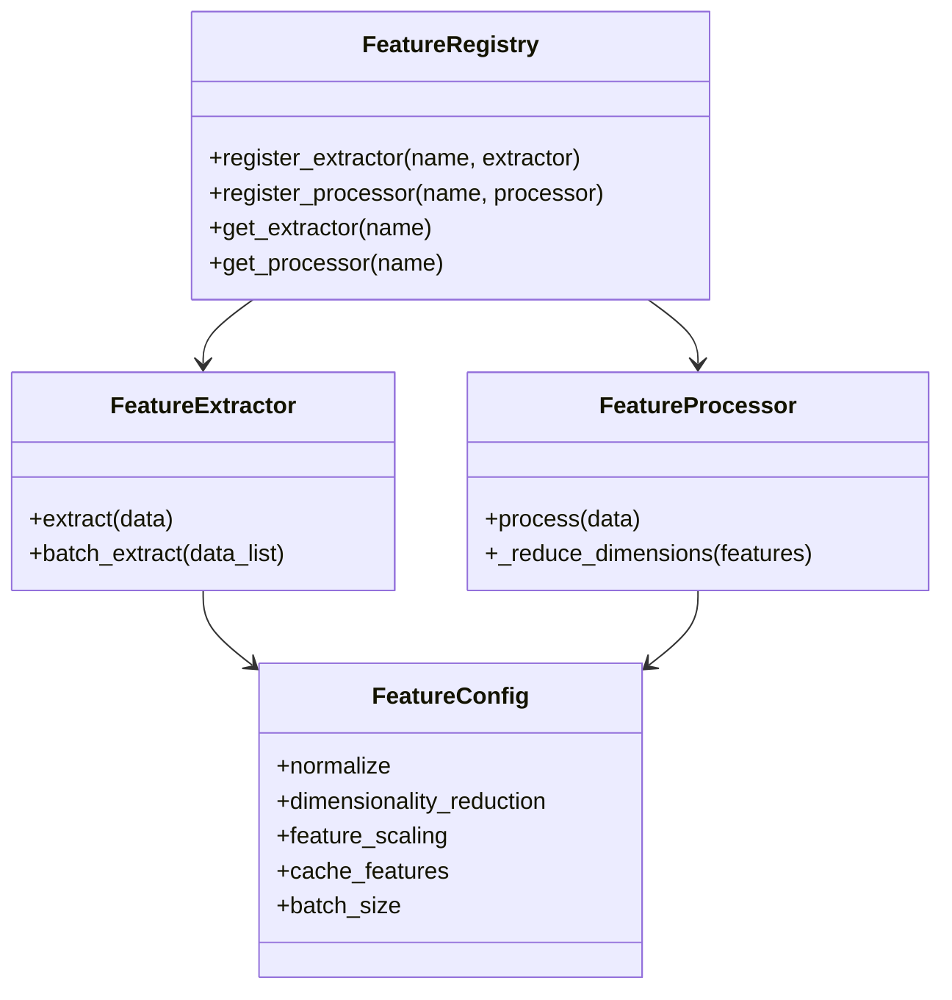

# Feature Extraction and Processing

## Feature System Architecture

```mermaid
graph TB
    subgraph "Feature Extraction"
        Base[Base Extractor]
        Text[Text Extractor]
        Image[Image Extractor]
        Audio[Audio Extractor]
    end
    
    subgraph "Feature Processing"
        Config[Feature Config]
        Processor[Feature Processor]
        Registry[Feature Registry]
    end
    
    subgraph "Feature Types"
        TextFeatures[Text Features]
        ImageFeatures[Image Features]
        AudioFeatures[Audio Features]
    end
    
    Base --> Text
    Base --> Image
    Base --> Audio
    
    Text --> TextFeatures
    Image --> ImageFeatures
    Audio --> AudioFeatures
    
    Config --> Processor
    Processor --> Registry
    
    TextFeatures --> Processor
    ImageFeatures --> Processor
    AudioFeatures --> Processor
```

## Feature Extraction Flow

```mermaid
sequenceDiagram
    participant Client
    participant Registry
    participant Extractor
    participant Processor
    participant Cache
    
    Client->>Registry: Request Feature
    Registry->>Extractor: Get Extractor
    Extractor->>Cache: Check Cache
    alt Cache Hit
        Cache-->>Extractor: Return Cached
    else Cache Miss
        Extractor->>Extractor: Extract Features
        Extractor->>Cache: Store Features
    end
    Extractor-->>Processor: Process Features
    Processor-->>Client: Return Features
```

## Feature Types and Processing

```mermaid
flowchart TD
    subgraph "Text Features"
        Length[Text Length]
        Complexity[Text Complexity]
        Sentiment[Sentiment Analysis]
        Topics[Topic Modeling]
    end
    
    subgraph "Image Features"
        Color[Color Features]
        Texture[Texture Features]
        Shape[Shape Features]
        Edges[Edge Detection]
    end
    
    subgraph "Audio Features"
        MFCC[MFCC Features]
        Spectral[Spectral Features]
        Temporal[Temporal Features]
        Rhythm[Rhythm Features]
    end
    
    subgraph "Processing"
        Normalize[Normalization]
        Scale[Feature Scaling]
        Reduce[Dimensionality Reduction]
        Combine[Feature Combination]
    end
    
    Length --> Normalize
    Complexity --> Normalize
    Sentiment --> Normalize
    Topics --> Normalize
    
    Color --> Normalize
    Texture --> Normalize
    Shape --> Normalize
    Edges --> Normalize
    
    MFCC --> Normalize
    Spectral --> Normalize
    Temporal --> Normalize
    Rhythm --> Normalize
    
    Normalize --> Scale
    Scale --> Reduce
    Reduce --> Combine
```

## Feature Registry

```mermaid
classDiagram
    class FeatureRegistry {
        +register_extractor(name, extractor)
        +register_processor(name, processor)
        +get_extractor(name)
        +get_processor(name)
    }
    
    class FeatureExtractor {
        +extract(data)
        +batch_extract(data_list)
    }
    
    class FeatureProcessor {
        +process(data)
        +_reduce_dimensions(features)
    }
    
    class FeatureConfig {
        +normalize
        +dimensionality_reduction
        +feature_scaling
        +cache_features
        +batch_size
    }
    
    FeatureRegistry --> FeatureExtractor
    FeatureRegistry --> FeatureProcessor
    FeatureExtractor --> FeatureConfig
    FeatureProcessor --> FeatureConfig
``` 