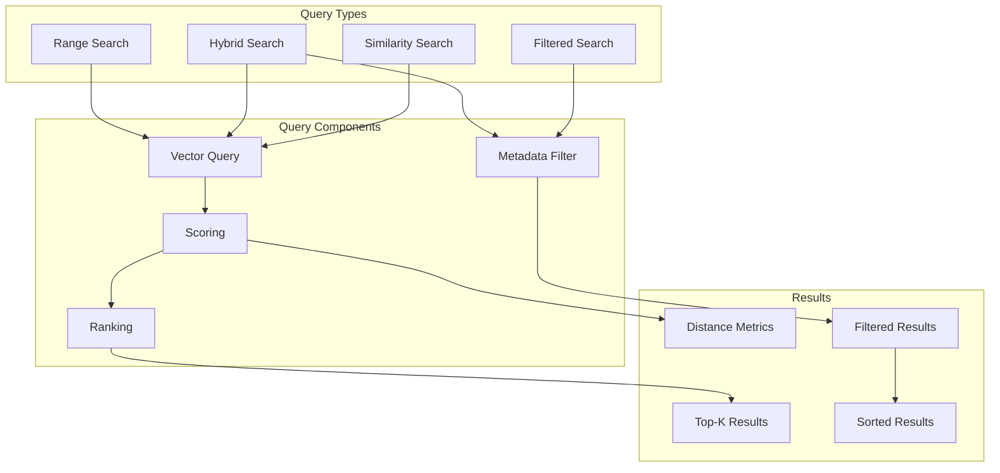
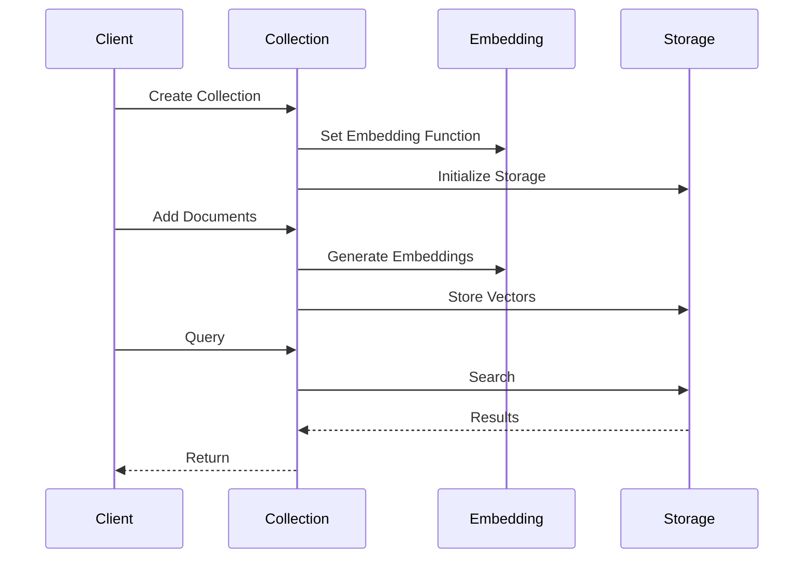
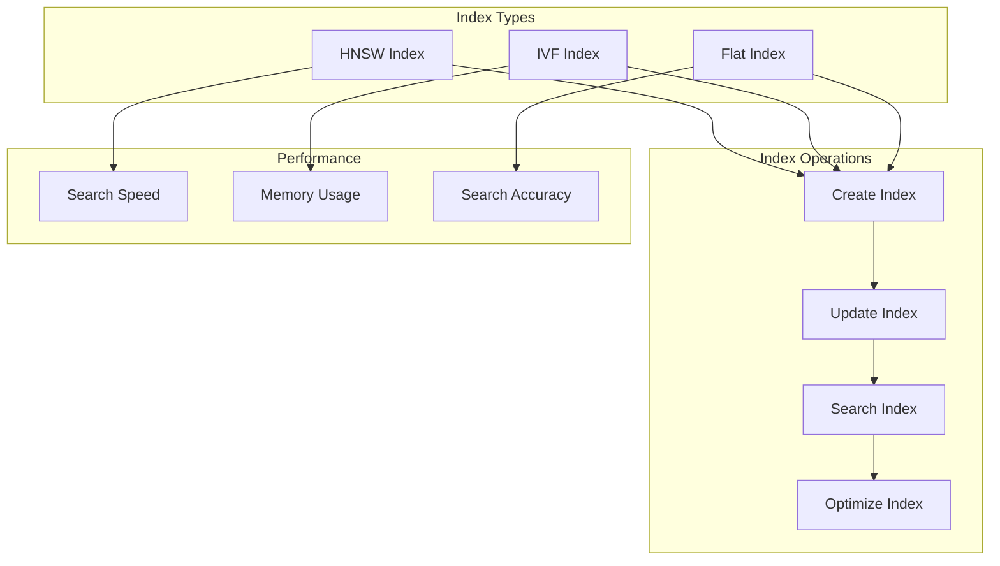
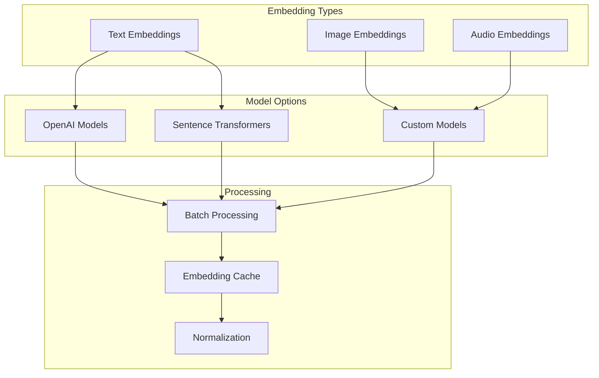
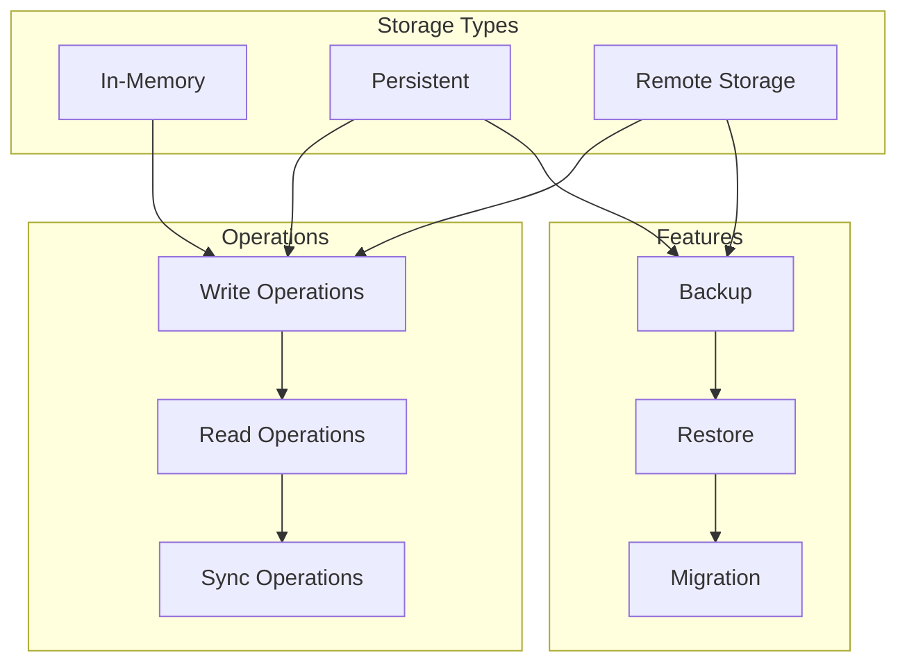

# Chroma Features

## Query Operations

```mermaid
graph TB
    subgraph "Query Types"
        Similarity[Similarity Search]
        Filter[Filtered Search]
        Hybrid[Hybrid Search]
        Range[Range Search]
    end
    
    subgraph "Query Components"
        Vector[Vector Query]
        Metadata[Metadata Filter]
        Score[Scoring]
        Rank[Ranking]
    end
    
    subgraph "Results"
        TopK[Top-K Results]
        Distance[Distance Metrics]
        Filtered[Filtered Results]
        Sorted[Sorted Results]
    end
    
    Similarity --> Vector
    Filter --> Metadata
    Hybrid --> Vector
    Hybrid --> Metadata
    Range --> Vector
    
    Vector --> Score
    Metadata --> Filtered
    Score --> Rank
    
    Rank --> TopK
    Score --> Distance
    Filtered --> Sorted
```

## Collection Management

```mermaid
sequenceDiagram
    participant Client
    participant Collection
    participant Embedding
    participant Storage
    
    Client->>Collection: Create Collection
    Collection->>Embedding: Set Embedding Function
    Collection->>Storage: Initialize Storage
    
    Client->>Collection: Add Documents
    Collection->>Embedding: Generate Embeddings
    Collection->>Storage: Store Vectors
    
    Client->>Collection: Query
    Collection->>Storage: Search
    Storage-->>Collection: Results
    Collection-->>Client: Return
```

## Index Management

```mermaid
flowchart TD
    subgraph "Index Types"
        HNSW[HNSW Index]
        IVF[IVF Index]
        Flat[Flat Index]
    end
    
    subgraph "Index Operations"
        Create[Create Index]
        Update[Update Index]
        Search[Search Index]
        Optimize[Optimize Index]
    end
    
    subgraph "Performance"
        Speed[Search Speed]
        Memory[Memory Usage]
        Accuracy[Search Accuracy]
    end
    
    HNSW --> Create
    IVF --> Create
    Flat --> Create
    
    Create --> Update
    Update --> Search
    Search --> Optimize
    
    HNSW --> Speed
    IVF --> Memory
    Flat --> Accuracy
```

## Embedding Functions

```mermaid
graph TB
    subgraph "Embedding Types"
        Text[Text Embeddings]
        Image[Image Embeddings]
        Audio[Audio Embeddings]
    end
    
    subgraph "Model Options"
        OpenAI[OpenAI Models]
        Sentence[Sentence Transformers]
        Custom[Custom Models]
    end
    
    subgraph "Processing"
        Batch[Batch Processing]
        Cache[Embedding Cache]
        Normalize[Normalization]
    end
    
    Text --> OpenAI
    Text --> Sentence
    Image --> Custom
    Audio --> Custom
    
    OpenAI --> Batch
    Sentence --> Batch
    Custom --> Batch
    
    Batch --> Cache
    Cache --> Normalize
```

## Storage and Persistence

```mermaid
flowchart TD
    subgraph "Storage Types"
        Memory[In-Memory]
        Disk[Persistent]
        Remote[Remote Storage]
    end
    
    subgraph "Operations"
        Write[Write Operations]
        Read[Read Operations]
        Sync[Sync Operations]
    end
    
    subgraph "Features"
        Backup[Backup]
        Restore[Restore]
        Migrate[Migration]
    end
    
    Memory --> Write
    Disk --> Write
    Remote --> Write
    
    Write --> Read
    Read --> Sync
    
    Disk --> Backup
    Remote --> Backup
    Backup --> Restore
    Restore --> Migrate
``` 