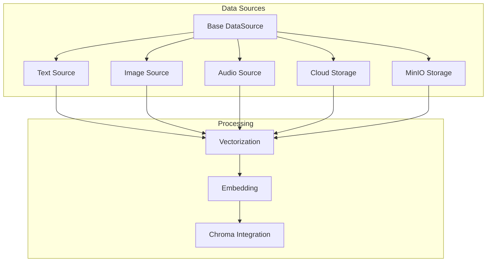
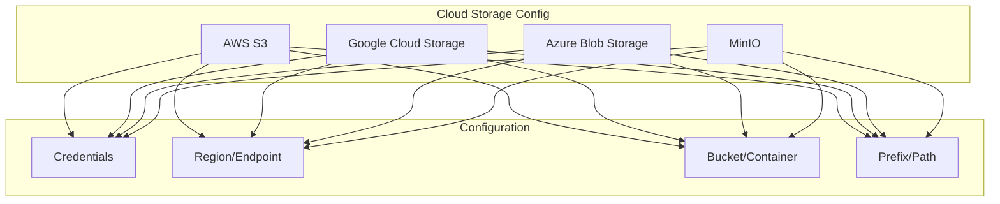
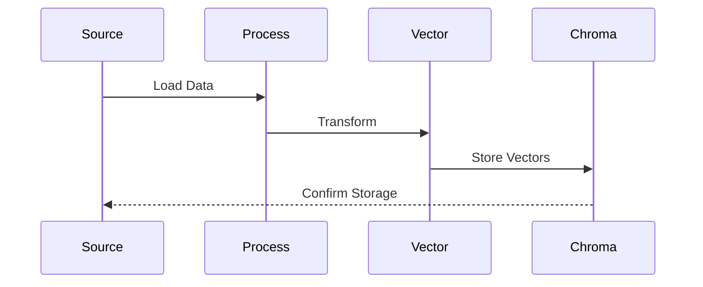
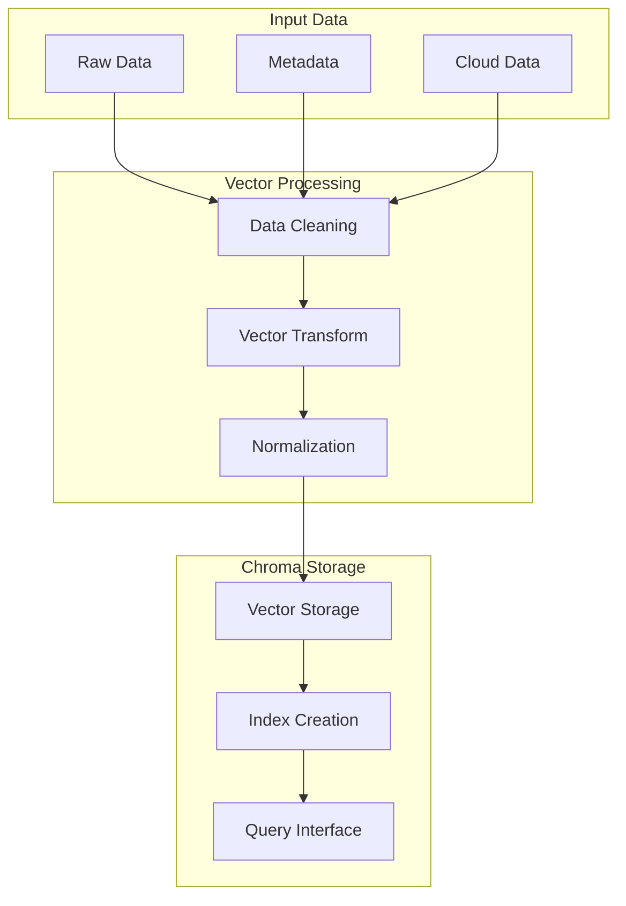

# Data Sources

## Data Source Hierarchy



## Cloud Storage Configuration



## Data Processing Flow



## Vector Operations



## Cloud Storage Configuration Details

### AWS S3 Configuration
```yaml
cloud_storage:
  aws:
    access_key: "your_access_key"
    secret_key: "your_secret_key"
    region: "us-west-2"
    bucket: "your-bucket"
    prefix: "data/"
    endpoint: null  # Optional for custom endpoints
```

### Google Cloud Storage Configuration
```yaml
cloud_storage:
  gcp:
    credentials_file: "path/to/credentials.json"
    project_id: "your-project-id"
    bucket: "your-bucket"
    prefix: "data/"
```

### Azure Blob Storage Configuration
```yaml
cloud_storage:
  azure:
    connection_string: "your_connection_string"
    container: "your-container"
    prefix: "data/"
```

### MinIO Configuration
```yaml
cloud_storage:
  minio:
    endpoint: "minio.example.com:9000"
    access_key: "your_access_key"
    secret_key: "your_secret_key"
    bucket: "your-bucket"
    prefix: "data/"
    secure: true  # Use SSL/TLS
```

## MinIO Features

### 1. Object Storage
- S3-compatible API
- Bucket management
- Object versioning
- Lifecycle policies

### 2. Data Management
- Automatic data replication
- Data encryption
- Access control
- Bucket policies

### 3. Integration Features
- S3-compatible client
- Web console
- API access
- Event notifications

### 4. Performance
- High throughput
- Low latency
- Scalable storage
- Caching support

## Usage Example

```python
from ai_prishtina_vectordb.data_sources import CloudDataSource, MinioDataSource

# Using MinIO
minio_config = {
    "endpoint": "minio.example.com:9000",
    "access_key": "your_access_key",
    "secret_key": "your_secret_key",
    "bucket": "your-bucket",
    "prefix": "data/"
}

minio_source = MinioDataSource(config=minio_config)
data = minio_source.load_data()

# Using AWS S3
s3_config = {
    "access_key": "your_access_key",
    "secret_key": "your_secret_key",
    "region": "us-west-2",
    "bucket": "your-bucket",
    "prefix": "data/"
}

s3_source = CloudDataSource(provider="aws", config=s3_config)
data = s3_source.load_data()
```

## Best Practices

1. **Security:**
   - Use environment variables for credentials
   - Implement proper access controls
   - Enable encryption for sensitive data
   - Regular credential rotation

2. **Performance:**
   - Use appropriate chunk sizes
   - Implement caching where needed
   - Monitor storage usage
   - Optimize network settings

3. **Data Management:**
   - Implement versioning
   - Set up lifecycle policies
   - Regular backup procedures
   - Data cleanup routines

4. **Monitoring:**
   - Track storage usage
   - Monitor access patterns
   - Set up alerts
   - Log important operations 

from ai_prishtina_vectordb.data_sources import DataSource

# Initialize data source
source = DataSource()

# Stream from a large CSV file
for batch in source.stream_data(
    source="large_data.csv",
    text_column="content",
    metadata_columns=["source", "date"],
    batch_size=1000
):
    # Process each batch
    documents = batch["documents"]
    metadatas = batch["metadatas"]
    ids = batch["ids"]
    
    # Do something with the batch
    process_batch(documents, metadatas, ids)

# Stream from cloud storage
for batch in source.stream_data(
    source="s3://my-bucket/data/",
    text_column="text",
    metadata_columns=["source", "bucket"],
    batch_size=500
):
    # Process each batch
    process_batch(batch["documents"], batch["metadatas"], batch["ids"]) 