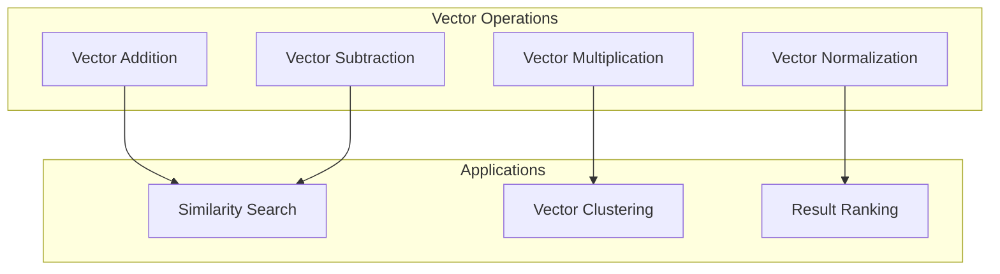
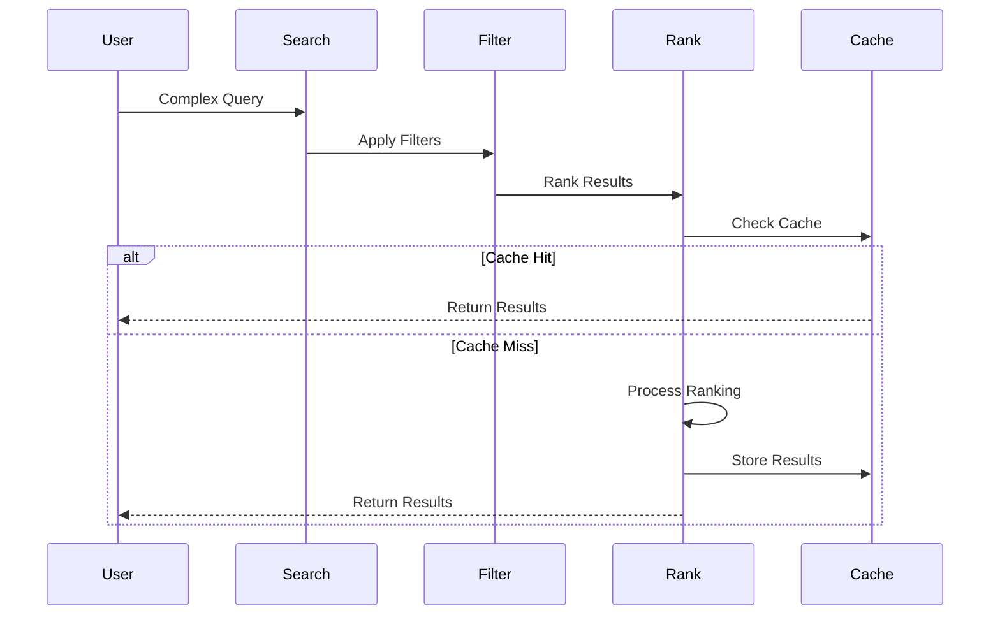
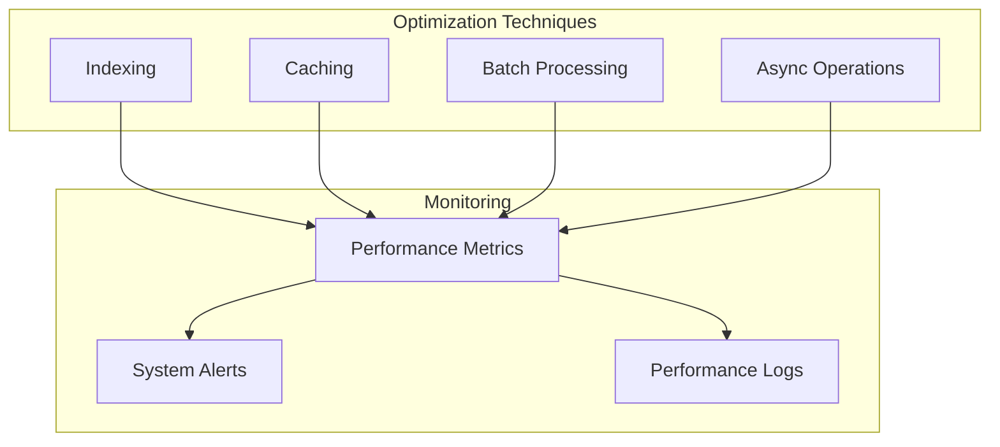
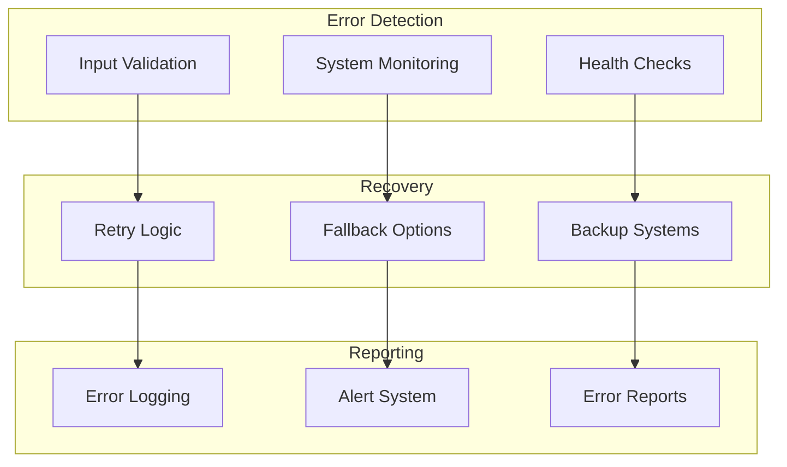

# Advanced Features and Workflows

## Vector Operations

```mermaid
flowchart TD
    subgraph "Vector Operations"
        Add[Vector Addition]
        Sub[Vector Subtraction]
        Mul[Vector Multiplication]
        Norm[Vector Normalization]
    end
    
    subgraph "Applications"
        Similarity[Similarity Search]
        Clustering[Vector Clustering]
        Ranking[Result Ranking]
    end
    
    Add --> Similarity
    Sub --> Similarity
    Mul --> Clustering
    Norm --> Ranking
```

## Advanced Search Features

```mermaid
sequenceDiagram
    participant User
    participant Search
    participant Filter
    participant Rank
    participant Cache
    
    User->>Search: Complex Query
    Search->>Filter: Apply Filters
    Filter->>Rank: Rank Results
    Rank->>Cache: Check Cache
    alt Cache Hit
        Cache-->>User: Return Results
    else Cache Miss
        Rank->>Rank: Process Ranking
        Rank->>Cache: Store Results
        Rank-->>User: Return Results
    end
```

## Performance Optimization

```mermaid
graph TB
    subgraph "Optimization Techniques"
        Index[Indexing]
        Cache[Caching]
        Batch[Batch Processing]
        Async[Async Operations]
    end
    
    subgraph "Monitoring"
        Metrics[Performance Metrics]
        Alerts[System Alerts]
        Logs[Performance Logs]
    end
    
    Index --> Metrics
    Cache --> Metrics
    Batch --> Metrics
    Async --> Metrics
    Metrics --> Alerts
    Metrics --> Logs
```

## Error Handling and Recovery

```mermaid
flowchart TD
    subgraph "Error Detection"
        Validate[Input Validation]
        Monitor[System Monitoring]
        Check[Health Checks]
    end
    
    subgraph "Recovery"
        Retry[Retry Logic]
        Fallback[Fallback Options]
        Backup[Backup Systems]
    end
    
    subgraph "Reporting"
        Log[Error Logging]
        Alert[Alert System]
        Report[Error Reports]
    end
    
    Validate --> Retry
    Monitor --> Fallback
    Check --> Backup
    Retry --> Log
    Fallback --> Alert
    Backup --> Report
``` 