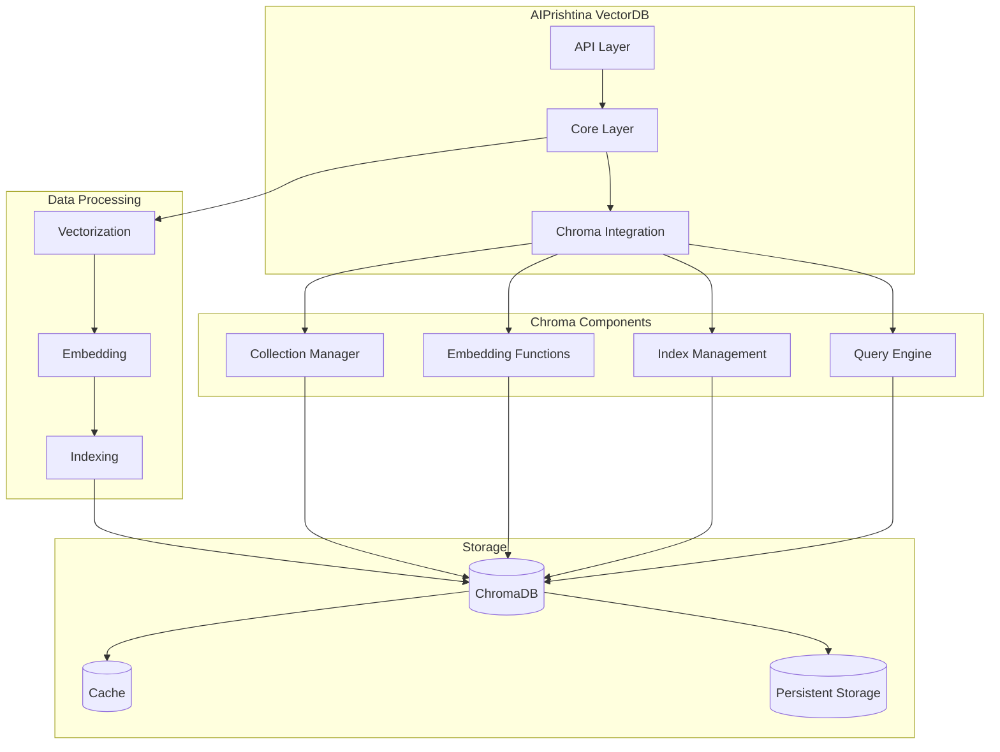
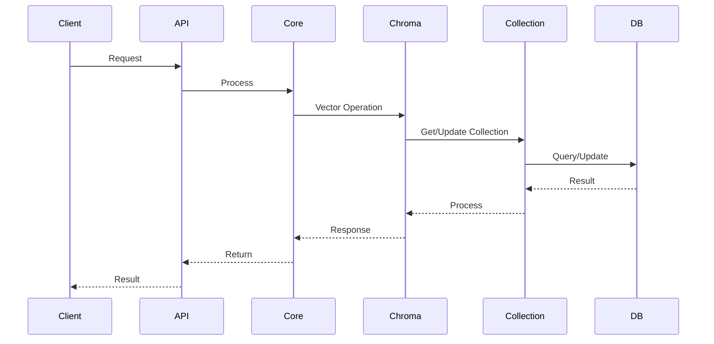
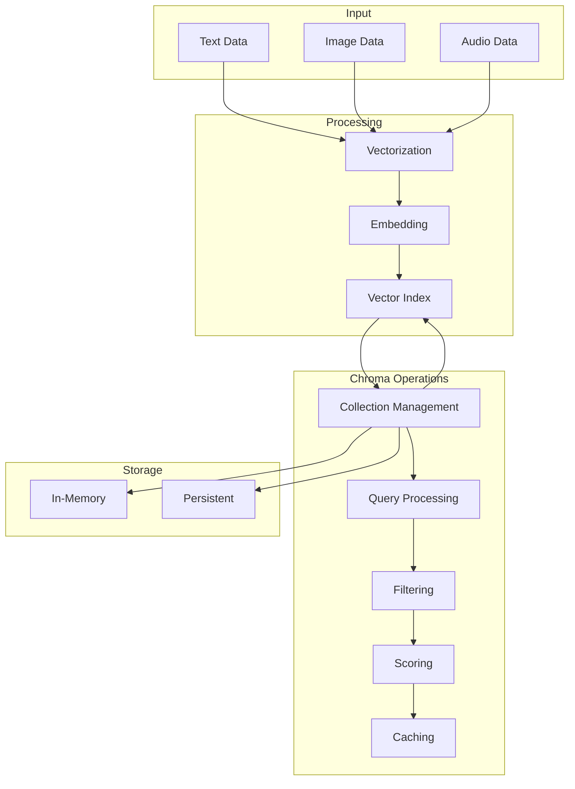
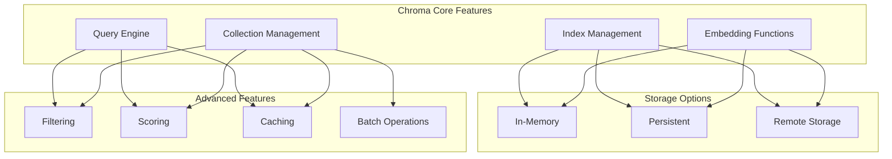

# Architecture

## Core Architecture

```mermaid
graph TB
    subgraph "AIPrishtina VectorDB"
        API[API Layer]
        Core[Core Layer]
        Chroma[Chroma Integration]
    end
    
    subgraph "Data Processing"
        Vector[Vectorization]
        Embed[Embedding]
        Index[Indexing]
    end
    
    subgraph "Chroma Components"
        Collection[Collection Manager]
        Embedding[Embedding Functions]
        Indexing[Index Management]
        Query[Query Engine]
    end
    
    subgraph "Storage"
        ChromaDB[(ChromaDB)]
        Cache[(Cache)]
        Persist[(Persistent Storage)]
    end
    
    API --> Core
    Core --> Chroma
    Core --> Vector
    Vector --> Embed
    Embed --> Index
    Index --> ChromaDB
    
    Chroma --> Collection
    Chroma --> Embedding
    Chroma --> Indexing
    Chroma --> Query
    
    Collection --> ChromaDB
    Embedding --> ChromaDB
    Indexing --> ChromaDB
    Query --> ChromaDB
    
    ChromaDB --> Cache
    ChromaDB --> Persist
```

## Component Interaction

```mermaid
sequenceDiagram
    participant Client
    participant API
    participant Core
    participant Chroma
    participant Collection
    participant DB
    
    Client->>API: Request
    API->>Core: Process
    Core->>Chroma: Vector Operation
    Chroma->>Collection: Get/Update Collection
    Collection->>DB: Query/Update
    DB-->>Collection: Result
    Collection-->>Chroma: Process
    Chroma-->>Core: Response
    Core-->>API: Return
    API-->>Client: Result
```

## Data Flow

```mermaid
flowchart TD
    subgraph "Input"
        Text[Text Data]
        Image[Image Data]
        Audio[Audio Data]
    end
    
    subgraph "Processing"
        Vector[Vectorization]
        Embed[Embedding]
        Index[Indexing]
    end
    
    subgraph "Chroma Operations"
        Collection[Collection Management]
        Query[Query Processing]
        Filter[Filtering]
        Score[Scoring]
        Cache[Caching]
    end
    
    subgraph "Storage"
        Memory[In-Memory]
        Disk[Persistent]
        Index[Vector Index]
    end
    
    Text --> Vector
    Image --> Vector
    Audio --> Vector
    Vector --> Embed
    Embed --> Index
    Index --> Collection
    
    Collection --> Query
    Query --> Filter
    Filter --> Score
    Score --> Cache
    
    Collection --> Memory
    Collection --> Disk
    Collection --> Index
```

## Chroma Features

```mermaid
graph TB
    subgraph "Chroma Core Features"
        Collection[Collection Management]
        Embedding[Embedding Functions]
        Query[Query Engine]
        Index[Index Management]
    end
    
    subgraph "Advanced Features"
        Filter[Filtering]
        Score[Scoring]
        Cache[Caching]
        Batch[Batch Operations]
    end
    
    subgraph "Storage Options"
        Memory[In-Memory]
        Disk[Persistent]
        Remote[Remote Storage]
    end
    
    Collection --> Filter
    Collection --> Score
    Collection --> Cache
    Collection --> Batch
    
    Embedding --> Memory
    Embedding --> Disk
    Embedding --> Remote
    
    Query --> Filter
    Query --> Score
    Query --> Cache
    
    Index --> Memory
    Index --> Disk
    Index --> Remote
``` 