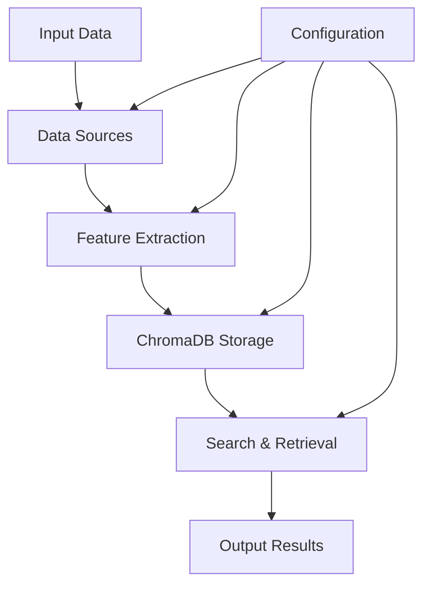
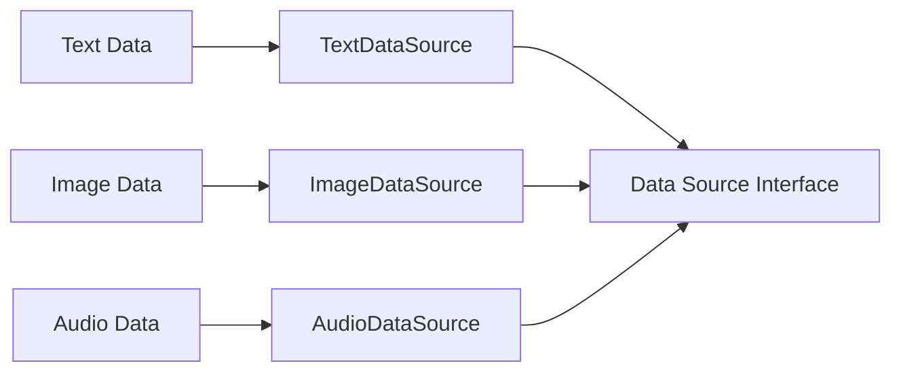
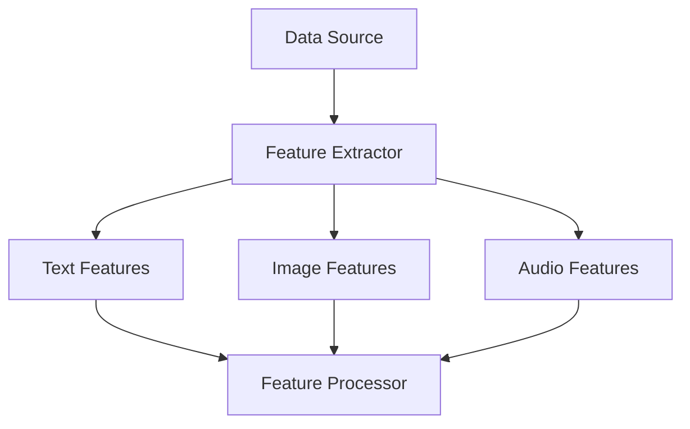
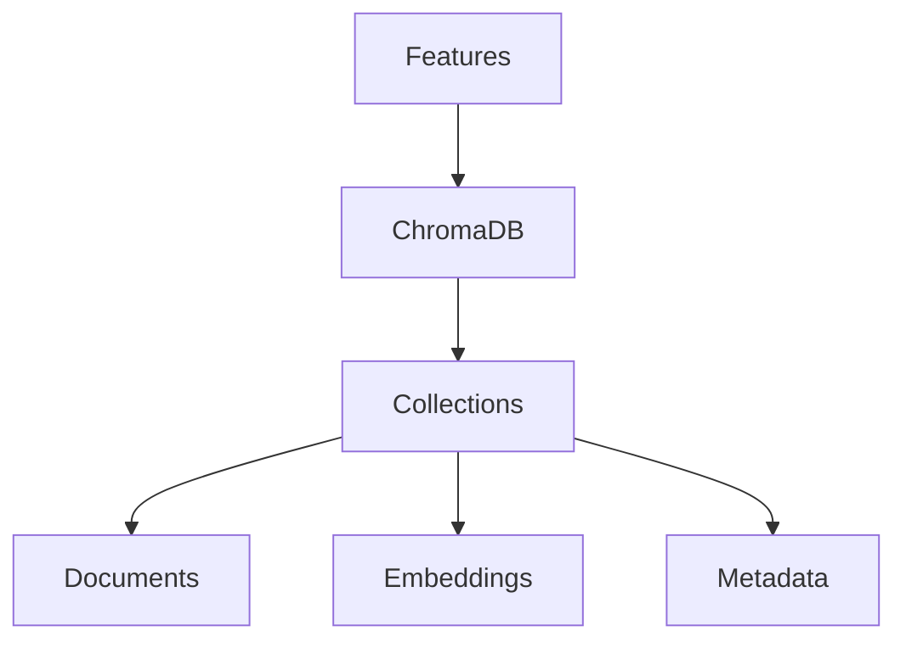
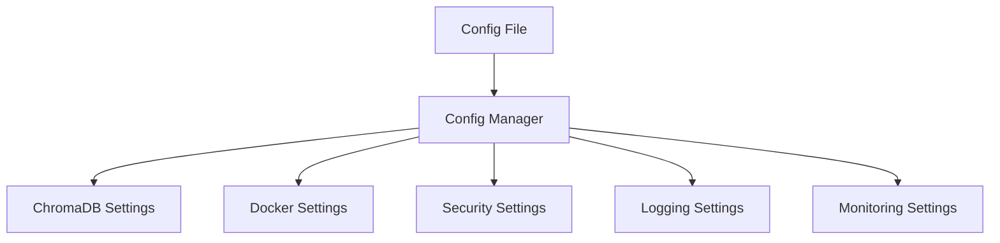
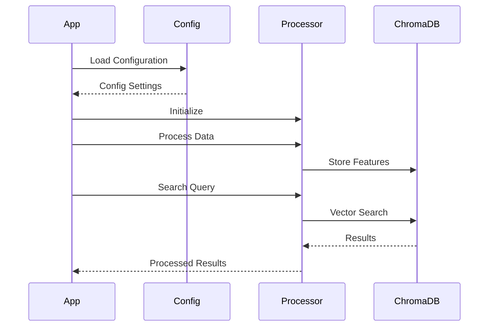
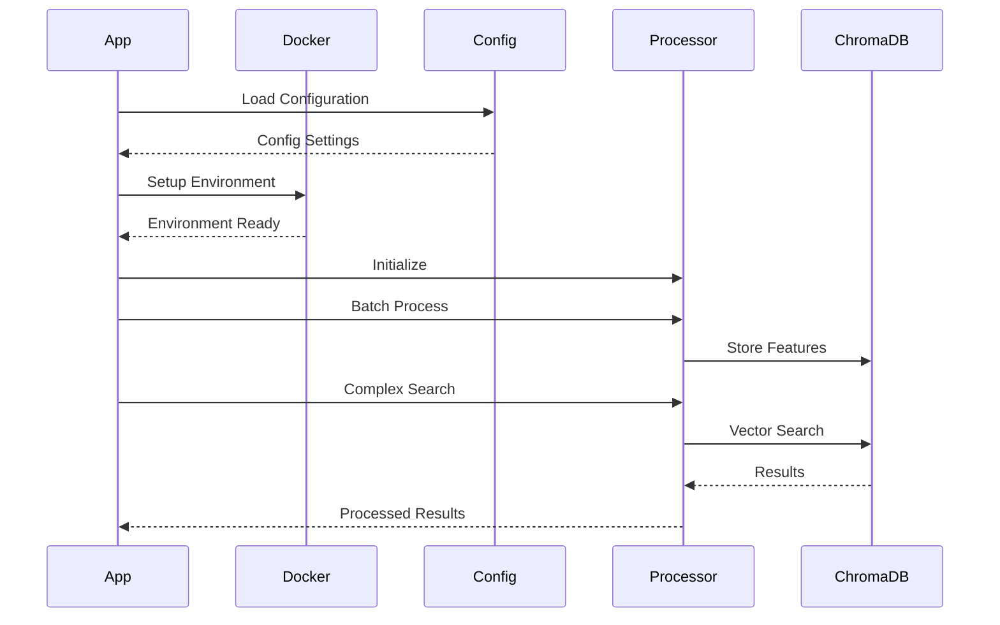

# AIPrishtina VectorDB Library Flow

## Overview
This document provides a detailed explanation of the flow and components of the AIPrishtina VectorDB library, from input to output, and the various customization points.

## System Architecture

## Detailed Flow

### 1. Input Layer

**Customization Points:**
- Create custom data sources by implementing the `DataSource` interface
- Add metadata to any data source
- Support for batch processing
- File-based or in-memory data loading

### 2. Feature Extraction

**Customization Points:**
- Choose embedding models
- Configure feature extraction parameters
- Add custom feature extractors
- Adjust batch sizes and processing options

### 3. Storage Layer

**Customization Points:**
- Collection configuration
- Persistence options
- Index settings
- Memory management

### 4. Search & Retrieval

**Customization Points:**
- Search parameters
- Result filtering
- Similarity metrics
- Ranking algorithms

## Configuration Flow

**Configuration Options:**
1. **ChromaDB Settings:**
   - Server configuration
   - Collection settings
   - Embedding models
   - Performance parameters

2. **Docker Settings:**
   - Container configuration
   - Resource limits
   - Volume management
   - Network settings

3. **Security Settings:**
   - Authentication
   - SSL/TLS
   - API keys
   - Access control

4. **Logging Settings:**
   - Log levels
   - Output formats
   - File management
   - Rotation policies

5. **Monitoring Settings:**
   - Metrics collection
   - Health checks
   - Alert thresholds
   - Performance monitoring

## Usage Flow

### Basic Usage

### Advanced Usage

## Customization Points

### 1. Data Processing
- Custom data sources
- Feature extraction methods
- Batch processing options
- Metadata handling

### 2. Storage
- Collection management
- Index configuration
- Persistence options
- Memory optimization

### 3. Search
- Query processing
- Result filtering
- Ranking algorithms
- Similarity metrics

### 4. Deployment
- Docker configuration
- Resource management
- Scaling options
- Monitoring setup

## Best Practices

1. **Configuration:**
   - Use YAML for complex configurations
   - Keep sensitive data in environment variables
   - Validate configurations before use

2. **Data Processing:**
   - Use batch processing for large datasets
   - Implement proper error handling
   - Monitor memory usage

3. **Search:**
   - Optimize query parameters
   - Use appropriate filters
   - Implement caching when needed

4. **Deployment:**
   - Use Docker in production
   - Configure proper resource limits
   - Set up monitoring and alerts

## Performance Considerations

1. **Memory Usage:**
   - Monitor batch sizes
   - Configure appropriate cache sizes
   - Use streaming for large datasets

2. **Processing Speed:**
   - Optimize feature extraction
   - Use appropriate batch sizes
   - Configure parallel processing

3. **Search Performance:**
   - Index optimization
   - Query caching
   - Result limiting

4. **Storage:**
   - Collection management
   - Index maintenance
   - Data cleanup 