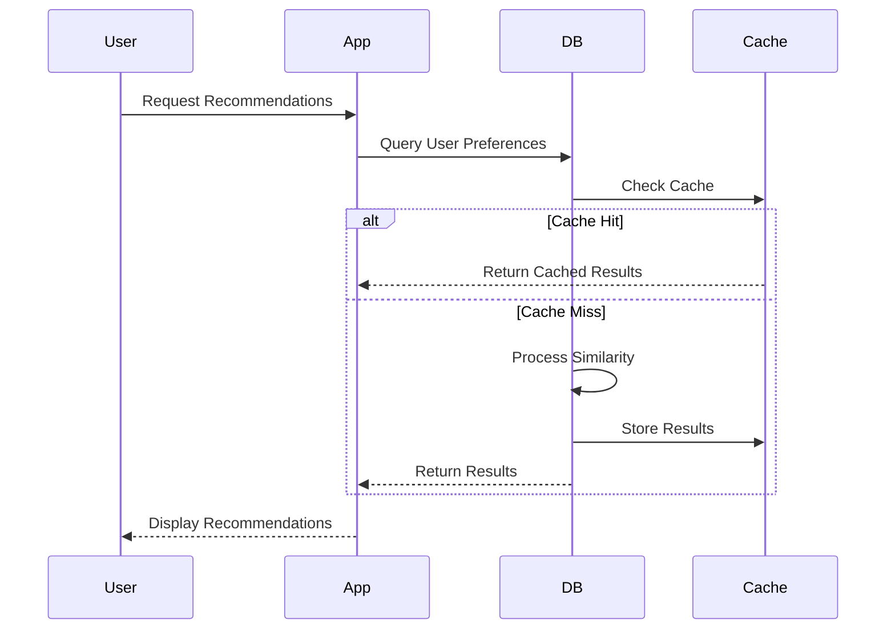
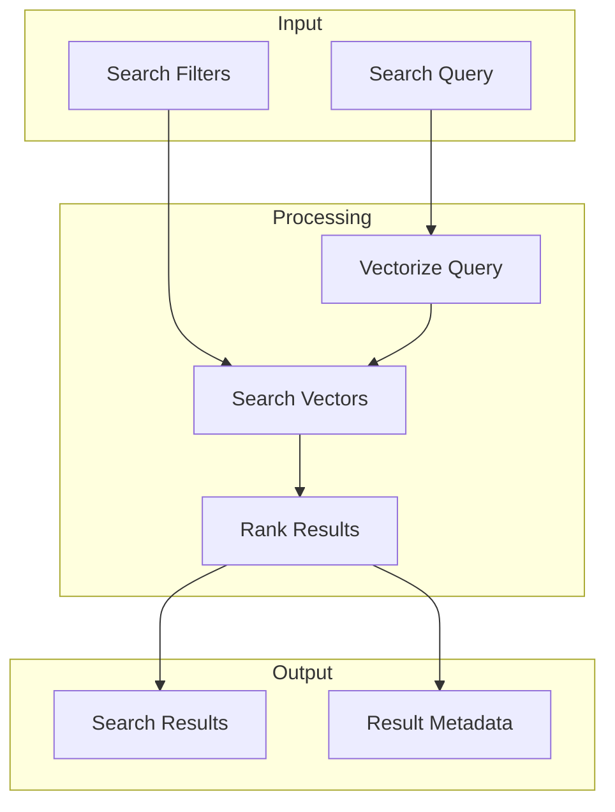
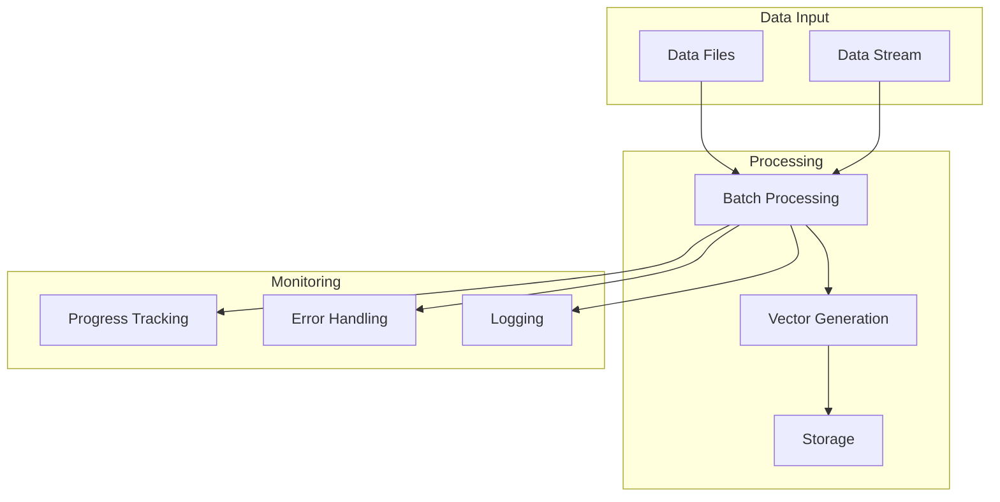
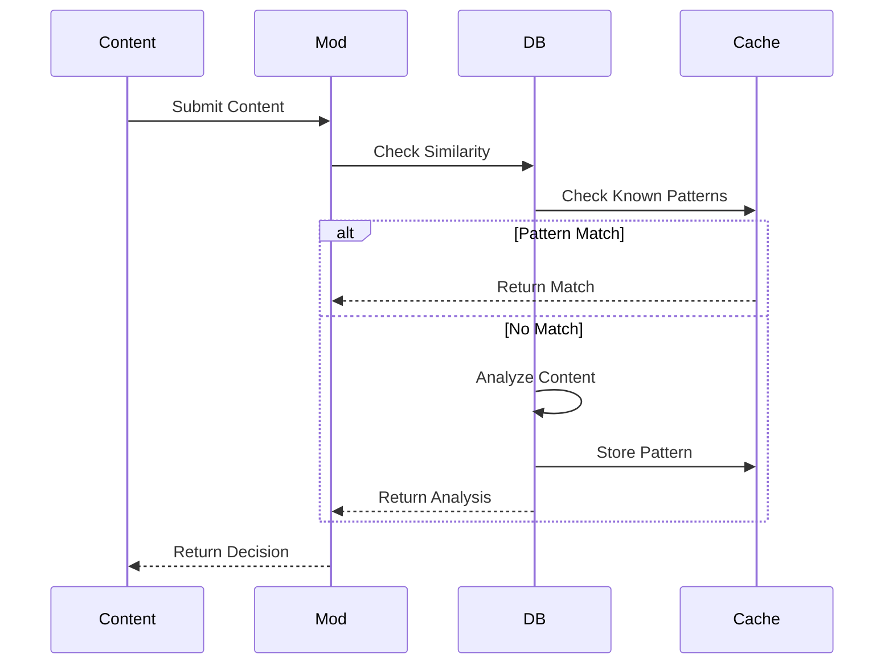

# Common Use Cases

## Recommendation System Flow

```mermaid
sequenceDiagram
    participant User
    participant App
    participant DB
    participant Cache
    
    User->>App: Request Recommendations
    App->>DB: Query User Preferences
    DB->>Cache: Check Cache
    alt Cache Hit
        Cache-->>App: Return Cached Results
    else Cache Miss
        DB->>DB: Process Similarity
        DB->>Cache: Store Results
        DB-->>App: Return Results
    end
    App-->>User: Display Recommendations
```

## Semantic Search Flow

```mermaid
flowchart TD
    subgraph "Input"
        Query[Search Query]
        Filters[Search Filters]
    end
    
    subgraph "Processing"
        Vectorize[Vectorize Query]
        Search[Search Vectors]
        Rank[Rank Results]
    end
    
    subgraph "Output"
        Results[Search Results]
        Metadata[Result Metadata]
    end
    
    Query --> Vectorize
    Filters --> Search
    Vectorize --> Search
    Search --> Rank
    Rank --> Results
    Rank --> Metadata
```

## Batch Processing Flow

```mermaid
graph TB
    subgraph "Data Input"
        Files[Data Files]
        Stream[Data Stream]
    end
    
    subgraph "Processing"
        Batch[Batch Processing]
        Vector[Vector Generation]
        Store[Storage]
    end
    
    subgraph "Monitoring"
        Progress[Progress Tracking]
        Errors[Error Handling]
        Logs[Logging]
    end
    
    Files --> Batch
    Stream --> Batch
    Batch --> Vector
    Vector --> Store
    Batch --> Progress
    Batch --> Errors
    Batch --> Logs
```

## Content Moderation Flow

```mermaid
sequenceDiagram
    participant Content
    participant Mod
    participant DB
    participant Cache
    
    Content->>Mod: Submit Content
    Mod->>DB: Check Similarity
    DB->>Cache: Check Known Patterns
    alt Pattern Match
        Cache-->>Mod: Return Match
    else No Match
        DB->>DB: Analyze Content
        DB->>Cache: Store Pattern
        DB-->>Mod: Return Analysis
    end
    Mod-->>Content: Return Decision
``` 