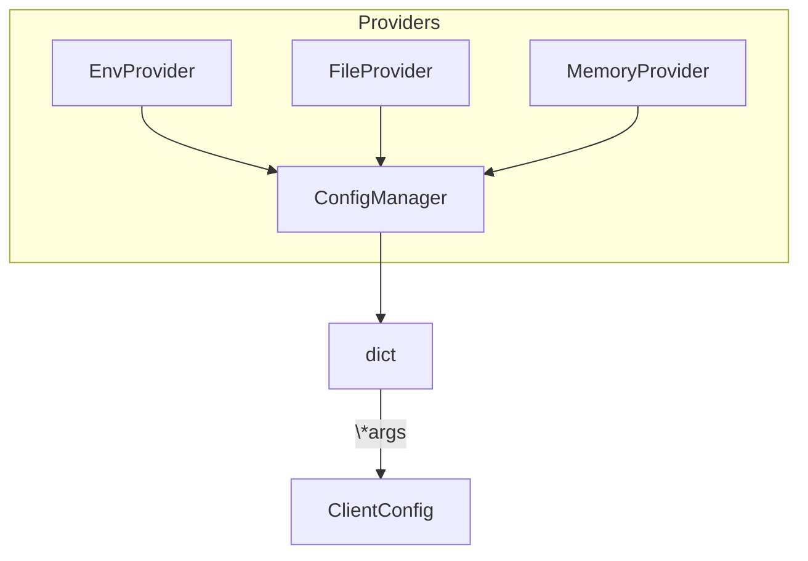
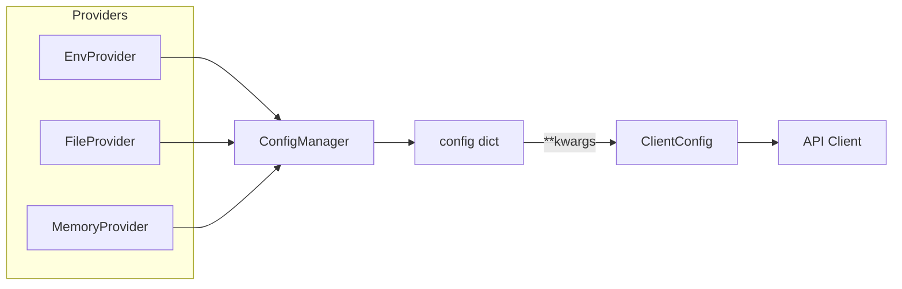

# apiconfig.config

## Module Description

`ClientConfig` encapsulates options for API clients, including hostname, API
version, headers, timeouts, and authentication settings. A `ConfigManager`
collects these values by loading configuration dictionaries from one or more
providers and returning a unified mapping ready for consumption.

Configuration providers supply configuration from sources like environment
variables or JSON files. Providers are processed in the order given, and each
dictionary merges into the next so later providers override earlier ones. This
strategy supports flexible layering, letting environment-specific data trump
defaults while still keeping predictable precedence.

The configuration module works alongside packages such as `auth` and
`exceptions`. Providers deliver raw dictionaries, the manager merges them, and
`ClientConfig` validates and exposes the final settings that the rest of the
library relies on.

Core configuration system for **apiconfig**.  This module exposes the `ClientConfig`
class used by API clients and the `ConfigManager` which coordinates loading of
configuration values from one or more providers.

## Navigation
- [apiconfig](../README.md)
- [providers](./providers/README.md)

## Contents
- `base.py` – `ClientConfig` with helpers for merging settings and constructing `base_url`.
- `manager.py` – `ConfigManager` that merges dictionaries from multiple providers.
- `providers/` – built‑in configuration providers such as `EnvProvider` and `FileProvider`.
- `__init__.py` – re‑exports the main classes for convenience.

## Usage Examples

### Basic
```python
from apiconfig.config import ClientConfig

config = ClientConfig(hostname="api.example.com", version="v1")
print(config.base_url)
```

### Advanced
```python
from apiconfig.config import ClientConfig, ConfigManager
from apiconfig.config.providers import EnvProvider, FileProvider

providers = [EnvProvider(prefix="MYAPP_"), FileProvider("config.json")]
manager = ConfigManager(providers)
config_data = manager.load_config()

config = ClientConfig(**config_data)
print(config.base_url)
```

## Key classes
| Class | Description | Key Methods |
| ----- | ----------- | ----------- |
| `ClientConfig` | Stores hostname, API version, headers, timeouts and authentication strategy. | `base_url()`, `merge()` |
| `ConfigManager` | Loads configuration from providers and merges them in order. | `load_config()` |
| `EnvProvider` | Reads configuration from environment variables. | `load()` |
| `FileProvider` | Reads configuration from JSON files. | `load()` |
| `MemoryProvider` | Supplies in-memory configuration data. | `get_config()` |

### Design
The manager and providers follow a simple **Strategy** style. Each provider
defines a `load()` (or `get_config()`) method returning a dictionary. The
`ConfigManager` merges these dictionaries in sequence so later providers override
previous ones.



## Architecture
The overall configuration flow is illustrated below:



## Tests
Install dependencies and run the unit tests for the configuration package:
```bash
poetry install --with dev
poetry run pytest tests/unit/config -q
```

## Dependencies
Standard library modules:
- `os`
- `json`

Internal modules:
- `apiconfig.exceptions`
- `apiconfig.auth`

## Status

**Stability:** Stable
**API Version:** 0.3.2
**Deprecations:** None

### Maintenance Notes
- Considered stable with occasional updates for new configuration sources.

### Changelog
- See the project changelog for release notes affecting configuration behavior.

### Future Considerations
- Potential support for dynamic configuration providers.

## See Also
- [auth](../auth/README.md) - describes available authentication strategies used by `ClientConfig`.
- [exceptions](../exceptions/README.md) - lists configuration-related errors raised when loading settings.
