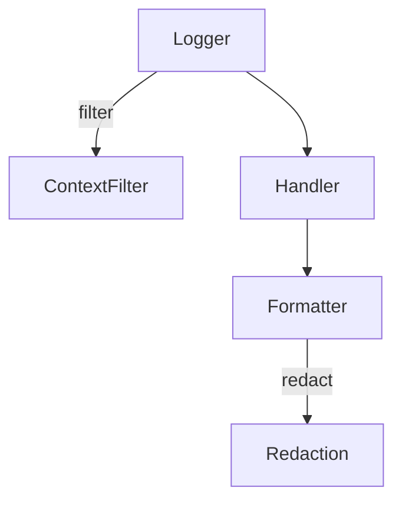

# apiconfig.utils.logging

Logging helpers used across **apiconfig**. This package bundles custom
formatters, context filters and convenience functions for setting up redacted
logging output.

## Module Description

The logging utilities build on the redaction helpers to provide safe and
context-rich output. Custom formatters such as `RedactingFormatter` apply the
redaction functions to scrub sensitive values before emitting a log message.
Handlers like `ConsoleHandler` make these formatters easy to wire up while
staying compatible with the standard `logging` handlers. Thread-local context
filters add request or user metadata to log records so that each entry carries
useful debugging information.

## Navigation

**Parent Module:** [apiconfig.utils](../README.md)

**Submodules:**
- [formatters](./formatters/README.md) - Custom log formatters

## Contents
- `filters.py` – thread-local `ContextFilter` and helper functions for log context.
- `handlers.py` – `ConsoleHandler` and `RedactingStreamHandler` wrappers around `logging.StreamHandler`.
- `formatters/` – specialised formatters like `DetailedFormatter` and `RedactingFormatter`.
- `setup.py` – `setup_logging` function to configure the library's logger.
- `__init__.py` – exports the common classes and helpers.

## Usage Examples

### Basic
```python
import logging
from apiconfig.utils.logging import setup_logging

setup_logging(level="INFO")
logger = logging.getLogger("apiconfig")
logger.info("configured")
```

### Advanced
Use the building blocks directly when you need full control over handlers and
formatters.

```python
import logging
from apiconfig.utils.logging.formatters import RedactingFormatter
from apiconfig.utils.logging.handlers import ConsoleHandler
from apiconfig.utils.logging.filters import ContextFilter, set_log_context

handler = ConsoleHandler()
handler.setFormatter(
    RedactingFormatter("%(asctime)s - %(levelname)s - %(message)s")
)
handler.addFilter(ContextFilter())

logger = logging.getLogger("custom")
logger.addHandler(handler)
logger.setLevel(logging.INFO)

set_log_context("request_id", "42")
logger.info({"token": "secret", "payload": "ok"})
```

## Key classes and functions
| Name | Description |
| ---- | ----------- |
| `ContextFilter` | Injects request or user context into log records via thread-local storage. |
| `DetailedFormatter` | Formats log messages with extra location information. |
| `RedactingFormatter` | Strips sensitive data using the redaction utilities. |
| `setup_logging` | Convenience function to configure handlers and formatters. |

### Design
The components follow a compositional approach: formatters delegate redaction to
`apiconfig.utils.redaction` and `setup_logging` wires up handlers with chosen
formatters. Context injection is optional via the filter.



## Tests
Run the logging-related unit tests using Poetry:
```bash
poetry install --with dev
poetry run pytest tests/unit/utils/logging -q
```

## Dependencies

### Standard Library
- `logging` – Python logging framework used by handlers and formatters

### Internal Dependencies
- `apiconfig.utils.redaction` – redaction helpers for sanitising log output

### Optional Dependencies
- `pytest` and `pytest_httpserver` – test utilities for running the logging
  tests


## Status
**Stability:** Stable
**API Version:** 0.3.1
**Deprecations:** None

### Maintenance Notes
- Logging utilities are stable; maintenance focuses on bug fixes and minor improvements.

### Changelog
- Refer to the project changelog for logging-related updates.

### Future Considerations
- Planned formatter enhancements will improve log readability.

## See Also
- [apiconfig.utils.redaction](../redaction/README.md) – used by log formatters
- [apiconfig.utils](../README.md) – overview of related utilities
