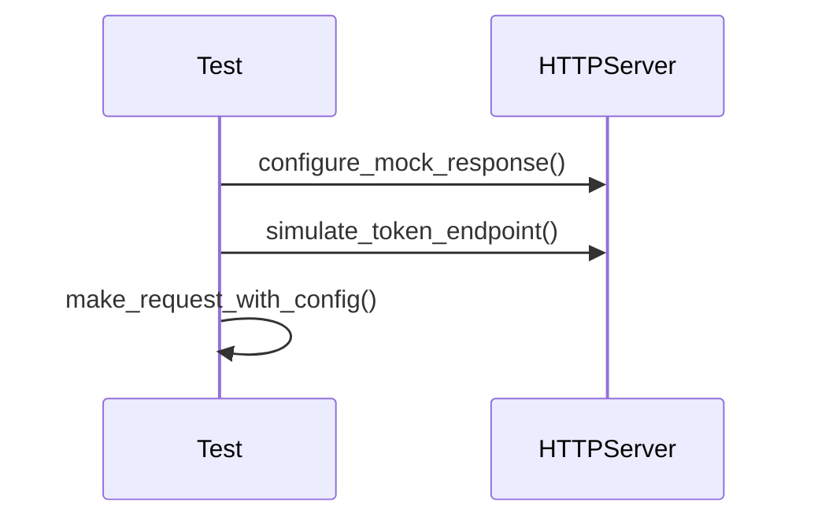

# apiconfig.testing.integration

## Module Description

Utilities for end-to-end tests of **apiconfig** based clients. The package
provides helpers for spinning up mock HTTP servers and convenient pytest
fixtures so integrations can be validated without hitting real services. These
helpers are separate from the unit test helpers because they rely on external
tools and focus on full request flows instead of isolated functions.

## Navigation

**Parent:** [../README.md](../README.md)

Submodules: none.

## Contents
- `fixtures.py` – pytest fixtures that provide temporary config files, HTTP server addresses and ready-made `ConfigManager` instances.
- `helpers.py` – helper functions such as `make_request_with_config` and `simulate_token_endpoint` for interacting with the mock server.
- `servers.py` – utilities to configure and verify responses of `pytest_httpserver`.
- `__init__.py` – exports the public helpers mentioned above.

## Usage
```python
from apiconfig.testing.integration import (
    configure_mock_response,
    make_request_with_config,
    setup_multi_provider_manager,
)
from apiconfig.auth.strategies import BasicAuth
from apiconfig.config.base import ClientConfig

# Prepare a ConfigManager using the helper
manager = setup_multi_provider_manager([
    ("defaults", {"api": {"hostname": "example.com"}}),
])
config = manager.load_config()

# Configure the mock HTTP server in a test
configure_mock_response(
    httpserver,
    path="/ping",
    response_data={"ok": True},
)

# Make a request using an auth strategy and ClientConfig
response = make_request_with_config(
    config=config,
    auth_strategy=BasicAuth("user", "pass"),
    mock_server_url=str(httpserver.url_for("/")),
    path="/ping",
)
assert response.json() == {"ok": True}
```

## Key Functions
| Name | Description |
| ---- | ----------- |
| `configure_mock_response` | Set up expectations on the mock server for a given path and method. |
| `assert_request_received` | Validate that the server received the expected requests. |
| `make_request_with_config` | Convenience wrapper around `httpx` that injects headers and parameters from an `AuthStrategy`. |
| `setup_multi_provider_manager` | Create a `ConfigManager` using multiple in-memory providers. |
| `simulate_token_endpoint` | Configure a mock token endpoint for testing OAuth2 flows. |

### Diagram


## Testing
Install dependencies and run the integration tests for this package:
```bash
poetry install --with dev
poetry run pytest tests/integration -q
```

## Dependencies

### External Dependencies
- `pytest` – required to run the integration tests.
- `typing` and `http` – standard library modules used in examples.

### Internal Dependencies
- `apiconfig.utils.http` – URL and request helpers reused in tests.
- Internal mocks from [`apiconfig.testing.unit.mocks`](../unit/mocks/README.md) – used in various examples.

### Optional Dependencies
None

## Status

**Stability:** Experimental
**API Version:** 0.3.1
**Deprecations:** None

### Maintenance Notes
- APIs are experimental and may break between minor releases.

### Changelog
- Added `assert_request_received` to validate HTTP requests made to the mock server.
- Enhanced type hints and explicit return types across helper functions.
- Expanded documentation with a navigation section and additional usage notes.

### Future Considerations
- Provide asynchronous variants of the helpers for `httpx.AsyncClient`.
- Offer higher-level fixtures for more complex authentication flows.

## See Also
- [../unit/README.md](../unit/README.md) – unit test helpers for isolated testing
  of configuration logic.
- [../../helpers_for_tests/README.md](../../helpers_for_tests/README.md) –
  example clients used in integration scenarios.
