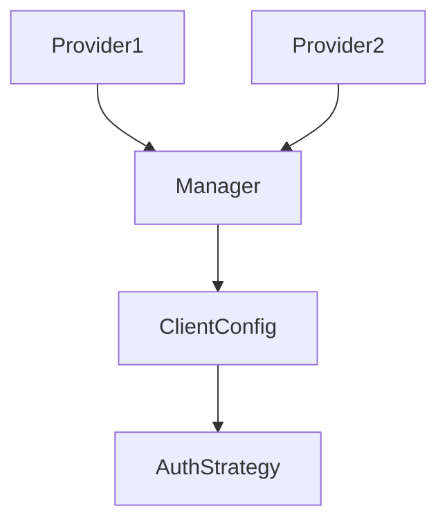

# apiconfig

Simplifies configuration and authentication for Python API clients.

## Module Description
**apiconfig** centralises configuration and authentication logic for Python API
clients. The library provides a small, stable surface area that applications can
depend on while hiding complex implementation details behind well defined
interfaces.

The project exists so that the many in-house tools and microservices speak to
vendor APIs in a consistent way. Each service can focus on business logic while
`apiconfig` handles configuration merging, secure credential storage and token
refresh flows.

At the top level this package ties together the submodules that actually
implement the work. `auth` offers pluggable authentication strategies, `config`
manages settings providers and loading order, `exceptions` defines a structured
error hierarchy and `utils` contains logging helpers and other small utilities.

## Navigation
- [auth](./auth/README.md) – authentication framework and strategies
- [config](./config/README.md) – configuration providers and management
- [exceptions](./exceptions/README.md) – structured error hierarchy
- [testing](./testing/README.md) – helpers and fixtures for tests
- [utils](./utils/README.md) – logging and miscellaneous utilities
- [types](./types/README.md) – shared type definitions

## Contents
- `auth/` – authentication framework and built‑in strategies.
- `config/` – `ClientConfig` class and configuration providers.
- `exceptions/` – structured error hierarchy for configuration and HTTP issues.
- `testing/` – helpers and fixtures for unit and integration tests.
- `utils/` – assorted utilities such as logging setup and URL helpers.
- `__init__.py` – re‑exports common classes and determines the package version.

## Usage Examples
```python
from apiconfig import ClientConfig, ApiKeyAuth

config = ClientConfig(
    hostname="api.example.com",
    auth_strategy=ApiKeyAuth(api_key="key", header_name="X-API-Key"),
)
print(config.base_url)
```

## Key components
| Component | Description |
| --------- | ----------- |
| `ClientConfig` | Holds API connection settings like base URL, timeouts and authentication. |
| `AuthStrategy` and friends | Base class and built‑in strategies for headers or token handling. |
| `ConfigManager` | Loads and merges configuration from providers. |
| `EnvProvider` / `FileProvider` / `MemoryProvider` | Sources for configuration data. |
| `APIConfigError` and subclasses | Domain specific exceptions for reporting failures. |

### Design
`apiconfig` is organised into small focused modules. Authentication strategies
implement the **Strategy** pattern while configuration providers can be combined
in any order via `ConfigManager`.



## Testing
Install dependencies and run the full test suite with Poetry:
```bash
poetry install --with dev
poetry run pytest -q
```

## Dependencies

### Standard Library
- `typing` – used for type hints across the project.
- `http` – provides HTTP status utilities for the examples.

### Internal Modules
- `apiconfig.utils.http` – shared helpers for constructing URLs and requests.

## Status

**Stability:** Stable
**API Version:** 0.0.0
**Deprecations:** None

### Maintenance Notes
- Library is used in production and receives regular updates.

### Changelog
- 0.0.0 – Initial public release.

### Future Considerations
- Expand documentation for custom provider integrations.

## See Also

- [helpers_for_tests](../helpers_for_tests/README.md) – example clients used in the test suite
- [project_plans](../project_plans/README.md) – design documents and task lists for upcoming features
