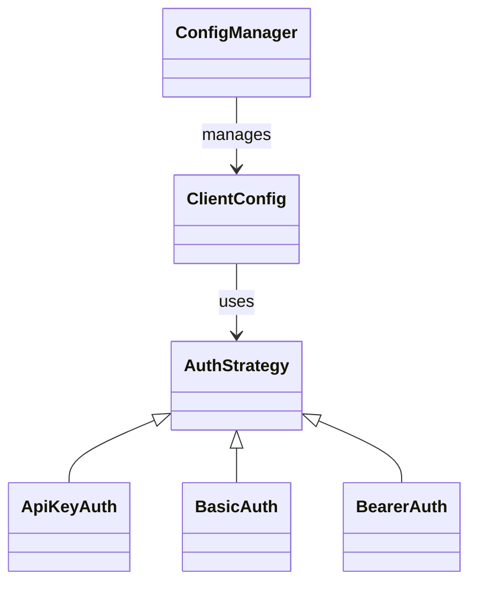
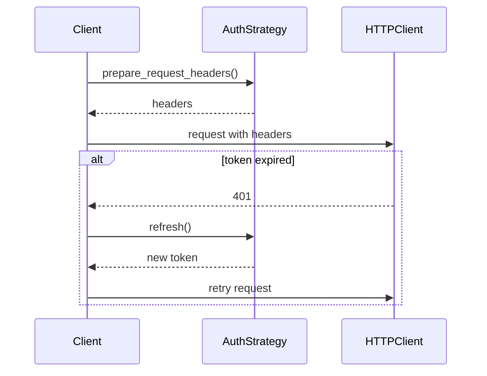

# apiconfig

_Flexible, extensible configuration and authentication for Python API clients._

[](https://pypi.org/project/apiconfig/)
[](https://pypi.org/project/apiconfig/)
[](https://github.com/Leikaab/apiconfig/actions/workflows/tests.yaml)
[](https://github.com/Leikaab/apiconfig/actions/workflows/publish.yaml)

---

## Table of Contents

- [Module Description](#module-description)
- [Navigation](#navigation)
- [Contents](#contents)
- [Usage Examples](#usage-examples)
  - [Quickstart](#quickstart)
  - [Installation](#installation)
  - [Basic Configuration](#basic-configuration)
  - [Authentication Strategies](#authentication-strategies)
  - [Using Configuration Providers](#using-configuration-providers)
  - [Merging Configurations](#merging-configurations)
  - [Practical Example: Real API Client Setup](#practical-example-real-api-client-setup)
  - [Logging](#logging)
  - [Error Handling](#error-handling)
- [Key Components](#key-components)
- [Architecture](#architecture)
- [Testing](#testing)
- [Dependencies](#dependencies)
- [Status](#status)
- [Further Documentation](#further-documentation)
- [See Also](#see-also)
- [License](#license)

[](https://leikaab.github.io/apiconfig/)

## Module Description

**apiconfig** is a standalone Python library for managing API client configuration and authentication. It provides a robust, extensible foundation for building API clients, handling configuration (base URLs, timeouts, retries, headers) and supporting multiple authentication strategies (API key, Basic, Bearer, custom).

apiconfig is designed for:
- Developers building reusable, testable API clients.
- Projects needing flexible configuration sources (env, file, memory).
- Secure, pluggable authentication for HTTP APIs.

---

## Navigation

- [auth](apiconfig/auth/README.md)
- [config](apiconfig/config/README.md)
- [exceptions](apiconfig/exceptions/README.md)
- [testing](apiconfig/testing/README.md)
- [utils](apiconfig/utils/README.md)

---

## Contents

```
apiconfig/
├── auth/          # Authentication strategies (basic, bearer, API key, custom)
├── config/        # API client configuration and providers
├── exceptions/    # Structured exception hierarchy
├── testing/       # Test utilities and helpers
├── utils/         # Logging, redaction, and utilities
└── types.py       # Shared type definitions
```

## Usage Examples
### Quickstart

```bash
pip install apiconfig
```

```python
from apiconfig import ClientConfig, ApiKeyAuth

auth = ApiKeyAuth(api_key="my-secret-key", header_name="X-API-Key")
config = ClientConfig(
    hostname="api.example.com",
    version="v1",
    auth_strategy=auth,
    timeout=10.0,
    retries=3,
)
print(config.base_url)  # https://api.example.com/v1
```

---

### Installation

Install from PyPI:

```bash
pip install apiconfig
```

Or with Poetry:

```bash
poetry add apiconfig
```

---

### Key Features

- **Unified API Client Configuration**: Manage base URLs, versions, headers, timeouts, retries, and more with a single, validated config object.
- **Authentication Strategies**: Built-in support for API Key, Basic, Bearer, and custom authentication via the Strategy Pattern.
- **Config Providers**: Load configuration from environment variables, files, or in-memory sources.
- **Extensible**: Easily add new authentication methods or config providers.
- **Robust Error Handling**: Clear, structured exception hierarchy for all config and auth errors.
- **Type Safety**: Strong type hints and type-checked public API.
- **Logging Integration**: Standard logging hooks for debugging and auditability.
- **High Test Coverage**: Around 94% coverage with unit and integration tests.


### Basic Configuration

```python
from apiconfig import ClientConfig

config = ClientConfig(
    hostname="api.example.com",
    version="v1",
    headers={"X-My-Header": "value"},
    timeout=10.0,
    retries=3,
)
print(config.base_url)  # https://api.example.com/v1
```

### Authentication Strategies

#### API Key in Header

```python
from apiconfig import ClientConfig, ApiKeyAuth

auth = ApiKeyAuth(api_key="my-secret-key", header_name="X-API-Key")
config = ClientConfig(
    hostname="api.example.com",
    version="v1",
    auth_strategy=auth,
)
```

#### API Key in Query Parameter

```python
from apiconfig import ApiKeyAuth

auth = ApiKeyAuth(api_key="my-secret-key", param_name="api_key")
```

#### Basic and Bearer Auth

```python
from apiconfig import BasicAuth, BearerAuth

basic = BasicAuth(username="user", password="pass")
bearer = BearerAuth(access_token="my-jwt-token")
```

#### Custom Authentication

```python
from apiconfig import CustomAuth

custom = CustomAuth(auth_callable=lambda: {"Authorization": "Custom xyz"})
```

### Using Configuration Providers

#### Environment Variables

```python
from apiconfig import EnvProvider

env = EnvProvider(prefix="MYAPI_")
config_dict = env.load()
# Example: MYAPI_HOSTNAME=api.example.com, MYAPI_TIMEOUT=5
```

#### File and Memory Providers

```python
from apiconfig import FileProvider, MemoryProvider

file_provider = FileProvider(file_path="config.json")
file_config = file_provider.load()

# MemoryProvider accepts configuration via the ``config_data`` parameter and
# exposes ``get_config`` instead of ``load``
memory_provider = MemoryProvider(config_data={"hostname": "api.example.com"})
memory_config = memory_provider.get_config()
```

### Merging Configurations

```python
from apiconfig import ClientConfig

base = ClientConfig(hostname="api.example.com", timeout=10)
override = ClientConfig(timeout=5, retries=2)
merged = base.merge(override)
```

---

### Practical Example: Real API Client Setup

Below is a real-world example based on the integration tests. This pattern demonstrates how to use apiconfig to load configuration and secrets from environment variables, set up authentication, and make a request with an HTTP client (e.g., httpx):

```python
import os
import httpx
from apiconfig import EnvProvider, ClientConfig, BearerAuth

# Load config and secrets from environment variables
env = EnvProvider()
config_dict = env.load()

# Get token and base URL from environment or use defaults
access_token = config_dict.get("FIKEN_ACCESS_TOKEN") or os.environ.get("FIKEN_ACCESS_TOKEN")
base_url = config_dict.get("FIKEN_BASE_URL") or os.environ.get("FIKEN_BASE_URL") or "https://api.fiken.no/api/v2"

# Set up authentication strategy if token is available
auth_strategy = BearerAuth(access_token) if access_token else None

# Create the API client configuration
client_config = ClientConfig(
    hostname=base_url,
    auth_strategy=auth_strategy,
)

# Prepare request headers using the auth strategy
headers = {}
if client_config.auth_strategy is not None:
    headers.update(client_config.auth_strategy.prepare_request_headers())

# Make a real HTTP request using httpx
with httpx.Client(timeout=10.0) as client:
    response = client.get(f"{client_config.base_url}/companies", headers=headers)
    print(response.status_code, response.json())
```

This approach can be adapted for any API and authentication method supported by apiconfig. See the [integration tests](tests/integration/) for more real-world examples.

---

### Logging

apiconfig uses standard Python logging. To enable debug output:

```python
import logging

logging.basicConfig(level=logging.DEBUG)
logging.getLogger("apiconfig").setLevel(logging.INFO)
```

---

### Error Handling

All errors are structured and documented. Common exceptions include:
- `APIConfigError`
- `ConfigurationError`
- `AuthenticationError`
- `InvalidConfigError`
- `MissingConfigError`
- `AuthStrategyError`

---

## Key Components

| Alias | Description |
| ----- | ----------- |
| `JsonObject` | Dictionary representing a JSON object |
| `HeadersType` | Mapping of HTTP header names to values |
| `QueryParamType` | Mapping for URL query parameters |
| `DataType` | HTTP request body data |
| `ResponseBodyType` | API response body |

## Architecture

### Class Hierarchy


### Authentication Flow


## Testing
### Testing and Coverage

apiconfig is fully tested with `pytest` and `coverage.py`. To run tests and check coverage:

```bash
pytest --cov=apiconfig --cov-report=html
```

### Static Type Checking

apiconfig uses [Pyright](https://github.com/microsoft/pyright) for optional static
type checking. Before running Pyright, ensure development dependencies are
installed and the virtual environment is active:

```bash
poetry install --with dev
poetry shell
pyright
```

This guarantees libraries like `httpx`, `pytest`, and their stubs are available.

### Test Structure
Unit tests are organized by feature under `tests/unit`. The exception hierarchy is covered in `tests/unit/exceptions`.

### Test Dependencies
Tests rely only on `pytest` and the `apiconfig` package; no external services are required.

---

### Running tests

Use `pytest` to execute the full test suite:

```bash
poetry run pytest
```

### Test Structure

- `tests/unit` – unit tests
- `tests/integration` – integration tests against real APIs

### Test Dependencies

- Install dev dependencies with `poetry install --with dev`
- Environment variables for integration tests are loaded automatically

---

## CI/CD

Continuous integration and deployment are managed with GitHub Actions. All pushes and pull requests are tested, and releases are published to PyPI after passing tests.

---

## Dependencies

### External

- [pytest](https://docs.pytest.org/) – test runner
- [pytest_httpserver](https://github.com/pytest-dev/pytest-httpserver) – HTTP server for integration tests

### Internal

- Modules like `apiconfig.config`, `apiconfig.auth`, and `apiconfig.utils`

### Optional

- [coverage.py](https://coverage.readthedocs.io/) for measuring test coverage
- [Pyright](https://github.com/microsoft/pyright) for optional static type checking
### Optional Dependencies
None

Install development dependencies with:

```bash
poetry install --with dev
```

## Status

**Stability:** Stable - the project is actively used in production environments.
**API Version:** Follows [Semantic Versioning](https://semver.org/spec/v2.0.0.html) starting at version 0.x.
**Deprecations:** None

### Maintenance Notes

The library is currently **stable** and actively maintained. Issues and pull requests are triaged on a best-effort basis. Minor feature requests and fixes are welcome.

### Changelog

See [CHANGELOG.md](CHANGELOG.md) for a complete history of changes.

### Future Considerations

Planned improvements include enhanced documentation, additional auth strategies, expanded test coverage, and formatter enhancements for more consistent styling.
## Further Documentation

- [Documentation (latest)](https://leikaab.github.io/apiconfig/)
- [CONTRIBUTING.md](CONTRIBUTING.md) — Contribution guidelines
- [Bug Tracker](https://github.com/Leikaab/apiconfig/issues)
- [PyPI Project Page](https://pypi.org/project/apiconfig/)

---

## See Also

- [Internal Documentation Guide](docs/internal_documentation_guide.md)
- [apiconfig.auth](apiconfig/auth/README.md) – authentication strategies using these types
- [apiconfig.utils](apiconfig/utils/README.md) – utilities built on the shared aliases
- [helpers_for_tests](../helpers_for_tests/README.md) – helper clients for tests

---

## License

LGPL-3.0-or-later. See [LICENSE](LICENSE) for details.
