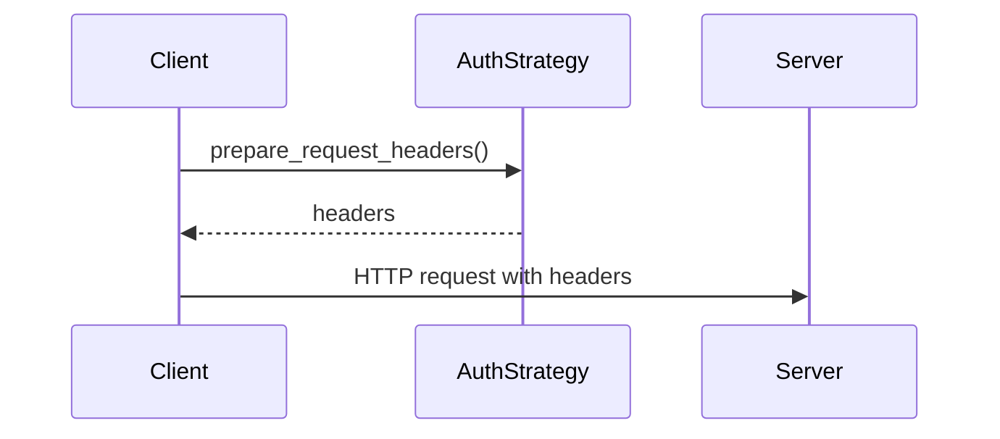
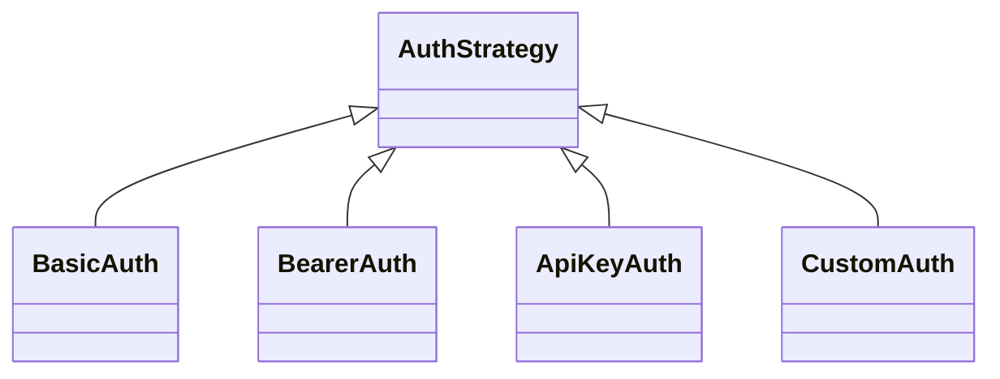
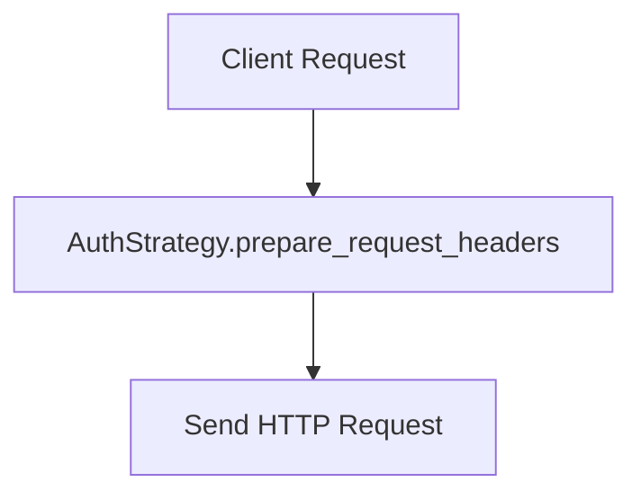

# apiconfig.auth

Authentication framework for **apiconfig**.  This package defines the common `AuthStrategy` base class and bundles the built in authentication strategies and token utilities.

## Module Description

`AuthStrategy` defines the interface used by all authentication implementations.
The package includes ready-made strategies such as `BasicAuth`, `BearerAuth`,
and `ApiKeyAuth` so clients can authenticate without custom code.

Centralizing authentication ensures headers and query parameters are prepared
consistently across APIs. Each `ClientConfig` instance holds a strategy, keeping
request logic independent of specific credentials or token refresh flows.

This design follows the Strategy pattern and encourages extensibility.
Applications can swap built-in strategies or provide custom implementations
without modifying consumers of `ClientConfig`.

## Navigation
- [apiconfig](../README.md) – project overview and main documentation.
- [strategies](./strategies/README.md) – built-in authentication strategies.
- [token](./token/README.md) – utilities for managing OAuth2 tokens.

## Contents
- `base.py` – abstract `AuthStrategy` with refresh support.
- `strategies/` – collection of ready to use strategies such as `BasicAuth`, `BearerAuth` and `ApiKeyAuth`.
- `token/` – helpers for OAuth2 token refresh and storage.
- `__init__.py` – re-exports the most used classes for convenience.

## Usage Examples

### Basic
```python
from datetime import datetime, timedelta, timezone
from apiconfig.auth.strategies import BearerAuth
from apiconfig.config import ClientConfig

# Set up bearer authentication with expiry
auth = BearerAuth(
    access_token="secret",
    expires_at=datetime.now(timezone.utc) + timedelta(hours=1),
)

config = ClientConfig(hostname="api.example.com", auth_strategy=auth)
headers = auth.prepare_request_headers()
```

### Advanced
```python
from apiconfig.auth.strategies import CustomAuth
from apiconfig.config import ClientConfig

# Custom strategy using callbacks
auth = CustomAuth(header_callback=lambda: {"X-Custom": "value"})

config = ClientConfig(hostname="api.example.com", auth_strategy=auth)
```

## Key Components
| Class | Description | Key Methods |
| ----- | ----------- | ----------- |
| `AuthStrategy` | Base class defining the common authentication interface. | `prepare_request_headers`, `prepare_request_params`, `refresh` |
| `ApiKeyAuth` | Sends an API key either in a header or as a query parameter. | `prepare_request_headers`, `prepare_request_params` |
| `BasicAuth` | Adds `Authorization: Basic ...` headers with a username and password. | `prepare_request_headers` |
| `BearerAuth` | Uses a bearer token and can refresh it when expired. | `prepare_request_headers`, `refresh` |
| `CustomAuth` | Allows user provided callbacks for headers, parameters and refresh. | `prepare_request_headers`, `prepare_request_params`, `refresh` |

### Design pattern
All strategies implement **Strategy** pattern via the `AuthStrategy` interface and can be swapped without affecting client code.

## Diagram


## Architecture

### Class Hierarchy


### Authentication Flow


## Dependencies

### External Dependencies
- `abc` – abstract base classes for auth strategies.
- `base64` – encodes Basic authentication credentials.
- `datetime` – handles token expiry timestamps.
- `json`, `logging`, and `time` – used in token refresh helpers.
- `typing` – provides type hints throughout the package.

### Internal Dependencies
- `apiconfig.exceptions.auth` – custom exceptions for authentication errors.
- `apiconfig.types` – shared type definitions used in strategy interfaces.

### Optional Dependencies
- `httpx` – recommended HTTP client for token refresh callbacks and testing.

## Tests
Install dependencies and run the unit tests for the authentication package:
```bash
poetry install --with dev
poetry run pytest tests/unit/auth -q
```

## Status

**Stability:** Stable – used by the configuration system and tested via the unit suite.
**API Version:** 0.3.1
**Deprecations:** None

### Maintenance Notes
- Authentication layer is stable and updated as new schemes are supported.

### Changelog
- Significant auth changes are captured in the project changelog.

### Future Considerations
- Upcoming work includes improved OAuth2 token refresh handling.

## See Also
- [apiconfig.config](../config/README.md) – configuration system used with auth strategies
- [apiconfig.exceptions.auth](../exceptions/auth/README.md) – exceptions raised during authentication
