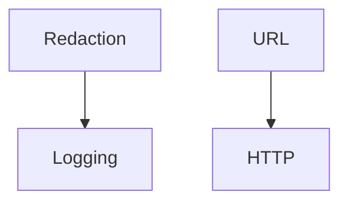

# apiconfig.utils

Miscellaneous utilities shipped with **apiconfig**. They cover HTTP helpers,
URL construction, redaction of sensitive data and logging setup. Each subpackage
can be used independently by API clients.

## Module Description

The utilities package centralizes common helpers used across `apiconfig`.
It provides HTTP status helpers, tools for safe URL building, utilities for
redacting sensitive data and helpers for configuring consistent logging.
These modules are lightweight and are imported by other parts of the project
to avoid duplicating boilerplate code.

## Navigation

**Parent Module:** [apiconfig](../README.md)

**Submodules:**
- [logging](./logging/README.md) - configure redacted log output
- [redaction](./redaction/README.md) - scrub secrets from requests and logs
- [url](./url.py) - build and normalise URLs safely

## Contents
- `http.py` – simple helpers for working with HTTP status codes and JSON payloads.
- `url.py` – safe wrappers around `urllib.parse` for building URLs.
- `redaction/` – functions for scrubbing secrets from bodies and headers.
- `logging/` – custom formatters and setup helpers for the library's logging.
- `__init__.py` – exposes the modules above for convenience.

## Usage Examples

### Basic
```python
from apiconfig.utils import http, url

if http.is_success(200):
    full_url = url.build_url("https://api.example.com", "/ping")
    print(full_url)
```

### Advanced
```python
from apiconfig.utils.redaction import redact_dict

data = {"token": "secret", "value": 42}
print(redact_dict(data, {"token"}))
```

## Key Components
| Module | Purpose | Key Functions |
| ------ | ------- | ------------- |
| `http` | HTTP status helpers and safe JSON encode/decode with custom exceptions. | `is_success`, `safe_json_decode`, `safe_json_encode` |
| `url` | Build URLs and normalise query parameters with type safety. | `build_url`, `add_query_params` |
| `redaction` | Remove sensitive data before logging or output. | `redact_body`, `redact_headers` |
| `logging` | Formatters, handlers and setup utilities for clean log output. | `setup_logging`, `set_log_context` |

### Design
Utility modules are kept lightweight and independent. Logging utilities compose
the redaction helpers to avoid code duplication.

## Architecture


## Dependencies

### External Dependencies
- `typing` – runtime type hints and conditional imports
- `urllib.parse` – safe URL parsing and construction
- `logging` – configure loggers and handlers

### Internal Dependencies
- `apiconfig.utils.redaction` – shared helpers for scrubbing secrets
- `apiconfig.types` – common type aliases used in URL helpers

### Optional Dependencies
- `httpx` – used in certain helpers for async HTTP utilities

## Tests
Run the unit tests for utility modules:
```bash
poetry install --with dev
poetry run pytest tests/unit/utils -q
```

## Status
Stable – used throughout the project.

**Stability:** Stable
**API Version:** 0.3.1
**Deprecations:** None

### Maintenance Notes
- Stable utilities with occasional updates for new helper functions.

### Changelog
- See project changelog for utility updates and bug fixes.

### Future Considerations
- Add async-friendly helpers and improve formatter integration.

## See Also
- [logging](./logging/README.md) – log utilities using redaction
- [redaction](./redaction/README.md) – helpers for scrubbing secrets
