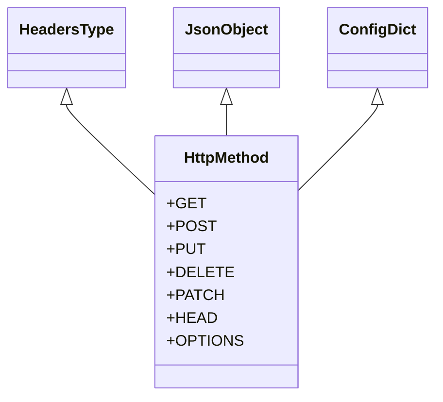

# apiconfig.types

## Module Description

Shared type aliases and protocols for **apiconfig** keep the public API small
and make static analysis consistent across modules.

Centralizing these definitions ensures every component relies on the same
contracts when exchanging data. This reduces duplication and helps type
checkers catch integration errors early.

## Navigation
**Parent Module:** [apiconfig](../README.md)

## Contents
- `types.py`

## Usage Examples
```python
from apiconfig.types import JsonObject, HeadersType, HttpMethod

headers: HeadersType = {"Authorization": "Bearer secret"}
method: HttpMethod = HttpMethod.GET
payload: JsonObject = {"ping": "pong"}
```

## Key Components
| Name | Description | Key Methods |
| ---- | ----------- | ----------- |
| `JsonObject` | Dictionary representing a JSON object | - |
| `HeadersType` | Mapping of HTTP header names to values | - |
| `QueryParamType` | Mapping for URL query parameters | - |
| `HttpMethod` | Enum listing standard HTTP methods | - |
| `HttpRequestProtocol` | Protocol representing an HTTP request | `method`, `url`, `headers` |
| `HttpResponseProtocol` | Protocol representing an HTTP response | `status_code`, `headers`, `text` |
| `ConfigDict` | Dictionary of configuration values | - |
| `ConfigProviderCallable` | Callable returning a `ConfigDict` | - |
| `TokenRefreshResult` | Result data from token refresh | - |
| `HttpRequestCallable` | Callable used for HTTP requests | - |

## Testing

Run the unit tests covering these type definitions:

```bash
poetry run pytest tests/unit/types
```

## Dependencies

### Standard Library
- `typing` – foundational type hints and protocols
- `enum` – enumeration for `HttpMethod`
- `json` – encoders and decoders used in JSON type aliases

### Internal Modules
- `apiconfig.auth` – authentication strategies rely on `TokenRefreshResult` and `HttpRequestCallable`
- `apiconfig.config` – configuration providers use `ConfigDict` and `ConfigProviderCallable`
- `apiconfig.utils` – utilities depend on `HeadersType`, `QueryParamType`, and related aliases

### Design
Type aliases are centralised in `types.py` to keep their definitions consistent across modules. The `HttpMethod` enum lists the standard verbs used by API clients.


## Status
Stable – used throughout the library for type checking.

**Stability:** Stable
**API Version:** 0.3.2
**Deprecations:** None

### Maintenance Notes
New type aliases are added only when multiple modules need the same
structure. Every addition is documented in the changelog and covered by unit
tests. Deprecated aliases are marked and removed during the next major
release cycle.

### Changelog
- Type alias changes are tracked in the project changelog.

### Future Considerations
- Additional generic types may be introduced as new modules appear.

## Architecture


This diagram shows the HttpMethod enum and how common type aliases reference it.

## See Also
- [`apiconfig.auth`](../auth) – authentication strategies and token handling
- [`apiconfig.config`](../config) – configuration providers and settings
- [`apiconfig.utils`](../utils) – shared utilities and helpers
