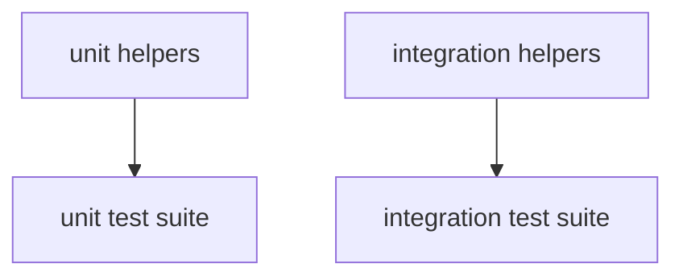

# apiconfig.testing

Testing utilities bundled with **apiconfig**. This package organises helpers for
both unit and integration tests so developers can verify clients without writing
boilerplate code.

## Module Description

The `apiconfig.testing` package offers a curated collection of utilities used to
validate API client behaviour across the project. It aims to remove repetitive
setup from test suites by supplying ready-made fixtures, mocks, and assertion
helpers so contributors can focus on the logic under test.

Helpers are organised into two main groups. The `unit` subpackage provides
lightweight factories and assertion tools for isolated unit tests, while the
`integration` subpackage includes fixtures for spawning mock HTTP servers and
other components needed to verify real request flows. This separation keeps
unit tests fast and integration tests realistic without mixing concerns.

Bundling these helpers directly with the repository ensures they evolve in lock
step with the codebase. Developers do not need to pull in external libraries or
maintain separate tooling when the API clients change, keeping the project
simple to contribute to and easier to maintain.

## Navigation

**Parent:** [apiconfig](../README.md)

**Submodules:**
- [unit](./unit/README.md) – unit-test helpers.
- [integration](./integration/README.md) – integration-test helpers.

## Contents
- `unit/` – assertions, factories and mocks for isolated unit tests.
- `integration/` – fixtures and HTTP server helpers for end‑to‑end scenarios.
- `auth_verification.py` – common checks for authentication headers during tests.
- `__init__.py` – exposes the most useful helpers across subpackages.

## Usage Examples

### Basic
```python
from apiconfig.testing.integration import configure_mock_response
from apiconfig.testing.unit import create_valid_client_config

config = create_valid_client_config(hostname="api.test")
configure_mock_response(httpserver, path="/ping", response_data={"ok": True})
```

### Advanced
```python
from apiconfig.testing.integration import assert_request_received

# After configuring responses and making requests, verify the server interaction
assert_request_received(httpserver, path="/ping")
```

## Key Components
| Module | Purpose | Key Methods |
| ------ | ------- | ----------- |
| `unit` | Mocks and assertions for fast unit tests. | `create_valid_client_config`, `assert_client_config_valid` |
| `integration` | Spin up mock HTTP servers and provide fixtures for real‑world flows. | `configure_mock_response`, `make_request_with_config` |
| `auth_verification` | Advanced helpers for verifying auth behaviour in tests. | `AuthHeaderVerification.verify_basic_auth_header` |

## Architecture


## Dependencies

### External Dependencies
- `pytest`, `pytest_httpserver`, and `pytest-xdist` for running the test suite.

### Internal Dependencies
- `apiconfig.testing.unit` and `apiconfig.testing.integration` utilities.

### Optional Dependencies
None

## Testing
Use these helpers to validate your API clients with the project's full test suite.

### Running tests
Install dependencies and run all project tests:
```bash
poetry install --with dev
poetry run pytest -q
```


## Status
Internal – APIs may evolve alongside the test suite.

**Stability:** Internal
**API Version:** 0.3.1
**Deprecations:** None

### Maintenance Notes
- Test utilities are maintained with the suite and may change frequently.

### Changelog
- No separate changelog; refer to repository history for changes.

### Future Considerations
- Additional helpers will be introduced as new features require.

## See Also
- [unit](./unit/README.md) – unit-test helpers
- [integration](./integration/README.md) – integration test utilities
- [helpers_for_tests](../helpers_for_tests/README.md) – further examples
