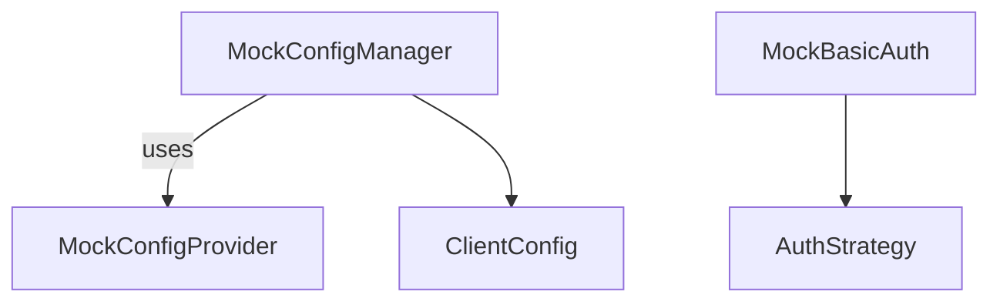

# apiconfig.testing.unit.mocks

Mocks used for unit testing **apiconfig** components.  These helpers provide
lightweight stand-ins for the real authentication strategies and configuration
classes so that tests can run without talking to external services.

## Navigation

- **Parent:** [../README.md](../README.md)

## Contents
- `auth.py` – mock implementations of the authentication strategies (`BasicAuth`,
  `BearerAuth`, `ApiKeyAuth`, `CustomAuth`) plus refreshable variants and a
  `MockHttpRequestCallable` for simulating HTTP refresh endpoints.
- `config.py` – `MockConfigProvider`, the `create_mock_client_config` helper and
  `MockConfigManager` for testing configuration loading logic.
- `__init__.py` – re-exports the most common mocks for convenience.

## Usage
```python
from apiconfig.testing.unit.mocks import (
    MockConfigManager,
    MockConfigProvider,
    create_mock_client_config,
)
from apiconfig.testing.unit.mocks.auth import MockBasicAuth

# Create a simple configuration using a mock provider
provider = MockConfigProvider({"hostname": "api.test.com"})
manager = MockConfigManager(providers=[provider])
config = manager.load_config()

# Use a mock auth strategy when constructing clients
auth = MockBasicAuth()
headers, params = auth.prepare_request()
```

## Key Classes
| Class | Description |
| ----- | ----------- |
| `MockAuthStrategy` | Base class that merges header/param overrides and can raise configured exceptions. |
| `MockBasicAuth` / `MockBearerAuth` / `MockApiKeyAuth` | Concrete mocks mirroring the real auth strategies. |
| `MockRefreshableAuthStrategy` | Adds refresh behaviour and helpers for testing concurrent refresh scenarios. |
| `MockHttpRequestCallable` | Callable returning dummy HTTP responses for token refresh tests. |
| `MockConfigProvider` | Duck-typed provider returning a predefined dictionary. |
| `MockConfigManager` | Simple config manager with a `load_config_mock` `MagicMock` invoked by `load_config()`. |

### Design
The mocks follow a minimal design where behaviour is simulated through simple
attributes and `MagicMock`. The auth mocks implement the same interfaces as the
real strategies so tests can swap them in without modifying production code.



## Testing
Run only the tests related to the mocks package:
```bash
poetry install --with dev
poetry run pytest tests/unit/testing/unit/mocks -q
```

## Dependencies

### Standard Library
- `random`, `threading`, `time`, `typing`, `unittest.mock`

### Internal Dependencies
- `apiconfig.auth` – base classes and concrete strategies
- `apiconfig.config` – configuration manager and providers
- `apiconfig.exceptions` – error types used in mocks
- `apiconfig.types` – shared type definitions

## Status
Internal – provided solely for unit testing purposes but kept stable.

### Maintenance Notes
- Maintained alongside the unit tests; expect changes when mocks require new features.

### Changelog
- Mock updates are documented in the main changelog.

### Future Considerations
- Additional mocks may be added as the test suite expands.
