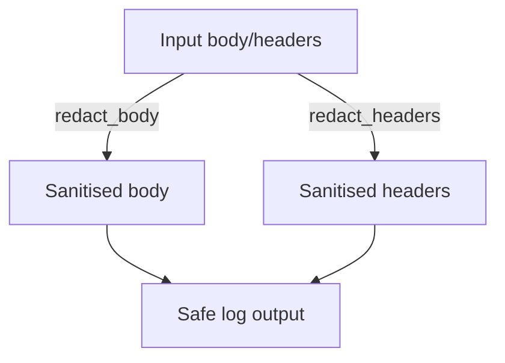

# apiconfig.utils.redaction

## Module Description

Redaction utilities exist to ensure that tokens, credentials and other personal
information never appear in logs or request dumps. They provide a centralised
set of helpers for sanitising HTTP bodies and headers, preventing accidental
data leaks. Modules such as `apiconfig.utils.logging` rely on these helpers to
prepare safe output for log handlers and monitoring services.

Utilities for scrubbing sensitive information from HTTP requests, responses and
logs. The package centralises common redaction logic so that clients and logging
helpers can easily avoid leaking secrets.

## Navigation

**Parent Module:** [apiconfig.utils](../README.md)

There are no submodules.

## Contents
- `body.py` – functions to redact JSON and form-encoded bodies.
- `headers.py` – utilities to remove secrets from HTTP headers and cookies.
- `__init__.py` – re-exports constants and helpers for convenient importing.

## Usage
```python
from apiconfig.utils.redaction import redact_body, redact_headers

body = {"token": "secret", "data": "ok"}
print(redact_body(body))  # {'token': '[REDACTED]', 'data': 'ok'}

headers = {"Authorization": "Bearer secret-token", "Content-Type": "json"}
print(redact_headers(headers))
```

## Key Functions
- `redact_body(body, content_type=None, sensitive_keys_pattern=..., sensitive_value_pattern=None)` – recursively strips values from dictionaries, JSON strings or form bodies.
- `redact_headers(headers, sensitive_keys=DEFAULT_SENSITIVE_HEADERS, ...)` – redacts header values and cookies based on configurable sets or regex patterns.

### Constants
- `DEFAULT_SENSITIVE_KEYS_PATTERN` – matches common sensitive keys such as `password`, `token` and `secret`.
- `DEFAULT_SENSITIVE_HEADERS`/`DEFAULT_SENSITIVE_HEADER_PREFIXES` – default header names and prefixes considered sensitive.
- `REDACTED_VALUE` and `REDACTED_BODY_PLACEHOLDER` – placeholders used when redacting.

## Design
Redaction utilities follow a functional style. `redact_body` and `redact_headers` are pure functions that operate on the provided data. The logging formatter modules reuse these helpers instead of implementing redaction logic themselves.



## Testing
Run unit tests with coverage:
```bash
poetry install --with dev
poetry run pytest --cov=apiconfig --cov-report=html
```

## Dependencies

### Standard Library
- `typing` – common type hints for function signatures.
- `http` – HTTP utilities referenced in examples.

### Internal Modules
- `apiconfig.utils.http` – helpers used to build request representations.

## Status

**Stability:** Stable
**API Version:** 0.3.1
**Deprecations:** None

### Maintenance Notes
The module is considered stable and receives updates only for critical bug fixes
or security patches. No major changes are currently planned.

### Changelog
- Redaction utilities follow the main project changelog.

### Future Considerations
Possible enhancements include more granular redaction options and performance
optimisations for handling very large payloads.

## See Also

- [apiconfig.utils.logging](../logging/README.md)
- [apiconfig.utils](../README.md)
