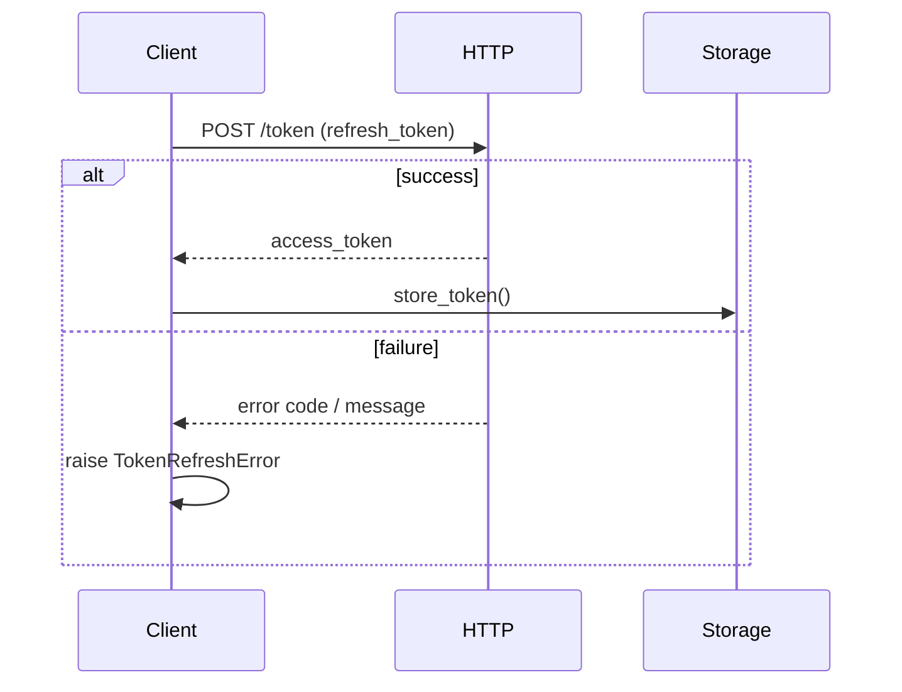

# apiconfig.auth.token

## Module Description

The token utilities in `apiconfig.auth.token` provide a lightweight framework for handling OAuth2 token refresh logic. They offer simple helpers that exchange refresh tokens for new access tokens and manage related errors.

These utilities exist to keep authentication workflows consistent across projects. By consolidating refresh operations, other modules can focus on their primary functionality while relying on a uniform approach to obtaining updated credentials.

The module integrates closely with the rest of `apiconfig` by using the same HTTP client configuration and pluggable storage pattern found throughout the library. Token data can be persisted through any implementation of the `TokenStorage` interface, ensuring compatibility with the different API clients defined elsewhere in the package.

Helpers for OAuth2 token refresh and storage in **apiconfig**. The module handles refresh logic and exposes a minimal storage interface.

## Navigation

**Parent Module:** [apiconfig.auth](../README.md)

**Subpackages:** None

## Contents

- `refresh.py` – functions to retrieve new OAuth2 access tokens.
- `storage.py` – `TokenStorage` interface and `InMemoryTokenStorage` implementation.
- `__init__.py` – exports `refresh_oauth2_token` and storage classes.

## Usage Example

```python
from apiconfig.auth.token import refresh_oauth2_token, InMemoryTokenStorage
import httpx

# HTTP client used by the refresh function
client = httpx.Client(timeout=5.0)

# Fetch a new access token using a refresh token
new_tokens = refresh_oauth2_token(
    refresh_token="abc123",
    token_url="https://auth.example.com/token",
    client_id="my-client",
    client_secret="s3cret",
    http_client=client,
)

storage = InMemoryTokenStorage()
storage.store_token("default", new_tokens)
```

## Key Classes and Functions

| Name | Description | Key Methods |
| ---- | ----------- | ----------- |
| `TokenStorage` | Abstract base class defining how tokens are saved and retrieved. | `store_token`, `retrieve_token`, `delete_token` |
| `InMemoryTokenStorage` | Simple implementation storing tokens in an internal dictionary, useful for testing. | `store_token`, `retrieve_token`, `delete_token` |
| `refresh_oauth2_token` | Performs the token refresh operation, handling timeout, HTTP errors, JSON decoding and retry logic. | n/a |

### Design Pattern

`TokenStorage` follows the **Strategy** pattern so different storage mechanisms can be used interchangeably.

## Architecture

### Class Hierarchy

```
TokenStorage
└── InMemoryTokenStorage
```

### Sequence Diagram



## Testing Instructions

### Test Structure
- `tests/unit/auth/token`

### Test Dependencies
- `pytest`
- `httpx`

### Running Tests

Install the packages and run the unit tests for this module:

```bash
poetry install --with dev
poetry run pytest tests/unit/auth/token -q
```

## Status

**Stability:** Stable
**API Version:** 0.3.1
**Deprecations:** None

### Maintenance Notes
- Actively maintained with bug fixes and periodic compatibility updates.

### Changelog
- Token management changes are recorded in the main changelog.

### Future Considerations

- Support for additional storage backends, such as Redis or SQL databases.
- CLI utilities to manage tokens outside of application code.
- Enhanced logging and error reporting during token refresh.

## See Also

- [apiconfig.exceptions.auth](../../exceptions/auth/README.md) – errors raised during token refresh
- [apiconfig.utils.logging](../../utils/logging/README.md) – logging helpers for refresh operations
