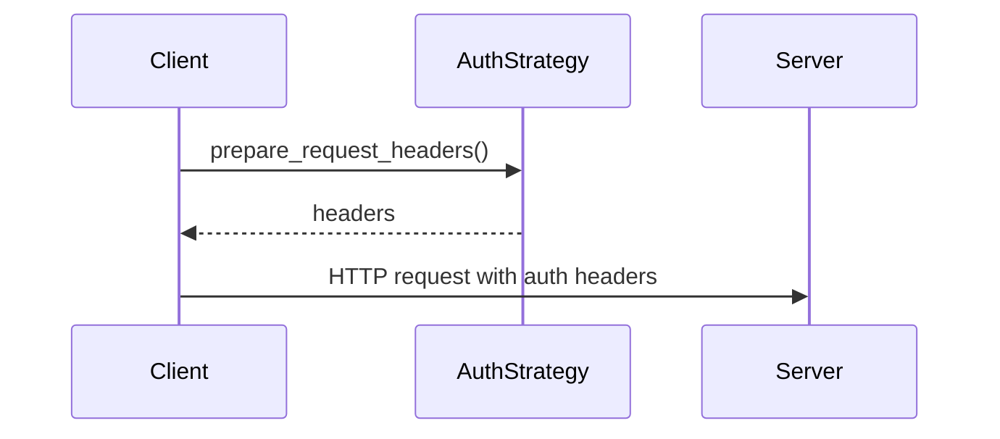
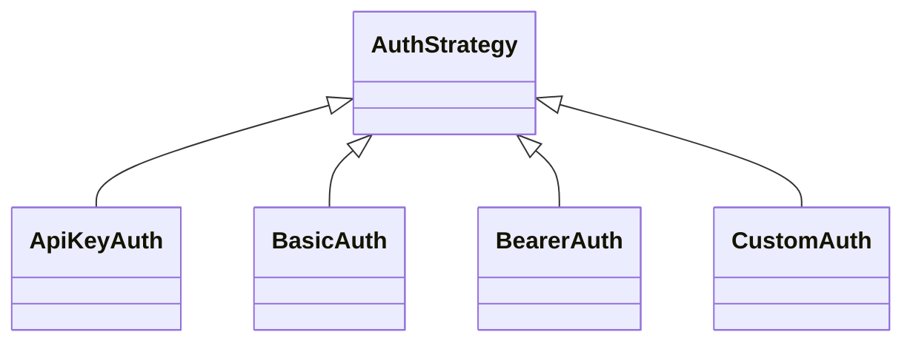
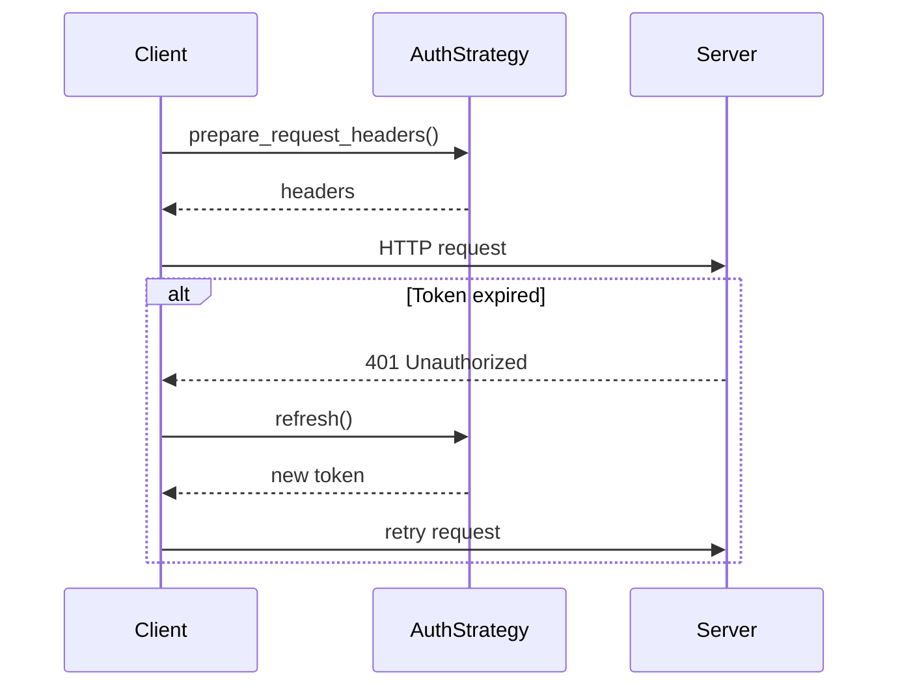

# apiconfig.auth.strategies

`apiconfig.auth.strategies` contains the built-in authentication strategies bundled with **apiconfig**. Every strategy implements the `AuthStrategy` interface and can be injected into a `ClientConfig` to attach credentials to outgoing HTTP requests.

## Module Description
The built-in authentication strategies provide common schemes like API keys, HTTP Basic, and bearer tokens. Each conforms to the `AuthStrategy` interface so they can be used interchangeably when configuring a `ClientConfig`. Clients can extend these defaults by subclassing `AuthStrategy` or leveraging `CustomAuth` callbacks for bespoke logic.

This package hides authentication details behind a common interface so client code stays the same regardless of how credentials are provided. The design follows the Strategy pattern, allowing you to swap or extend authentication mechanisms without modifying other parts of the client.

## Navigation
**Parent Module:** [apiconfig.auth](../README.md)

- [`api_key.py`](./api_key.py) – API key authentication via header or query parameter.
- [`basic.py`](./basic.py) – HTTP Basic authentication.
- [`bearer.py`](./bearer.py) – Bearer token authentication with optional expiry and refresh support.
- [`custom.py`](./custom.py) – User-defined strategies with callbacks.
- [`__init__.py`](./__init__.py) – Re-exports all strategies for convenience.

## Contents
- `api_key.py` – API key authentication via header or query parameter.
- `basic.py` – HTTP Basic authentication.
- `bearer.py` – Bearer token with optional expiry and refresh support.
- `custom.py` – User-defined strategies with callbacks.
- `__init__.py` – re-exports all strategies for easy import.

## Usage example
```python
from datetime import datetime, timedelta, timezone
from apiconfig import ClientConfig
from apiconfig.auth.strategies import ApiKeyAuth, BasicAuth, BearerAuth, CustomAuth

# API key in a header
auth_header = ApiKeyAuth(api_key="secret", header_name="X-API-Key")

# Basic Auth
basic_auth = BasicAuth(username="user", password="pass")

# Bearer token with expiry
bearer_auth = BearerAuth(
    access_token="token",
    expires_at=datetime.now(timezone.utc) + timedelta(hours=1),
)

# Custom strategy using a callback
custom_auth = CustomAuth(header_callback=lambda: {"X-Custom": "value"})

config = ClientConfig(hostname="api.example.com", auth_strategy=auth_header)
```

## Key Components
| Class | Description | Key Methods |
| ------ | ----------- | ----------- |
| `ApiKeyAuth` | Sends an API key in a header or as a query parameter. | `prepare_request_headers()`, `prepare_request_params()` |
| `BasicAuth` | Adds an `Authorization: Basic` header using a username and password. | `prepare_request_headers()`, `prepare_request_params()` |
| `BearerAuth` | Uses a bearer token and can refresh it when `expires_at` is set and a refresh function is available. | `is_expired()`, `refresh()`, `prepare_request_headers()` |
| `CustomAuth` | Allows custom callbacks for headers, parameters and refresh logic. | `prepare_request_headers()`, `prepare_request_params()`, `refresh()` |

### Design pattern
The strategies implement the **Strategy pattern**: each one conforms to `AuthStrategy` so they can be swapped without changing client code.

## Sequence diagram


## Architecture

### Class Hierarchy


### Token Refresh Flow


## Test instructions
Install dependencies and run the unit tests for this module:
```bash
poetry install --with dev
poetry run pytest tests/unit/auth/strategies -q
```

## Status

**Stability:** Stable
**API Version:** 0.3.2
**Deprecations:** None

### Maintenance Notes
- Strategies are stable with occasional improvements for new authentication flows.

### Changelog
- Updates are logged in the project changelog.

### Future Considerations
- Support for additional token exchange mechanisms is planned.

## See Also
- [apiconfig.auth.token](../token/README.md) – token refresh utilities
- [apiconfig.exceptions.auth](../../exceptions/auth/README.md) – related authentication errors
