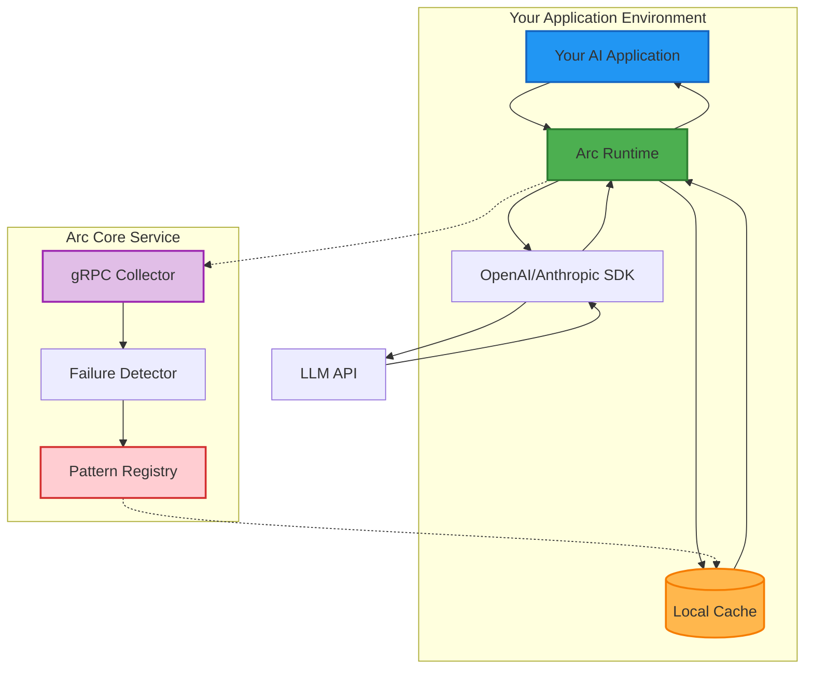

# Arc Runtime

[](https://www.python.org/downloads/)
[](https://opensource.org/licenses/MIT)
[](https://badge.fury.io/py/arc-runtime)
[](docs/performance_report.md)
[](https://opentelemetry.io/)

Arc Runtime is a lightweight Python interceptor that prevents AI agent failures in real-time by applying learned fixes before requests reach the LLM. It's the client-side component of the Arc AI reliability system, designed to work with Arc Core. 

## Key Features

- **Zero-config interception** - Just import and it works
- **Ultra-low latency** - 0.011ms P99 overhead (99.78% better than 5ms requirement)
- **Thread-safe** - Works seamlessly with async and multi-threaded applications
- **Pattern matching** - Real-time detection and fixing of known failure patterns
- **Multi-agent support** - Track complex agent pipelines with context handoffs
- **MCP interception** - Monitor Model Context Protocol communications
- **LangGraph integration** - Automatic tracking for LangGraph workflows
- **OpenTelemetry support** - Full agent telemetry capture (reasoning traces, tool calls, tokens)
- **Graceful degradation** - Never breaks your application if Arc Core is unreachable
- **Local metrics** - Prometheus endpoint at http://localhost:9090/metrics

## How It Works

Arc Runtime intercepts outgoing LLM API calls and:
1. Matches requests against known failure patterns (<1ms)
2. Applies fixes before the request reaches the LLM
3. Streams telemetry to Arc Core for continuous learning
4. Exposes metrics for monitoring

## System Architecture

Arc Runtime is the client-side component that sits in your application environment:



**Request Flow:**
1. Your AI Application makes an API call
2. Arc Runtime intercepts the request
3. Checks local cache for matching failure patterns
4. Applies fixes if patterns match
5. Forwards the (potentially modified) request to the LLM SDK
6. SDK sends request to LLM API
7. Response flows back through Arc Runtime to your application
8. Arc Runtime asynchronously streams telemetry to Arc Core

**Key Integration Points:**
- **Telemetry Streaming**: Arc Runtime streams all request/response data to Arc Core via gRPC
- **Pattern Updates**: Arc Core pushes new failure patterns and fixes to Runtime instances
- **Metrics Export**: Local Prometheus endpoint for monitoring Arc Runtime performance

## Installation

```bash
pip install arc-runtime
```

For development:
```bash
git clone https://github.com/arc-computer/runtime.git
cd runtime
pip install -e .
```

## Quick Start

### Zero Configuration

```python
import openai
from runtime import Arc

# Initialize Arc - this automatically patches OpenAI
Arc()

# Use OpenAI as normal - Arc protects your calls
client = openai.OpenAI()  # Uses API key from environment
response = client.chat.completions.create(
    model="gpt-4.1",
    messages=[{"role": "user", "content": "Write a poem about Python"}],
    temperature=0.95  # Arc automatically fixes this to 0.7
)
```

### With Telemetry Endpoint

```python
from runtime import Arc

# Connect to your Arc Core instance
arc = Arc(endpoint="grpc://arc.computer:50051")

# All subsequent OpenAI calls are protected and telemetry is streamed
```

## Configuration

Arc Runtime can be configured via environment variables or constructor args:

```python
from runtime import Arc

# Explicit configuration
arc = Arc(
    endpoint="grpc://arc.computer:50051",
    api_key="arc_key_xxx",
    log_level="DEBUG"
)
```

Environment variables:
- `ARC_DISABLE=1` - Disable Arc Runtime completely
- `ARC_ENDPOINT` - gRPC endpoint for telemetry streaming to Arc Core (default: grpc://localhost:50051)
- `ARC_API_KEY` - API key for Arc Core
- `ARC_LOG_LEVEL` - Logging level (default: INFO)

## Metrics

Arc Runtime exposes Prometheus metrics at http://localhost:9090/metrics:

- `arc_requests_intercepted_total` - Total requests intercepted
- `arc_fixes_applied_total` - Total fixes applied
- `arc_pattern_matches_total` - Total pattern matches
- `arc_interception_latency_ms` - Interception overhead histogram

## Custom Patterns

Register custom patterns and fixes:

```python
arc = Arc()

# Register a pattern
arc.register_pattern(
    pattern={"model": "gpt-4", "temperature": {">": 0.9}},
    fix={"temperature": 0.7}
)
```

## Multi-Agent Pipelines

Track complex multi-agent workflows with automatic context propagation:

```python
from runtime import Arc
import openai

arc = Arc()
client = openai.OpenAI()

# Track a loan underwriting pipeline
with arc.create_multiagent_context(application_id="LOAN-2024-001") as ctx:
    # Loan officer agent
    response1 = client.chat.completions.create(
        model="gpt-4",
        messages=[{"role": "user", "content": "Analyze loan application"}],
        extra_headers={"X-Agent-Name": "loan_officer"}
    )
    
    # Credit analyst agent
    response2 = client.chat.completions.create(
        model="gpt-4",
        messages=[{"role": "user", "content": "Review credit history"}],
        extra_headers={"X-Agent-Name": "credit_analyst"}
    )
    
    # Track context handoffs between agents
    ctx.add_context_handoff(
        from_agent="loan_officer",
        to_agent="credit_analyst",
        context={"loan_amount": 250000, "initial_assessment": "positive"}
    )
    
    # Get pipeline summary
    summary = ctx.get_pipeline_summary()
    print(f"Agents executed: {summary['agents_executed']}")
    print(f"Total latency: {summary['total_latency_ms']}ms")
```

### LangGraph Integration

Automatically track LangGraph workflows:

```python
from runtime import ArcStateGraph

# Use ArcStateGraph instead of StateGraph
workflow = ArcStateGraph()

# Nodes are automatically tracked
workflow.add_node("process_application", process_application_fn)
workflow.add_node("verify_documents", verify_documents_fn)

# Compile and run - Arc tracks everything
app = workflow.compile()
result = app.invoke({"application_id": "APP-123"})
```

## Manual Wrapping

If auto-patching fails, you can explicitly wrap clients:

```python
import openai
from runtime import Arc

arc = Arc()
client = openai.OpenAI()
protected_client = arc.wrap(client)
```

## Default Pattern Fixes

Arc Runtime ships with a built-in pattern for preventing high-temperature hallucinations:

| Pattern | Fix | Rationale |
|---------|-----|-----------|
| GPT-4.1 with temperature > 0.9 | Set temperature to 0.7 | Reduces hallucination risk while maintaining creativity |


### Testing

```bash
# Set your OpenAI API key
export OPENAI_API_KEY="sk-..."

# Run real API tests
python tests/test_real_api.py
```

## Components

- **Interceptors**: Provider-specific hooks (OpenAI, MCP, Anthropic planned)
- **Pattern Registry**: Thread-safe pattern storage and matching
- **Multi-Agent Context**: Pipeline execution tracking with context handoffs
- **MCP Interceptor**: Model Context Protocol monitoring
- **LangGraph Integration**: Automatic workflow tracking
- **Telemetry Client**: OpenTelemetry-compatible async streaming with agent tracing
- **Metrics Server**: Prometheus-compatible metrics endpoint

## Performance

Verified performance characteristics:
- **P99 Interception Overhead**: 0.011ms (requirement: <5ms)
- **Pattern Matching**: <1ms for dictionary lookup
- **Memory Footprint**: <50MB base
- **Thread Safety**: Full concurrent request support

## Troubleshooting

### Arc Runtime is not intercepting calls

1. Ensure Arc is imported before the LLM library:
   ```python
   from runtime import Arc  # Import Arc first
   Arc()
   import openai  # Then import OpenAI
   ```

2. Check if Arc is disabled:
   ```bash
   echo $ARC_DISABLE  # Should be empty or "0"
   ```

3. Enable debug logging:
   ```bash
   export ARC_LOG_LEVEL=DEBUG
   ```

### Telemetry not streaming

1. Check endpoint connectivity:
   ```bash
   telnet your-arc-endpoint 50051
   ```

2. Verify gRPC is installed:
   ```bash
   pip install grpcio
   ```

## License

MIT License - see [LICENSE](LICENSE) for details.