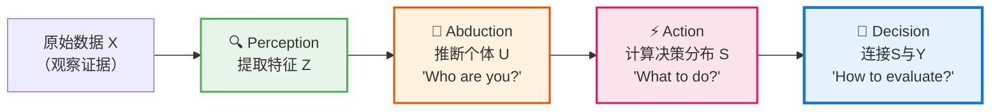

# CausalEngine第四阶段详解：Decision 框架

> - 📋 文档用途: 深入解析CausalEngine第四阶段(Decision)的核心数学原理，统一不同任务的底层逻辑。
> - 🎯 目标读者: 核心开发者与研究人员，关注因果建模、概率编程和深度学习的交叉领域。
> - 📖 内容定位: Decision Head的理论基础、数学推导和未来方向的权威参考。

## 引言：重新定义第四阶段的核心问题

在CausalEngine的四阶段透明因果推理链 `Perception → Abduction → Action → Decision` 中，第四阶段**Decision (决断)**承担着连接抽象决策与具体任务的桥梁作用。

我们真正的核心问题是：
> 假设模型已为个体推断出潜在决策分数的分布 $S \sim \text{Cauchy}(\mu_S, \gamma_S)$，并且我们观测到了真实世界的结果 $y_{\text{true}}$。我们如何利用 $y_{\text{true}}$ 来计算模型的损失，从而指导训练？

这个问题的答案，才是**Decision Head**的真正基石。

## 1. 理论基石：确定性结构方程与衍生似然

### 1.1 万物之源：确定性结构方程

我们假设，在世界的底层物理中，观测结果 $y$ 是由一个潜在的决策分数 $s$ 通过一个**确定性的函数** $\tau$ (tau) 产生的。这个决策分数 $s$ 本身，又是从更深层的个体表征 $u$ 和一个随机扰动 $\epsilon$ 衍生而来。

完整的上层结构方程 $f$ 可以分解为 Action 和 Decision 两个阶段：
$$ y = \tau(s) \quad \text{其中} \quad s = w \cdot (u + \epsilon) + b $$

- $u$: 来自**Abduction**阶段的个体深层表征。
- $\epsilon$: 代表了个体内部或环境中的**随机性**。我们假设 $\epsilon \sim \text{Cauchy}(0, 1)$ 或其他标准分布。
- $w, b$: 来自**Action**阶段的参数，负责将 $u$ 适配到决策空间。
- $\tau$: **Decision**阶段的核心，定义了从决策到观测的确定性变换函数。

**核心洞察**：整个 `u -> s -> y` 的过程，一旦随机变量 $\epsilon$ 的值被确定，就是一个完全确定的函数链。我们模型面对的概率分布，是由于我们对 $\epsilon$ 的不确定性而**衍生**出来的。

### 1.2 不确定性的双重来源与柯西传播

在CausalEngine框架中，最终决策分布$S$的不确定性来自两个独立且互补的源头：

**认知不确定性（Epistemic Uncertainty）**：
- 来源：**Abduction阶段**对个体表征的推断不确定性
- 数学表示：$U \sim \text{Cauchy}(\mu_U, \gamma_U)$，其中$u$本身是随机变量
- 含义：即使在完全确定的环境下，我们对个体真实表征的认知仍存在不确定性
- 特性：原则上可通过更好的模型、更多数据来减少

**外生不确定性（Aleatoric Uncertainty）**：
- 来源：**Action阶段**注入的可学习外生噪声$\mathbf{b}_{\text{noise}}$
- 数学表示：$\epsilon \sim \text{Cauchy}(0, 1)$，通过$\mathbf{b}_{\text{noise}} \cdot \epsilon$调制强度
- 含义：环境和个体内在的随机扰动，即使完全知道个体表征仍无法消除
- 特性：反映世界的本质随机性，可学习但不可消除

**柯西分布的优雅传播**：
基于柯西分布的线性稳定性，两种不确定性在Action阶段完美融合：
$$U' = U + \mathbf{b}_{\text{noise}} \cdot \epsilon \sim \text{Cauchy}(\mu_U, \gamma_U + |\mathbf{b}_{\text{noise}}|)$$
$$S = w \cdot U' + b \sim \text{Cauchy}(w \cdot \mu_U + b, |w| \cdot (\gamma_U + |\mathbf{b}_{\text{noise}}|))$$

这种设计使得最终的决策分布$S$自然地包含了**认知限制**和**世界随机性**的复合效应，为Decision阶段提供了丰富而结构化的不确定性信息。

### 1.3 损失计算的核心：计算观测Y的似然

我们的根本任务是：对于一个给定的真实观测 $y_{\text{true}}$，计算其发生的可能性（即似然），从而更新模型参数（如 $w, b$ 以及产生 $u$ 的网络）。

根据结构方程 $\tau$ 的性质，我们有两条核心路径来计算这个似然：

#### 路径A：当 $\tau$ 可逆时（例如：回归）
如果 $\tau$ 是可逆的，我们可以通过其逆函数 $\tau^{-1}$，精确地找到是哪个潜在分数 $s_{\text{inferred}}$ 导致了观测 $y_{\text{true}}$。
$$ s_{\text{inferred}} = \tau^{-1}(y_{\text{true}}) $$
此时，$y_{\text{true}}$ 的似然可以直接通过 $s_{\text{inferred}}$ 在潜在分数分布 $S$ 中的**概率密度（Probability Density Function, PDF）**来计算。
$$ \text{Likelihood}(y_{\text{true}}) \propto p_S(s_{\text{inferred}}) $$
**计算手段**：**逆向映射 + PDF**。

#### 路径B：当 $\tau$ 不可逆时（例如：分类）
如果 $\tau$ 是不可逆的（多对一映射），我们无法从 $y_{\text{true}}$ 反推一个唯一的 $s$。例如，在二元分类中 $y = \mathbb{I}(s > c)$，任何大于 $c$ 的 $s$ 都会产生 $y=1$。
此时，我们计算的是导致 $y_{\text{true}}$ 发生的**整个事件集合的概率**。
$$ \text{Likelihood}(y_{\text{true}}=1) = P(\{s \mid \tau(s) = 1\}) = P(S > c) $$
**计算手段**：**事件概率 + CDF** (累积分布函数)。

**总结**：**“逆”不是目的，只是路径A的手段。真正的目的是统一计算所有确定性函数 $\tau$ 下的观测似然。**

## 2. 决断策略：结构方程 $\tau$ 的不同形态

### 2.1 路径A特例：恒等映射（标准回归）

这是最基础的假设，常用于标准回归任务。

- **结构方程 $\tau$**: 假设观测 $y$ 就是决策分数 $s$ 本身，是一个可逆的恒等映射。
  $$ y = \tau(s) = s $$
- **似然计算**: 使用路径A。从观测 $y_{\text{true}}$ 到潜在分数的逆映射为：
  $$ s_{\text{inferred}} = \tau^{-1}(y_{\text{true}}) = y_{\text{true}} $$
  模型的损失通过计算 $s_{\text{inferred}}$ 在模型预测的决策分布 $S \sim \text{Cauchy}(\mu_S, \gamma_S)$ 下的负对数似然（NLL）得到：
  $$
  \begin{aligned}
  L(y_{\text{true}}, \mu_S, \gamma_S) &= -\log p_S(s_{\text{inferred}}) \\
  &= -\log \left( \frac{1}{\pi\gamma_S(1 + (\frac{y_{\text{true}} - \mu_S}{\gamma_S})^2)} \right) \\
  &= \log(\pi) + \log(\gamma_S) + \log\left(1 + \left(\frac{y_{\text{true}} - \mu_S}{\gamma_S}\right)^2\right)
  \end{aligned}
  $$
- **实现**: 这对应于 `causal_sklearn/_causal_engine/heads.py` 中的 `RegressionHead`，它直接将 `y_true` 作为输入来计算柯西NLL损失。

### 2.2 路径A特例：CDF变换（处理任意已知分布）

这是一个极其优美的特例，当我们可以假设观测 $y$ 服从某个已知的连续分布时使用。

- **核心思想**: 为了计算似然，我们需要定义一个从观测空间 $Y$ 到潜在决策空间 $S$ 的、**与模型参数无关的**固定变换。我们利用概率积分变换（Probability Integral Transform）来实现这一点。
- **结构方程 $\tau$**: 我们假设潜在分数 $s$ 和观测 $y$ 在它们各自的概率分布中处于相同的分位数。这构成了它们之间的可逆关系。
  $$ F_S(s) = F_Y(y) $$
  其中 $F_S$ 是决策分数 $S$ 的CDF，而 $F_Y$ 是我们为观测 $y$ 假设的已知CDF。
- **似然计算**: 使用路径A。为了将 $y_{\text{true}}$ 映射到决策空间，我们利用标准柯西分布 $\text{Cauchy}(0,1)$ 作为“公共转换尺度”，定义逆映射 $\tau^{-1}: Y \to S$：
  $$ s_{\text{inferred}} = \tau^{-1}(y_{\text{true}}) = F_{\text{Cauchy}(0,1)}^{-1}(F_Y(y_{\text{true}})) = \tan(\pi(F_Y(y_{\text{true}}) - 0.5)) $$
  这个 $s_{\text{inferred}}$ 就是 $y_{\text{true}}$ 在标准柯西空间中的“等价位置”。然后，我们用模型预测的决策分布 $S \sim \text{Cauchy}(\mu_S, \gamma_S)$ 来评估生成这个点的对数似然：
  $$ L(y_{\text{true}}, \mu_S, \gamma_S) = \text{CauchyNLL}(s_{\text{inferred}}, \mu_S, \gamma_S) $$
- **实现**: 该方法让模型能为**任何已知的一维连续分布**（如均匀分布、正态分布、指数分布等）的输出进行建模，只需在Decision Head中定义相应的 $F_Y$ 即可。

### 2.3 路径A特例：可学习的逆向映射（自适应决断）

当 $\tau$ 的形式未知但我们假设其可逆时，可以采用此策略。

- **结构方程 $\tau$**: $y = \tau(s)$，其中 $\tau$ 本身是一个可逆的、可学习的函数。
- **似然计算**: 使用路径A。我们让逆映射 $\tau^{-1}$ 成为一个可学习的神经网络 $\text{NN}_{\theta}$。
  $$ s_{\text{inferred}} = \text{NN}_{\theta}(y_{\text{true}}) $$
  损失函数为：
  $$ L(y_{\text{true}}, \mu_S, \gamma_S, \theta) = \text{CauchyNLL}(\text{NN}_{\theta}(y_{\text{true}}), \mu_S, \gamma_S) $$
- **实现**: 这个神经网络 $\text{NN}_{\theta}$ 通常被设计成**可逆神经网络（INN / RevNet）**，以保证逆向计算的高效性和稳定性。这是路径A最灵活的形态，能处理高维、具有复杂依赖结构的输出。

### 2.4 路径B特例：阈值事件（分类问题）

当 $\tau$ 是多对一的、不可逆的函数时，例如分类任务。

- **结构方程 $\tau$**: 采用 One-vs-Rest (OvR) 策略，对每个类别 $k$ 的结构方程是：
  $$ y_k = \tau_k(s_k) = \mathbb{I}(s_k > C_k) $$
  其中 $y_k=1$ 表示样本属于类别 $k$，$\mathbb{I}$ 是指示函数，$s_k$ 是对类别 $k$ 的决策分数，$C_k$ 是决策阈值（通常默认为0）。
- **似然计算**: 必须使用路径B。我们无法从 $y_k=1$ 反推唯一的 $s_k$，因此我们计算该**事件发生的概率**。利用决策分数分布 $S_k \sim \text{Cauchy}(\mu_{S_k}, \gamma_{S_k})$ 的累积分布函数(CDF)，我们可以得到：
  $$ P_k \equiv P(Y_k=1) = P(S_k > C_k) = 1 - F_{S_k}(C_k) = \frac{1}{2} - \frac{1}{\pi}\arctan\left(\frac{C_k - \mu_{S_k}}{\gamma_{S_k}}\right) $$
  这个概率 $P_k$ 就是二元分类的预测概率。总损失是所有类别上的**二元交叉熵（BCE）损失**之和，这等价于最大化观测到的多标签分类结果的对数似然：
  $$ L(\{y_k\}, \{\mu_{S_k}, \gamma_{S_k}\}_{k=1}^K) = - \sum_{k=1}^K \left[ y_k \log(P_k) + (1-y_k)\log(1-P_k) \right] $$
- **实现**: `ClassificationHead` 的 OvR 策略完美地体现了路径B的思想。

## 3. 结论：一个统一的似然计算框架

CausalEngine的**Decision Head**远非一个简单的输出层。它是一个深刻而统一的数学框架，其核心是**围绕结构方程 $y = \tau(s)$，通过设计或学习其变换函数 $\tau$ 来计算任意形式观测的似然**。

- `heads.py` 中当前的实现，是这个宏大框架下最基础、最直接的特例。
- CDF变换和可逆神经网络代表了其未来发展的巨大潜力，能够以一种有原则的、基于因果假设的方式，处理高度复杂和多样化的任务。

这种设计使得模型的前三个阶段（Perception, Abduction, Action）可以保持任务无关性和强大的可迁移性，而将任务的特异性优雅地封装在第四阶段**Decision Head**的变换函数 $\tau$ 的假设中。
