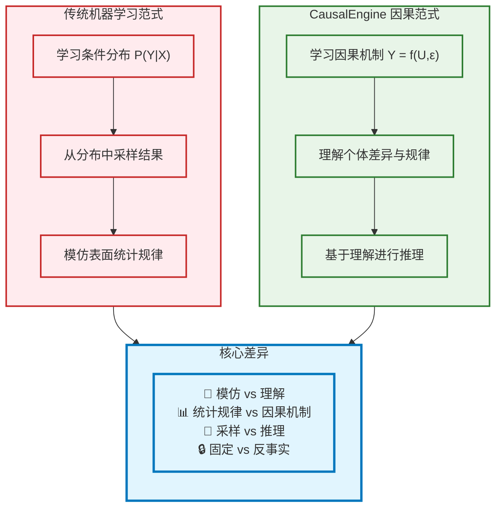
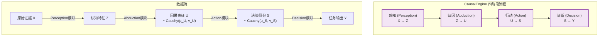
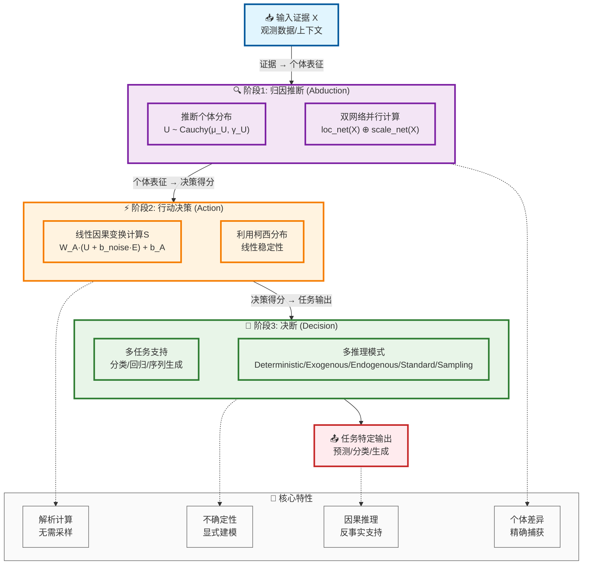
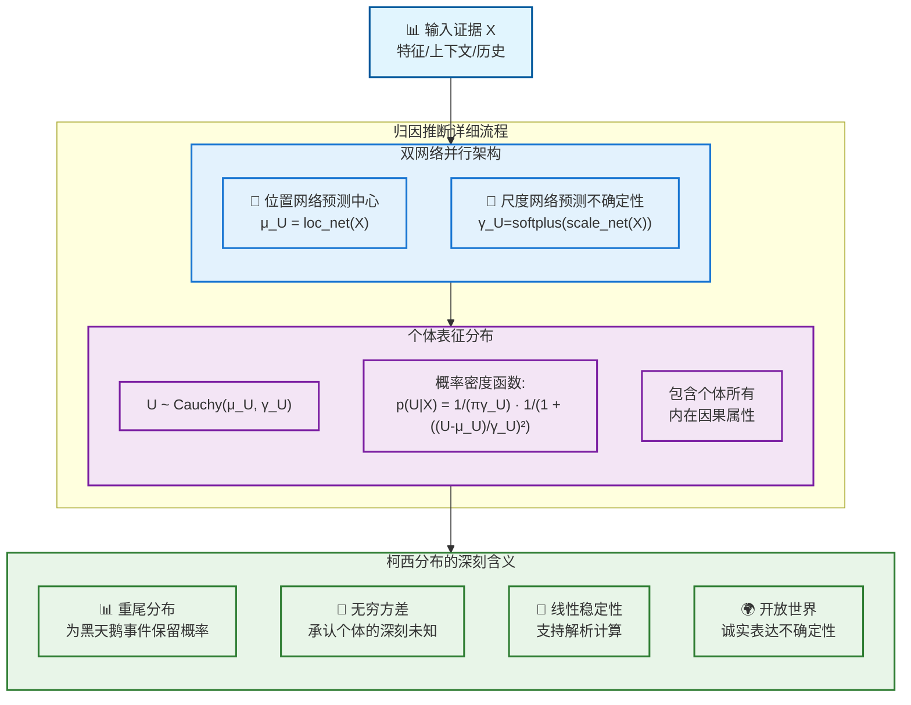
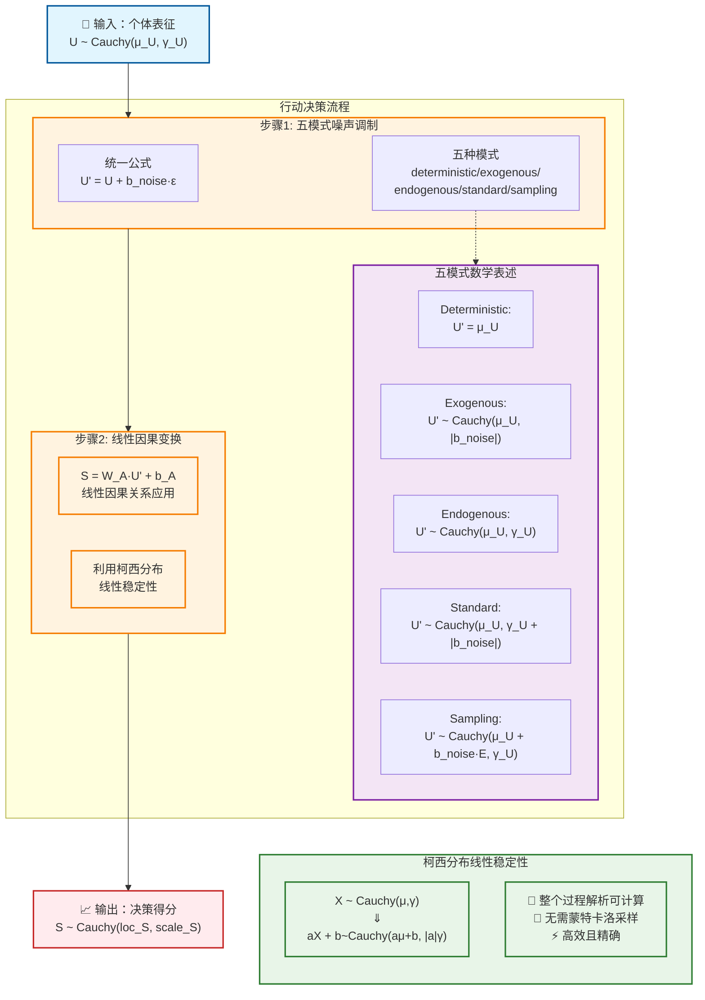
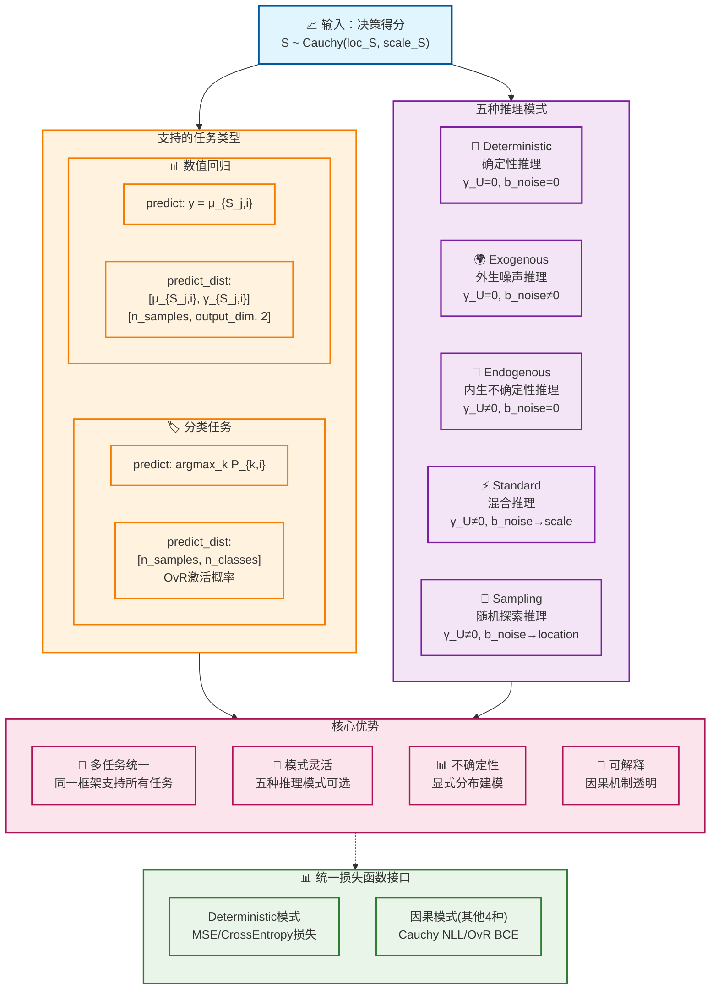
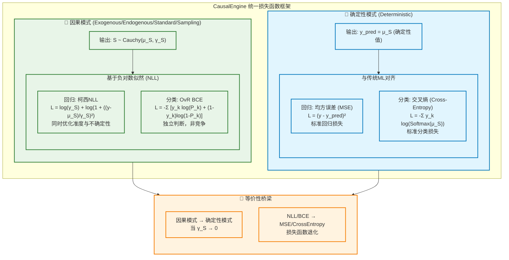
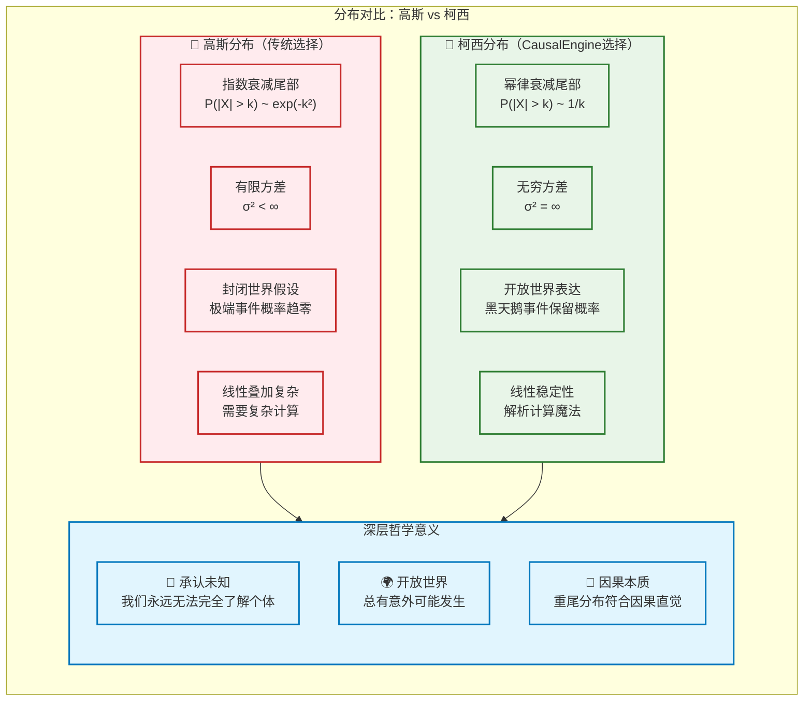
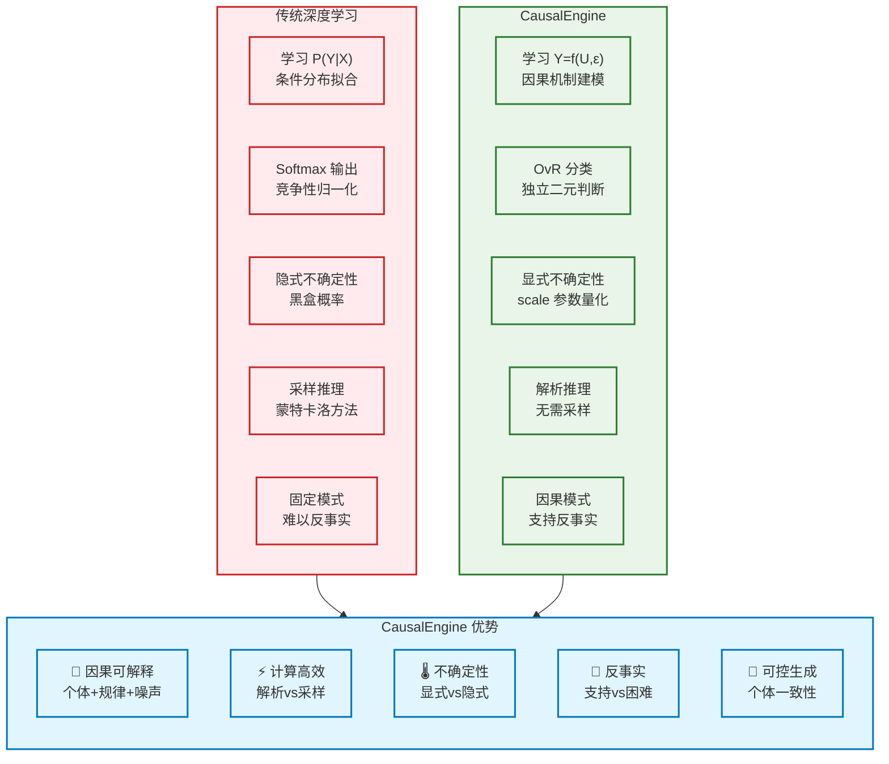
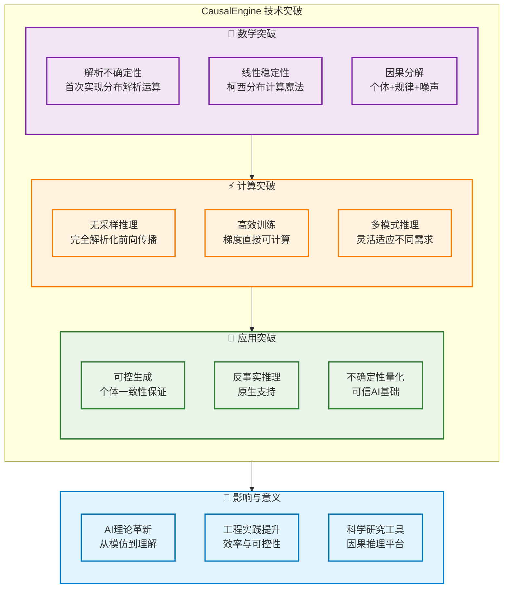

# CausalEngine 数学基础

> **核心创新**: 基于因果推理的通用智能算法，首次实现不确定性的解析运算  
> **理论基石**: [Distribution-consistency Structural Causal Models](https://arxiv.org/abs/2401.15911)  
> **技术突破**: 利用柯西分布的线性稳定性，避免大规模采样

## 1. 核心哲学与数学框架

### 1.1 因果推理的本质

CausalEngine 基于一个深刻洞察：**真正的智能是理解，而非模仿**。传统机器学习通过学习 $P(Y|X)$ 来模拟数据分布，而 CausalEngine 通过学习因果机制来理解世界运行的本质规律。



### 1.2 个体选择变量 U 的双重身份

为了真正实现因果推理，我们引入**个体选择变量 $U$**——这是理解 CausalEngine 所有"魔法"的关键：

**身份一：个体选择变量**
- $U=u$ 代表从所有可能个体中"选择"了特定个体 $u$

**身份二：个体因果表征**  
- 向量 $u$ 包含该个体所有内在的、驱动其行为的潜在属性

### 1.3 核心数学框架

CausalEngine 基于结构因果模型的数学框架：

$$Y = f(U, E)$$

其中：
- **$Y$**: 观测结果
- **$U$**: 个体选择变量（Individual Choice Variable）
- **$E$**: 外生噪声（Exogenous Noise）  
- **$f$**: 普适因果机制（Universal Causal Mechanism）

**关键洞察**：
- **复杂性在表征**：从混乱证据 $X$ 推断真正表征 $U$ 是高度非线性的
- **简洁性在规律**：一旦找到正确表征 $u$，因果规律 $f$ 本身是简单线性的
- **一致性在机制**：函数 $f$ 对所有个体普适，个体差异完全体现在 $u$ 中

## 2. CausalEngine 架构演进：从三阶段到四阶段

> **核心思想**: 架构的演进是为了在概念上更清晰地分离"特征感知"与"因果归因"，使模型在结构上与理论更完全地对齐。

### 2.1 最新四阶段模型 (核心架构)

经过进一步的思考和迭代，我们认为最初的三阶段模型（归因、行动、激活）在概念上存在混淆，特别是将"特征感知"和"因果归因"两个截然不同的步骤耦合在了"归因网络"中。为了使架构更清晰、更灵活，并更忠实地反映其哲学核心，我们将其演进为以下更精确的四阶段模型：

> Perception → Abduction → Action → Decision



这四个阶段代表了一个完整的智能决策链条：

1.  **感知 (Perception)**: "我观察到了什么？" - 负责从原始、复杂的输入 `X` 中提取出有意义、干净的认知特征 `Z`。这是一个纯粹的表征学习模块。
2.  **归因 (Abduction)**: "基于我的观察，我推断自己是谁？" - 负责基于认知特征 `Z`，推断出不可见的、代表个体本质的因果表征 `U` 的分布 `Cauchy(μ_U, γ_U)`。
3.  **行动 (Action)**: "如果是我去行动，会产生什么潜在结果？" - 负责应用普适的线性因果规律，将个体表征 `U` 变换为行动的潜在决策得分 `S` 的分布 `Cauchy(μ_S, γ_S)`。
4.  **决断 (Decision)**: "基于这些潜在结果，我最终的裁决是什么？" - 负责通过一个确定性的的数学函数，将分决策得分 $s$ `s~S` 转换为具体任务（分类、回归等）的最终输出 $y$。

这一架构的演进，使得模型在结构上与理论完全对齐，极大地提升了模块化程度和灵活性，允许我们为感知模块（Perception）轻松替换不同的网络结构（如CNN, Transformer等），从而构建一个真正通用的因果推理引擎。

### 2.2 三阶段模型回顾 (历史参考)

> **编者注**: 本章节描述的是CausalEngine的早期三阶段模型。其核心思想已被整合并升华到最新的四阶段模型中。本节保留仅为追溯历史演进之用。

#### 2.2.1 整体架构图



#### 2.2.2 阶段1：归因（Abduction）

**核心任务**：从观测证据推断个体的内在因果表征



**数学表达**：

位置网络计算个体表征的"中心"：
$$\mu_U = \text{loc\_net}(X)$$

尺度网络计算个体表征的"不确定性"：
$$\gamma_U = \text{softplus}(\text{scale\_net}(X)) = \log(1 + \exp(\text{scale\_net}(X)))$$

个体表征分布：
$$U \sim \text{Cauchy}(\mu_U, \gamma_U)$$

#### 2.2.3 阶段2：行动（Action）

**核心任务**：基于个体表征生成决策得分，体现普适因果规律



**线性稳定性的数学魔法**：

柯西分布具有独特的线性稳定性质：
$$\text{如果 } X \sim \text{Cauchy}(\mu, \gamma), \text{ 则 } aX + b \sim \text{Cauchy}(a\mu + b, |a|\gamma)$$

**加法稳定性**：
$$X_1 \sim \text{Cauchy}(\mu_1, \gamma_1), X_2 \sim \text{Cauchy}(\mu_2, \gamma_2) \Rightarrow X_1 + X_2 \sim \text{Cauchy}(\mu_1 + \mu_2, \gamma_1 + \gamma_2)$$

**线性组合稳定性**：
$$\sum_{i=1}^n w_i X_i \sim \text{Cauchy}\left(\sum_{i=1}^n w_i \mu_i, \sum_{i=1}^n |w_i| \gamma_i\right)$$

这使得整个前向传播过程完全解析化，无需任何采样！

#### 2.2.4 阶段3：决断 (Decision)

**核心任务**：将决策得分转化为任务特定的输出，即实现变换 $y = \tau(s)$。

Decision Head 是 CausalEngine 的最后一层，负责将通用的决策得分 $S$ 转换为具体任务需要的输出格式。

**默认配置设计**：
- **不可学习参数**：Decision Head采用固定的数学变换，无需训练。
- **简单高效**：避免额外的复杂性，专注于核心因果推理能力。
- **数学纯粹**：直接基于柯西分布的解析性质进行输出变换。

**数学公式**：

回归任务的变换函数 $\tau$（恒等映射）：
$$y_{j,i} = \tau(s_{j,i}) = \mu_{S_{j,i}}$$

分类任务的变换函数 $\tau$（基于柯西CDF的事件概率）：
$$P_{k,i} = P(S_k > C_k) = \frac{1}{2} - \frac{1}{\pi}\arctan\left(\frac{C_k - \mu_{S_{k,i}}}{\gamma_{S_{k,i}}}\right)$$

其中 $C_k$ 是决策阈值（通常为0），所有其他变换参数都是固定的（无可学习权重），确保Decision Head的数学纯粹性。

> **未来扩展**：后续版本可引入可学习的Decision Head，如分类任务的可调阈值 $C_k$ 或回归任务的线性变换权重，以提升模型表达能力。

不同的推理模式支持不同类型的机器学习任务。



#### 数学等价性配置

**核心理念**：通过 Deterministic 模式实现与传统深度学习的完全数学等价，为CausalEngine提供可信的理论基线。

**等价性配置**：
```python
# Deterministic模式配置
mode = "deterministic"  # γ_U=0, b_noise=0
# 此时 U' = μ_U（确定性），整个模型退化为标准MLP
```

**数学验证**：

Deterministic模式下的前向传播：
$$U' = \mu_U = \text{loc\_net}(X)$$
$$S = W_A \cdot U' + b_A = W_A \cdot \text{loc\_net}(X) + b_A$$

任务输出：
- **回归**：$y = \mu_S = S$（与MLP线性层等价）
- **分类**：$\text{logits} = \mu_S = S$（与MLP+CrossEntropy等价）

> **数学注记**：虽然可以将 `loc_net` 设为恒等映射来更直观地显示等价性，但由于线性变换的复合仍为线性变换，即 $W_A \cdot \text{loc\_net}(X) + b_A$ 在数学上等价于任意线性层 $W \cdot X + b$，因此当前设计已完全保证数学等价性。

**等价性意义**：
- ✅ **数学基线**：确保CausalEngine理论基础的正确性
- ✅ **性能对比**：为因果推理能力提供可信的参考标准  
- ✅ **渐进验证**：从确定性逐步过渡到因果推理模式

#### 2.2.5 统一损失函数

CausalEngine 的设计哲学之一是与传统机器学习的数学等价性。这不仅体现在模型架构上，也体现在损失函数的设计上。我们为不同的推理模式设计了不同的损失函数，确保在`deterministic`模式下与标准方法完全对等，同时在因果模式下使用更符合理论基础的损失。



##### 2.5.2.1 因果模式损失：基于分布的负对数似然

在`exogenous`, `endogenous`, `standard`, `sampling`四种因果模式下，模型输出的是一个完整的柯西分布 $S \sim \text{Cauchy}(\mu_S, \gamma_S)$。因此，我们采用负对数似然（Negative Log-Likelihood, NLL）作为损失函数，以最大化观测数据出现的概率。

**1. 回归任务：柯西NLL损失**

对于回归任务，给定真实值 $y$，其损失是柯西分布的负对数似然：
$$L_{\text{CauchyNLL}}(y, \mu_S, \gamma_S) = -\log p(y | \mu_S, \gamma_S) = \log(\pi) + \log(\gamma_S) + \log\left(1 + \left(\frac{y - \mu_S}{\gamma_S}\right)^2\right)$$
该损失函数会同时优化预测的中心 $\mu_S$ 和不确定性 $\gamma_S$，使模型学会不仅预测得"准"，还要对自己的预测"有数"。

**2. 分类任务：独立二元交叉熵损失（OvR BCE）**

对于分类任务，我们采用 One-vs-Rest (OvR) 策略。每个类别 $k$ 都被视为一个独立的二元分类问题。
首先，通过柯西CDF计算出将决策得分 $S_k$ 判定为正类的概率 $P_k$：
$$P_{k} = P(S_k > C_{k}) = \frac{1}{2} - \frac{1}{\pi}\arctan\left(\frac{C_k - \mu_{S_{k}}}{\gamma_{S_{k}}}\right)$$
其中 $C_k$ 是一个可学习或固定的决策阈值（通常默认为0）。

然后，对所有类别使用二元交叉熵（Binary Cross-Entropy, BCE）计算总损失：
$$L_{\text{OvR-BCE}} = -\sum_{k=1}^{K} [y_k \log P_k + (1-y_k) \log(1-P_k)]$$
其中 $y_k$ 是类别 $k$ 的真实标签（0或1）。这种方法摆脱了Softmax的竞争性归一化，允许模型对每个类别做出独立、不相互排斥的判断。

##### 2.5.2.2 确定性模式损失：与传统ML对齐

在`deterministic`模式下，$\gamma_U=0$ 且 $b_{noise}=0$，因此输出的尺度 $\gamma_S=0$，分布退化为确定性值。此时，模型与标准深度学习模型在数学上等价，损失函数也相应退化。

**1. 回归任务：均方误差损失（MSE）**

当 $\gamma_S \to 0$ 时，柯西NLL损失在数学上并不适用。此时模型输出 $y_{pred} = \mu_S$，我们采用标准的均方误差损失：
$$L_{\text{MSE}}(y, y_{pred}) = (y - y_{pred})^2$$

**2. 分类任务：标准交叉熵损失（Cross-Entropy）**

在确定性模式下，模型的输出 $\mu_S$ 等价于传统模型的logits。因此，我们使用标准的多分类交叉熵损失：
$$L_{\text{CrossEntropy}}(y, \mu_S) = -\sum_{k=1}^{K} y_k \log(\text{Softmax}(\mu_S)_k)$$

通过这种双轨设计，CausalEngine不仅推进了因果推理的边界，也坚实地植根于现有深度学习的最佳实践中，为性能对比和理论验证提供了坚固的桥梁。

## 3. 理论深探：生成过程与噪声处理

> **编者注**: 以下内容源自附录，深入探讨了四阶段模型背后的哲学思想，包括"本体与认知"的区分，以及对随机噪声的统一处理原则。这是理解CausalEngine如何运作的关键。

### 3.1 论生成过程：从"嫌疑人名单"到"抽样推演"

我们必须严格区分个体的"本体"（Ontology）和我们对个体的"认知"（Epistemology）。此前的"潜能之云"比喻不够精确，现更正如下。

#### 正确的生成过程 (The Generative Process)

我的核心思想是，**个体是确定的，不确定性来源于我们的认知**。

1.  **个体的本体是固定的 (`u`)**: 每一个体都有一个真实的、确定的、但我们永远无法直接观测的因果表征 `u`。它就像个体的DNA，是其内在属性的唯一蓝图。它就在那里，固定不变。

2.  **归因的终点是"嫌疑人名单" (`P(U|x)`)**: `Abduction` 阶段的使命，不是去描述个体有什么"潜能"，而是基于我们有限的观察 `x`，在茫茫人海中圈定出一个所有成员都符合该证据的**子群体**。我们用后验分布 `P(U|x)` 来数学化地描述这个群体。这个分布，更像是一份**"嫌疑人名单"**——我们知道真实的 `u` 就在这份名单上，但我们无法确定是哪一个。

3.  **故事的开端是"抽样推演" (`u ~ P(U|x)`)**: 整个前向推理的"第一推动力"，是从这份"嫌疑人名单"中，随机抽取一个样本 `u` 来进行一次**模拟推演**。这个操作的本质是在问："***如果***真正的个体恰好是名单上的这一个 `u`，那么接下来会发生什么？"

4.  **行动的本质是确定性规律 (`f_action`)**: `Action` 模块 `f_action` 是一个确定性的因果转换函数。它代表了普适的因果规律。它的输入是一个**具体的"嫌疑人" `u`**，输出则是这个`u`在此规律下必然导致的**具体的决策得分 `s`**。
    $$ s = f_{\text{action}}(u) $$

5.  **决策得分分布的涌现 (`S`)**: `S` 分布并非基本实体，而是**涌现**的结果。它完全是由我们**认知中的不确定性**（体现在"嫌疑人名单"`P(U|x)`的分布上），经过确定性函数 `f_action` 映射到输出空间的结果。

#### 数学形式化

这个生成过程的数学描述保持不变，但我们对其含义的理解变得更加深刻：

-   `Action` 模块的函数 `f_action` 是一个确定性线性变换：
    $$ f_{\text{action}}(u) = W_A \cdot u + b_A $$
-   我们进行抽样推演的起点是"嫌疑人名单"的分布 `P(U|x)`，即：
    $$ u \sim \text{Cauchy}(\mu_U, \gamma_U) $$
-   根据柯西分布的线性稳定性，我们可以解析地推导出，如果我们对所有"嫌疑人"都进行推演，最终得到的决策得分 `s` 将构成一个新的分布 `S`：
    $$ s = W_A \cdot u + b_A \sim \text{Cauchy}(W_A \cdot \mu_U + b_A, |W_A| \cdot \gamma_U) $$
-   因此，`S` 分布的参数，代表了整个"嫌疑人名单"在因果规律作用下的群体表现：
    $$ \mu_S = W_A \cdot \mu_U + b_A $$
    $$ \gamma_S = |W_A| \cdot \gamma_U $$

#### 为什么这个区别至关重要？

这个本体与认知的区分，是整个 `CausalEngine` 理论的基石：

*   **它锁定了不确定性的唯一根源**: 所有的"随机性"都来自于我们**认知上的局限**（我们只有一个嫌疑人名单，而非确定的个体），而不是个体本身是"随机的" 。
*   **它定义了因果规律的纯粹性**: 因果规律 `f_action` 是确定性的，它作用于具体的实例（一个假想的`u`），而非作用于我们的"认知"（一个概率分布）。Action 的噪声注入代表是外生随机性，我们认为外生噪声是通过影响个体选择变量分布来影响结果的。
*   **它让模型变得可控和可解释**: 我们可以通过控制"如何对待这份嫌疑人名单"（例如，是只考察最典型的嫌疑人`μ_U`，还是随机抽查一个`u`）来精确地控制模型的不同推理模式。

只有深刻理解了**"个体是确定的，而我们的认知是不确定的"**这一核心矛盾，我们才能在代码中正确地实现这个优雅的生成过程。

### 3.2 噪声的统一处理原则

模型对外部世界随机性的处理，基于一个核心的**数学等价假设**：

> 一个特定个体 `u` 在外生噪声 `ε` 下产生的结果分布 `f(u, ε)`，可以在数学上等价地由一个"被噪声扰动后的虚拟个体群体 `U_noisy`"通过一个"确定性因果律 `f_action`"来建模。

基于此，模型中代表外生随机性的噪声参数 `b_noise`，其作用点并非在 `Action` 阶段干涉确定性函数 `f_action`，而是用于在采样前**构造**那个"被噪声扰动后的虚拟个体群体 `U_noisy`"。

这在数学上表现为对 `P(U|x)` 分布参数的修正。例如：
-   `standard` 模式通过 `γ_U' = γ_U + |b_noise|` 来扩大虚拟群体的多样性。
-   `exogenous` 模式通过修正 `μ_U` 来平移虚拟群体的中心。

通过这种方式，`f_action` 作为普适因果律的纯粹性得到了保障。它永远只作用于一个从（可能已被修正的）分布中最终采样出的具体实例 `u`。这一设计，将所有不确定性都统一归因为对个体认知的建模，而非对因果律本身的干涉。

## 4. 核心数学构件：柯西分布

### 4.1 为什么选择柯西分布？



### 4.2 柯西分布的三重价值

> *"在反事实世界里，一切皆有可能。"*  
> *"In the counterfactual world, everything is possible."*

**1. 诚实的不确定性表达**
> "任何观测到的伟大成就，任何人都有非零的概率做出来"

重尾分布为"黑天鹅"事件保留不可忽略的概率，诚实表达开放世界的深层不确定性。

**2. 数学上的"深刻未知"**

柯西分布的期望和方差数学上无定义：
$$E[X] = \text{undefined}, \quad \text{Var}[X] = \text{undefined}$$

这恰好对应了"我们永远无法完全知道一个个体到底是什么样的"这一哲学事实。

**3. 线性稳定性（计算魔法）**

柯西分布的线性稳定性使得整个前向传播过程可以完全解析化：

$$X_1 + X_2 \sim \text{Cauchy}(\mu_1 + \mu_2, \gamma_1 + \gamma_2)$$
$$w \cdot X \sim \text{Cauchy}(w \cdot \mu, |w| \cdot \gamma)$$

## 5. 实际应用与优势

### 5.1 与传统方法的对比



### 5.2 核心技术突破



## 6. 总结与展望

CausalEngine 代表了人工智能从"模仿"向"理解"的范式转变。通过引入个体选择变量 $U$ 和利用柯西分布的线性稳定性，我们首次实现了：

1. **真正的因果推理**：基于 $Y = f(U, E)$ 的因果机制建模
2. **解析不确定性**：无需采样的完全解析化计算  
3. **可控可解释**：个体差异与普适规律的清晰分离
4. **反事实支持**：原生支持反事实推理和可控生成

这不仅是技术上的突破，更是AI哲学的革新——从学习表面统计规律转向理解深层因果机制，为构建真正智能、可信、可控的AI系统奠定了坚实基础。

## 附录: 论生成过程：从"嫌疑人名单"到"抽样推演"

一个最核心的哲学观点必须被精确阐述，以避免任何混淆。这个观点是：**我们必须严格区分个体的"本体"（Ontology）和我们对个体的"认知"（Epistemology）。**

此前的"潜能之云"比喻不够精确，现更正如下。

### 正确的生成过程 (The Generative Process)

我的核心思想是，**个体是确定的，不确定性来源于我们的认知**。

1.  **个体的本体是固定的 (`u`)**: 每一个体都有一个真实的、确定的、但我们永远无法直接观测的因果表征 `u`。它就像个体的DNA，是其内在属性的唯一蓝图。它就在那里，固定不变。

2.  **归因的终点是"嫌疑人名单" (`P(U|x)`)**: `Abduction` 阶段的使命，不是去描述个体有什么"潜能"，而是基于我们有限的观察 `x`，在茫茫人海中圈定出一个所有成员都符合该证据的**子群体**。我们用后验分布 `P(U|x)` 来数学化地描述这个群体。这个分布，更像是一份**"嫌疑人名单"**——我们知道真实的 `u` 就在这份名单上，但我们无法确定是哪一个。

3.  **故事的开端是"抽样推演" (`u ~ P(U|x)`)**: 整个前向推理的"第一推动力"，是从这份"嫌疑人名单"中，随机抽取一个样本 `u` 来进行一次**模拟推演**。这个操作的本质是在问："***如果***真正的个体恰好是名单上的这一个 `u`，那么接下来会发生什么？"

4.  **行动的本质是确定性规律 (`f_action`)**: `Action` 模块 `f_action` 是一个确定性的因果转换函数。它代表了普适的因果规律。它的输入是一个**具体的"嫌疑人" `u`**，输出则是这个`u`在此规律下必然导致的**具体的决策得分 `s`**。
    $$ s = f_{\text{action}}(u) $$

5.  **决策得分分布的涌现 (`S`)**: `S` 分布并非基本实体，而是**涌现**的结果。它完全是由我们**认知中的不确定性**（体现在"嫌疑人名单"`P(U|x)`的分布上），经过确定性函数 `f_action` 映射到输出空间的结果。

### 数学形式化

这个生成过程的数学描述保持不变，但我们对其含义的理解变得更加深刻：

-   `Action` 模块的函数 `f_action` 是一个确定性线性变换：
    $$ f_{\text{action}}(u) = W_A \cdot u + b_A $$
-   我们进行抽样推演的起点是"嫌疑人名单"的分布 `P(U|x)`，即：
    $$ u \sim \text{Cauchy}(\mu_U, \gamma_U) $$
-   根据柯西分布的线性稳定性，我们可以解析地推导出，如果我们对所有"嫌疑人"都进行推演，最终得到的决策得分 `s` 将构成一个新的分布 `S`：
    $$ s = W_A \cdot u + b_A \sim \text{Cauchy}(W_A \cdot \mu_U + b_A, |W_A| \cdot \gamma_U) $$
-   因此，`S` 分布的参数，代表了整个"嫌疑人名单"在因果规律作用下的群体表现：
    $$ \mu_S = W_A \cdot \mu_U + b_A $$
    $$ \gamma_S = |W_A| \cdot \gamma_U $$

### 为什么这个区别至关重要？

这个本体与认知的区分，是整个 `CausalEngine` 理论的基石：

*   **它锁定了不确定性的唯一根源**: 所有的"随机性"都来自于我们**认知上的局限**（我们只有一个嫌疑人名单，而非确定的个体），而不是个体本身是"随机的" 。
*   **它定义了因果规律的纯粹性**: 因果规律 `f_action` 是确定性的，它作用于具体的实例（一个假想的`u`），而非作用于我们的"认知"（一个概率分布）。Action 的噪声注入代表是外生随机性，我们认为外生噪声是通过影响个体选择变量分布来影响结果的。
*   **它让模型变得可控和可解释**: 我们可以通过控制"如何对待这份嫌疑人名单"（例如，是只考察最典型的嫌疑人`μ_U`，还是随机抽查一个`u`）来精确地控制模型的不同推理模式。

只有深刻理解了**"个体是确定的，而我们的认知是不确定的"**这一核心矛盾，我们才能在代码中正确地实现这个优雅的生成过程。

### 噪声的统一处理原则

模型对外部世界随机性的处理，基于一个核心的**数学等价假设**：

> 一个特定个体 `u` 在外生噪声 `ε` 下产生的结果分布 `f(u, ε)`，可以在数学上等价地由一个"被噪声扰动后的虚拟个体群体 `U_noisy`"通过一个"确定性因果律 `f_action`"来建模。

基于此，模型中代表外生随机性的噪声参数 `b_noise`，其作用点并非在 `Action` 阶段干涉确定性函数 `f_action`，而是用于在采样前**构造**那个"被噪声扰动后的虚拟个体群体 `U_noisy`"。

这在数学上表现为对 `P(U|x)` 分布参数的修正。例如：
-   `standard` 模式通过 `γ_U' = γ_U + |b_noise|` 来扩大虚拟群体的多样性。
-   `exogenous` 模式通过修正 `μ_U` 来平移虚拟群体的中心。

通过这种方式，`f_action` 作为普适因果律的纯粹性得到了保障。它永远只作用于一个从（可能已被修正的）分布中最终采样出的具体实例 `u`。这一设计，将所有不确定性都统一归因为对个体认知的建模，而非对因果律本身的干涉。

---

**文档版本**: v7.0 (四阶段生成模型)  
**最后更新**: 2025年6月29日  
**理论基础**: [Distribution-consistency SCM](https://arxiv.org/abs/2401.15911)  
**技术状态**: ✅ 理论完备，进入代码重构阶段
