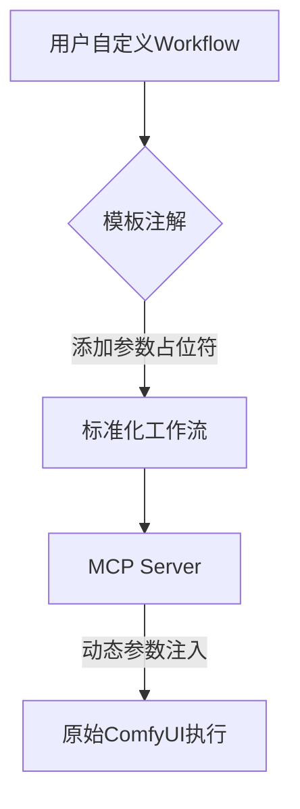
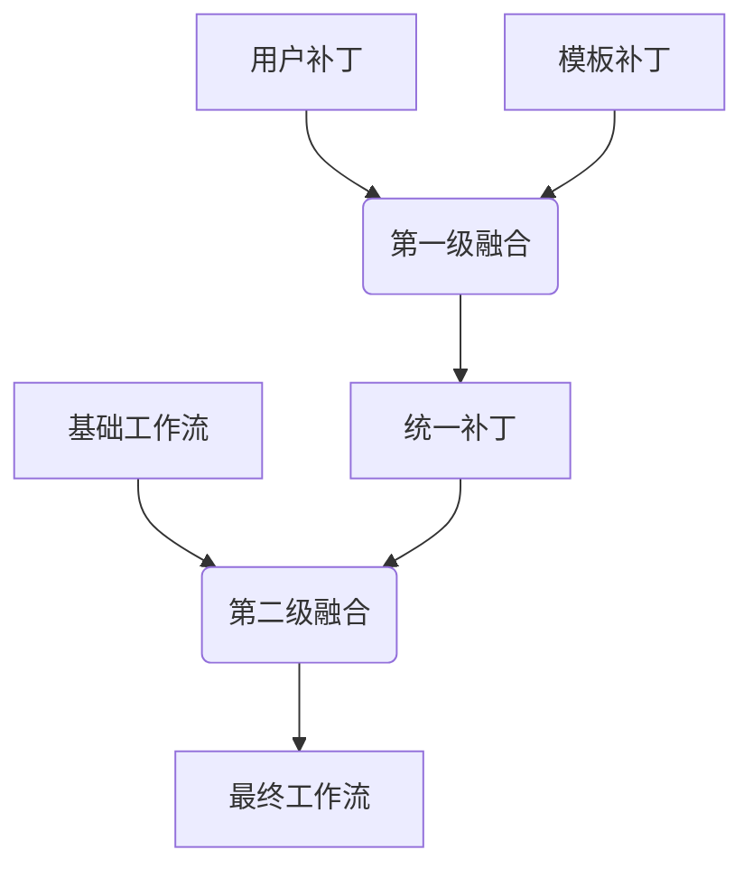
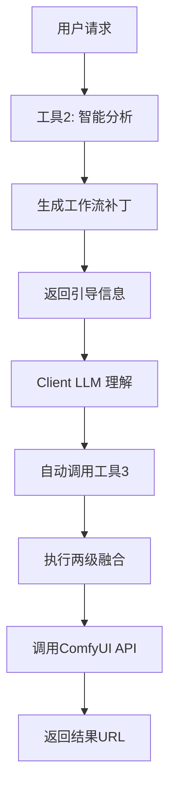

# ComfyFusion Engine - 智能化 ComfyUI 工作流执行引擎

## 🌟 项目概览

ComfyFusion Engine 是针对 ComfyUI 工作流管理难题的智能执行引擎。ComfyUI 作为基于节点的 AI 工作流编辑器，其核心优势在于允许用户通过可视化编程自由组合工作流节点（如 Stable Diffusion 模型、ControlNet 控制模块、图像后处理节点等）。然而这也带来了两个主要挑战：

1. **工作流碎片化**：用户常为不同任务创建多个变体工作流（如文生图/图生图/视频生成）
2. **参数管理复杂**：每个工作流可能有数十个可调参数（提示词、采样步数、ControlNet 权重等）

ComfyFusion Engine 通过创新设计解决这些问题：

### 🧩 通用工作流适配器
- **即插即用**：用户只需将 ComfyUI 工作流保存为 `.json` 文件并添加轻量级模板（`_tp.json`）
- **智能参数映射**：自动识别工作流中的可配置节点（如 CLIP 文本编码器、KSampler 等）
- **模板系统**：通过 `{参数}` 占位符将技术参数转化为用户友好配置项



### 💡 核心价值
1. **降低使用门槛**：
   - 将复杂节点网络抽象为简单API参数
   - 用户无需理解底层节点连接逻辑
   - 保留ComfyUI全部灵活性的同时提供标准化接口

2. **提升协作效率**：
   - 开发者可封装技术细节，暴露业务相关参数
   - 支持团队间工作流版本管理和模板共享
   - 通过MCP协议与各类IDE/编辑器深度集成

3. **生产环境就绪**：
   - 流式执行状态监控
   - 自动错误重试机制
   - 资源用量控制（GPU内存/执行时间）

## 🌟 核心特性

### 三工具协作架构
- **工具1 (`list_workflows`)**：工作流枚举器，提供可用工作流清单
- **工具2 (`analyze_and_execute`)**：智能分析器，分析用户需求并生成工作流补丁
- **工具3 (`execute_workflow`)**：纯执行引擎，执行两级融合和ComfyUI调用

### LLM引导的工具链协作
- 工具2不直接调用工具3，而是通过返回引导信息让Client LLM自动调用工具3
- 实现真正的MCP协议合规的工具链协作
- 符合FastMCP最佳实践

### 流式协议支持
- 所有工具函数支持 `AsyncGenerator` 流式返回
- 提供实时执行反馈和进度跟踪
- 支持流式错误处理和状态更新

### 两级融合架构


## 🛠️ 技术栈

- **FastMCP** >= 2.0.0 - MCP服务器框架
- **Pydantic** >= 2.0.0 - 数据验证
- **HTTPX** >= 0.24.0 - 异步HTTP客户端
- **aiofiles** >= 23.0.0 - 异步文件操作
- **deepmerge** >= 1.1.0 - 深度合并
- **watchdog** >= 3.0.0 - 文件系统监控

## ⚙️ 配置

### 基础配置 (`config/settings.json`)
项目默认配置存储在 `config/settings.json` 中。您可以复制此文件并进行修改，或通过命令行参数覆盖特定设置。

```json
{
  "comfyui": {
    "host": "127.0.0.1",
    "port": 8188,
    "timeout": 300
  },
  "mcp": {
    "server_name": "comfyfusion-engine",
    "description": "ComfyUI 智能工作流执行引擎",
    "version": "1.0.0",
    "protocol": "streaming",
    "enable_streams": true,
    "host": "127.0.0.1",
    "port": 8000
  },
  "paths": {
    "workflows": "./workflows"
  },
  "logging": {
    "level": "INFO"
  }
}
```

### 命令行参数覆盖

启动时可通过命令行参数覆盖配置文件中的任何设置。参数命名遵循 `--<section>-<key>` 格式。

| 参数 | 描述 | 示例 |
| :----------------- | :--------------------------------- | :------------------------------------ |
| `--comfyui-host`   | ComfyUI 服务地址                   | `--comfyui-host 192.168.1.100`        |
| `--comfyui-port`   | ComfyUI 服务端口                   | `--comfyui-port 8188`                 |
| `--mcp-protocol`   | MCP 服务器协议 (`stdio` 或 `streaming`) | `--mcp-protocol streaming`            |
| `--mcp-host`       | MCP 服务器监听地址                 | `--mcp-host 0.0.0.0`                  |
| `--mcp-port`       | MCP 服务器监听端口                 | `--mcp-port 8000`                     |
| `--workflows-path` | 工作流文件目录路径                 | `--workflows-path /custom/workflows`  |

**示例：**
```bash
comfyfusion-mcp \
  --comfyui-host 192.168.1.100 \
  --mcp-port 9000 \
  --workflows-path /custom/workflows
```

## 🚀 启动方式

ComfyFusion Engine 支持以下两种启动方式：

### 方式一：通过 `run_server.py` 和 `config/settings.json` 启动

这种方式适用于本地开发和调试，您可以通过修改配置文件来调整服务行为。

1.  **环境准备**：
    *   确保您已安装 Python 3.9 或更高版本。
    *   确保 ComfyUI 正在运行（默认地址：`http://127.0.0.1:8188`）。
    *   安装项目依赖：
        ```bash
        pip install -e .
        ```

2.  **配置修改**：
    *   打开 [`config/settings.json`](config/settings.json) 文件。
    *   根据您的需求修改 `comfyui` 和 `mcp` 部分的配置，例如 ComfyUI 的主机和端口，或 MCP 服务器的监听地址和端口。

3.  **启动服务器**：
    *   在项目根目录下运行：
        ```bash
        python run_server.py
        ```
    *   服务器启动后，您将看到相应的日志输出。

### 方式二：使用 `uvx` 命令行参数启动

这种方式适用于快速启动和临时配置覆盖，无需修改配置文件。

1.  **环境准备**：
    *   确保您已安装 `uv`。如果未安装，请运行：
        ```bash
        pip install uv
        ```
    *   确保 ComfyUI 正在运行（默认地址：`http://127.0.0.1:8188`）。
    *   安装 `comfyfusion-engine`：
        ```bash
        uv pip install comfyfusion-engine
        ```

2.  **启动服务器**：
    *   使用默认配置启动：
        ```bash
        comfyfusion-mcp
        ```
    *   使用命令行参数覆盖配置启动（例如，更改 ComfyUI 主机、MCP 端口和工作流路径）：
        ```bash
        comfyfusion-mcp \
          --comfyui-host 192.168.1.100 \
          --mcp-port 9000 \
          --workflows-path /custom/workflows
        ```
    *   您可以通过 `comfyfusion-mcp --help` 查看所有可用的命令行参数。

## 📁 项目结构
```
mcp-comfyui-anything/
├── src/
│   └── comfyfusion/
│       ├── __init__.py
│       ├── server.py              # FastMCP 服务器主文件
│       ├── fusion/
│       │   ├── __init__.py
│       │   ├── engine.py          # 两级融合引擎
│       │   └── mapping.py         # 参数映射配置
│       ├── api/
│       │   ├── __init__.py
│       │   └── comfyui_client.py  # ComfyUI API 客户端
│       └── utils/
│           ├── __init__.py
│           ├── config.py          # 配置管理
│           ├── logger.py          # 日志系统
│           ├── types.py           # 类型定义
│           └── workflow_discovery.py  # 工作流发现
├── workflows/                     # 工作流和模板存储
│   ├── text2image_v1.json        # 基础工作流
│   ├── text2image_v1_tp.json     # 对应模板
│   └── ...
├── config/
│   └── settings.json             # 配置文件
├── pyproject.toml                # 项目配置
├── run_server.py                 # 启动脚本
└── README.md
```

## 🔧 工作流管理

### 添加新工作流完整流程

1. **从 ComfyUI 导出完整工作流**：
   ```bash
   # 在 ComfyUI 界面操作
   1. 加载或创建您的工作流
   2. 点击右上角 "Save" 按钮
   3. 保存为 JSON 文件到 workflows/ 目录
   示例文件名: fluximage.json
   ```

2. **创建最小参数模板**：
   新建 `{工作流名称}_tp.json` 文件（如 `fluximage_tp.json`），只需包含需要暴露的参数：
   ```json
   {
     "description": "Flux 图像生成 - 支持自定义提示词",
     "nodes": {
       "6": {
         "inputs": {
           "text": "{prompt}"
         }
       },
       "31": {
         "inputs": {
           "seed": "{seed}"
         }
       }
     }
   }
   ```
   █ 原则说明：
   - 仅保留核心用户参数（通常 2-5 个）
   - 保持 JSON 结构扁平化
   - 使用英文小写参数名（prompt/seed）

3. **文件存放规范**：
   ```bash
   workflows/
   ├── your_workflow.json    # 原始工作流
   └── your_workflow_tp.json # 参数模板
   ```

4. **重启服务生效**：
   ```bash
   # 如果使用 run_server.py
   pkill -f run_server.py && python run_server.py

   # 如果使用 uvx 启动
   comfyfusion-mcp --workflows-path ./workflows
   ```

### 技术细节说明
1. 模板文件会自动与基础工作流匹配（通过文件名前缀）
2. 新增/修改模板文件后需要重启服务
3. 参数替换仅修改现有节点字段，不会新增节点
- **prompt**：控制图像生成的核心描述
- **seed**：控制生成结果的随机性
- 其他技术参数（采样器配置、模型选择等）保持默认

## 🌊 流式特性

### 实时进度反馈
```python
async for update in client.call_tool_stream("execute_workflow", args):
    print(f"进度: {update.get('progress', 0)}%")
    print(f"状态: {update.get('status', 'processing')}")
```

### 错误流式处理
- 异常和错误信息通过流式协议实时反馈
- 支持优雅降级和自动重试
- 详细的错误追踪和调试信息

## 🔄 工具协作流程



## 🛡️ 错误处理

### 监控与日志
- **流式监控**：实时状态和性能指标
- **审计日志**：完整的操作记录
- **错误追踪**：详细的异常信息

### 资源管理
- **并发控制**：合理的任务队列管理
- **资源限制**：CPU、内存和执行时间限制
- **自动清理**：临时文件和缓存管理

## 🔧 开发

### 开发环境设置
```bash
# 安装开发依赖
pip install -e .[dev]

# 代码格式化
black src/
isort src/
 
# 类型检查
mypy src/
```

### 运行测试
```bash
pytest tests/
```

## 🚀 部署

### Docker 部署
```dockerfile
FROM python:3.11-slim

WORKDIR /app
COPY . .
RUN pip install -e .

EXPOSE 8000
CMD ["python", "run_server.py"]
```

### 生产配置
- 使用环境变量覆盖配置
- 配置日志轮转和监控
- 设置健康检查端点

## 📄 许可证

本项目采用 Apache License 2.0 许可。详见 [LICENSE](LICENSE) 文件。