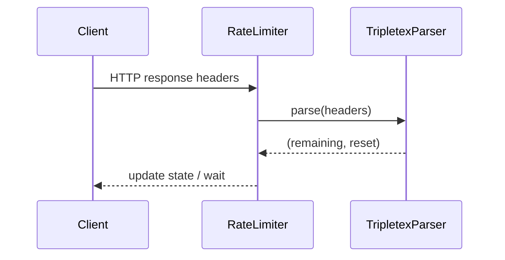

# crudclient.ratelimit.parsing

This submodule provides header parsing utilities used by the rate limiting facade. It is responsible for extracting rate limit information from HTTP response headers.

## Status

EXPERIMENTAL - APIs may change.

## Key Files

- `__init__.py` – module initialization.
- `tripletex.py` – contains `TripletexParser` for the Tripletex API header format.

## Usage

```python
from crudclient.ratelimit.parsing.tripletex import TripletexParser

headers = {
    "X-Rate-Limit-Remaining": "100",
    "X-Rate-Limit-Reset": "3600",
}

parser = TripletexParser()
info = parser.parse(headers)
print(info)  # (100, 3600.0)
```

The parser expects headers to include `X-Rate-Limit-Remaining` and `X-Rate-Limit-Reset`. The lookup is case-insensitive and returns a `(remaining, reset_seconds)` tuple or `None` when headers are missing or malformed.

## Class Overview

- `TripletexParser.parse(headers: Mapping[str, str]) -> Optional[Tuple[int, float]]`
  - Parses headers and returns `(remaining, seconds_until_reset)`.
  - Returns `None` if the expected headers are not found or cannot be parsed.

## Sequence Diagram



## Testing

Run the rate limit unit tests which exercise the parsing logic via the `RateLimiter` facade:

```bash
pytest -k ratelimit -q
```

## Dependencies

- Standard library only.

