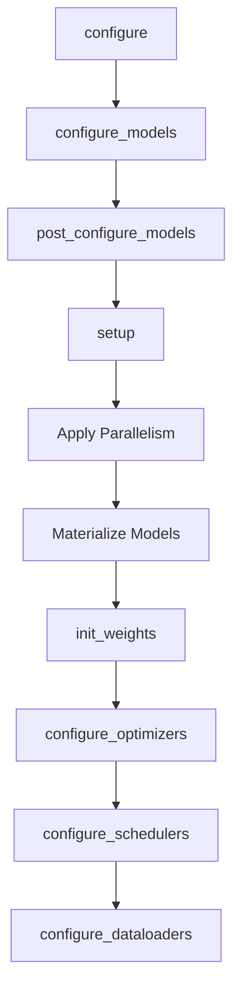

# Setup Mixins

The setup mixins provide a comprehensive framework for configuring models, optimizers, schedulers, and dataloaders in Dream Trainer. They handle the complete lifecycle from configuration to initialization, including parallelism strategies and memory optimization.

## Overview

The setup system is composed of three main mixins that work together:

1. **ModelSetupMixin** - Model configuration, parallelism, and initialization
2. **OptimizerAndSchedulerSetupMixin** - Optimizer and LR scheduler management
3. **DataLoaderSetupMixin** - Training and validation dataloader setup

These are combined into a unified **SetupMixin** that orchestrates the complete setup process.

## SetupMixin

The main setup orchestrator that combines all setup functionality:

::: dream_trainer.trainer.mixins.SetupMixin
    options:
      show_source: true
      show_bases: false
      show_root_full_path: false

### Configuration

::: dream_trainer.trainer.mixins.SetupConfigMixin
    options:
      show_source: true
      show_bases: false

## ModelSetupMixin

Handles model configuration, parallelism strategies, and weight initialization:

::: dream_trainer.trainer.mixins.ModelSetupMixin
    options:
      show_source: true
      show_bases: false
      show_root_full_path: false
      members:
        - named_models
        - get_module
        - configure_models
        - post_configure_models
        - init_weights
        - apply_tensor_parallel
        - apply_pipeline_parallel
        - apply_activation_checkpointing
        - apply_compile
        - apply_fully_shard
        - apply_replicate
        - mark_forward_methods
        - context_parallel_buffers

### Configuration

::: dream_trainer.trainer.mixins.ModelSetupConfigMixin
    options:
      show_source: true
      show_bases: false

### Usage Example

```python
from dream_trainer.trainer.mixins import ModelSetupMixin
import torch.nn as nn

class MyTrainer(ModelSetupMixin):
    def configure_models(self):
        # Models are automatically tracked when assigned as attributes
        self.model = nn.TransformerModel(
            d_model=768,
            nhead=12,
            num_layers=12
        )
        self.auxiliary_model = nn.Linear(768, 10)
    
    def init_weights(self):
        # Initialize weights after parallelism is applied
        def init_fn(module):
            if isinstance(module, nn.Linear):
                nn.init.xavier_uniform_(module.weight)
                if module.bias is not None:
                    nn.init.zeros_(module.bias)
            elif isinstance(module, nn.Embedding):
                nn.init.normal_(module.weight, std=0.02)
        
        self.model.apply(init_fn)
        self.auxiliary_model.apply(init_fn)
    
    def apply_tensor_parallel(self, tp_mesh):
        # Apply tensor parallelism to split model across devices
        from torch.distributed.tensor.parallel import parallelize_module
        
        plan = {
            "attention": ColwiseParallel(),
            "mlp": RowwiseParallel(),
            "embedding": RowwiseParallel()
        }
        parallelize_module(self.model, tp_mesh, plan)
    
    def apply_activation_checkpointing(self):
        # Enable gradient checkpointing to save memory
        from torch.distributed.fsdp.wrap import (
            enable_checkpointing,
            checkpoint_wrapper
        )
        
        enable_checkpointing(
            self.model,
            checkpoint_wrapper,
            checkpoint_impl=torch.utils.checkpoint.checkpoint
        )
```

### Parallelism Strategies

The ModelSetupMixin supports multiple parallelism strategies:

#### 1. Tensor Parallelism (TP)
```python
def apply_tensor_parallel(self, tp_mesh):
    # Split layers across tensor parallel dimension
    parallelize_module(
        self.model,
        tp_mesh,
        {"attention.wqkv": ColwiseParallel(), "mlp.w1": RowwiseParallel()}
    )
```

#### 2. Pipeline Parallelism (PP)
```python
def apply_pipeline_parallel(self, pp_mesh):
    # Split model into pipeline stages
    stages = [
        self.model.embeddings,
        self.model.encoder[:6],
        self.model.encoder[6:],
        self.model.output_layer
    ]
    schedule = PipelineSchedule(stages, pp_mesh)
    return {"model": (schedule, stages, True, True)}
```

#### 3. Fully Sharded Data Parallel (FSDP)
```python
def apply_fully_shard(self, fsdp_config):
    # Configure which layers to wrap with FSDP
    from torch.distributed.fsdp import wrap
    
    # Wrap each transformer layer
    for layer in self.model.layers:
        wrap(layer, fsdp_config)
    
    # Wrap the entire model
    wrap(self.model, fsdp_config)
```

#### 4. Data Parallel (DDP)
```python
def apply_replicate(self, dp_mesh):
    # Apply traditional data parallelism
    from torch.distributed._composable.replicate import replicate
    replicate(self.model, device_mesh=dp_mesh)
```

## OptimizerAndSchedulerSetupMixin

Manages optimizer and learning rate scheduler configuration:

::: dream_trainer.trainer.mixins.OptimizerAndSchedulerSetupMixin
    options:
      show_source: true
      show_bases: false
      show_root_full_path: false
      members:
        - named_optimizers
        - named_schedulers
        - configure_optimizers
        - configure_schedulers

### Configuration

::: dream_trainer.trainer.mixins.OptimizerAndSchedulerSetupConfigMixin
    options:
      show_source: true
      show_bases: false

### Usage Example

```python
from dream_trainer.trainer.mixins import OptimizerAndSchedulerSetupMixin
import torch.optim as optim

class MyTrainer(OptimizerAndSchedulerSetupMixin):
    def configure_optimizers(self):
        # Optimizers are automatically tracked when assigned as attributes
        self.optimizer = optim.AdamW(
            self.model.parameters(),
            lr=1e-4,
            weight_decay=0.1,
            betas=(0.9, 0.95)
        )
        
        # Multiple optimizers for different models
        self.discriminator_opt = optim.SGD(
            self.discriminator.parameters(),
            lr=1e-3,
            momentum=0.9
        )
    
    def configure_schedulers(self):
        # Schedulers are automatically tracked and linked to optimizers
        self.scheduler = optim.lr_scheduler.CosineAnnealingLR(
            self.optimizer,
            T_max=self.config.num_epochs,
            eta_min=1e-6
        )
        
        # Warmup scheduler
        self.warmup_scheduler = optim.lr_scheduler.LinearLR(
            self.optimizer,
            start_factor=0.1,
            total_iters=self.config.warmup_steps
        )
```

### Advanced Optimizer Configuration

#### Parameter Groups
```python
def configure_optimizers(self):
    # Different learning rates for different parts
    param_groups = [
        {"params": self.model.embeddings.parameters(), "lr": 1e-5},
        {"params": self.model.encoder.parameters(), "lr": 1e-4},
        {"params": self.model.output_layer.parameters(), "lr": 2e-4}
    ]
    
    self.optimizer = optim.AdamW(
        param_groups,
        weight_decay=0.01,
        betas=(0.9, 0.999)
    )
```

#### Multiple Optimizers
```python
def configure_optimizers(self):
    # Separate optimizers for generator and discriminator
    self.gen_optimizer = optim.Adam(
        self.generator.parameters(),
        lr=2e-4,
        betas=(0.5, 0.999)
    )
    
    self.disc_optimizer = optim.Adam(
        self.discriminator.parameters(),
        lr=2e-4,
        betas=(0.5, 0.999)
    )
```

## DataLoaderSetupMixin

Handles training and validation dataloader configuration:

::: dream_trainer.trainer.mixins.DataLoaderSetupMixin
    options:
      show_source: true
      show_bases: false
      show_root_full_path: false
      members:
        - train_dataloader
        - val_dataloader
        - configure_dataloaders

### Configuration

::: dream_trainer.trainer.mixins.DataLoaderSetupConfigMixin
    options:
      show_source: true
      show_bases: false

### Usage Example

```python
from dream_trainer.trainer.mixins import DataLoaderSetupMixin
from torch.utils.data import DataLoader, DistributedSampler

class MyTrainer(DataLoaderSetupMixin):
    def configure_dataloaders(self):
        # Create datasets
        train_dataset = MyDataset(
            self.config.train_path,
            transform=self.train_transform
        )
        val_dataset = MyDataset(
            self.config.val_path,
            transform=self.val_transform
        )
        
        # Create distributed samplers if needed
        train_sampler = None
        if self.world.size > 1:
            train_sampler = DistributedSampler(
                train_dataset,
                num_replicas=self.world.size,
                rank=self.world.rank,
                shuffle=True
            )
        
        # Create dataloaders
        train_loader = DataLoader(
            train_dataset,
            batch_size=self.config.batch_size,
            sampler=train_sampler,
            shuffle=(train_sampler is None),
            num_workers=self.config.num_workers,
            pin_memory=True,
            persistent_workers=True
        )
        
        val_loader = DataLoader(
            val_dataset,
            batch_size=self.config.val_batch_size,
            shuffle=False,
            num_workers=self.config.num_workers,
            pin_memory=True,
            persistent_workers=True
        )
        
        return train_loader, val_loader
```

### Advanced DataLoader Features

#### Custom Collate Functions
```python
def configure_dataloaders(self):
    def collate_fn(batch):
        # Custom batching logic
        texts = [item["text"] for item in batch]
        labels = torch.stack([item["label"] for item in batch])
        
        # Tokenize and pad
        encoded = self.tokenizer(
            texts,
            padding=True,
            truncation=True,
            return_tensors="pt"
        )
        
        return {
            "input_ids": encoded["input_ids"],
            "attention_mask": encoded["attention_mask"],
            "labels": labels
        }
    
    train_loader = DataLoader(
        train_dataset,
        batch_size=self.config.batch_size,
        collate_fn=collate_fn,
        num_workers=self.config.num_workers
    )
    
    return train_loader, val_loader
```

#### Streaming Datasets
```python
def configure_dataloaders(self):
    # For large datasets that don't fit in memory
    train_dataset = StreamingDataset(
        self.config.train_urls,
        batch_size=self.config.batch_size
    )
    
    # No need for DistributedSampler with streaming
    train_loader = DataLoader(
        train_dataset,
        batch_size=None,  # Dataset returns batches
        num_workers=1
    )
    
    return train_loader, val_loader
```

## Setup Order and Dependencies

The setup process follows a specific order to ensure dependencies are satisfied:



## Best Practices

### 1. Model Configuration

- Create models on meta device (automatic in configure_models)
- Apply parallelism before weight initialization
- Use post_configure_models for model-specific setup

### 2. Optimizer Configuration

- Configure optimizers after models are set up
- Use parameter groups for different learning rates
- Link schedulers to their optimizers properly

### 3. DataLoader Configuration

- Use DistributedSampler for multi-GPU training
- Enable pin_memory for GPU training
- Use persistent_workers to reduce overhead

### 4. Memory Optimization

- Apply activation checkpointing for large models
- Use gradient accumulation to simulate larger batches
- Enable CPU offloading for very large models

## See Also

- [AbstractTrainer](../trainers/abstract.md) - Base trainer interface
- [DreamTrainer](../trainers/dream.md) - Complete example using all setup mixins
- [Device Configuration](../configuration/device.md) - Parallelism configuration
- [Training Configuration](../configuration/training.md) - Training hyperparameters 