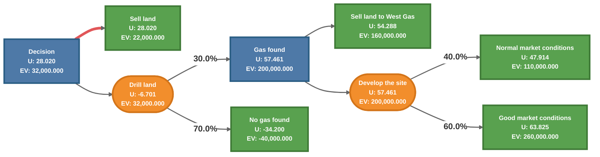

```mermaid
graph LR
    classDef decision fill:#4e79a7,stroke:#2c5f85,stroke-width:3px,color:#ffffff,font-weight:bold,font-size:12px
    classDef chance fill:#f28e2c,stroke:#d4751a,stroke-width:3px,color:#ffffff,font-weight:bold,font-size:12px
    classDef terminal fill:#59a14f,stroke:#3f7a37,stroke-width:3px,color:#ffffff,font-weight:bold,font-size:12px
    I["<b>Decision</b><br/>U: 28.020<br/>EV: 32,000.000"]
    class I decision
    S["<b>Sell land</b><br/>U: 28.020<br/>EV: 22,000.000"]
    class S terminal
    D(["<b>Drill land</b><br/>U: -6.701<br/>EV: 32,000.000"])
    class D chance
    G["<b>Gas found</b><br/>U: 57.461<br/>EV: 200,000.000"]
    class G decision
    NG["<b>No gas found</b><br/>U: -34.200<br/>EV: -40,000.000"]
    class NG terminal
    GS["<b>Sell land to West Gas</b><br/>U: 54.288<br/>EV: 160,000.000"]
    class GS terminal
    GD(["<b>Develop the site</b><br/>U: 57.461<br/>EV: 200,000.000"])
    class GD chance
    NM["<b>Normal market conditions</b><br/>U: 47.914<br/>EV: 110,000.000"]
    class NM terminal
    GM["<b>Good market conditions</b><br/>U: 63.825<br/>EV: 260,000.000"]
    class GM terminal
    I ==> S
    I ==> D
    D ==>|<b>30.0%</b>| G
    D ==>|<b>70.0%</b>| NG
    G ==> GD
    G ==> GS
    GD ==>|<b>40.0%</b>| NM
    GD ==>|<b>60.0%</b>| GM
    linkStyle default stroke:#666,stroke-width:2px
    %%{init: {'theme':'base', 'themeVariables': {'primaryColor':'#ffffff', 'primaryTextColor':'#333333', 'primaryBorderColor':'#dddddd', 'lineColor':'#666666'}}}%%
    linkStyle 0 stroke:#e15759,stroke-width:5px;
```
