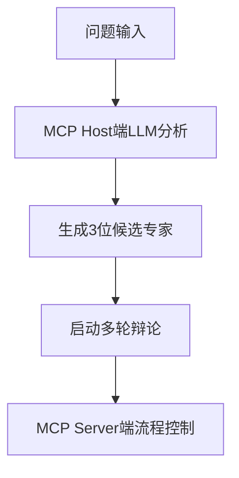
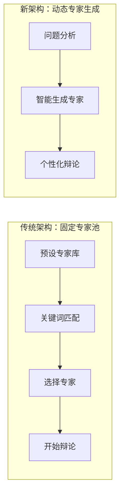

# Guru-PK MCP 智能专家辩论系统

基于MCP（Model Context Protocol）的AI专家辩论系统，采用**动态专家生成架构**，根据问题智能创建最适合的专家组合进行多轮智慧碰撞。

## ✨ 核心特色

- 🏭 **动态专家生成** - 完全问题驱动，每次生成专属专家组合
- 🌟 **无限专家池** - 突破固定专家限制，支持任意领域的专家生成
- 🔄 **多轮PK流程** - 独立思考 → 交叉辩论 → 最终立场 → 智慧综合  
- 🤖 **智能分工架构** - MCP Host端LLM负责智能分析，MCP Server端提供流程指导

## 🚀 快速安装

### 1. 安装依赖

**方式一：使用安装脚本（推荐）**

**macOS/Linux:**

```bash
curl -LsSf https://astral.sh/uv/install.sh | sh
```

**Windows:**

```powershell
powershell -ExecutionPolicy ByPass -c "irm https://astral.sh/uv/install.ps1 | iex"
```

**方式二：使用 pip 安装（适用于所有平台）**

```bash
pip install uv
```

**方式三：下载安装包**

从 [UV Releases](https://github.com/astral-sh/uv/releases) 页面下载对应平台的安装包

### 2. 配置MCP客户端

**推荐方式：从PyPI安装**

```json
{
  "mcpServers": {
    "guru-pk": {
      "command": "uvx",
      "args": ["--from", "guru-pk-mcp", "guru-pk-mcp-server"],
      "env": {
        "DATA_DIR": "~/.guru-pk-data"  // macOS/Linux: ~/目录, Windows: %USERPROFILE%目录
      }
    }
  }
}
```

> **更新说明**:
>
> - 当需要更新`guru-pk-mcp`到最新版本时，请执行命令：
>
>   ```bash
>   uvx pip install --upgrade guru-pk-mcp
>   ```
>
> - 此命令会从PyPI获取并安装最新发布的版本
> - 如果遇到缓存问题，可以强制刷新：
>
>   ```bash
>   uvx --refresh-package guru-pk-mcp --from guru-pk-mcp python -c "print('✅ UVX缓存已刷新')"
>   ```
>
> **注意**:
>
> - macOS用户可能需要使用完整路径：`/Users/{用户名}/.local/bin/uvx`
> - Windows用户：`~`会自动解析为用户主目录（如 `C:\Users\{用户名}`），无需手动修改

**开发方式：从源码安装**

```json
{
  "mcpServers": {
    "guru-pk": {
      "command": "uvx", 
      "args": ["--from", "/path/to/guru-pk-mcp", "guru-pk-mcp-server"],
      "env": {
        "DATA_DIR": "~/.guru-pk-data"  // macOS/Linux: ~/目录, Windows: %USERPROFILE%目录
      }
    }
  }
}
```

> **本地开发说明**:
>
> - 对于本地开发场景，如需刷新uvx缓存，请使用`make refresh-uvx`
> - 此命令强制UVX重新安装本地包，确保使用最新的代码更改

### 3. 开始使用

重启MCP客户端，输入 `guru_pk_help` 获取帮助，或直接提问开始专家辩论！

## 💡 使用方法

### 🎯 核心架构：智能专家工厂



#### 动态专家生成流程

1. **提出问题** - 直接向系统提问任何话题
2. **智能分析** - MCP Host端LLM深度分析问题特征
3. **生成候选** - 动态创建3位最相关的专家
4. **开始辩论** - 启动多轮PK流程

```javascript
// 1. 智能生成候选专家（系统自动执行）
start_pk_session: 生成AI的领域，有没有特别适合个人创业的方向？

// 2. 智能生成候选专家（用户对期待的专家范围进行限定）
start_pk_session: 生成AI的领域，有没有特别适合个人创业的方向？ 找两个AI领域的大牛和一个知名的个人创业家来辩论
```

### 核心工具

- `start_pk_session` - 智能生成候选专家，开始辩论
- `get_persona_prompt` - 获取当前专家的角色提示
- `record_round_response` - 记录专家发言

### 专家管理

- `generate_dynamic_experts` - 动态生成专家候选
- `save_custom_persona` - 保存专家数据

### 会话管理

- `view_session_history` - 查看会话历史
- `export_session` - 导出会话为Markdown文件
- `export_enhanced_session` - 导出增强分析报告

### 系统设置

- `get_language_settings` - 查看当前语言设置
- `set_language` - 设置回复语言
- `get_usage_statistics` - 获取使用统计分析
- `guru_pk_help` - 获取系统帮助

## 🔄 辩论流程

1. **独立思考** - 每位专家独立分析问题
2. **交叉辩论** - 专家间互相质疑和借鉴  
3. **最终立场** - 形成各自完善的方案
4. **智慧综合** - 融合各方观点的终极答案

## 🛠️ 技术架构

### 🏗️ 架构设计理念

**智能分工原则**：

- 🧠 **MCP Host端 LLM**：负责复杂的语义分析和智能生成
- 🔧 **MCP Server端**：提供简洁的流程控制和数据管理

**语言**: Python 3.10+ | **框架**: MCP | **包管理**: UVX  
**存储**: 本地JSON | **特点**: 零部署、隐私保护

### 项目结构

```
src/guru_pk_mcp/
├── server.py           # MCP服务器主程序
├── session_manager.py  # 会话状态管理
├── personas.py         # 专家生成指导逻辑
├── dynamic_experts.py  # 动态生成专家
└── models.py          # 数据模型定义
```

## 🎨 核心创新

### 🏭 动态专家生成架构

**彻底摒弃固定专家池** - 实现真正的问题驱动专家生成。

#### 💡 设计理念



#### 🎯 核心优势

- **无限扩展** - 不受固定专家数量限制
- **精准匹配** - 专家完全服务于具体问题
- **智能组合** - 确保专家组合的多样性和互补性
- **实时生成** - 每次辩论都是独特的专家组合

### 🤖 智能分工架构

**MCP Host端 LLM智能** + **MCP Server端简洁控制**

#### 🧠 MCP Host端职责

- 深度语义分析问题特征
- 智能生成专家画像和特质
- 提供丰富的推理和创造能力

#### 🔧 MCP Server端职责

- 提供专家生成的原则性指导
- 管理辩论流程和状态
- 处理数据持久化和会话管理

### 💰 成本效益优势

- **零API费用** - 充分利用订阅制Chat APP的LLM能力  
- **本地隐私** - 所有数据本地存储，完全隐私保护
- **开源可定制** - 不依赖任何第三方服务
- **轻量简洁** - MCP Server端逻辑简单，维护成本低

## 📱 兼容性

支持所有MCP兼容应用：Claude Desktop、Cursor、TRAE、DeepChat、Cherry Studio等

### 🎯 推荐配置

**最推荐的MCP Host**：

- 💰 **按用户请求收费的MCP Host** - 如Cursor和海外版Trae
- 🌟 **优势**：
  - 成本优势显著：按用户请求次数收费，而非API调用次数或token收费
  - Claude模型对MCP支持最佳，具有优秀的指令遵循能力

### ⚠️ 使用注意事项

**不推荐配置**：

- 🚫 **Trae国内版** - 内置国内模型存在高频敏感词审查问题，可能导致专家辩论过程中断，影响使用体验

## 💡 使用提示

- 🤖 **`start_pk_session:直接提问`** - 最简单的使用方式，系统自动生成专家
- 📋 `guru_pk_help` - 获取系统介绍和详细帮助
- 📊 `get_usage_statistics` - 查看使用统计和分析
- 📄 `export_enhanced_session` - 导出增强分析报告
- 🌍 `set_language` - 设置专家回复语言

## 💭 设计理念

### 灵感来源

本项目初期的专家系统受到 [人生教练团Agent](https://mp.weixin.qq.com/s/QGNzRRo7U3Y2fmvOXNJvyw) 的启发，将内置专家的多角色PK的创新思路通过本地MCP的方式实现。

### 技术方案对比

**🔧 Agent框架开发**

- ✅ 功能强大，可集成多个LLM API
- ✅ 前端交互灵活，控制强劲
- ❌ 开发复杂度高，API调用成本高昂

**☁️ 第三方服务远程MCP方案**  

- ✅ 部署简单，利用现有生态
- ❌ 依赖第三方服务，定制化程度有限

**🏠 本地MCP方案（本项目）**

- ✅ 与订阅制Chat APP结合，无API费用
- ✅ 数据本地化，隐私保护
- ✅ 开源可定制，技术独立
- ✅ **智能分工架构** - 充分利用MCP Host端LLM智能
- ✅ **动态专家生成** - 突破固定专家池限制
- ❌ 依赖MCP客户端实现

### 核心价值

**动态专家生成** - 实现了从固定专家库到智能专家工厂的根本性突破：

#### 🏭 **架构创新**

- **问题驱动** - 专家完全服务于问题，告别固定限制
- **智能生成** - 每次都是专属的专家组合
- **无限扩展** - 支持任意领域的专家创建

#### 🤖 **智能分工**  

- **MCP Host端智能** - 利用订阅制LLM的强大分析能力
- **MCP Server端简洁** - 专注流程控制，降低维护成本
- **完美配合** - 实现智能与简洁的最佳平衡

这种**动态专家生成架构**，将AI专家辩论系统推向了新的高度，真正实现了智能化、个性化的专家辩论体验。
