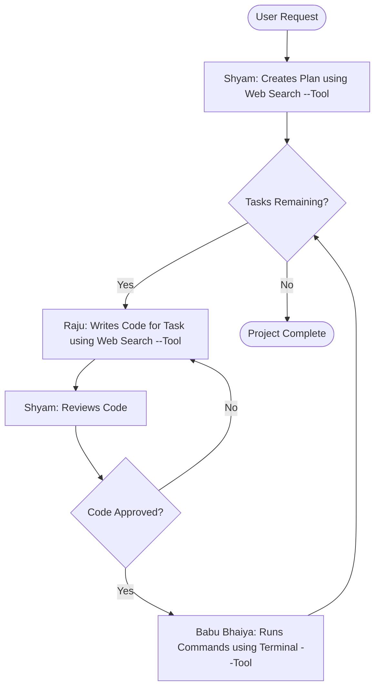

# Hera Pheri: An Autonomous AI Coding Crew 🤖

[](https://opensource.org/licenses/MIT)
[](https://www.python.org/downloads/)
[](https://github.com/langchain-ai/langgraph)

An experimental autonomous AI agent system built with LangGraph that plans, writes, reviews, and executes code to complete complex tasks. The system is inspired by the iconic characters from the movie *Hera Pheri*, with each agent embodying a unique persona and role.

-   **Shyam:** The meticulous planner and reviewer.
-   **Raju:** The fast-moving, clever coder.
-   **Babu Bhaiya:** The reliable operator who interacts with the terminal.

## Core Concept

The project demonstrates a multi-agent collaboration pattern where complex tasks are broken down and handled by specialized AI agents. This "separation of concerns" creates a robust and fault-tolerant system:

1.  **Planning:** Shyam receives a high-level goal and creates a detailed, step-by-step execution plan.
2.  **Coding & Review Loop:** Raju takes one task at a time and writes the necessary code, which is then passed to Shyam for rigorous review. If the code fails review, it's sent back to Raju with feedback. This loop ensures code quality.
3.  **Execution:** Once a piece of code is approved by Shyam, it's handed to Babu Bhaiya, who is the only agent with permission to execute terminal commands (like writing to files, running git, etc.).

## Workflow Diagram

This diagram illustrates the core logic and flow of control between the agents.


## Folder Structure

```
├── README.md
├── agents
│   ├── __init__.py
│   ├── graph.py
│   ├── nodes.py
│   ├── state.py
│   └── tool.py
├── config
│   ├── __init__.py
│   └── settings.py
├── database
│   ├── __init__.py
│   ├── models.py
│   └── storage.py
├── llms
│   ├── __init__.py
│   ├── factory.py
│   └── providers.py
├── notebooks
│   └── test.ipynb
├── requirements-test.txt
├── requirements.txt
├── run
│   └── main.py
├── setup.py
└── tools
    ├── __init__.py
    ├── babu_bhaiya_node_tools.py
    ├── raju_node_tools.py
    ├── shyam_node_tools.py
    └── task_node_tools.py
```

**Framework:** LangGraph

**Clone the repository:**
    ```sh
    git clone https://github.com/datasciritwik/Hera-Pheri.git
    cd Hera-Pheri
    ```

    ```
    pip install -e .
    ```

## ⚠️ Security Warning

This project uses an AI agent (`Babu Bhaiya`) that can **execute arbitrary terminal commands**. This is extremely powerful and potentially dangerous. It can modify your file system, access sensitive information, and interact with the internet.

**It is strongly recommended to run this project in a sandboxed, isolated environment, such as a Docker container, to prevent unintended consequences.**

## Contributing

Contributions are welcome! If you have ideas for new features, tools, or improvements to the agent logic, feel free to open an issue or submit a pull request.

1.  Fork the repository.
2.  Create your feature branch (`git checkout -b feature/AmazingFeature`).
3.  Commit your changes (`git commit -m 'Add some AmazingFeature'`).
4.  Push to the branch (`git push origin feature/AmazingFeature`).
5.  Open a Pull Request.

## License

This project is licensed under the MIT License - see the [LICENSE](LICENSE) file for details.
