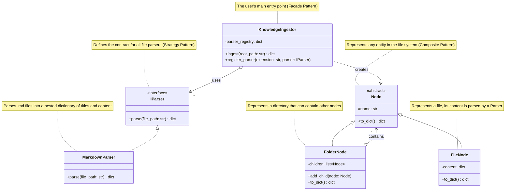

好的，完全没问题。

我们已经深入讨论了需求、设计模式和实现细节。现在，我将把所有这些要素整合起来，为你生成一份完整、正式且可以直接用于指导开发的 **PRD (产品需求文档)**。

---

## **产品需求文档 (PRD): Knowledge Ingestor SDK**

| **文档版本** | **V1.0** |
| :--- | :--- |
| **创建日期** | 2023年10月27日 |
| **产品名称** | Knowledge Ingestor SDK (知识摄取SDK) |
| **产品负责人** | (你的名字) |
| **目标读者** | 项目经理、软件架构师、开发工程师 |

### 1. 产品概述

#### 1.1. 产品愿景
构建一个强大、可扩展的知识摄取工具，作为未来“智能大脑”项目的信息输入中枢。本SDK旨在将来自不同来源、不同格式的非结构化或半结构化信息，高效、准确地转换为统一、层级分明的结构化数据，为后续的知识处理、分析和推理提供高质量的“养料”。

#### 1.2. 问题陈述
“智能大脑”需要处理海量的知识，但这些知识往往分散在复杂的文件夹结构和多样的文件格式（如API文档、技术手册、报告等）中。手动整理和录入这些信息效率低下且容易出错。我们需要一个自动化的工具，能够：
1.  **理解并保留**原始知识的组织结构（如文件夹、文件的层级关系）。
2.  **深入解析**文件内容，提取其内在的逻辑结构（如章节、标题）。
3.  **提供统一、干净、机器可读**的数据格式，以供“智能大脑”消费。

#### 1.3. 近期目标 (V1.0)
**完美处理基于Markdown的API文档。** 能够将一个完整的API文档库（以文件夹形式组织）转换为一个单一的、结构严谨的JSON对象，为AI提供精确、及时的API包信息。

### 2. 产品范围

#### 2.1. 范围内 (In Scope)
*   [✓] 递归遍历指定的文件目录结构。
*   [✓] 精准保留“文件夹 → 子文件夹 → 文件”的嵌套关系。
*   [✓] 解析`.md`或`.markdown`文件。
*   [✓] 识别并提取Markdown语法中的H1到H6各级标题。
*   [✓] 提取每个标题下的所有内容块（段落、代码块、列表、表格等）。
*   [✓] 在单个文件的解析结果中，保留标题间的嵌套关系（如H3是H2的子节点）。
*   [✓] 提供一个简洁、清晰的Python API。
*   [✓] 输出一个单一的、合法的、能够完整表示所有信息的JSON对象。
*   [✓] 架构设计必须是可扩展的，预留接口以支持未来添加新的文件解析器。

#### 2.2. 范围外 (Out of Scope)
*   [✗] **语义理解：** SDK不负责理解文本的含义，如识别“函数”与“参数”之间的关系。
*   [✗] **知识图谱构建：** SDK不负责构建概念实体及它们之间的关系图谱。
*   [✗] **跨文件关联：** V1.0不处理文件之间的引用或超链接关系。
*   [✗] **UI界面：** 本产品是一个后端SDK，不提供任何图形用户界面。

### 3. 功能需求 (Functional Requirements)

| ID | 功能模块 | 需求描述 | 优先级 |
| :--- | :--- | :--- | :--- |
| **FR-1** | **目录结构遍历** | SDK必须能从一个给定的根目录路径开始，递归地遍历所有子目录和文件，不能遗漏。 | **高** |
| **FR-2** | **层级关系保持** | 输出的JSON结构必须能1:1映射原始的目录结构。文件夹应表现为JSON中的一个对象（或键），其子项（文件或子文件夹）嵌套在该对象内部。 | **高** |
| **FR-3** | **Markdown解析** | SDK的核心功能。必须能解析Markdown文件，识别H1-H6各级标题，并提取每个标题下的所有内容块。 | **高** |
| **FR-4** | **内容结构化** | 在单个文件的解析结果中，必须保留标题间的嵌套关系。例如，一个H3标题及其内容应被视为其前一个H2标题的子节点。 | **高** |
| **FR-5** | **统一JSON输出** | 所有处理完成后，SDK应输出一个单一的、合法的JSON对象，作为整个目录知识的高度结构化表示。 | **高** |
| **FR-6** | **可扩展解析器** | SDK的架构必须支持“插件式”的解析器。用户应能通过简单的注册机制，添加对新文件类型（如`.txt`）的自定义解析逻辑。 | **中** |

### 4. 系统设计与UML

为实现上述需求，特别是**可扩展性(FR-6)**，我们采用**策略模式**来处理不同类型文件的解析，结合**组合模式**来构建文件系统的树形结构，并通过**门面模式**提供简洁的API。

#### 4.1. UML 类图 (Mermaid)



### 5. API 与数据结构

#### 5.1. 对外API设计
API应极其简洁，隐藏所有内部实现细节。

**基础用法:**
```python
from knowledge_sdk import KnowledgeIngestor

# 1. 实例化摄取器 (默认已注册Markdown解析器)
ingestor = KnowledgeIngestor()

# 2. 指定API文档根目录并开始摄取
api_knowledge_base = ingestor.ingest("./path/to/api/docs")

# 3. 得到完整的JSON对象
# print(json.dumps(api_knowledge_base, indent=2))
```

**扩展用法 (注册自定义解析器):**
```python
from knowledge_sdk import KnowledgeIngestor, IParser

class TxtParser(IParser):
    def parse(self, file_path: str) -> dict:
        # ... 自定义解析逻辑
        with open(file_path, 'r') as f:
            return {"raw_content": f.read()}

ingestor = KnowledgeIngestor()
ingestor.register_parser(".txt", TxtParser())
knowledge_base = ingestor.ingest("./path/to/mixed/docs")
```

#### 5.2. 输出JSON数据结构示例
这是SDK最终输出的核心产物，其结构必须清晰、一致。

**假设文件结构如下:**
```
my-project/
├── README.md
└── api/
    └── users.md
```

**`README.md` 内容:**
```markdown
# My Project
This is the main project.
```

**`users.md` 内容:**
```markdown
# Users API
## Get User
### Request
- Method: GET
```

**SDK输出的JSON应如下所示:**
```json
{
  "name": "my-project",
  "type": "folder",
  "children": [
    {
      "name": "README.md",
      "type": "file",
      "content": {
        "title": "My Project",
        "level": 1,
        "content": [
          "This is the main project."
        ],
        "children": []
      }
    },
    {
      "name": "api",
      "type": "folder",
      "children": [
        {
          "name": "users.md",
          "type": "file",
          "content": {
            "title": "Users API",
            "level": 1,
            "content": [],
            "children": [
              {
                "title": "Get User",
                "level": 2,
                "content": [],
                "children": [
                  {
                    "title": "Request",
                    "level": 3,
                    "content": [
                      "- Method: GET"
                    ],
                    "children": []
                  }
                ]
              }
            ]
          }
        }
      ]
    }
  ]
}
```

### 6. 依赖与假设

*   **技术依赖:**
    *   Python 3.8+
    *   Markdown解析库: `markdown-it-py` (推荐，因其能生成易于处理的Token流)。
*   **运行假设:**
    *   用户提供的目录路径是有效的，且程序具有读取权限。
    *   待解析的Markdown文件语法基本遵循CommonMark标准。

### 7. 成功指标 (Success Metrics)

*   **功能性:** SDK能够成功、无误地解析10个以上不同的、公开的、基于Markdown的API文档项目（如Stripe, GitHub API Docs等）。
*   **准确性:** 输出的JSON结构与原始文件目录和Markdown标题层级的匹配度达到99%以上。
*   **易用性:** 开发者能够在15分钟内理解API并成功运行一个示例。

### 8. 未来路线图 (Post-V1.0)

*   **V1.1 - 增强解析器:** 支持解析表格、图片链接等更丰富的Markdown元素。
*   **V1.2 - 多文档格式支持:** 实现`PDFParser`和`WordParser`，提取纯文本和基本结构。
*   **V2.0 - 多模态支持:** 集成OCR和ASR能力，实现`ImageParser`和`AudioParser`，将图片中的文字和音频转录稿纳入知识结构中。
*   **V2.1 - 性能优化:** 针对海量文件（10,000+）的场景，引入异步IO或并行处理，提升摄取效率。