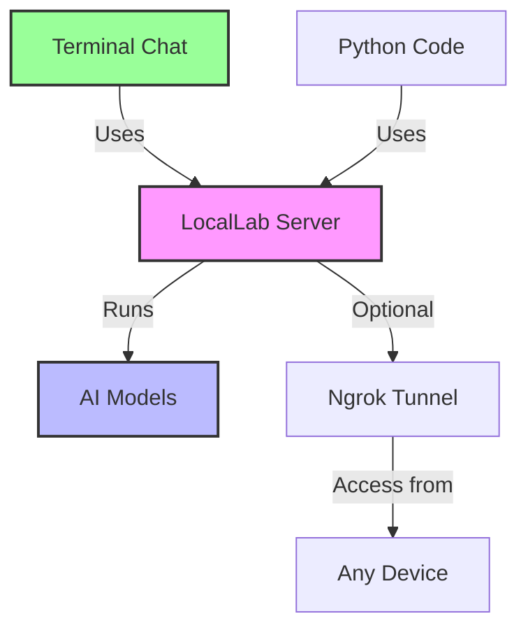
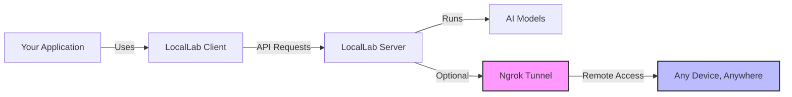

# 🚀 LocalLab: Your Personal AI Lab

[](https://pypi.org/project/locallab/) [](https://pypi.org/project/locallab-client/) [](./LICENSE) [](https://www.python.org/)

**Run ChatGPT-like AI on your own computer!** LocalLab is a complete AI platform that runs models locally with a powerful chat interface and Python client.

## ✨ What Makes LocalLab Special?

LocalLab gives you **your own personal ChatGPT** that runs entirely on your computer:

- 🎯 **Terminal Chat Interface** - ChatGPT-like experience in your terminal
- 🔒 **Complete Privacy** - Your data never leaves your computer
- 💰 **Zero Cost** - No monthly fees or API charges
- 🌐 **Access Anywhere** - Use from any device with ngrok tunneling
- ⚡ **Multiple Models** - Support for various open-source AI models
- 🎮 **Free GPU** - Run on Google Colab for free GPU acceleration

Perfect for developers, students, researchers, or anyone who wants to experiment with AI without privacy concerns or ongoing costs.

## 🚀 Quick Start (3 Steps)

```bash
# 1. Install LocalLab
pip install locallab locallab-client

# 2. Start your AI server
locallab start

# 3. Chat with your AI
locallab chat
```

That's it! You now have your own ChatGPT running locally.

## 🧠 How LocalLab Works

LocalLab has three main components:

### 1. 🖥️ **LocalLab Server** (`pip install locallab`)
- Runs AI models on your computer
- Provides a web API for interactions
- Handles model loading and optimization
- Start with: `locallab start`

### 2. 💬 **Chat Interface** (Built-in)
- Terminal-based ChatGPT-like experience
- Real-time streaming responses
- Multiple generation modes
- Access with: `locallab chat`

### 3. 🐍 **Python Client** (`pip install locallab-client`)
- Programmatic access for your code
- Both sync and async support
- Use with: `client = SyncLocalLabClient("http://localhost:8000")`



**🌟 The Magic**: Use `--use-ngrok` to access your AI from anywhere - your phone, another computer, or share with friends!

### 🎯 Key Features

```
📦 Easy Setup         🔒 Privacy First       🎮 Free GPU Access
🤖 Multiple Models    💾 Memory Efficient    🔄 Auto-Optimization
🌐 Local or Colab    ⚡ Fast Response       🔧 Simple Server
🌍 Access Anywhere   🔌 Client Package      🛡️ Secure Tunneling
```

**Two-Part System**:

- **LocalLab Server**: Runs the AI models and exposes API endpoints
- **LocalLab Client**: A separate Python package (`pip install locallab-client`) that connects to the server

**Access From Anywhere**: With built-in ngrok integration, you can securely access your LocalLab server from any device, anywhere in the world - perfect for teams, remote work, or accessing your models on the go.

### 🌟 Two Ways to Run

1. **On Your Computer (Local Mode)**

   ```
   💻 Your Computer
   └── 🚀 LocalLab Server
       └── 🤖 AI Model
           └── 🔧 Auto-optimization
   ```

2. **On Google Colab (Free GPU Mode)**
   ```
   ☁️ Google Colab
   └── 🎮 Free GPU
       └── 🚀 LocalLab Server
           └── 🤖 AI Model
               └── ⚡ GPU Acceleration
   ```

## 📦 Installation & Setup

> **Latest Package Versions:**
>
> - **LocalLab Server**: [](https://pypi.org/project/locallab/)
> - **LocalLab Client**: [](https://pypi.org/project/locallab-client/)

### Windows Setup

1. **Install Required Build Tools**

   - Install [Microsoft C++ Build Tools](https://visualstudio.microsoft.com/visual-cpp-build-tools/)
     - Select "Desktop development with C++"
   - Install [CMake](https://cmake.org/download/)
     - Add to PATH during installation

2. **Install Packages**

   ```powershell
   pip install locallab locallab-client
   ```

3. **Verify PATH**

   - If `locallab` command isn't found, add Python Scripts to PATH:
     ```powershell
     # Find Python location
     where python
     # This will show something like: C:\Users\YourName\AppData\Local\Programs\Python\Python311\python.exe
     ```

   **Adding to PATH in Windows:**

   1. Press `Win + X` and select "System"
   2. Click "Advanced system settings" on the right
   3. Click "Environment Variables" button
   4. Under "System variables", find and select "Path", then click "Edit"
   5. Click "New" and add your Python Scripts path (e.g., `C:\Users\YourName\AppData\Local\Programs\Python\Python311\Scripts\`)
   6. Click "OK" on all dialogs
   7. Restart your command prompt

   - Alternatively, use: `python -m locallab start`

> 🔍 Having issues? See our [Windows Troubleshooting Guide](./docs/guides/troubleshooting.md#windows-specific-issues)

### Linux/Mac Setup

```bash
# Install both server and client packages
pip install locallab locallab-client
```

### 2. Configure the Server (Recommended)

```bash
# Run interactive configuration
locallab config

# This will help you set up:
# - Model selection
# - Memory optimizations
# - GPU settings
# - System resources
```

### 3. Start the Server

```bash
# Start with saved configuration
locallab start

# Or start with specific options
locallab start --model microsoft/phi-2 --quantize --quantize-type int8
```

## 💬 Terminal Chat Interface - Your Personal ChatGPT

The **LocalLab Chat Interface** is a powerful terminal-based tool that gives you a ChatGPT-like experience right in your command line. It's the easiest way to interact with your AI models.

### 🎯 Why Use the Chat Interface?

- **Instant AI Access** - No coding required, just type and chat
- **Real-time Responses** - See AI responses as they're generated
- **Rich Formatting** - Markdown rendering with syntax highlighting
- **Smart Features** - History, saving, batch processing, and more
- **Works Everywhere** - Local, remote, or Google Colab

### 🚀 Getting Started

```bash
# Start your server
locallab start

# Open chat interface
locallab chat
```

### ✨ Key Features

| Feature | Description | Example |
|---------|-------------|---------|
| **Dynamic Mode Switching** | Change generation mode per message | `Explain AI --stream` |
| **Real-time Streaming** | See responses as they're typed | Live text generation |
| **Conversation History** | Track and save your chats | `/history`, `/save` |
| **Batch Processing** | Process multiple prompts | `/batch` command |
| **Remote Access** | Connect to any LocalLab server | `--url https://your-server.com` |
| **Error Recovery** | Auto-reconnection and graceful handling | Seamless experience |

### 🎮 Interactive Commands

```bash
/help      # Show all available commands
/history   # View conversation history
/save      # Save current conversation
/batch     # Enter batch processing mode
/reset     # Clear conversation history
/exit      # Exit gracefully
```

### 🔄 Dynamic Mode Switching (New!)

Override the default generation mode for any message:

```bash
You: Write a story --stream          # Use streaming mode
🔄 Using stream mode for this message

You: Remember my name is Alice --chat # Use chat mode with context
🔄 Using chat mode for this message

You: What's 2+2? --simple            # Use simple mode
🔄 Using simple mode for this message
```

### 📱 Example Chat Session

```bash
$ locallab chat
🚀 LocalLab Chat Interface
✅ Connected to: http://localhost:8000
📊 Server: LocalLab v0.9.0 | Model: qwen-0.5b

You: Hello! Can you help me with Python?

AI: Hello! I'd be happy to help you with Python programming.
What specific topic would you like to explore?

You: Show me how to create a class --stream

AI: Here's how to create a simple class in Python:

```python
class Person:
    def __init__(self, name, age):
        self.name = name
        self.age = age

    def introduce(self):
        return f"Hi, I'm {self.name} and I'm {self.age} years old."

# Usage
person = Person("Alice", 25)
print(person.introduce())

You: /save
💾 Conversation saved to: chat_2024-07-06_14-30-15.json

You: /exit
👋 Goodbye!
```

### 🌐 Remote Access

Connect to any LocalLab server from anywhere:

```bash
# Connect to remote server
locallab chat --url https://abc123.ngrok.app

# Use with Google Colab
locallab chat --url https://your-colab-ngrok-url.app
```

> 📖 **Complete Guide**: See the [Chat Interface Documentation](./docs/cli/chat.md) for advanced features, examples, and troubleshooting.

## 🐍 Python Client - Programmatic Access

For developers who want to integrate AI into their applications, LocalLab provides a powerful Python client package.

### 🎯 Two Ways to Use LocalLab

| Method | Best For | Getting Started |
|--------|----------|-----------------|
| **Chat Interface** | Interactive use, testing, quick questions | `locallab chat` |
| **Python Client** | Applications, scripts, automation | `from locallab_client import SyncLocalLabClient` |

### 📦 Synchronous Client (Recommended for Beginners)

```python
from locallab_client import SyncLocalLabClient

# Connect to server - choose ONE of these options:
# 1. For local server (default)
client = SyncLocalLabClient("http://localhost:8000")

# 2. For remote server via ngrok (when using Google Colab or --use-ngrok)
# client = SyncLocalLabClient("https://abc123.ngrok.app")  # Replace with your ngrok URL

try:
    print("Generating text...")
    # Generate text
    response = client.generate("Write a story")
    print(response)

    print("Streaming responses...")
    # Stream responses
    for token in client.stream_generate("Tell me a story"):
       print(token, end="", flush=True)

    print("Chat responses...")
    # Chat with AI
    response = client.chat([
        {"role": "system", "content": "You are helpful."},
        {"role": "user", "content": "Hello!"}
    ])
    print(response.choices[0]["message"]["content"])

finally:
    # Always close the client
    client.close()
```

> 💡 **Important**: When connecting to a server running on Google Colab or with ngrok enabled, always use the ngrok URL (https://abc123.ngrok.app) that was displayed when you started the server.

### Asynchronous Client Usage (For Advanced Users)

```python
import asyncio
from locallab_client import LocalLabClient

async def main():
    # Connect to server - choose ONE of these options:
    # 1. For local server (default)
    client = LocalLabClient("http://localhost:8000")

    # 2. For remote server via ngrok (when using Google Colab or --use-ngrok)
    # client = LocalLabClient("https://abc123.ngrok.app")  # Replace with your ngrok URL

    try:
        print("Generating text...")
        # Generate text
        response = await client.generate("Write a story")
        print(response)

        print("Streaming responses...")
        # Stream responses
        async for token in client.stream_generate("Tell me a story"):
            print(token, end="", flush=True)

        print("\nChatting with AI...")
        # Chat with AI
        response = await client.chat([
            {"role": "system", "content": "You are helpful."},
            {"role": "user", "content": "Hello!"}
        ])
        # Extracting Content
        content = response['choices'][0]['message']['content']
        print(content)
    finally:
        # Always close the client
        await client.close()

# Run the async function
asyncio.run(main())
```

## 🌐 Google Colab Usage with Remote Access

### Step 1: Set Up the Server on Google Colab

First, you'll set up the LocalLab server on Google Colab to use their free GPU:

```python
# In your Colab notebook:

# 1. Install the server package
!pip install locallab

# 2. Configure with CLI (notice the ! prefix)
!locallab config

# 3. Start server with ngrok for remote access
!locallab start --use-ngrok

# The server will display a public URL like:
# 🚀 Ngrok Public URL: https://abc123.ngrok.app
# COPY THIS URL - you'll need it to connect!
```

### Step 2: Connect to Your Server

After setting up your server on Google Colab, you'll need to connect to it using the LocalLab client package. The server will display a ngrok URL that you'll use for the connection.

#### Using the Client Connection Examples

**You can now use the client connection examples from the [Client Connection & Usage](#-client-connection--usage) section above.**

Just make sure to:

1. Use your ngrok URL instead of localhost
2. Install the client package if needed

For example:

```python
# In another cell in the same Colab notebook:

# 1. Install the client package
!pip install locallab-client

# 2. Import the client
from locallab_client import SyncLocalLabClient

# 3. Connect to your ngrok URL (replace with your actual URL from Step 1)
client = SyncLocalLabClient("https://abc123.ngrok.app")  # ← REPLACE THIS with your URL!

# 4. Now you can use any of the client methods
response = client.generate("Write a poem about AI")
print(response)

# 5. Always close when done
client.close()
```

#### Access From Any Device

The power of using ngrok is that you can connect to your Colab server from anywhere:

```python
# On your local computer, phone, or any device with Python:
pip install locallab-client

from locallab_client import SyncLocalLabClient
client = SyncLocalLabClient("https://abc123.ngrok.app")  # ← REPLACE THIS with your URL!
response = client.generate("Hello from my device!")
print(response)
client.close()
```

> 💡 **Remote Access Tip**: The ngrok URL lets you access your LocalLab server from any device - your phone, tablet, another computer, or share with teammates. See the [Client Connection & Usage](#-client-connection--usage) section above for more examples of what you can do with the client.

## 💻 Requirements

### Local Computer

- Python 3.8+
- 4GB RAM minimum (8GB+ recommended)
- GPU optional but recommended
- Internet connection for downloading models

### Google Colab

- Just a Google account!
- Free tier works fine

## 🌟 Features

- **Easy Setup**: Just pip install and run
- **Multiple Models**: Use any Hugging Face model
- **Resource Efficient**: Automatic optimization
- **Privacy First**: All local, no data sent to cloud
- **Free GPU**: Google Colab integration
- **Flexible Client API**: Both async and sync clients available
- **Automatic Resource Management**: Sessions close automatically
- **Remote Access**: Access your models from anywhere with ngrok integration
- **Secure Tunneling**: Share your models securely with teammates or access from mobile devices
- **Client Libraries**: Python libraries for both synchronous and asynchronous usage

### 🌍 Client-Server Architecture



[➡️ See All Features](./docs/features/README.md)

## 📚 Documentation

### 🚀 Getting Started
| Guide | Description |
|-------|-------------|
| [**Installation & Setup**](./docs/guides/getting-started.md) | Complete installation guide for all platforms |
| [**CLI Overview**](./docs/cli/README.md) | Command-line interface documentation |
| [**Chat Interface**](./docs/cli/chat.md) | Terminal chat features and examples |

### 💻 Using LocalLab
| Guide | Description |
|-------|-------------|
| [**CLI Reference**](./docs/guides/cli.md) | Complete command documentation |
| [**Python Client**](./docs/clients/README.md) | Programmatic access guide |
| [**API Reference**](./docs/guides/API.md) | HTTP API documentation |

### 🌐 Deployment & Advanced
| Guide | Description |
|-------|-------------|
| [**Google Colab Setup**](./docs/colab/README.md) | Free GPU deployment guide |
| [**Troubleshooting**](./docs/guides/troubleshooting.md) | Common issues and solutions |
| [**Advanced Features**](./docs/guides/advanced.md) | Power user features |

## 🔍 Need Help?

- Check [FAQ](./docs/guides/faq.md)
- Visit [Troubleshooting](./docs/guides/troubleshooting.md)
- Ask in [Discussions](https://github.com/UtkarshTheDev/LocalLab/discussions)

## 📖 Additional Resources

- [Contributing Guide](./docs/guides/contributing.md)
- [Changelog](./CHANGELOG.md)
- [License](./LICENSE)

## 🌟 Star Us!

If you find LocalLab helpful, please star our repository! It helps others discover the project.

---

Made with ❤️ by Utkarsh Tiwari
[GitHub](https://github.com/UtkarshTheDev) • [Twitter](https://twitter.com/UtkarshTheDev) • [LinkedIn](https://linkedin.com/in/utkarshthedev)
