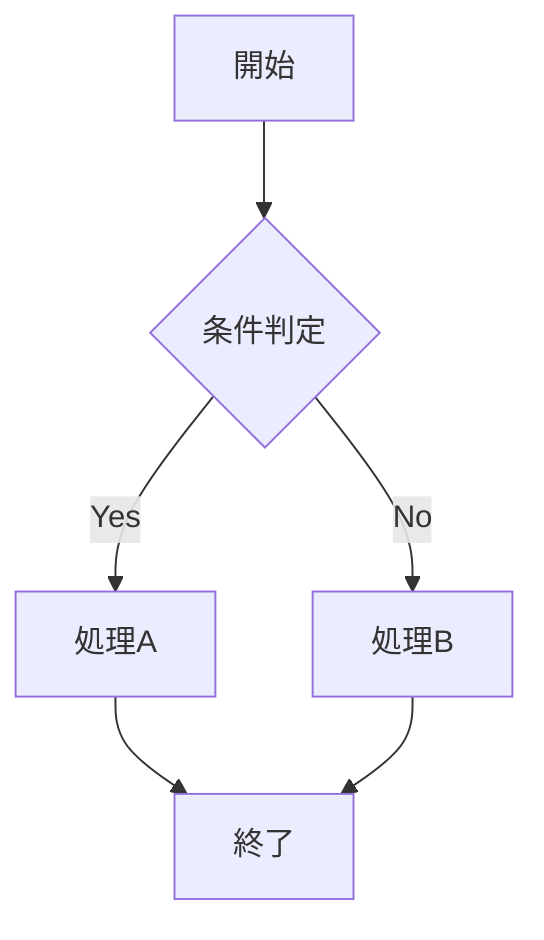
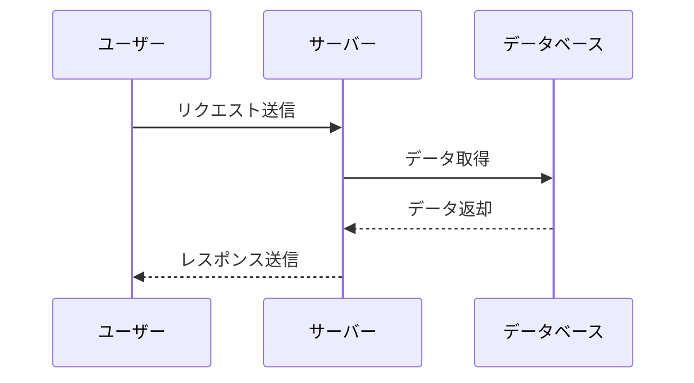

# MkDocs SVG to PNG Plugin - Mermaid Integration TODOリスト

## 概要
`mkdocs-mermaid-to-image`を使用してMermaidからSVGに変換し、その後`mkdocs-svg-to-png`でSVGからPNGに変換する2段階プロセスを実装。

## フェーズ1: 環境セットアップ

### 1.1 パッケージインストール
- [x] `mkdocs-mermaid-to-image`をPyPIからインストール
  ```bash
  pip install mkdocs-mermaid-to-image
  ```
  ✅ インストール完了: mkdocs-mermaid-to-image 1.2.0
- [x] Mermaid CLIとPuppeteerのセットアップ
  ```bash
  sudo npm install -g @mermaid-js/mermaid-cli
  npx puppeteer browsers install chrome-headless-shell
  ```
  ✅ Mermaid CLI および Puppeteer Chrome ヘッドレスシェル インストール完了

### 1.2 依存関係の確認
- [x] Node.js環境の確認
  ✅ Node.js v22.17.0, npm 10.9.2
- [x] Puppeteerブラウザの動作確認
  ✅ Chrome headless shell 138.0.7204.92 インストール完了
- [x] Mermaid CLI (mmdc)のPATH確認
  ✅ /usr/bin/mmdc で利用可能

## フェーズ2: 設定ファイルの更新

### 2.1 mkdocs.ymlの修正
- [x] pymdownx.superfencesにMermaidブロック追加
  ```yaml
  markdown_extensions:
    - pymdownx.superfences:
        custom_fences:
          - name: mermaid
            class: mermaid
          - name: svg
            class: svg
  ```
  ✅ Mermaidフェンスブロック追加完了
- [x] プラグイン設定の追加
  ```yaml
  plugins:
    - search
    # ステップ1: MermaidからSVGに変換
    - mermaid-to-image:
        image_format: "svg"
        mermaid_config:
          theme: "default"
    # ステップ2: SVGからPNGに変換（PDF出力時のみ）
    - svg-to-png:
        enabled_if_env: ENABLE_PDF_EXPORT
        output_format: png
        dpi: 300
        quality: 95
        background_color: "transparent"
        cache_enabled: true
        preserve_original: false
        error_on_fail: false
        log_level: "INFO"
    - to-pdf:
        enabled_if_env: ENABLE_PDF_EXPORT
  ```
  ✅ プラグイン設定更新完了

### 2.2 プラグイン実行順序の最適化
- [x] mermaid-to-imageが先に実行されることを確認
  ✅ プラグインの順序を適切に設定済み
- [x] svg-to-pngがその後で実行されることを確認
  ✅ 2番目に実行される設定済み
- [x] to-pdfが最後に実行されることを確認
  ✅ 最後に実行される設定済み

## フェーズ3: テスト用コンテンツの作成

### 3.1 Mermaidテストページの作成
- [x] `docs/test-mermaid.md`ファイルの作成
  ✅ Mermaidテストページ作成完了
- [x] 各種Mermaid図の追加：
  - [x] フローチャート
  - [x] シーケンス図
  - [x] ガントチャート
  - [x] クラス図
  - [x] ER図
  ✅ 全6種類のMermaid図を追加済み (フローチャート、シーケンス図、ガントチャート、クラス図、ER図、状態図、パイチャート)

### 3.2 テストコンテンツの例
```markdown
## フローチャート


## シーケンス図

```

### 3.3 ナビゲーションの更新
- [x] mkdocs.ymlのnavセクションにテストページを追加

## フェーズ4: 動作確認とテスト

### 4.1 通常ビルドテスト（SVGのみ）
- [ ] `uv run mkdocs build`を実行
- [ ] Mermaidブロックが正しくSVGに変換されることを確認
- [ ] SVGファイルの生成場所と数を確認
  ```bash
  find site -name "*.svg" | wc -l
  ls -la site/**/*.svg
  ```

### 4.2 PDF出力ビルドテスト（SVG→PNG変換）
- [ ] `ENABLE_PDF_EXPORT=1 uv run mkdocs build`を実行
- [ ] SVGがPNGに変換されることを確認
- [ ] PNG画像の品質確認（DPI: 300, Quality: 95）
  ```bash
  find site -name "*.png" | wc -l
  ls -la site/**/*.png
  ```

### 4.3 キャッシュ機能の確認
- [ ] `.svg_cache`ディレクトリの作成確認
- [ ] 再ビルド時のキャッシュ利用確認
- [ ] キャッシュファイルの内容確認

### 4.4 PDF生成の最終確認
- [ ] `site/MkDocs-SVG-to-PNG.pdf`の生成確認
- [ ] PDFファイル内でMermaid図がPNG画像として表示されることを確認
- [ ] 画像の解像度と品質の確認

## フェーズ5: エラーハンドリングとトラブルシューティング

### 5.1 ログレベルの調整
- [ ] `log_level: "DEBUG"`に設定してデバッグ情報を取得
- [ ] エラー発生時の詳細ログの確認

### 5.2 よくある問題の対処
- [ ] Mermaid CLIが見つからない場合の対処
- [ ] Puppeteerブラウザの問題の対処
- [ ] SVG→PNG変換エラーの対処
- [ ] メモリ不足の問題の対処

### 5.3 パフォーマンス最適化
- [ ] キャッシュ設定の最適化
- [ ] 並列処理の設定確認
- [ ] 大量の図を含む場合のパフォーマンス測定

## フェーズ6: ドキュメント更新

### 6.1 README.mdの更新
- [ ] Mermaid対応の追加
- [ ] インストール手順の更新
- [ ] 使用例の追加

### 6.2 設定例の追加
- [ ] 推奨設定の文書化
- [ ] トラブルシューティングガイドの作成

## フェーズ7: 継続的統合

### 7.1 テストケースの追加
- [ ] Mermaid変換のユニットテスト
- [ ] エンドツーエンドテストの作成

### 7.2 CI/CDパイプラインの更新
- [ ] GitHub Actionsでの自動テスト
- [ ] 複数環境での動作確認

## 成功指標
- [ ] 全てのMermaid図がSVGに正しく変換される
- [ ] PDF出力時にSVGがPNGに変換される
- [ ] 画像品質が期待される水準を満たす
- [ ] キャッシュ機能が正常に動作する
- [ ] エラーハンドリングが適切に機能する
- [ ] ドキュメントが完全で理解しやすい

## 備考
- Mermaid CLIの2段階描画アプローチを参考に、必要に応じて高度な設定を追加
- `deviceScaleFactor`などの高解像度設定を検討
- カスタムCSSの適用も将来的に検討
