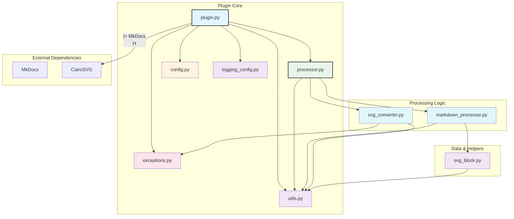
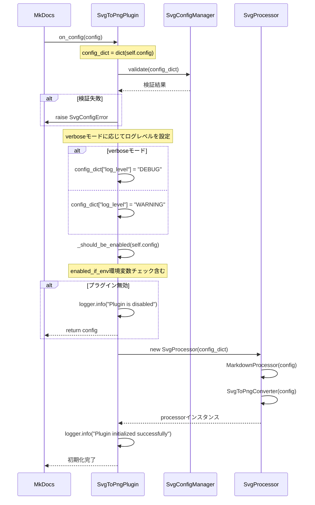
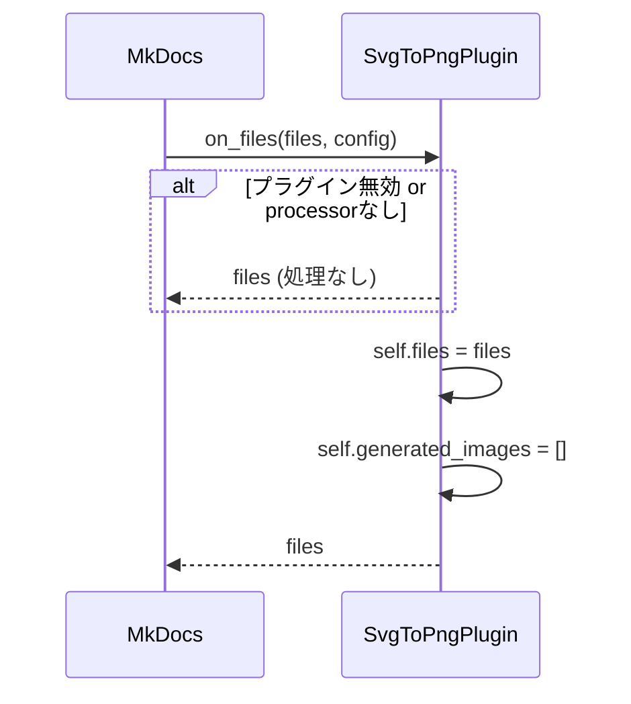
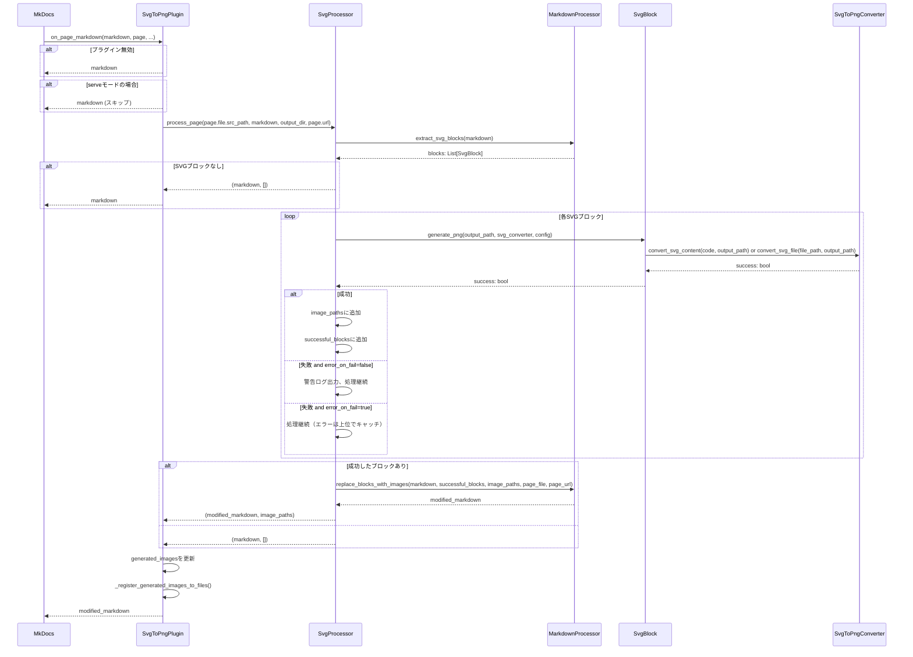
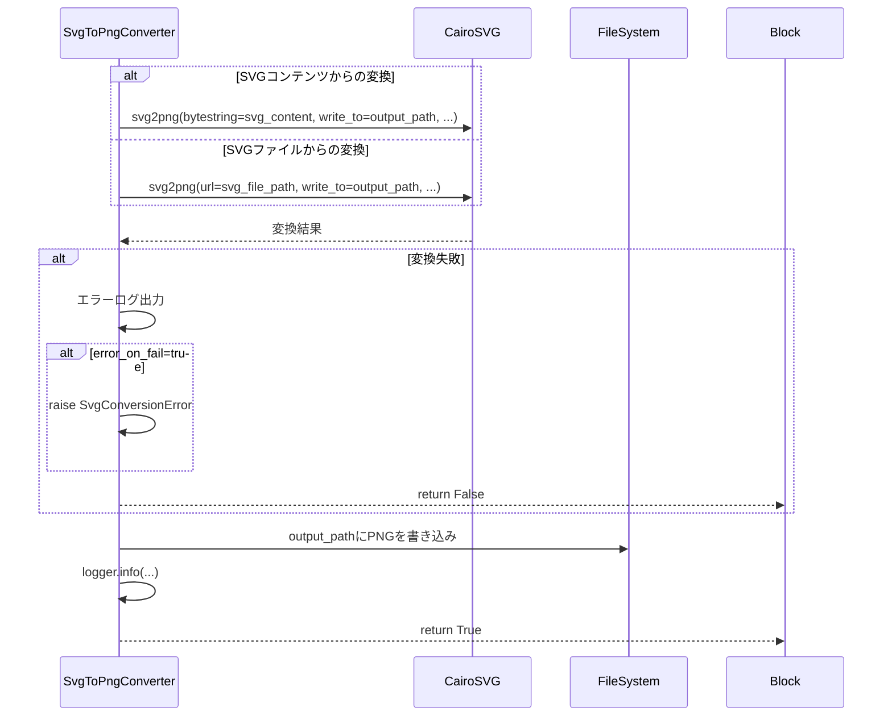
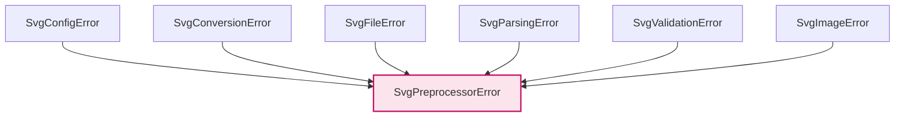

# アーキテクチャ設計

## 概要

MkDocs SVG to PNG Pluginは、MkDocsプロジェクト内のSVGファイル参照やSVGコードブロックをビルド時に静的画像（PNG）に変換するプラグインです。CairoSVGを利用してMarkdownファイル内のSVGコンテンツを画像化し、Markdownの内容を画像参照タグに置き換えます。これにより、PDF出力やオフライン環境での閲覧に対応します。

## プロジェクト構造

```
mkdocs-svg-to-png/
└── src/
    └── mkdocs_svg_to_png/
        ├── __init__.py             # パッケージ初期化・バージョン情報
        ├── plugin.py               # MkDocsプラグインメインクラス (SvgToPngPlugin)
        ├── processor.py            # ページ処理の統括 (SvgProcessor)
        ├── markdown_processor.py   # Markdown解析 (MarkdownProcessor)
        ├── svg_converter.py        # SVG変換 (SvgToPngConverter)
        ├── svg_block.py            # SVGブロック表現 (SvgBlock)
        ├── config.py               # 設定スキーマ (SvgConfigManager)
        ├── types.py                # 型定義 (TypedDictなど)
        ├── exceptions.py           # カスタム例外クラス
        ├── logging_config.py       # ロギング設定・構造化フォーマッタ
        └── utils.py                # ユーティリティ関数
```

## ファイル依存関係図



## クラス図

```mermaid
classDiagram
    direction LR

    class BasePlugin {
        <<interface>>
    }

    class SvgToPngPlugin {
        +SvgConfigManager config
        +SvgProcessor processor
        +Logger logger
        +list~str~ generated_images
        +Files files
        +bool is_serve_mode
        +bool is_verbose_mode
        +on_config(config)
        +on_files(files, config)
        +on_page_markdown(markdown, page, config, files)
        +on_post_build(config)
        +on_serve(server, config, builder)
        -_should_be_enabled(config) bool
        -_process_svg_diagrams(markdown, page, config)
        -_register_generated_images_to_files(image_paths, docs_dir, config)
    }
    SvgToPngPlugin --|> BasePlugin

    class SvgProcessor {
        +dict config
        +Logger logger
        +MarkdownProcessor markdown_processor
        +SvgToPngConverter svg_converter
        +process_page(page_file, markdown, output_dir, page_url) tuple
    }

    class MarkdownProcessor {
        +dict config
        +Logger logger
        +extract_svg_blocks(markdown) List~SvgBlock~
        +replace_blocks_with_images(markdown, blocks, paths, page_file, page_url) str
        -_parse_attributes(attr_str) dict
    }

    class SvgToPngConverter {
        +dict config
        +Logger logger
        +convert_svg_content(svg_content, output_path) bool
        +convert_svg_file(svg_file_path, output_path) bool
    }

    class SvgBlock {
        +str code
        +str file_path
        +dict attributes
        +int start_pos
        +int end_pos
        +generate_png(output_path, converter, config) bool
        +get_filename(page_file, index, format) str
        +get_image_markdown(image_path, page_file, preserve_original, page_url) str
    }

    class SvgPreprocessorError {<<exception>>}
    class SvgConfigError {<<exception>>}
    class SvgConversionError {<<exception>>}
    class SvgFileError {<<exception>>}
    class SvgParsingError {<<exception>>}
    class SvgValidationError {<<exception>>}
    class SvgImageError {<<exception>>}

    SvgConfigError --|> SvgPreprocessorError
    SvgConversionError --|> SvgPreprocessorError
    SvgFileError --|> SvgPreprocessorError
    SvgParsingError --|> SvgPreprocessorError
    SvgValidationError --|> SvgPreprocessorError
    SvgImageError --|> SvgPreprocessorError

    SvgToPngPlugin o-- SvgProcessor
    SvgToPngPlugin ..> SvgConfigManager
    SvgProcessor o-- MarkdownProcessor
    SvgProcessor o-- SvgToPngConverter
    MarkdownProcessor --> SvgBlock : creates
    SvgBlock --> SvgToPngConverter : uses
    SvgToPngConverter --> SvgConversionError : throws
```



## プラグイン処理フロー

### 1. プラグイン初期化フロー (`on_config`)



### 2. ファイル処理フロー (`on_files`)



### 3. ページ処理フロー (`on_page_markdown`)



### 4. 画像変換フロー (`SvgToPngConverter.convert_svg_content` / `convert_svg_file`)



## 環境別処理戦略

このプラグインは、`mkdocs build`（本番ビルド）と`mkdocs serve`（開発サーバー）で動作を切り替えます。

### モード判定

```python
# src/mkdocs_svg_to_png/plugin.py
class SvgToPngPlugin(BasePlugin):
    def __init__(self) -> None:
        # ...
        self.is_serve_mode: bool = "serve" in sys.argv
        self.is_verbose_mode: bool = "--verbose" in sys.argv or "-v" in sys.argv
```

### プラグイン有効化制御

プラグインの有効化は、環境変数設定に基づいて動的に制御できます：

```python
# src/mkdocs_svg_to_png/plugin.py
def _should_be_enabled(self, config: dict[str, Any]) -> bool:
    enabled_if_env = config.get("enabled_if_env")

    if enabled_if_env is not None:
        # 環境変数の存在と値をチェック
        env_value = os.environ.get(enabled_if_env)
        return env_value is not None and env_value.strip() != ""

    # 通常のenabled設定に従う
    return config.get("enabled", True)
```

### ログレベル制御

verboseモードの有無に応じてログ出力を調整：

```python
# src/mkdocs_svg_to_png/plugin.py
# verboseモードに応じてログレベルを動的に設定
config_dict["log_level"] = "DEBUG" if self.is_verbose_mode else "WARNING"
```

## プラグイン設定管理

設定は `mkdocs.yml` で行われ、`src/mkdocs_svg_to_png/plugin.py` の `config_scheme` と `src/mkdocs_svg_to_png/config.py` の `SvgConfigManager` で定義されます。

### 設定スキーマ

```python
# src/mkdocs_svg_to_png/plugin.py
class SvgToPngPlugin(BasePlugin):
    config_scheme = SvgConfigManager.get_config_scheme()
```

### 設定検証

`SvgConfigManager().validate()` で設定値の整合性を検証します。

## ファイル管理戦略

### 生成画像のFiles登録

生成された画像をMkDocsのFilesオブジェクトに動的に追加し、ビルド対象に含めます。

```python
# src/mkdocs_svg_to_png/plugin.py
def _register_generated_images_to_files(self, image_paths: list[str], docs_dir: Path, config: Any) -> None:
    if not (image_paths and self.files):
        return

    from mkdocs.structure.files import File

    for image_path in image_paths:
        image_file_path = Path(image_path)
        if image_file_path.exists():
            rel_path = image_file_path.relative_to(docs_dir)
            file_obj = File(str(rel_path), str(docs_dir), str(config["site_dir"]), ...)
            self.files.append(file_obj)
```

### 画像の配置戦略

- **開発時**: `docs_dir` 内の `output_dir` に画像を生成します。
- **ビルド時**: MkDocsが `_register_generated_images_to_files` で登録された画像を自動的にサイトディレクトリにコピーします。
- **クリーンアップ**: `cleanup_generated_images` 設定でビルド後の自動削除が可能です。

## エラーハンドリング戦略

### 例外階層



### エラー発生時の処理

- **設定エラー (`SvgConfigError`, `SvgFileError`)**: `on_config`で発生し、ビルドプロセスを即座に停止させます。
- **変換エラー (`SvgConversionError`)**: `svg_converter.py`で発生します。
  - `error_on_fail=true`: 例外が送出され、ビルドが停止します。
  - `error_on_fail=false`: エラーログを出力後、処理を継続します（該当図は画像化されません）。
- **画像生成エラー (`SvgImageError`)**: 画像ファイルが生成されなかった場合に発生します。
- **その他エラー**: 予期せぬエラーは `on_page_markdown` 内でキャッチされ、`error_on_fail` の設定に従って処理されます。

### ログ出力戦略

- **設定レベル**: `log_level` 設定で制御します。
- **Verboseモード**: コマンドライン引数 `--verbose` / `-v` で詳細ログ（`DEBUG`レベル）を有効化します。
- **通常モード**: `WARNING`レベルのログのみ出力されます。
- **条件付きログ**: 画像生成時は常にINFOレベルで結果を出力します。
