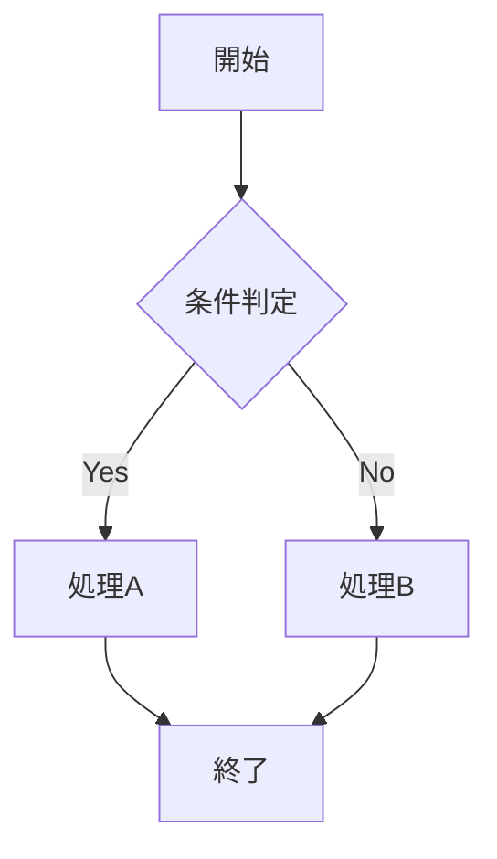
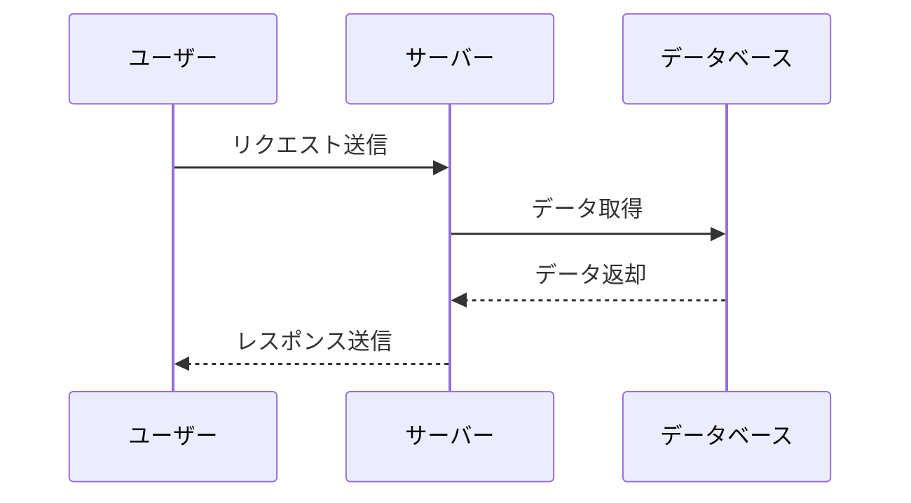
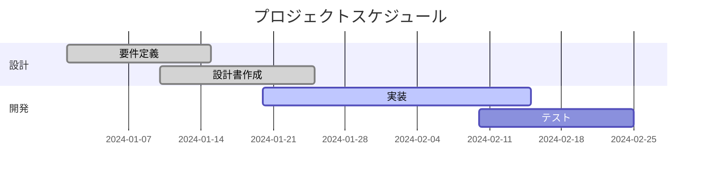
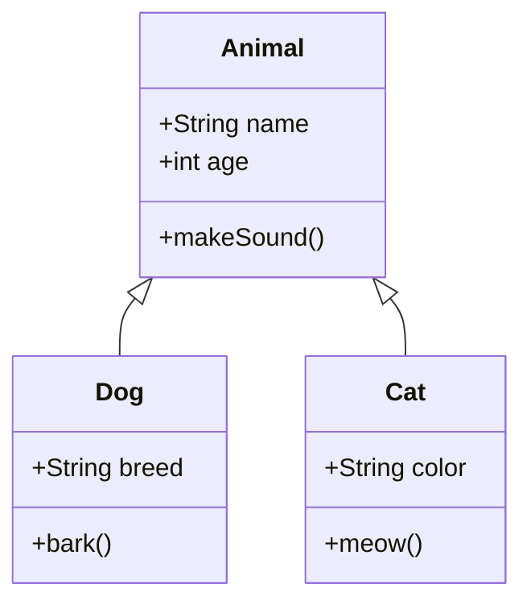
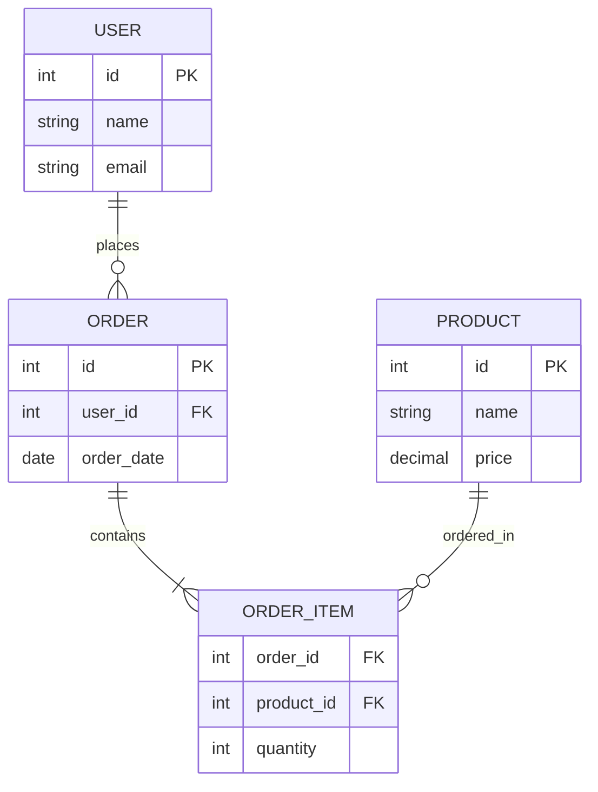
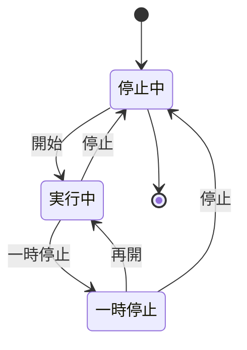
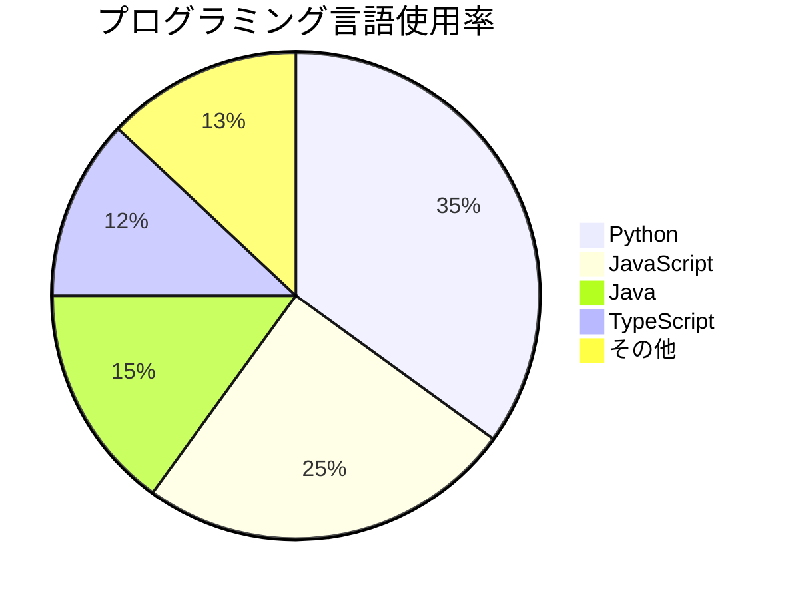

# Mermaidテストページ

このページでは、Mermaidの各種図を使用して、SVGからPNGへの変換機能をテストします。

## フローチャート

基本的なフローチャートです：

## シーケンス図

システム間の相互作用を表現するシーケンス図です：

## ガントチャート

プロジェクトスケジュールを表現するガントチャートです：

## クラス図

オブジェクト指向設計のクラス関係を表現するクラス図です：

## ER図

データベース設計のER図です：

## 状態図

システムの状態遷移を表現する状態図です：

## パイチャート

データの割合を表現するパイチャートです：

---

これらの図はすべて、通常のビルドではSVG形式で保存され、`ENABLE_PDF_EXPORT=1`環境変数が設定されている場合にのみPNG形式に変換されます。
