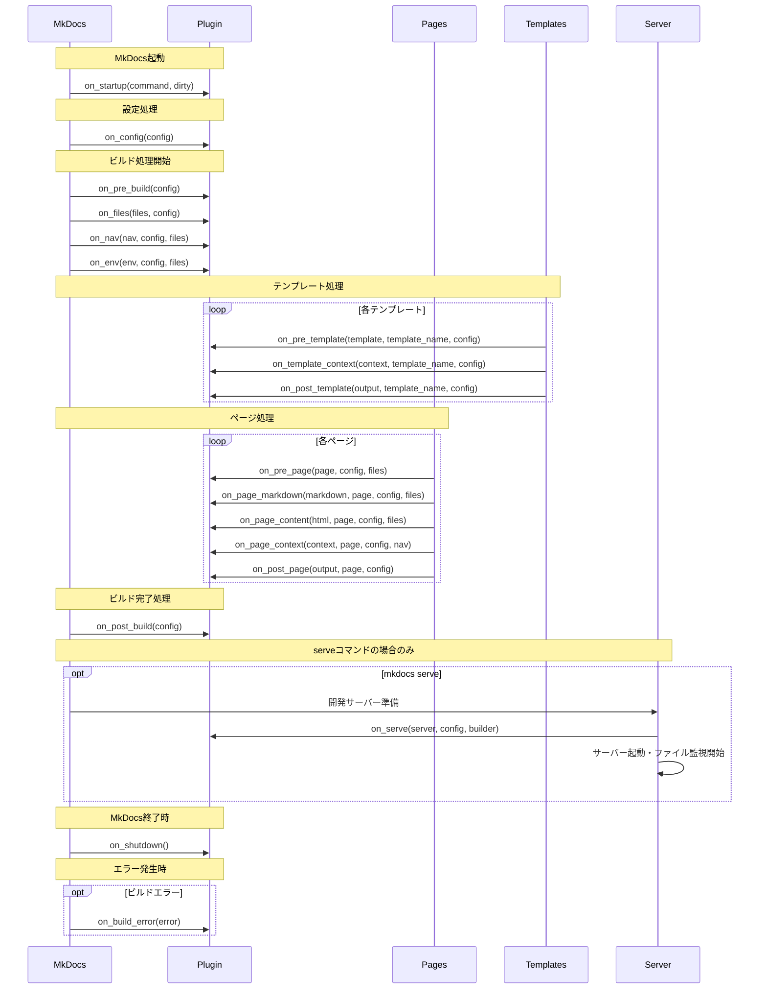
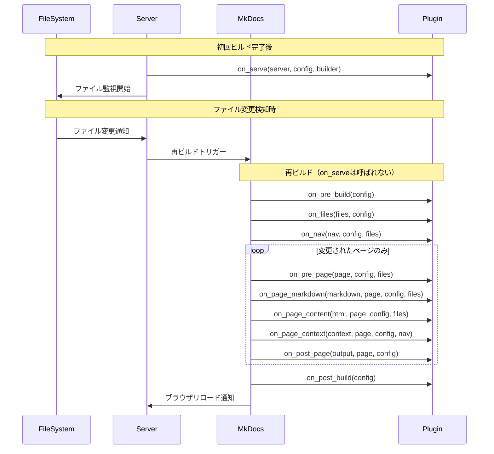

# MkDocsプラグインフックメソッド完全ガイド

MkDocsプラグインシステムは**イベント駆動型アーキテクチャ**を採用し、ドキュメントビルドプロセスの特定のポイントで実行される**25個のフックメソッド**を提供している。これらのフックは4つのカテゴリに分類され、それぞれが異なるライフサイクルタイミングで呼び出される。**on_serve**フックは開発サーバー専用の重要なフックで、ファイル監視のカスタマイズやライブリロード機能の拡張に使用される。

## フックメソッドの分類体系

MkDocsプラグインフックは以下の4つのカテゴリに整理されている：

### One-Time Events（一回限りイベント）
MkDocsの起動ごとに1回だけ実行されるフック。`mkdocs serve`実行時にのみ特別な動作を行う。

### Global Events（グローバルイベント）
サイト全体に影響する、ビルドプロセス全体で1回実行されるフック。

### Template Events（テンプレートイベント）
各非ページテンプレート（extra_templatesとstatic_templates）に対して1回実行されるフック。

### Page Events（ページイベント）
サイトに含まれる各Markdownページに対して1回実行されるフック。

## 完全なフックメソッド一覧

### One-Time Events

**`on_startup`**（MkDocs 1.4以降）
```python
def on_startup(self, *, command: Literal['build', 'gh-deploy', 'serve'], dirty: bool) -> None
```
- **用途**: MkDocs起動の最初に実行される初期化処理
- **パラメータ**: `command`（実行コマンド）、`dirty`（--dirtyフラグの有無）
- **重要**: このメソッドの存在により、プラグインが新システムに移行される

**`on_shutdown`**（MkDocs 1.4以降）
```python
def on_shutdown(self) -> None
```
- **用途**: MkDocs終了直前に実行される後処理
- **注意**: "ベストエフォート"での実行（正常終了時のみ保証）

**`on_serve`**
```python
def on_serve(self, server: LiveReloadServer, *, config: MkDocsConfig, builder: Callable) -> LiveReloadServer | None
```
- **用途**: 開発サーバー用の特別な設定とファイル監視のカスタマイズ
- **タイミング**: 初回ビルド完了後、サーバー起動前の1回のみ

### Global Events

**`on_config`**
```python
def on_config(self, config: MkDocsConfig) -> MkDocsConfig | None
```
- **用途**: グローバル設定の変更と検証
- **重要**: ビルドプロセスで最初に呼び出されるフック

**`on_pre_build`**
```python
def on_pre_build(self, *, config: MkDocsConfig) -> None
```
- **用途**: ビルド開始前の準備処理とスクリプト実行

**`on_files`**
```python
def on_files(self, files: Files, *, config: MkDocsConfig) -> Files | None
```
- **用途**: ファイルコレクションの変更（追加・削除・変更）

**`on_nav`**
```python
def on_nav(self, nav: Navigation, *, config: MkDocsConfig, files: Files) -> Navigation | None
```
- **用途**: サイトナビゲーション構造の変更

**`on_env`**
```python
def on_env(self, env: Environment, *, config: MkDocsConfig, files: Files) -> Environment | None
```
- **用途**: Jinja2テンプレート環境のカスタマイズ

**`on_post_build`**
```python
def on_post_build(self, *, config: MkDocsConfig) -> None
```
- **用途**: ビルド完了後の後処理とクリーンアップ

**`on_build_error`**
```python
def on_build_error(self, error: Exception, **kwargs) -> None
```
- **用途**: ビルドエラー発生時の例外処理とクリーンアップ

### Page Events

**`on_pre_page`**
```python
def on_pre_page(self, page: Page, *, config: MkDocsConfig, files: Files) -> Page | None
```
- **用途**: ページ処理開始前のPage インスタンス変更

**`on_page_markdown`**
```python
def on_page_markdown(self, markdown: str, *, page: Page, config: MkDocsConfig, files: Files) -> str | None
```
- **用途**: Markdownソーステキストの変更（メタデータ抽出後）

**`on_page_content`**
```python
def on_page_content(self, html: str, *, page: Page, config: MkDocsConfig, files: Files) -> str | None
```
- **用途**: MarkdownからHTMLレンダリング後の変更

**`on_page_context`**
```python
def on_page_context(self, context: TemplateContext, *, page: Page, config: MkDocsConfig, nav: Navigation) -> TemplateContext | None
```
- **用途**: ページ固有のテンプレートコンテキスト変更

**`on_post_page`**
```python
def on_post_page(self, output: str, *, page: Page, config: MkDocsConfig) -> str | None
```
- **用途**: 最終レンダリング済みページ出力の変更

### Template Events

**`on_pre_template`**
```python
def on_pre_template(self, template: Template, *, template_name: str, config: MkDocsConfig) -> Template | None
```
- **用途**: テンプレート読み込み直後の変更

**`on_template_context`**
```python
def on_template_context(self, context: TemplateContext, *, template_name: str, config: MkDocsConfig) -> TemplateContext | None
```
- **用途**: テンプレート固有のコンテキスト変更

**`on_post_template`**
```python
def on_post_template(self, output_content: str, *, template_name: str, config: MkDocsConfig) -> str | None
```
- **用途**: テンプレートレンダリング後の出力変更

## フックメソッドのライフサイクルと呼び出し順序

### 実行順序
```
1. on_startup（MkDocs起動時、1回のみ）
2. on_config（設定読み込み・検証）
3. on_pre_build（ビルド前処理）
4. on_files（ファイル収集）
5. on_nav（ナビゲーション構築）
6. on_env（テンプレート環境設定）
7. Template Events ループ:
   - on_pre_template → on_template_context → on_post_template
8. Page Events ループ:
   - on_pre_page → on_page_markdown → on_page_content → on_page_context → on_post_page
9. on_post_build（ビルド後処理）
10. on_serve（serveコマンド時のみ、初回ビルド後）
11. on_shutdown（MkDocs終了時）
12. on_build_error（例外発生時）
```

### ライフサイクルのMermaidシーケンス図



### serveモードでの再ビルド時のシーケンス



### プライオリティシステム（MkDocs 1.4以降）
```python
@mkdocs.plugins.event_priority(100)  # "first"
@mkdocs.plugins.event_priority(50)   # "early"
@mkdocs.plugins.event_priority(0)    # "default"
@mkdocs.plugins.event_priority(-50)  # "late"
@mkdocs.plugins.event_priority(-100) # "last"
```

## on_serveフックの詳細分析

### 呼び出しタイミング
**on_serve**フックは非常に特殊なタイミングで実行される：

1. **mkdocs serve**コマンド実行時のみ
2. **初回ビルド完了後**かつ**開発サーバー起動前**
3. **1回のみ実行**（ファイル変更による再ビルド時は実行されない）
4. **LiveReloadServer**インスタンスを受け取り、カスタマイズ可能

### 具体的な実装例
```python
def on_serve(self, server, config, builder, **kwargs):
    # 追加ディレクトリの監視
    server.watch('/path/to/external/data', builder)

    # 特定ディレクトリの監視除外
    server.watcher.ignore_dirs(Path(config["docs_dir"]) / "generated")

    # 開発モード固有の設定
    self.dev_mode = True

    return server
```

### on_startupを活用したビルド/サーブモードの判定（推奨）

MkDocs 1.4以降では、**on_startup**フックを使用してコマンドタイプを判定し、Page Events内で処理を分岐させることが推奨される。これは最も確実で、将来的にも安定した方法である。

```python
from mkdocs.plugins import BasePlugin
from mkdocs.config import config_options

class ModeAwarePlugin(BasePlugin):
    config_scheme = (
        ('dev_only_features', config_options.Type(bool, default=True)),
        ('prod_optimizations', config_options.Type(bool, default=True)),
    )

    def __init__(self):
        super().__init__()
        self.command = None
        self.is_serve_mode = False

    def on_startup(self, *, command, **kwargs):
        """MkDocs起動時にコマンドタイプを記録"""
        self.command = command  # 'build', 'serve', 'gh-deploy'
        self.is_serve_mode = (command == 'serve')

        # ロギング
        log.info(f"Plugin initialized in {command.upper()} mode")

    def on_page_markdown(self, markdown, page, **kwargs):
        """コマンドタイプに応じた処理の分岐"""
        if self.is_serve_mode and self.config['dev_only_features']:
            # 開発モード専用の処理
            markdown = self.add_development_helpers(markdown, page)
        elif not self.is_serve_mode and self.config['prod_optimizations']:
            # ビルドモード専用の処理
            markdown = self.optimize_for_production(markdown, page)

        return markdown

    def add_development_helpers(self, markdown, page):
        """開発時のみ有効なヘルパー機能"""
        # ファイルパス情報の追加
        dev_info = f"<!-- Source: {page.file.src_path} -->\n"

        # ドラフトページの警告
        if page.meta.get('draft', False):
            dev_info += "!!! warning \"Draft Page\"\n    This content is not finalized.\n\n"

        return dev_info + markdown

    def optimize_for_production(self, markdown, page):
        """本番環境向けの最適化"""
        # ドラフトページの除外
        if page.meta.get('draft', False):
            return None  # ページをビルドから除外

        # その他の最適化処理
        return markdown
```

このアプローチの利点：
- **確実性**: コマンドタイプを直接取得できる
- **早期判定**: プラグイン初期化時点で判定可能
- **互換性**: MkDocs 1.4以降で安定して動作
- **拡張性**: 'gh-deploy'など他のコマンドにも対応可能

### 他のフックとの関係性

**プラグインオブジェクトの永続化**
- **on_serve**メソッドの存在により、プラグインオブジェクトが`mkdocs serve`セッション中に保持される
- 複数の再ビルド間で状態を維持可能
- **on_startup**や**on_shutdown**との組み合わせで強力な開発環境カスタマイズが可能

**実行順序との関係**
- **on_startup** → 各ビルドサイクル → **on_serve** → ファイル監視開始
- Global Events（on_pre_build、on_post_build）は再ビルドのたびに実行
- **on_serve**は開発サーバーセッション全体で1回のみ

### 重要な注意点

**無限ループの防止**
```python
def on_serve(self, server, config, builder, **kwargs):
    # on_pre_buildで自動生成されるファイルの監視を除外
    self.disable_autogenerated_docs = True
    return server
```

**エラーハンドリング**
```python
def on_serve(self, server, config, builder, **kwargs):
    try:
        server.watch(additional_path, builder)
    except Exception as e:
        raise PluginError(f"Failed to setup serve configuration: {e}")
    return server
```

## プラグイン開発のベストプラクティス

### モダンな設定スキーマ（MkDocs 1.4以降推奨）
```python
from mkdocs.config.base import Config

class MyPluginConfig(Config):
    enabled = config_options.Type(bool, default=True)
    custom_option = config_options.Type(str, default='default_value')

class MyPlugin(BasePlugin[MyPluginConfig]):
    def on_config(self, config):
        if self.config.enabled:
            # 型安全な設定アクセス
            pass
        return config
```

### エラーハンドリングパターン
```python
from mkdocs.exceptions import PluginError

def on_page_markdown(self, markdown, page, **kwargs):
    try:
        return self.process_markdown(markdown)
    except Exception as e:
        raise PluginError(f"Error processing {page.file.src_path}: {e}")
```

### ログ出力の最適化
```python
from mkdocs.plugins import get_plugin_logger

log = get_plugin_logger(__name__)

def on_page_markdown(self, markdown, page, **kwargs):
    log.info(f"Processing page: {page.file.src_path}")
    if log.getEffectiveLevel() <= logging.DEBUG:
        log.debug(f"Debug info: {self.get_debug_info()}")
```

### パフォーマンス最適化
```python
import hashlib
import concurrent.futures

class OptimizedPlugin(BasePlugin):
    def __init__(self):
        super().__init__()
        self.cache = {}

    def on_page_markdown(self, markdown, page, **kwargs):
        # キャッシュによる最適化
        cache_key = hashlib.md5(markdown.encode()).hexdigest()
        if cache_key in self.cache:
            return self.cache[cache_key]

        result = self.expensive_operation(markdown)
        self.cache[cache_key] = result
        return result

    def on_files(self, files, config, **kwargs):
        # 並行処理による高速化
        max_workers = min(cpu_count() - 1, len(files)) or 1
        with concurrent.futures.ThreadPoolExecutor(max_workers=max_workers) as executor:
            futures = [executor.submit(self.process_file, f) for f in files]
            concurrent.futures.wait(futures)
        return files
```

## 実用的な実装パターン

### 条件分岐による処理制御
```python
def on_page_markdown(self, markdown, page, **kwargs):
    # ページレベルの制御
    if page.meta.get('skip_processing'):
        return markdown

    # ファイルパスによる制御
    if page.file.src_path.startswith('api/'):
        return self.process_api_docs(markdown)

    return markdown
```

### 状態管理パターン
```python
class StatefulPlugin(BasePlugin):
    def on_pre_build(self, config, **kwargs):
        self.build_state = {
            'pages_processed': 0,
            'links_found': [],
            'errors': []
        }

    def on_post_build(self, config, **kwargs):
        self.generate_report(self.build_state)
```

### プラグイン合成パターン
```python
class CompositePlugin(BasePlugin):
    def __init__(self):
        super().__init__()
        self.processors = [
            MarkdownProcessor(),
            HTMLProcessor(),
            LinkProcessor()
        ]

    def on_page_markdown(self, markdown, page, **kwargs):
        for processor in self.processors:
            markdown = processor.process(markdown, page)
        return markdown
```

## 結論

MkDocsプラグインフックシステムは、**イベント駆動型アーキテクチャ**により強力で柔軟なドキュメント処理機能を提供している。特に**on_serve**フックは開発ワークフローの最適化に重要な役割を果たし、ファイル監視のカスタマイズやライブリロード機能の拡張を可能にする。プラグイン開発では、適切なフック選択、エラーハンドリング、パフォーマンス最適化、そして開発・本番環境の両方での動作確認が成功の鍵となる。
