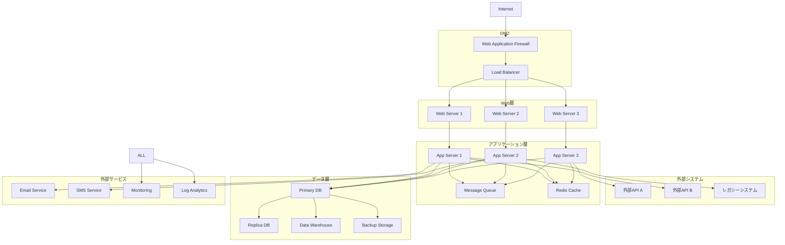
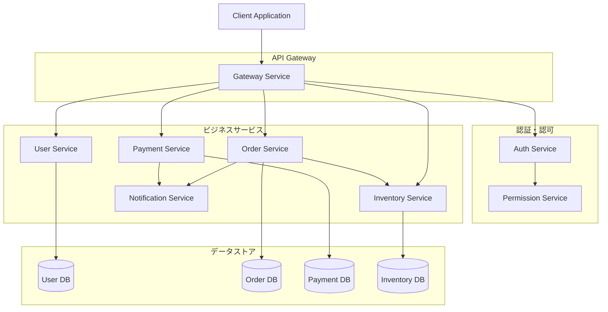

# システムアーキテクチャ

## 全体アーキテクチャ



## マイクロサービス構成



## セキュリティレイヤー

```mermaid
graph LR
    subgraph "セキュリティ層"
        A[WAF] --> B[DDoS Protection]
        B --> C[SSL/TLS Termination]
        C --> D[Rate Limiting]
        D --> E[Authentication]
        E --> F[Authorization]
        F --> G[Data Encryption]
        G --> H[Audit Logging]
    end
