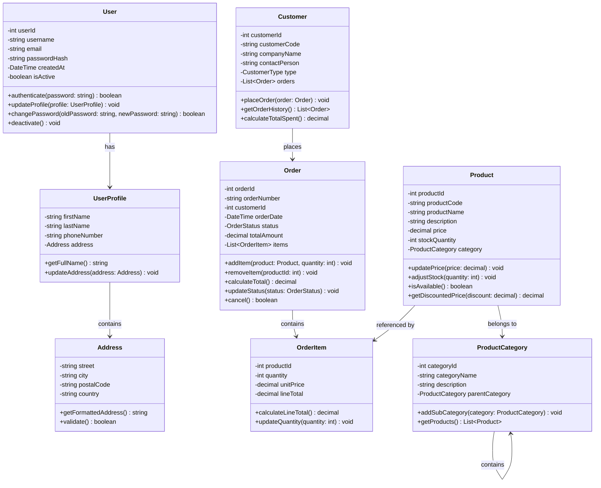
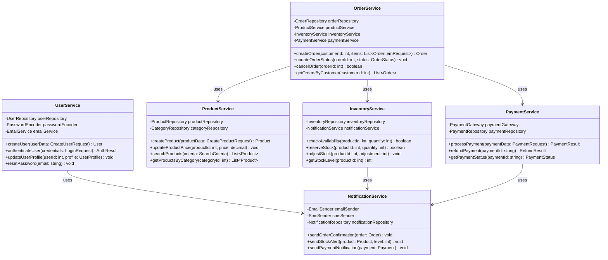
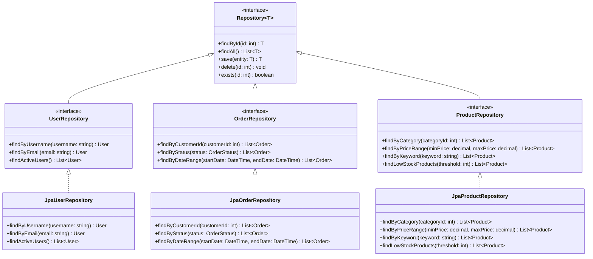
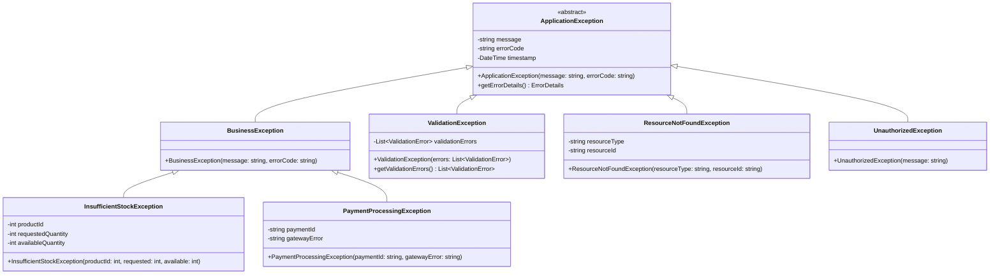

# クラス設計

## コアビジネスロジッククラス図


```mermaid
classDiagram
    class User {
        -int userId
        -string username
        -string email
        -string passwordHash
        -DateTime createdAt
        -boolean isActive
        +authenticate(password: string) boolean
        +updateProfile(profile: UserProfile) void
        +changePassword(oldPassword: string, newPassword: string) boolean
        +deactivate() void
    }

    class UserProfile {
        -string firstName
        -string lastName
        -string phoneNumber
        -Address address
        +getFullName() string
        +updateAddress(address: Address) void
    }

    class Address {
        -string street
        -string city
        -string postalCode
        -string country
        +getFormattedAddress() string
        +validate() boolean
    }

    class Order {
        -int orderId
        -string orderNumber
        -int customerId
        -DateTime orderDate
        -OrderStatus status
        -decimal totalAmount
        -List~OrderItem~ items
        +addItem(product: Product, quantity: int) void
        +removeItem(productId: int) void
        +calculateTotal() decimal
        +updateStatus(status: OrderStatus) void
        +cancel() boolean
    }

    class OrderItem {
        -int productId
        -int quantity
        -decimal unitPrice
        -decimal lineTotal
        +calculateLineTotal() decimal
        +updateQuantity(quantity: int) void
    }

    class Product {
        -int productId
        -string productCode
        -string productName
        -string description
        -decimal price
        -int stockQuantity
        -ProductCategory category
        +updatePrice(price: decimal) void
        +adjustStock(quantity: int) void
        +isAvailable() boolean
        +getDiscountedPrice(discount: decimal) decimal
    }

    class ProductCategory {
        -int categoryId
        -string categoryName
        -string description
        -ProductCategory parentCategory
        +addSubCategory(category: ProductCategory) void
        +getProducts() List~Product~
    }

    class Customer {
        -int customerId
        -string customerCode
        -string companyName
        -string contactPerson
        -CustomerType type
        -List~Order~ orders
        +placeOrder(order: Order) void
        +getOrderHistory() List~Order~
        +calculateTotalSpent() decimal
    }

    User --> UserProfile : has
    UserProfile --> Address : contains
    Customer --> Order : places
    Order --> OrderItem : contains
    Product --> OrderItem : referenced by
    Product --> ProductCategory : belongs to
    ProductCategory --> ProductCategory : contains
```

## サービス層アーキテクチャ


```mermaid
classDiagram
    class UserService {
        -UserRepository userRepository
        -PasswordEncoder passwordEncoder
        -EmailService emailService
        +createUser(userData: CreateUserRequest) User
        +authenticateUser(credentials: LoginRequest) AuthResult
        +updateUserProfile(userId: int, profile: UserProfile) void
        +resetPassword(email: string) void
    }

    class OrderService {
        -OrderRepository orderRepository
        -ProductService productService
        -InventoryService inventoryService
        -PaymentService paymentService
        +createOrder(customerId: int, items: List~OrderItemRequest~) Order
        +updateOrderStatus(orderId: int, status: OrderStatus) void
        +cancelOrder(orderId: int) boolean
        +getOrdersByCustomer(customerId: int) List~Order~
    }

    class ProductService {
        -ProductRepository productRepository
        -CategoryRepository categoryRepository
        +createProduct(productData: CreateProductRequest) Product
        +updateProductPrice(productId: int, price: decimal) void
        +searchProducts(criteria: SearchCriteria) List~Product~
        +getProductsByCategory(categoryId: int) List~Product~
    }

    class InventoryService {
        -InventoryRepository inventoryRepository
        -NotificationService notificationService
        +checkAvailability(productId: int, quantity: int) boolean
        +reserveStock(productId: int, quantity: int) boolean
        +adjustStock(productId: int, adjustment: int) void
        +getStockLevel(productId: int) int
    }

    class PaymentService {
        -PaymentGateway paymentGateway
        -PaymentRepository paymentRepository
        +processPayment(paymentData: PaymentRequest) PaymentResult
        +refundPayment(paymentId: string) RefundResult
        +getPaymentStatus(paymentId: string) PaymentStatus
    }

    class NotificationService {
        -EmailSender emailSender
        -SmsSender smsSender
        -NotificationRepository notificationRepository
        +sendOrderConfirmation(order: Order) void
        +sendStockAlert(product: Product, level: int) void
        +sendPaymentNotification(payment: Payment) void
    }

    OrderService --> ProductService : uses
    OrderService --> InventoryService : uses
    OrderService --> PaymentService : uses
    UserService --> NotificationService : uses
    InventoryService --> NotificationService : uses
    PaymentService --> NotificationService : uses
```

## データアクセス層


```mermaid
classDiagram
    class Repository~T~ {
        <<interface>>
        +findById(id: int) T
        +findAll() List~T~
        +save(entity: T) T
        +delete(id: int) void
        +exists(id: int) boolean
    }

    class UserRepository {
        <<interface>>
        +findByUsername(username: string) User
        +findByEmail(email: string) User
        +findActiveUsers() List~User~
    }

    class OrderRepository {
        <<interface>>
        +findByCustomerId(customerId: int) List~Order~
        +findByStatus(status: OrderStatus) List~Order~
        +findByDateRange(startDate: DateTime, endDate: DateTime) List~Order~
    }

    class ProductRepository {
        <<interface>>
        +findByCategory(categoryId: int) List~Product~
        +findByPriceRange(minPrice: decimal, maxPrice: decimal) List~Product~
        +findByKeyword(keyword: string) List~Product~
        +findLowStockProducts(threshold: int) List~Product~
    }

    class JpaUserRepository {
        +findByUsername(username: string) User
        +findByEmail(email: string) User
        +findActiveUsers() List~User~
    }

    class JpaOrderRepository {
        +findByCustomerId(customerId: int) List~Order~
        +findByStatus(status: OrderStatus) List~Order~
        +findByDateRange(startDate: DateTime, endDate: DateTime) List~Order~
    }

    class JpaProductRepository {
        +findByCategory(categoryId: int) List~Product~
        +findByPriceRange(minPrice: decimal, maxPrice: decimal) List~Product~
        +findByKeyword(keyword: string) List~Product~
        +findLowStockProducts(threshold: int) List~Product~
    }

    Repository~T~ <|-- UserRepository
    Repository~T~ <|-- OrderRepository
    Repository~T~ <|-- ProductRepository
    UserRepository <|.. JpaUserRepository
    OrderRepository <|.. JpaOrderRepository
    ProductRepository <|.. JpaProductRepository
```

## 例外処理クラス構造


```mermaid
classDiagram
    class ApplicationException {
        <<abstract>>
        -string message
        -string errorCode
        -DateTime timestamp
        +ApplicationException(message: string, errorCode: string)
        +getErrorDetails() ErrorDetails
    }

    class BusinessException {
        +BusinessException(message: string, errorCode: string)
    }

    class ValidationException {
        -List~ValidationError~ validationErrors
        +ValidationException(errors: List~ValidationError~)
        +getValidationErrors() List~ValidationError~
    }

    class ResourceNotFoundException {
        -string resourceType
        -string resourceId
        +ResourceNotFoundException(resourceType: string, resourceId: string)
    }

    class UnauthorizedException {
        +UnauthorizedException(message: string)
    }

    class InsufficientStockException {
        -int productId
        -int requestedQuantity
        -int availableQuantity
        +InsufficientStockException(productId: int, requested: int, available: int)
    }

    class PaymentProcessingException {
        -string paymentId
        -string gatewayError
        +PaymentProcessingException(paymentId: string, gatewayError: string)
    }

    ApplicationException <|-- BusinessException
    ApplicationException <|-- ValidationException
    ApplicationException <|-- ResourceNotFoundException
    ApplicationException <|-- UnauthorizedException
    BusinessException <|-- InsufficientStockException
    BusinessException <|-- PaymentProcessingException
```
```
