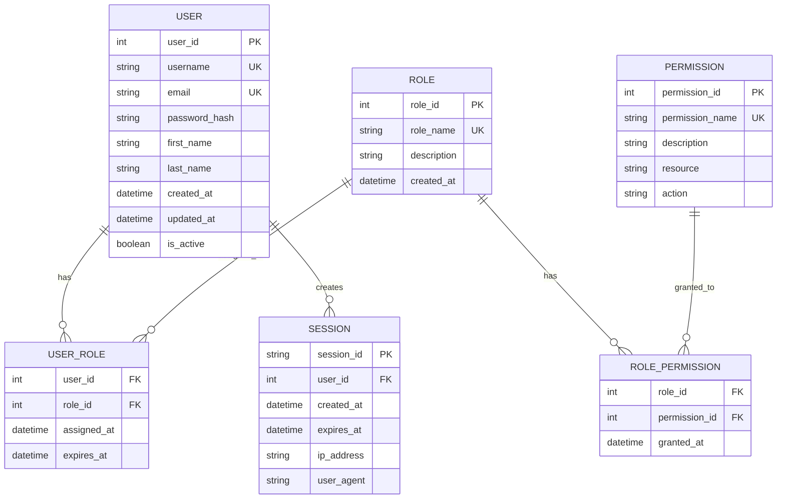
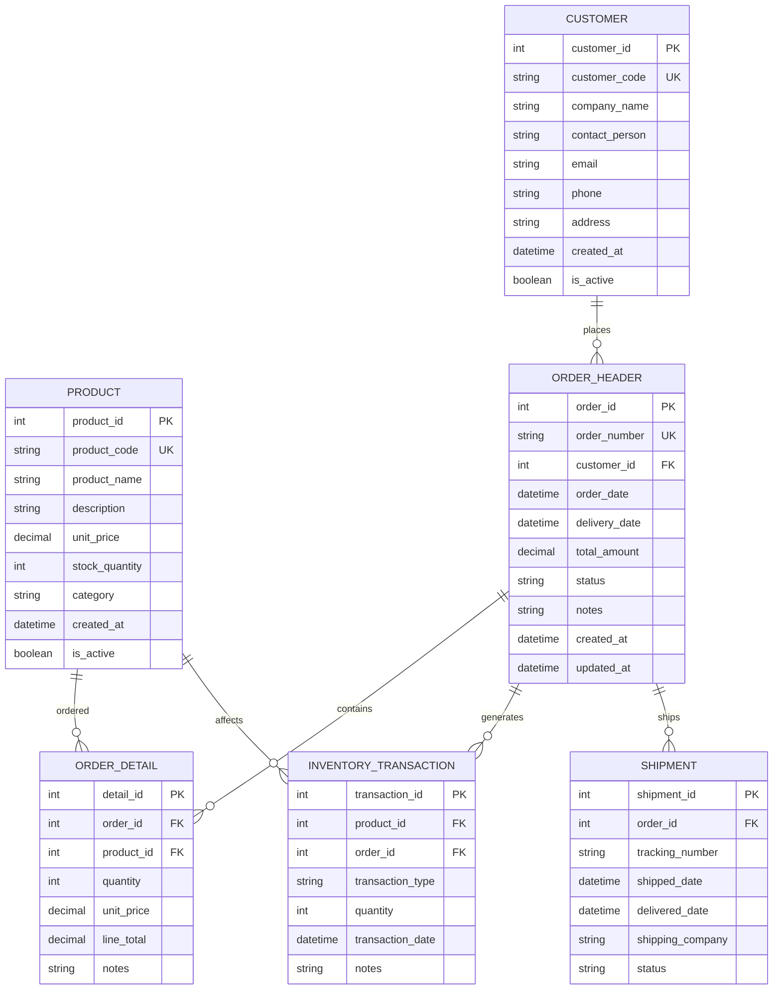
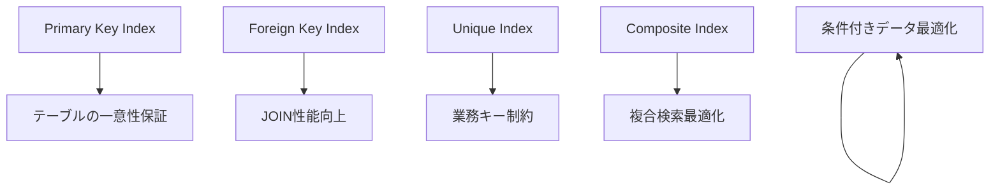

# データベース設計

## エンティティ関係図（ER図）

### ユーザー管理システム

```mermaid
erDiagram
    USER {
        int user_id PK
        string username UK
        string email UK
        string password_hash
        string first_name
        string last_name
        datetime created_at
        datetime updated_at
        boolean is_active
    }

    ROLE {
        int role_id PK
        string role_name UK
        string description
        datetime created_at
    }

    PERMISSION {
        int permission_id PK
        string permission_name UK
        string description
        string resource
        string action
    }

    USER_ROLE {
        int user_id FK
        int role_id FK
        datetime assigned_at
        datetime expires_at
    }

    ROLE_PERMISSION {
        int role_id FK
        int permission_id FK
        datetime granted_at
    }

    SESSION {
        string session_id PK
        int user_id FK
        datetime created_at
        datetime expires_at
        string ip_address
        string user_agent
    }

    USER ||--o{ USER_ROLE : has
    ROLE ||--o{ USER_ROLE : assigned_to
    ROLE ||--o{ ROLE_PERMISSION : has
    PERMISSION ||--o{ ROLE_PERMISSION : granted_to
    USER ||--o{ SESSION : creates
```

### 業務システム（受注管理）

```mermaid
erDiagram
    CUSTOMER {
        int customer_id PK
        string customer_code UK
        string company_name
        string contact_person
        string email
        string phone
        string address
        datetime created_at
        boolean is_active
    }

    PRODUCT {
        int product_id PK
        string product_code UK
        string product_name
        string description
        decimal unit_price
        int stock_quantity
        string category
        datetime created_at
        boolean is_active
    }

    ORDER_HEADER {
        int order_id PK
        string order_number UK
        int customer_id FK
        datetime order_date
        datetime delivery_date
        decimal total_amount
        string status
        string notes
        datetime created_at
        datetime updated_at
    }

    ORDER_DETAIL {
        int detail_id PK
        int order_id FK
        int product_id FK
        int quantity
        decimal unit_price
        decimal line_total
        string notes
    }

    INVENTORY_TRANSACTION {
        int transaction_id PK
        int product_id FK
        int order_id FK
        string transaction_type
        int quantity
        datetime transaction_date
        string notes
    }

    SHIPMENT {
        int shipment_id PK
        int order_id FK
        string tracking_number
        datetime shipped_date
        datetime delivered_date
        string shipping_company
        string status
    }

    CUSTOMER ||--o{ ORDER_HEADER : places
    ORDER_HEADER ||--o{ ORDER_DETAIL : contains
    PRODUCT ||--o{ ORDER_DETAIL : ordered
    PRODUCT ||--o{ INVENTORY_TRANSACTION : affects
    ORDER_HEADER ||--o{ INVENTORY_TRANSACTION : generates
    ORDER_HEADER ||--o{ SHIPMENT : ships
```

## データベーステーブル設計

### インデックス戦略

```mermaid
graph TD
    A[Primary Key Index] --> B[テーブルの一意性保証]
    C[Foreign Key Index] --> D[JOIN性能向上]
    E[Unique Index] --> F[業務キー制約]
    G[Composite Index] --> H[複合検索最適化]
    I[Partial Index] --> I[条件付きデータ最適化]
```
