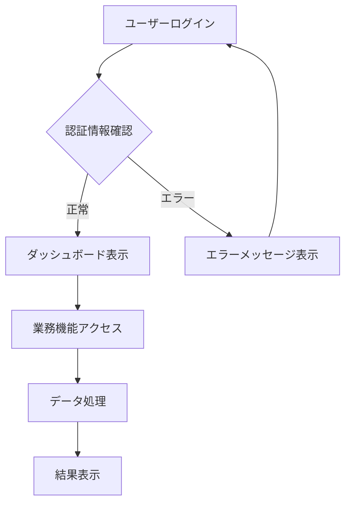
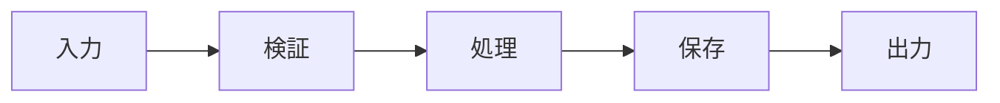
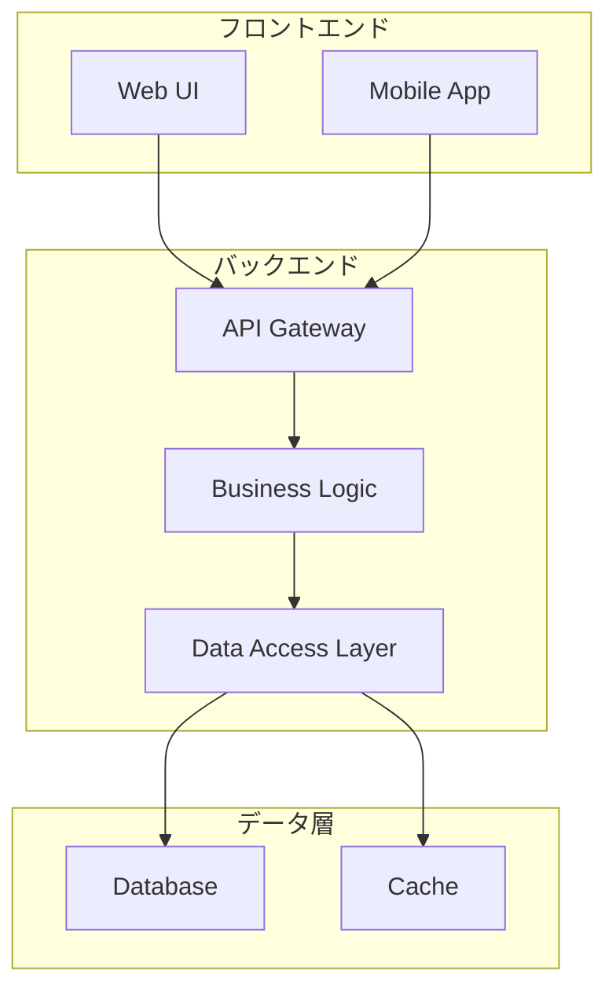

# システム概要

## 基本的なシステムフロー

### ユーザー認証フロー

```mermaid
flowchart TD
    A[ユーザーログイン] --> B{認証情報確認}
    B -->|正常| C[ダッシュボード表示]
    B -->|エラー| D[エラーメッセージ表示]
    D --> A
    C --> E[業務機能アクセス]
    E --> F[データ処理]
    F --> G[結果表示]
```

### 基本的なデータフロー

```mermaid
graph LR
    A[入力] --> B[検証]
    B --> C[処理]
    C --> D[保存]
    D --> E[出力]
```

## システムの主要コンポーネント

```mermaid
graph TB
    subgraph "フロントエンド"
        A[Web UI]
        B[Mobile App]
    end

    subgraph "バックエンド"
        C[API Gateway]
        D[Business Logic]
        E[Data Access Layer]
    end

    subgraph "データ層"
        F[Database]
        G[Cache]
    end

    A --> C
    B --> C
    C --> D
    D --> E
    E --> F
    E --> G
```
