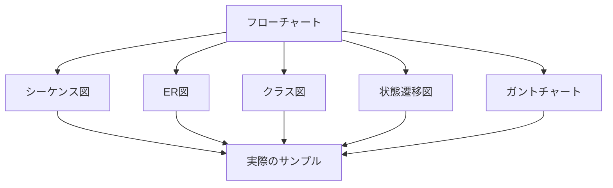

# はじめに

業務システムドキュメントのベストプラクティスとMermaid図表のサンプル集

- [PDF](pdf/ドキュメンテーション戦略.pdf)

## 目次

### システム設計ドキュメント
- [システム概要](01.システム設計/system-overview.md) - 基本的なシステムフロー
- [アーキテクチャ](architecture.md) - 詳細なシステム構成
- [データベース設計](database-design.md) - ER図とテーブル構造
- [クラス設計](class-design.md) - オブジェクト指向設計

### プロセス・フロードキュメント
- [ユーザージャーニー](user-journey.md) - シーケンス図とユーザー体験
- [状態管理](state-management.md) - システム状態遷移

### プロジェクト管理
- [プロジェクト計画](project-plan.md) - ガントチャートとマイルストーン

## Mermaid図表の種類

このサイトでは以下のMermaid図表のサンプルを提供しています：

## 複雑な図表

Mermaidはレイアウト位置などが自動判定されることで、逆に詳細な図は読みやすく書くのが難しい場合があります。

その場合はVS Codeの「Draw.io Integration」拡張を利用して、SVGで記述します。

## 技術スタック

- **MkDocs**: 静的サイトジェネレーター
- **Mermaid**: 図表描画ライブラリ
- **Material for MkDocs**: レスポンシブテーマ
- **Python**: ビルド環境
