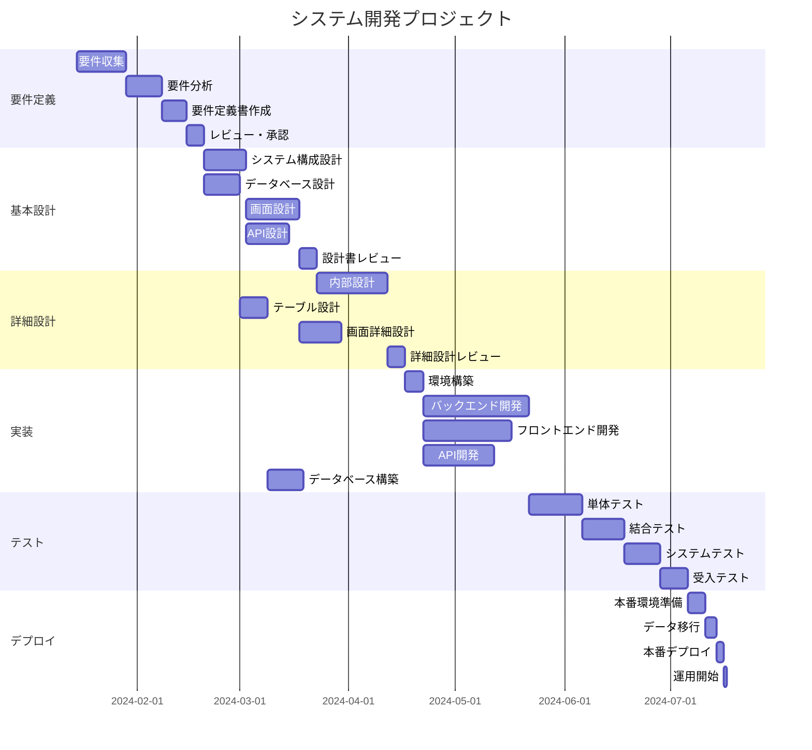
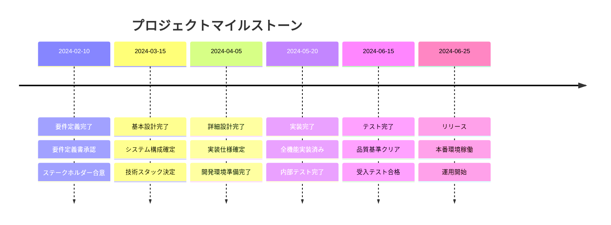
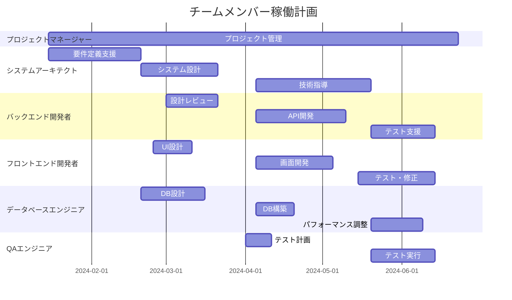
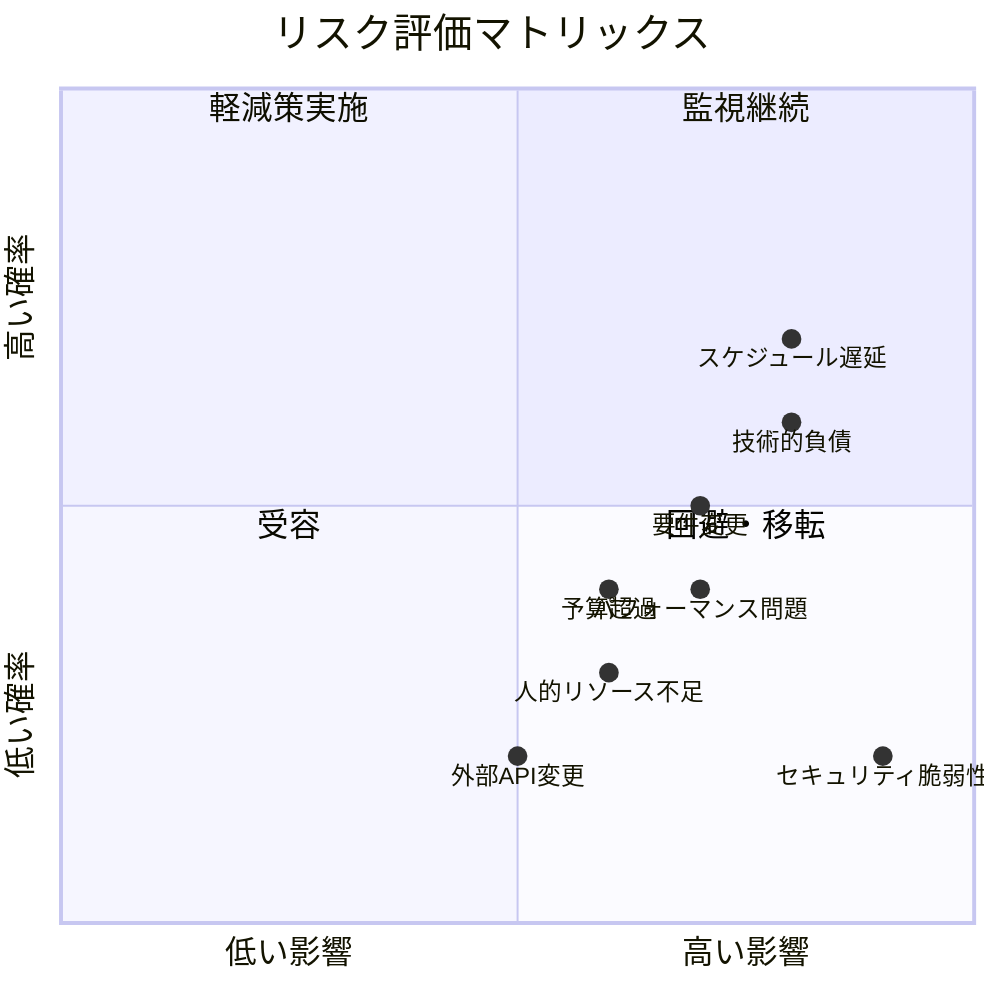

# プロジェクト計画

## システム開発ガントチャート

```mermaid
gantt
    title システム開発プロジェクト
    dateFormat  YYYY-MM-DD
    section 要件定義
    要件収集           :req1, 2024-01-15, 14d
    要件分析           :req2, after req1, 10d
    要件定義書作成     :req3, after req2, 7d
    レビュー・承認     :req4, after req3, 5d

    section 基本設計
    システム構成設計   :design1, after req4, 12d
    データベース設計   :design2, after req4, 10d
    画面設計           :design3, after design1, 15d
    API設計            :design4, after design1, 12d
    設計書レビュー     :design5, after design3, 5d

    section 詳細設計
    内部設計           :detail1, after design5, 20d
    テーブル設計       :detail2, after design2, 8d
    画面詳細設計       :detail3, after design3, 12d
    詳細設計レビュー   :detail4, after detail1, 5d

    section 実装
    環境構築           :impl1, after detail4, 5d
    バックエンド開発   :impl2, after impl1, 30d
    フロントエンド開発 :impl3, after impl1, 25d
    API開発            :impl4, after impl1, 20d
    データベース構築   :impl5, after detail2, 10d

    section テスト
    単体テスト         :test1, after impl2, 15d
    結合テスト         :test2, after test1, 12d
    システムテスト     :test3, after test2, 10d
    受入テスト         :test4, after test3, 8d

    section デプロイ
    本番環境準備       :deploy1, after test4, 5d
    データ移行         :deploy2, after deploy1, 3d
    本番デプロイ       :deploy3, after deploy2, 2d
    運用開始           :deploy4, after deploy3, 1d
```

## マイルストーン管理

```mermaid
timeline
    title プロジェクトマイルストーン

    2024-02-10 : 要件定義完了
                : 要件定義書承認
                : ステークホルダー合意

    2024-03-15 : 基本設計完了
                : システム構成確定
                : 技術スタック決定

    2024-04-05 : 詳細設計完了
                : 実装仕様確定
                : 開発環境準備完了

    2024-05-20 : 実装完了
                : 全機能実装済み
                : 内部テスト完了

    2024-06-15 : テスト完了
                : 品質基準クリア
                : 受入テスト合格

    2024-06-25 : リリース
                : 本番環境稼働
                : 運用開始
```

## リソース配分チャート

```mermaid
gantt
    title チームメンバー稼働計画
    dateFormat  YYYY-MM-DD

    section プロジェクトマネージャー
    プロジェクト管理   :pm1, 2024-01-15, 160d

    section システムアーキテクト
    要件定義支援       :arch1, 2024-01-15, 36d
    システム設計       :arch2, 2024-02-20, 30d
    技術指導           :arch3, 2024-04-05, 45d

    section バックエンド開発者
    設計レビュー       :be1, 2024-03-01, 20d
    API開発            :be2, 2024-04-05, 35d
    テスト支援         :be3, 2024-05-20, 25d

    section フロントエンド開発者
    UI設計             :fe1, 2024-02-25, 15d
    画面開発           :fe2, 2024-04-05, 30d
    テスト・修正       :fe3, 2024-05-15, 30d

    section データベースエンジニア
    DB設計             :db1, 2024-02-20, 25d
    DB構築             :db2, 2024-04-05, 15d
    パフォーマンス調整 :db3, 2024-05-20, 20d

    section QAエンジニア
    テスト計画         :qa1, 2024-04-01, 10d
    テスト実行         :qa2, 2024-05-20, 25d
```

## リスク管理

```mermaid
quadrantChart
    title リスク評価マトリックス
    x-axis "低い影響" --> "高い影響"
    y-axis "低い確率" --> "高い確率"

    quadrant-1 "監視継続"
    quadrant-2 "軽減策実施"
    quadrant-3 "受容"
    quadrant-4 "回避・移転"

    "技術的負債": [0.8, 0.6]
    "要件変更": [0.7, 0.5]
    "人的リソース不足": [0.6, 0.3]
    "外部API変更": [0.5, 0.2]
    "パフォーマンス問題": [0.7, 0.4]
    "セキュリティ脆弱性": [0.9, 0.2]
    "スケジュール遅延": [0.8, 0.7]
    "予算超過": [0.6, 0.4]
```
