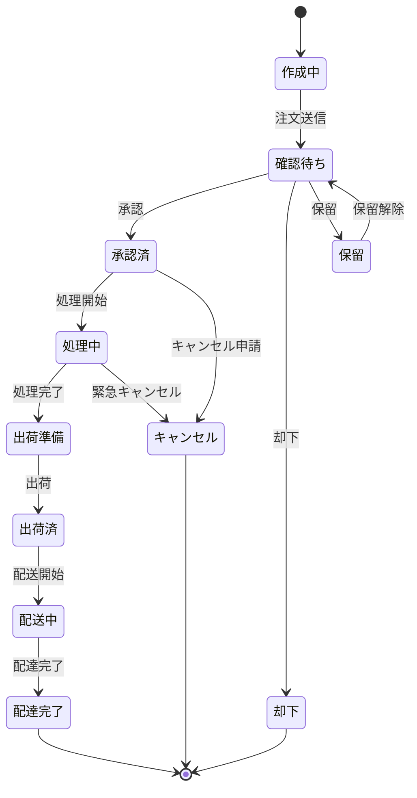
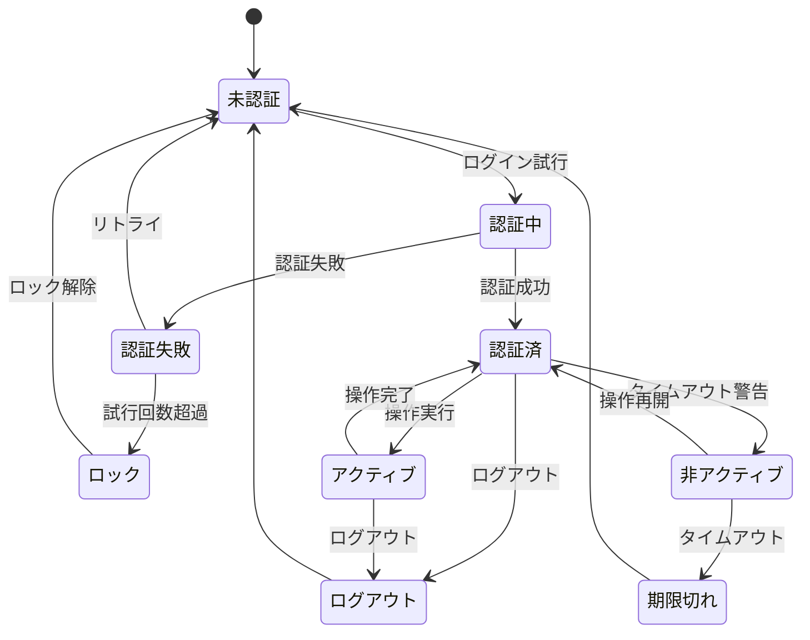
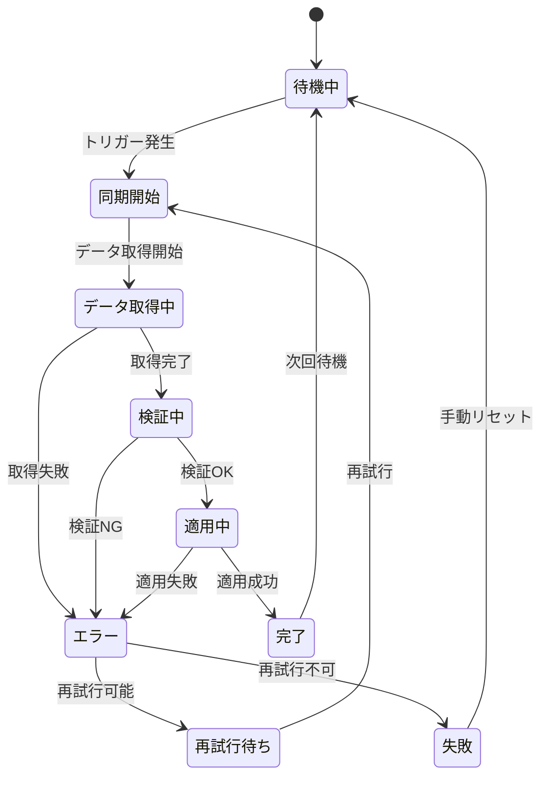
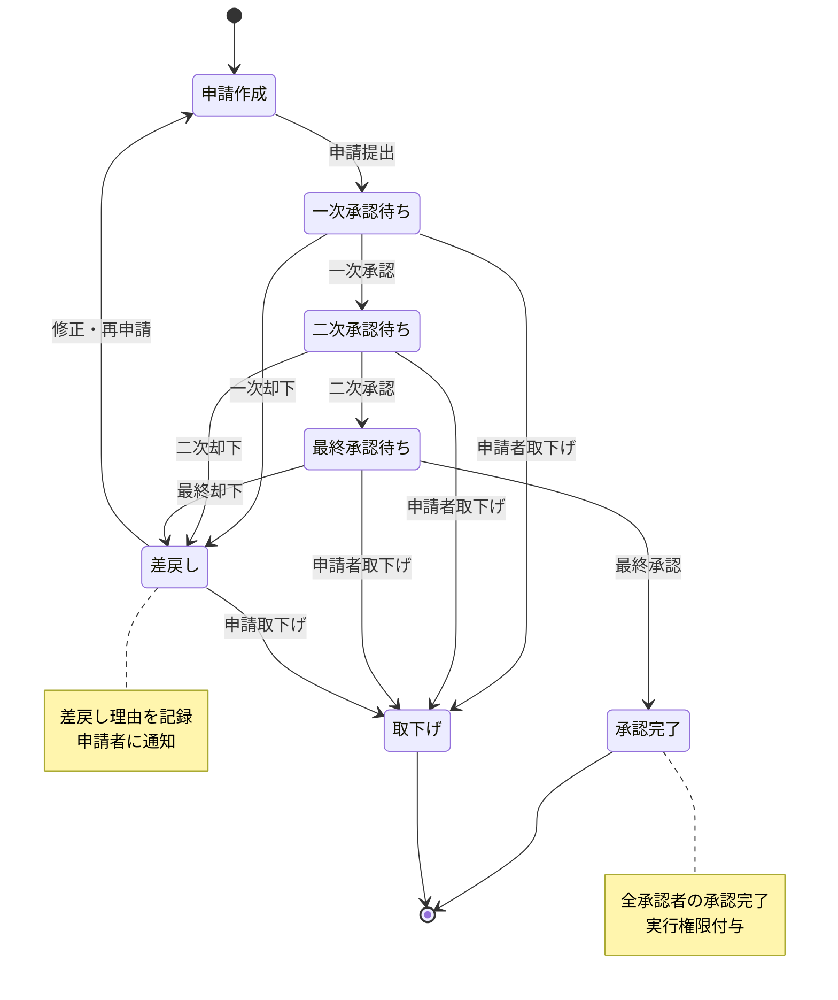

# 状態管理

## 注文状態遷移

```mermaid
stateDiagram-v2
    [*] --> 作成中
    作成中 --> 確認待ち : 注文送信
    確認待ち --> 承認済 : 承認
    確認待ち --> 却下 : 却下
    確認待ち --> 保留 : 保留
    保留 --> 確認待ち : 保留解除
    承認済 --> 処理中 : 処理開始
    処理中 --> 出荷準備 : 処理完了
    出荷準備 --> 出荷済 : 出荷
    出荷済 --> 配送中 : 配送開始
    配送中 --> 配達完了 : 配達完了
    配達完了 --> [*]

    承認済 --> キャンセル : キャンセル申請
    処理中 --> キャンセル : 緊急キャンセル
    キャンセル --> [*]
    却下 --> [*]
```

## ユーザーセッション状態

```mermaid
stateDiagram-v2
    [*] --> 未認証
    未認証 --> 認証中 : ログイン試行
    認証中 --> 認証済 : 認証成功
    認証中 --> 認証失敗 : 認証失敗
    認証失敗 --> 未認証 : リトライ
    認証失敗 --> ロック : 試行回数超過
    認証済 --> アクティブ : 操作実行
    アクティブ --> 認証済 : 操作完了
    認証済 --> 非アクティブ : タイムアウト警告
    非アクティブ --> 認証済 : 操作再開
    非アクティブ --> 期限切れ : タイムアウト
    認証済 --> ログアウト : ログアウト
    アクティブ --> ログアウト : ログアウト
    期限切れ --> 未認証
    ログアウト --> 未認証
    ロック --> 未認証 : ロック解除
```

## データ同期状態

```mermaid
stateDiagram-v2
    [*] --> 待機中
    待機中 --> 同期開始 : トリガー発生
    同期開始 --> データ取得中 : データ取得開始
    データ取得中 --> 検証中 : 取得完了
    データ取得中 --> エラー : 取得失敗
    検証中 --> 適用中 : 検証OK
    検証中 --> エラー : 検証NG
    適用中 --> 完了 : 適用成功
    適用中 --> エラー : 適用失敗
    完了 --> 待機中 : 次回待機
    エラー --> 再試行待ち : 再試行可能
    エラー --> 失敗 : 再試行不可
    再試行待ち --> 同期開始 : 再試行
    失敗 --> 待機中 : 手動リセット
```

## ワークフロー状態（承認プロセス）

```mermaid
stateDiagram-v2
    [*] --> 申請作成
    申請作成 --> 一次承認待ち : 申請提出
    一次承認待ち --> 二次承認待ち : 一次承認
    一次承認待ち --> 差戻し : 一次却下
    一次承認待ち --> 取下げ : 申請者取下げ

    二次承認待ち --> 最終承認待ち : 二次承認
    二次承認待ち --> 差戻し : 二次却下
    二次承認待ち --> 取下げ : 申請者取下げ

    最終承認待ち --> 承認完了 : 最終承認
    最終承認待ち --> 差戻し : 最終却下
    最終承認待ち --> 取下げ : 申請者取下げ

    差戻し --> 申請作成 : 修正・再申請
    差戻し --> 取下げ : 申請取下げ

    承認完了 --> [*]
    取下げ --> [*]

    note right of 差戻し
        差戻し理由を記録
        申請者に通知
    end note

    note right of 承認完了
        全承認者の承認完了
        実行権限付与
    end note
```
