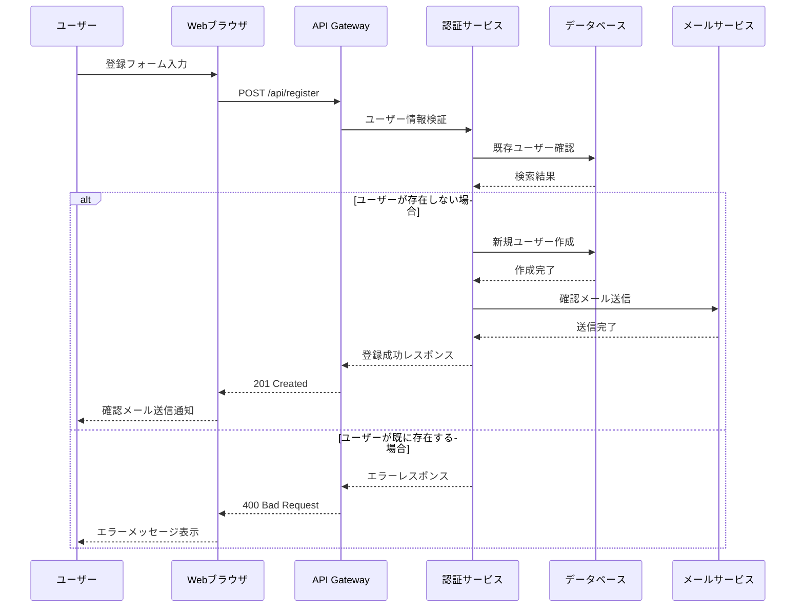
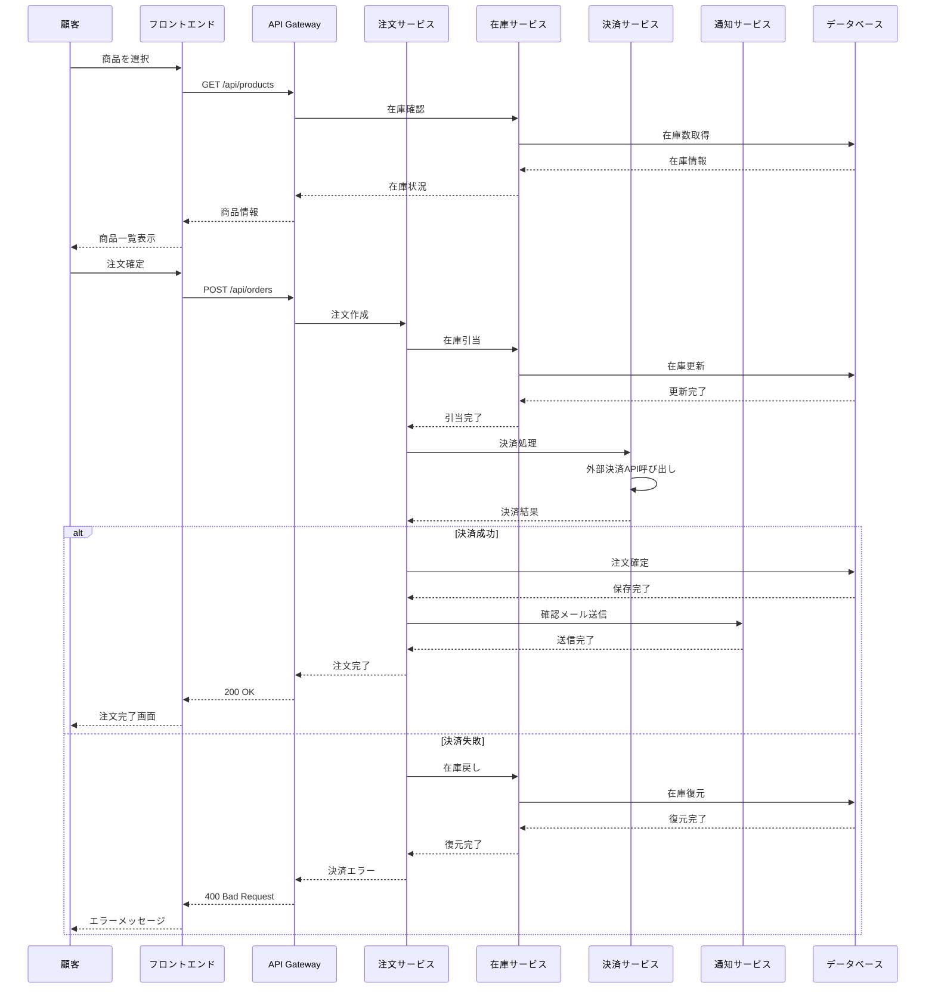
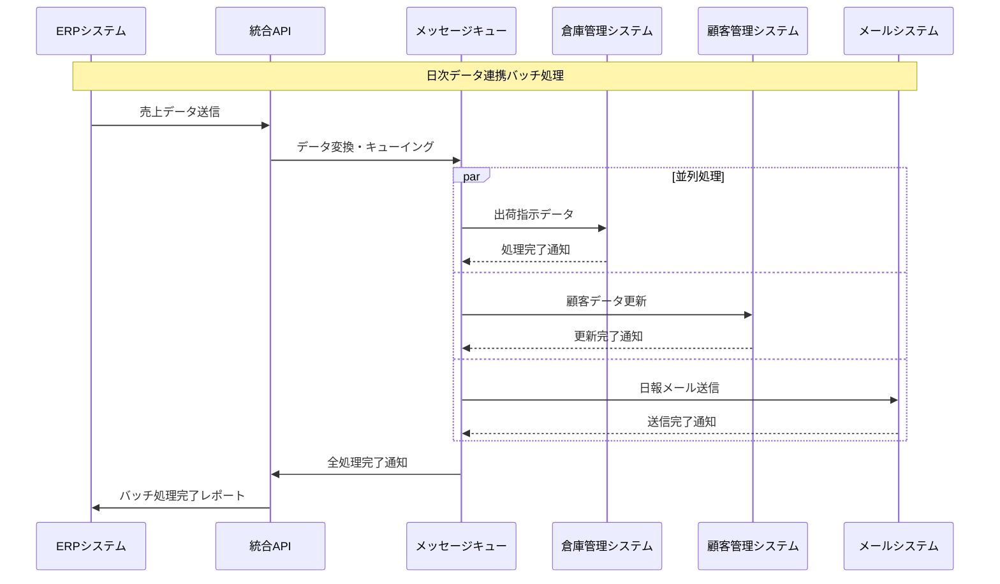

# ユーザージャーニー

## ユーザー登録フロー

```mermaid
sequenceDiagram
    participant U as ユーザー
    participant W as Webブラウザ
    participant A as API Gateway
    participant Auth as 認証サービス
    participant DB as データベース
    participant Email as メールサービス

    U->>W: 登録フォーム入力
    W->>A: POST /api/register
    A->>Auth: ユーザー情報検証
    Auth->>DB: 既存ユーザー確認
    DB-->>Auth: 検索結果

    alt ユーザーが存在しない場合
        Auth->>DB: 新規ユーザー作成
        DB-->>Auth: 作成完了
        Auth->>Email: 確認メール送信
        Email-->>Auth: 送信完了
        Auth-->>A: 登録成功レスポンス
        A-->>W: 201 Created
        W-->>U: 確認メール送信通知
    else ユーザーが既に存在する場合
        Auth-->>A: エラーレスポンス
        A-->>W: 400 Bad Request
        W-->>U: エラーメッセージ表示
    end
```

## 注文処理フロー

```mermaid
sequenceDiagram
    participant C as 顧客
    participant UI as フロントエンド
    participant API as API Gateway
    participant Order as 注文サービス
    participant Inventory as 在庫サービス
    participant Payment as 決済サービス
    participant Notification as 通知サービス
    participant DB as データベース

    C->>UI: 商品を選択
    UI->>API: GET /api/products
    API->>Inventory: 在庫確認
    Inventory->>DB: 在庫数取得
    DB-->>Inventory: 在庫情報
    Inventory-->>API: 在庫状況
    API-->>UI: 商品情報
    UI-->>C: 商品一覧表示

    C->>UI: 注文確定
    UI->>API: POST /api/orders
    API->>Order: 注文作成

    Order->>Inventory: 在庫引当
    Inventory->>DB: 在庫更新
    DB-->>Inventory: 更新完了
    Inventory-->>Order: 引当完了

    Order->>Payment: 決済処理
    Payment->>Payment: 外部決済API呼び出し
    Payment-->>Order: 決済結果

    alt 決済成功
        Order->>DB: 注文確定
        DB-->>Order: 保存完了
        Order->>Notification: 確認メール送信
        Notification-->>Order: 送信完了
        Order-->>API: 注文完了
        API-->>UI: 200 OK
        UI-->>C: 注文完了画面
    else 決済失敗
        Order->>Inventory: 在庫戻し
        Inventory->>DB: 在庫復元
        DB-->>Inventory: 復元完了
        Inventory-->>Order: 復元完了
        Order-->>API: 決済エラー
        API-->>UI: 400 Bad Request
        UI-->>C: エラーメッセージ
    end
```

## システム間連携フロー

```mermaid
sequenceDiagram
    participant ERP as ERPシステム
    participant API as 統合API
    participant Queue as メッセージキュー
    participant WMS as 倉庫管理システム
    participant CRM as 顧客管理システム
    participant Mail as メールシステム

    Note over ERP,Mail: 日次データ連携バッチ処理

    ERP->>API: 売上データ送信
    API->>Queue: データ変換・キューイング

    par 並列処理
        Queue->>WMS: 出荷指示データ
        WMS-->>Queue: 処理完了通知
    and
        Queue->>CRM: 顧客データ更新
        CRM-->>Queue: 更新完了通知
    and
        Queue->>Mail: 日報メール送信
        Mail-->>Queue: 送信完了通知
    end

    Queue->>API: 全処理完了通知
    API->>ERP: バッチ処理完了レポート
```
