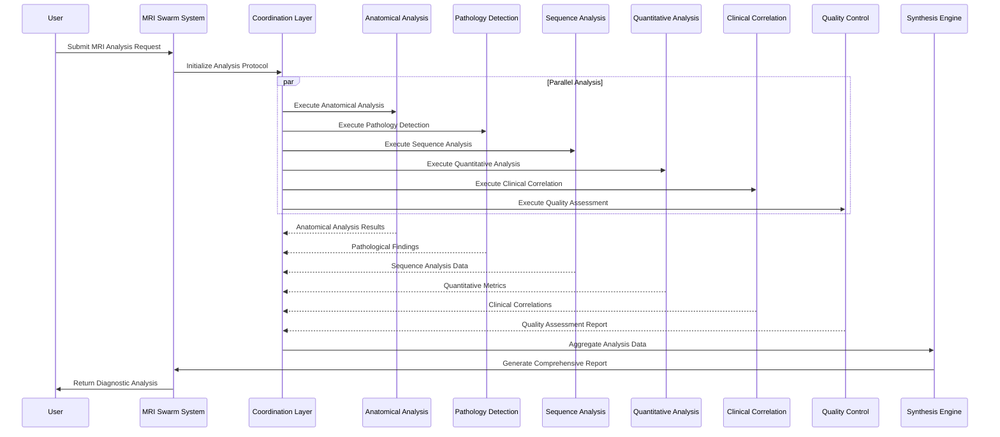

# MRI Swarm

MRI Swarm is an enterprise-grade collaborative system designed for comprehensive MRI scan analysis. It leverages a distributed network of specialized medical imaging agents, each focusing on different aspects of MRI interpretation, to provide detailed and accurate analysis of medical imaging data.

## Features

- **Multi-Agent Distributed Analysis**: Six specialized medical imaging agents working in coordination
- **Comprehensive Diagnostic Analysis**: From detailed anatomical structure to clinical correlation
- **Advanced Quality Assurance**: Integrated quality assessment and artifact detection protocols
- **Automated Clinical Reporting**: Generates detailed medical summaries with diagnostic insights
- **Flexible Input Processing**: Supports single and multiple MRI sequence analysis

## Installation

```bash
pip install -r requirements.txt
```

## Quick Start Guide

```python
from mri_swarm import mri_swarm

# Analyze a single MRI scan
result = mri_swarm(
    task="Analyze this brain MRI for signs of multiple sclerosis",
    img="path/to/brain_mri.jpg"
)
print(result)

# Analyze multiple MRI scans
results = mri_swarm(
    task="Compare these brain MRIs for progression of tumor",
    imgs=["scan1.jpg", "scan2.jpg"]
)
print(results)
```

## Agent Architecture

The system comprises six specialized medical imaging agents and one synthesis agent:

1. **Anatomical Analysis Agent**
   - Precise anatomical structure identification
   - Advanced brain region mapping and segmentation
   - Multi-tissue classification system

2. **Pathology Detection Agent**
   - Advanced tumor detection and classification
   - Comprehensive lesion identification
   - Disease marker evaluation protocol

3. **Sequence Analysis Agent**
   - T1/T2 weighted image interpretation
   - FLAIR sequence analysis
   - Diffusion-weighted imaging interpretation

4. **Quantitative Analysis Agent**
   - High-precision volumetric measurements
   - Signal intensity quantification
   - Advanced statistical analysis

5. **Clinical Correlation Agent**
   - Systematic symptom correlation
   - Treatment response assessment
   - Evidence-based outcome prediction

6. **Quality Control Agent**
   - Comprehensive image quality assessment
   - Systematic artifact detection
   - Protocol compliance verification

7. **Synthesis Agent**
   - Integration of diagnostic findings
   - Generation of comprehensive medical reports
   - Evidence-based diagnostic recommendations

## System Operation

1. User submits an MRI analysis task with imaging data
2. System initiates a coordinated analysis protocol
3. Specialized agents perform targeted analysis
4. Agents exchange diagnostic insights
5. Synthesis agent integrates findings
6. System generates comprehensive diagnostic report

## Implementation Examples

```python
# Case 1: Tumor Analysis
result = mri_swarm(
    task="Analyze this brain MRI for presence and characteristics of any tumors",
    img="tumor_case.jpg"
)

# Case 2: Multiple Sclerosis Assessment
result = mri_swarm(
    task="Evaluate these MRI sequences for MS lesions and disease progression",
    imgs=["ms_baseline.jpg", "ms_followup.jpg"]
)

# Case 3: Quality Assessment
result = mri_swarm(
    task="Assess the quality of this MRI scan and identify any artifacts",
    img="scan_quality_check.jpg"
)
```

## System Architecture Diagram




## API File

[Learn how to setup an API for MRI Swarm](./docs/api.md)

## Docker Setup

[Learn how to run MRI Swarm using Docker](./docs/docker.md)

## Contributing

We welcome contributions from the medical imaging and software development community. Please submit pull requests following our contribution guidelines.

## Todo

- [ ] Implement the ability to create detailed documents on the patient like a real-life MRI scan
- [ ] Implement unit tests for the main file
- [ ] Implement unit tests for the api

## License

This project is licensed under the terms specified in the LICENSE file included in the repository.
