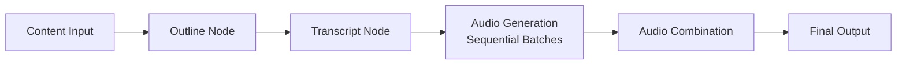

# Podcast Creator

An AI-powered podcast generation library that creates conversational audio content from text-based sources. This pip-installable package processes documents, generates structured outlines, creates natural dialogue transcripts, and converts them into high-quality audio podcasts using **LangGraph workflow orchestration**.

## 🚀 Quick Start

### Installation

```bash
# Install from PyPI (when published)
pip install podcast-creator

# Or install from source
git clone <repository-url>
cd podcast-creator
pip install .
```

### Initialize Your Project

```bash
# Create templates and configuration files
podcast-creator init

# This creates:
# - prompts/podcast/outline.jinja
# - prompts/podcast/transcript.jinja  
# - speakers_config.json
# - example_usage.py
```

### Generate Your First Podcast

```python
import asyncio
from podcast_creator import create_podcast

async def main():
    result = await create_podcast(
        content="Your content here...",
        briefing="Create an engaging discussion about...",
        episode_name="my_podcast",
        output_dir="output/my_podcast",
        speaker_config="ai_researchers"
    )
    print(f"✅ Podcast created: {result['final_output_file_path']}")

asyncio.run(main())
```

## ✨ Features

### 🔧 **Flexible Configuration**

```python
from podcast_creator import configure

# Configure with custom templates
configure("templates", {
    "outline": "Your custom outline template...",
    "transcript": "Your custom transcript template..."
})

# Configure with custom paths
configure({
    "prompts_dir": "./my_templates",
    "speakers_config": "./my_speakers.json",
    "output_dir": "./podcasts"
})

# Configure speakers inline
configure("speakers_config", {
    "profiles": {
        "my_hosts": {
            "tts_provider": "elevenlabs",
            "tts_model": "eleven_flash_v2_5",
            "speakers": [...]
        }
    }
})
```

### 🎙️ **Core Features**

- **🔄 LangGraph Workflow**: Advanced state management and parallel processing
- **👥 Multi-Speaker Support**: Dynamic 1-4 speaker configurations with rich personalities
- **⚡ Parallel Audio Generation**: API-safe batching with concurrent processing
- **🔧 Fully Configurable**: Multiple AI providers (OpenAI, Anthropic, Google, etc.)
- **📊 Content Processing**: Extracts content from various sources
- **🤖 AI-Powered Generation**: Creates structured outlines and natural dialogues
- **🎵 Multi-Provider TTS**: ElevenLabs, OpenAI, Google TTS support
- **📝 Flexible Templates**: Jinja2-based prompt customization
- **🌍 Multilingual Support**: Generate content in multiple languages

## 🏗️ Architecture

### LangGraph Workflow



### Configuration Priority

The library uses a smart priority system for loading resources:

1. **User Configuration** (highest priority)

   ```python
   configure("templates", {"outline": "...", "transcript": "..."})
   ```

2. **Custom Paths**

   ```python
   configure("prompts_dir", "/path/to/templates")
   ```

3. **Working Directory**
   - `./prompts/podcast/*.jinja`
   - `./speakers_config.json`

4. **Bundled Defaults** (lowest priority)
   - Package includes production-ready templates
   - Multiple speaker profiles included

## 📚 Usage Examples

### Basic Usage

```python
import asyncio
from podcast_creator import create_podcast

async def main():
    result = await create_podcast(
        content="AI has transformed many industries...",
        briefing="Create an informative discussion about AI impact",
        episode_name="ai_impact",
        output_dir="output/ai_impact",
        speaker_config="ai_researchers"
    )

asyncio.run(main())
```

### Advanced Configuration

```python
from podcast_creator import configure, create_podcast

# Custom speaker configuration
configure("speakers_config", {
    "profiles": {
        "tech_experts": {
            "tts_provider": "elevenlabs",
            "tts_model": "eleven_flash_v2_5",
            "speakers": [
                {
                    "name": "Dr. Alex Chen",
                    "voice_id": "your_voice_id",
                    "backstory": "Senior AI researcher with focus on ethics",
                    "personality": "Thoughtful, asks probing questions"
                },
                {
                    "name": "Jamie Rodriguez", 
                    "voice_id": "your_voice_id_2",
                    "backstory": "Tech journalist and startup advisor",
                    "personality": "Enthusiastic, great at explanations"
                }
            ]
        }
    }
})

# Custom templates
configure("templates", {
    "outline": """
    Create a {{ num_segments }}-part podcast outline about: {{ briefing }}
    
    Content: {{ context }}
    
    Speakers: {{ speaker.name }}: {{ speaker.personality }}
    """,
    "transcript": """
    Generate natural dialogue for: {{ segment.name }}
    
    Keep it conversational and engaging.
    """
})

# Generate podcast with custom configuration
result = await create_podcast(
    content="Your content...",
    briefing="Your briefing...",
    episode_name="custom_podcast",
    speaker_config="tech_experts"
)
```

### Different Speaker Configurations

```python
# Solo expert
result = await create_podcast(
    content="Technical content...",
    briefing="Deep technical explanation...",
    speaker_config="solo_expert"
)

# Panel discussion (3-4 speakers)
result = await create_podcast(
    content="Complex topic...",
    briefing="Multi-perspective analysis...",
    speaker_config="diverse_panel"
)
```

## 🔧 Configuration API

### Main Functions

```python
from podcast_creator import configure, get_config, create_podcast

# Set configuration
configure(key, value)
configure({"key1": "value1", "key2": "value2"})

# Get configuration
value = get_config("key", default_value)

# Generate podcast
result = await create_podcast(...)
```

### Configuration Options

| Key | Type | Description |
|-----|------|-------------|
| `prompts_dir` | `str` | Directory containing template files |
| `templates` | `dict` | Inline template content |
| `speakers_config` | `str/dict` | Path to speaker JSON or inline config |
| `output_dir` | `str` | Default output directory |

## 🎭 Speaker Configuration

### Speaker Profile Structure

```json
{
  "profiles": {
    "profile_name": {
      "tts_provider": "elevenlabs",
      "tts_model": "eleven_flash_v2_5",
      "speakers": [
        {
          "name": "Speaker Name",
          "voice_id": "voice_id_from_provider",
          "backstory": "Rich background that informs expertise",
          "personality": "Speaking style and traits"
        }
      ]
    }
  }
}
```

### Creating Custom Speakers

1. **Get Voice IDs** from your TTS provider
2. **Design Personalities** that complement each other
3. **Write Rich Backstories** to guide content expertise
4. **Test Combinations** with different content types

## 🌐 Supported Providers

### Language Models (via Esperanto)

- **OpenAI**: GPT-4, GPT-4o, o1, o3
- **Anthropic**: Claude 3.5 Sonnet, Claude 3 Opus
- **Google**: Gemini Pro, Gemini Flash
- **Groq**: Mixtral, Llama models
- **Ollama**: Local model support
- **Perplexity**: Research-enhanced models
- **Azure OpenAI**: Enterprise OpenAI
- **Mistral**: Mistral models
- **DeepSeek**: DeepSeek models
- **xAI**: Grok models
- **OpenRouter**: Multi-provider access

### Text-to-Speech Services

- **ElevenLabs**: Professional voice synthesis
- **OpenAI TTS**: High-quality voices
- **Google**: Google Cloud TTS
- **Vertex AI**: Google Cloud enterprise

## 📁 Output Structure

```text
output/episode_name/
├── outline.json          # Structured outline
├── transcript.json       # Complete dialogue
├── clips/               # Individual audio clips
│   ├── 0000.mp3         # First segment
│   ├── 0001.mp3         # Second segment
│   └── ...              # Additional segments
└── audio/               # Final output
    └── episode_name.mp3  # Complete podcast
```

## 🛠️ CLI Commands

```bash
# Initialize project with templates
podcast-creator init

# Initialize in specific directory
podcast-creator init --output-dir /path/to/project

# Overwrite existing files
podcast-creator init --force

# Show version
podcast-creator version
```

## 🚀 Performance

- **⚡ Parallel Processing**: 5 concurrent audio clips per batch
- **🔄 API-Safe Batching**: Respects provider rate limits
- **📊 Scalable**: Handles 30+ dialogue segments efficiently
- **⏱️ Fast Generation**: ~2-3 minutes for typical podcasts
- **🎯 Optimized Workflow**: Smart resource management

## 🧪 Development

### Installing for Development

```bash
git clone <repository-url>
cd podcast-creator
pip install -e .

# Or with uv
uv sync
uv pip install -e .
```

### Project Structure

```text
podcast-creator/
├── src/
│   └── podcast_creator/
│       ├── __init__.py           # Public API
│       ├── config.py             # Configuration system
│       ├── cli.py                # CLI commands
│       ├── core.py               # Core utilities
│       ├── graph.py              # LangGraph workflow
│       ├── nodes.py              # Workflow nodes
│       ├── speakers.py           # Speaker management
│       ├── state.py              # State management
│       ├── validators.py         # Validation utilities
│       └── resources/            # Bundled templates
│           ├── prompts/
│           ├── speakers_config.json
│           └── examples/
├── pyproject.toml               # Package configuration
└── README.md
```

### Testing

```bash
# Test the package
python -c "from podcast_creator import create_podcast; print('Import successful')"

# Test CLI
podcast-creator --help

# Test initialization
mkdir test_project
cd test_project
podcast-creator init
python example_usage.py
```

## 📝 Examples

Check the `examples/` directory for:

- Basic usage examples
- Advanced configuration
- Custom speaker setups
- Multi-language podcasts
- Different content types

## 🤝 Contributing

1. Fork the repository
2. Create a feature branch
3. Make your changes
4. Add tests if applicable
5. Submit a pull request

## 📄 License

[Your License Here]

## 🔗 Links

- **Documentation**: [Link to docs]
- **Issues**: [GitHub Issues]
- **Discussions**: [GitHub Discussions]
- **Examples**: [Examples Directory]

---

Made with ❤️ for the AI community
