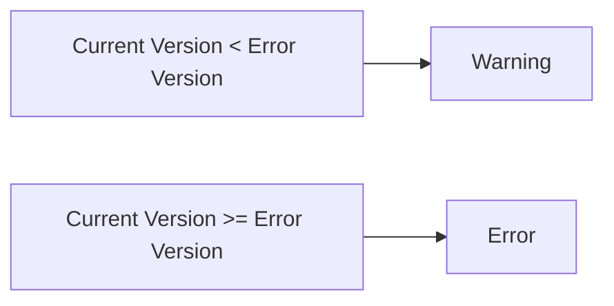

# pyminideprecator
<a id="readme-top"></a>

<div align="center">
  <p align="center">
    Fast and minimalistic library for set methods and classes as deprecated
    <br />
    <a href="https://alexeev-prog.github.io/pyminideprecator/"><strong>Explore the docs »</strong></a>
    <br />
    <br />
    <a href="#-getting-started">Getting Started</a>
    ·
    <a href="#-usage-examples">Basic Usage</a>
    ·
    <a href="https://alexeev-prog.github.io/pyminideprecator/">Documentation</a>
    ·
    <a href="https://github.com/alexeev-prog/pyminideprecator/blob/main/LICENSE">License</a>
  </p>
</div>
<br>
<p align="center">
    
    
    
    
    
    
    
    
    
    
    
    
</p>

<p align="center">
    
</p>

 > Fast and minimalistic library for set methods and classes as deprecated

`pyminideprecator` is a lightweight yet powerful decorator for managing code deprecation in Python libraries and applications. It provides a robust mechanism to mark deprecated code with automatic warnings that escalate to errors at specified version thresholds, supporting both semantic versioning and date-based versioning.

## Features

- **Minimal API**: Single decorator for all deprecation needs
- **Version-aware**: Supports semantic (1.2.3) and date-based (2023.12.31) versions
- **Automatic escalation**: Warnings become errors at specified versions
- **Class support**: Decorates classes and all their methods
- **Documentation integration**: Auto-updates docstrings with deprecation notices
- **Zero dependencies**: Pure Python implementation
- **100% test coverage**: Production-ready reliability

## Installation

```bash
pip install pyminideprecator
```

## Quick Start

### Basic Function Deprecation

```python
from pyminideprecator import deprecate, set_current_version

# Set current application version
set_current_version("1.2.0")

@deprecate(
    remove_version="2.0.0",
    message="Legacy API function",
    instead="new_api()",
    since="1.0.0"
)
def old_api() -> str:
    """Original documentation"""
    return "legacy data"

# Generates warning when called
print(old_api())
```

### Class Deprecation

```python
@deprecate(
    remove_version="2024.01.01",
    message="Old database client",
    instead="NewDBClient"
)
class OldDBClient:
    def __init__(self, url: str):
        self.url = url

    def query(self, sql: str) -> list:
        return ["result1", "result2"]

# Shows warning on instantiation
client = OldDBClient("db://localhost")
```

## Core Concepts

### Version Management

pyminideprecator supports two version formats:

1. **Semantic Versioning** (SemVer):
   - Format: `MAJOR.MINOR.PATCH`
   - Example: `1.2.3`, `2.0.0`
   - Comparison: Numeric ordering

2. **Date-based Versions**:
   - Format: `YYYY.MM.DD`
   - Example: `2023.12.31`, `2024.01.01`
   - Comparison: Chronological ordering

Set your application version before using deprecated functionality:

```python
from pyminideprecator import set_current_version, Version

# Set as string
set_current_version("1.2.3")

# Set as Version object
set_current_version(Version("2023.12.31"))

# Auto-detect from package metadata
set_current_version(source="your_package_name")
```

### Lifecycle Management

Deprecation follows a predictable lifecycle:



## API Reference

### Decorator: `@deprecate`

Marks functions, classes, or methods as deprecated.

**Parameters:**
| Parameter        | Type             | Required | Default              | Description |
|------------------|------------------|----------|----------------------|-------------|
| `remove_version` | str              | Yes      | -                    | Version when functionality will be removed |
| `message`        | str              | Yes      | -                    | Deprecation description |
| `since`          | Optional[str]    | No       | None                 | Version when deprecated |
| `instead`        | Optional[str]    | No       | None                 | Replacement suggestion |
| `category`       | Type[Warning]    | No       | DeprecationWarning   | Warning class |
| `stacklevel`     | int              | No       | 2                    | Warning stack level |
| `error_version`  | Optional[str]    | No       | remove_version       | Version when errors start |

### Function: `set_current_version(version: Union[str, Version, None])`

Sets the current application version.

**Parameters:**
- `version`: Version string, Version object, or None to clear

### Function: `get_current_version() -> Optional[Version]`

Returns the current application version.

### Class: `Version`

Represents a version for comparison operations.

**Constructor:**
```python
Version(version_str: str)
```

**Methods:**
- `__lt__(other: Version) -> bool`: Less than comparison
- `__ge__(other: Version) -> bool`: Greater or equal comparison

### Exception: `DeprecatedError`

Raised when deprecated functionality is used beyond its error version.

## Advanced Usage

### Property Deprecation

```python
class DataModel:
    @property
    @deprecate("2.5.0", "Use new_property instead")
    def old_property(self) -> str:
        return self._value
```

### Static Method Deprecation

```python
class Utilities:
    @deprecate("3.0.0", "Use new_utility()")
    @staticmethod
    def old_utility() -> int:
        return 42
```

### Custom Warning Type

```python
@deprecate(
    "3.0.0",
    "Future removal",
    category=FutureWarning
)
def future_function():
    pass
```

### Different Error Version

```python
@deprecate(
    remove_version="2.0.0",
    message="Early removal",
    error_version="1.9.0"
)
def early_removal_func():
    pass
```

## Integration Examples

### pytest Testing

```python
import pytest
from pyminideprecator import set_current_version

def test_deprecation_warning():
    set_current_version("1.0.0")

    with pytest.warns(DeprecationWarning):
        deprecated_function()

def test_deprecation_error():
    set_current_version("2.0.0")

    with pytest.raises(DeprecatedError):
        deprecated_function()
```

### Sphinx Documentation

Deprecation notices automatically appear in docstrings:

```python
@deprecate("2.0.0", "Deprecated function")
def sample_function():
    """Original documentation"""
```

Resulting docstring:
```
**DEPRECATED** Deprecated function Will be removed in 2.0.0.

Original documentation
```

## Best Practices

1. **Set version early**: Configure version at application start
2. **Provide alternatives**: Always use `instead` parameter
3. **Gradual enforcement**: Use `error_version` before `remove_version`
4. **Document deprecations**: Include `since` for historical context
5. **Test all states**: Verify warning and error behaviors

## Limitations

1. Global version state
2. Cannot compare semantic vs date-based versions
3. No async function support (planned for v0.2.0)

## Contributing

We welcome contributions! Please see [CONTRIBUTING.md](CONTRIBUTING.md) for guidelines.

### License & Support
This project operates under **MIT LICENSE** - see [LICENSE](https://github.com/alexeev-prog/pyminideprecator/blob/main/LICENSE). For enterprise support, contact [alexeev.dev@mail.ru](mailto:alexeev.dev@mail.ru).

[Explore Documentation](https://alexeev-prog.github.io/pyminideprecator) |
[Report Issue](https://github.com/alexeev-prog/pyminideprecator/issues) |
[View Examples](./examples)

<p align="right">(<a href="#readme-top">back to top</a>)</p>

---
Fast and minimalistic library for set methods and classes as deprecated

Copyright (C) 2024  Alexeev Bronislav (C) 2024

This library is free software; you can redistribute it and/or
modify it under the terms of the GNU Lesser General Public
License as published by the Free Software Foundation; either
version 2.1 of the License, or (at your option) any later version.

This library is distributed in the hope that it will be useful,
but WITHOUT ANY WARRANTY; without even the implied warranty of
MERCHANTABILITY or FITNESS FOR A PARTICULAR PURPOSE.  See the GNU
Lesser General Public License for more details.

You should have received a copy of the GNU Lesser General Public
License along with this library; if not, write to the Free Software
Foundation, Inc., 51 Franklin Street, Fifth Floor, Boston, MA  02110-1301
USA

