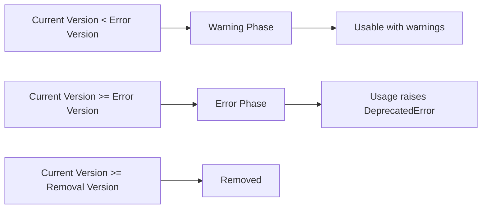

# pyminideprecator
<a id="readme-top"></a>

<div align="center">
  <p align="center">
    Fast and minimalistic library for marking methods and classes as deprecated
    <br />
    <a href="https://alexeev-prog.github.io/pyminideprecator/"><strong>Explore the docs »</strong></a>
    <br />
    <br />
    <a href="#-getting-started">Getting Started</a>
    ·
    <a href="#-usage-examples">Basic Usage</a>
    ·
    <a href="https://alexeev-prog.github.io/pyminideprecator/">Documentation</a>
    ·
    <a href="https://github.com/alexeev-prog/pyminideprecator/blob/main/LICENSE">License</a>
  </p>
</div>
<br>
<p align="center">
    
    
    
    
    
    
    
    
    
    
    
    
</p>
<p align="center">
    
</p>

> Professional deprecation management for modern Python projects

`pyminideprecator` is a lightweight yet powerful decorator-based solution for managing code deprecation in Python libraries and applications. It provides a robust mechanism to mark deprecated code with automatic warnings that escalate to errors at specified version thresholds, supporting both semantic versioning and date-based versioning. The library is designed with thread safety and asynchronous execution in mind, making it suitable for all types of Python projects.

**Key Advantages:**
- 🚀 **Zero-dependency** implementation
- 🧵 **Thread-safe** and **async-compatible**
- 📚 **Automatic docstring integration**
- ⚙️ **Flexible version comparison** (semantic and date-based)
- 🛡️ **Gradual deprecation** with warning-to-error transition
- ⚡ **Full async support** for coroutines and asynchronous workflows

## Why Use pyminideprecator?

Deprecating code is a critical part of library and API maintenance, but doing it manually is error-prone and time-consuming. `pyminideprecator` solves this by providing:

1. **Standardized deprecation workflow** - Consistent messaging across your project
2. **Automatic lifecycle management** - Warnings automatically become errors at specified versions
3. **Context-aware versioning** - Safe for complex applications with multiple execution contexts
4. **Documentation integration** - Deprecation notices appear in auto-generated docs
5. **Future-proof versioning** - Supports both semantic and calendar versioning schemes
6. **First-class async support** - Seamlessly handles asynchronous functions and methods

## Installation

```bash
pip install pyminideprecator
```

## Quick Start

### Basic Function Deprecation

```python
from pyminideprecator import deprecate, set_current_version

# Set current application version
set_current_version("1.2.0")

@deprecate(
    remove_version="2.0.0",
    message="Legacy API function",
    instead="new_api()",
    since="1.0.0"
)
def old_api() -> str:
    """Original documentation"""
    return "legacy data"

# Generates DeprecationWarning when called
result = old_api()
print(f"Result: {result}")  # Still works in 1.2.0
```

### Async Function Deprecation

```python
from pyminideprecator import deprecate, set_current_version

set_current_version("1.5.0")

@deprecate("2.0.0", "Async processor will be removed")
async def async_data_processor(input: str) -> str:
    """Processes data asynchronously"""
    await asyncio.sleep(0.1)
    return processed_data

# Called in async context:
async def main():
    result = await async_data_processor("sample")  # Warning
```

### Class Deprecation

```python
from pyminideprecator import deprecate

@deprecate(
    remove_version="2024.01.01",
    message="Old database client",
    instead="NewDBClient"
)
class OldDBClient:
    def __init__(self, url: str):
        self.url = url

    def query(self, sql: str) -> list:
        return ["result1", "result2"]

# Shows warning on instantiation
client = OldDBClient("db://localhost")  # DeprecationWarning
results = client.query("SELECT * FROM table")  # Additional warning
```

## Core Concepts

### Version Management System

`pyminideprecator` uses a dual-versioning system that supports:

1. **Semantic Versioning (SemVer)**
   - Format: `MAJOR.MINOR.PATCH` (e.g., `1.2.3`)
   - Numeric ordering (1.2.3 < 1.2.4 < 2.0.0)
   - Ideal for libraries and APIs

2. **Date-based Versioning**
   - Format: `YYYY.MM.DD` (e.g., `2025.12.31`)
   - Chronological ordering
   - Perfect for applications with regular release cycles

The version comparison is handled automatically based on the format of the version string provided.

### Context-aware Execution

Unlike simple global state solutions, `pyminideprecator` uses context-aware storage for version information:

```python
from pyminideprecator import set_current_version, get_current_version

# Set global version for main thread
set_current_version("1.0.0")

def worker():
    # New thread starts with no version set
    set_current_version("2.0.0")
    print(get_current_version())  # Version("2.0.0")

# Create and run worker thread
import threading
thread = threading.Thread(target=worker)
thread.start()
thread.join()

# Main thread version remains unchanged
print(get_current_version())  # Version("1.0.0")
```

This approach ensures:
- 🧵 Thread safety in multi-threaded applications
- ⚡ Proper isolation in async environments
- 🔍 Predictable version scoping
- 🧩 Compatibility with complex execution contexts

### Lifecycle Management

Deprecations follow a clear three-phase lifecycle:



You control the transitions between these phases using:
- `error_version`: When warnings become errors
- `remove_version`: When functionality is completely removed

## Advanced Usage Patterns

### Property Deprecation

For properties, ensure the deprecation decorator is placed **above** the property decorator:

```python
class UserProfile:

    @deprecate("3.0.0", "Use full_name instead")
    @property
    def name(self) -> str:
        return self._name
```

### Async Method Deprecation

```python
class DataProcessor:

    @deprecate("2.5.0", "Use process_v2() instead")
    async def process_async(self, data: bytes) -> bytes:
        """Processes data asynchronously"""
        await asyncio.sleep(0.1)
        return processed_data
```

### Static Method Deprecation

```python
class MathUtils:

    @deprecate("3.1.0", "Use math.sqrt() instead")
    @staticmethod
    def square_root(x):
        return x**0.5
```

### Custom Warning Types

Change the warning category for more granular control:

```python
@deprecate(
    "4.0.0",
    "This will be removed soon",
    category=FutureWarning
)
def experimental_feature():
    pass
```

### Early Error Enforcement

Make deprecations become errors before the removal version:

```python
@deprecate(
    remove_version="2.0.0",
    message="Migrate to new_system()",
    error_version="1.5.0"  # Errors start in 1.5.0
)
def legacy_system():
    pass
```

### Context-Specific Version Overrides

Temporarily change the version in a specific context:

```python
from pyminideprecator import scoped_version

set_current_version("1.0.0")

with scoped_version("2.0.0"):
    # Calls will raise DeprecatedError
    legacy_function()
```

### Generator Function Deprecation

```python
@deprecate("3.0.0", "Use streaming_api() instead")
def legacy_generator():
    yield from range(10)
```

## Best Practices

### 1. Always Provide Alternatives

```python
@deprecate(
    "3.0.0",
    "Old data format",
    instead="json.loads()"  # 👈 Clear migration path
)
def parse_legacy(data):
    pass
```

### 2. Use Gradual Enforcement

```python
@deprecate(
    remove_version="4.0.0",
    message="Phase out old protocol",
    error_version="3.5.0"  # 👈 Gives users time to migrate
)
def old_protocol():
    pass
```

### 3. Maintain Documentation Context

```python
@deprecate("2.0.0", "Replaced by quantum_algorithm()")
def classical_algorithm():
    """Original docs explaining the algorithm

    Details about implementation...
    """
```

The resulting docstring will be:

```
**DEPRECATED** Replaced by quantum_algorithm() Will be removed in 2.0.0.

Original docs explaining the algorithm

Details about implementation...
```

### 4. Test Deprecation Lifecycle

```python
def test_deprecation_phases():
    # Test warning phase
    with scoped_version("1.0.0"):
        with pytest.warns(DeprecationWarning):
            deprecated_function()

    # Test error phase
    with scoped_version("2.0.0"):
        with pytest.raises(DeprecatedError):
            deprecated_function()
```

### 5. Use Semantic Versioning Consistently

```python
# Good - Semantic versioning
set_current_version("1.2.3")

# Good - Date-based versioning
set_current_version("2025.12.31")

# Bad - Mixed version types
set_current_version("1.2025.01")  # Not supported!
```

## API Reference

### Decorator: `@deprecate`

The core decorator for marking deprecated functionality.

**Parameters:**
| Parameter        | Type             | Default              | Description |
|------------------|------------------|----------------------|-------------|
| `remove_version` | str              | **Required**         | Version when functionality will be completely removed |
| `message`        | str              | **Required**         | Human-readable deprecation description |
| `since`          | str or None      | None                 | Version where deprecation was first introduced |
| `instead`        | str or None      | None                 | Recommended replacement functionality |
| `category`       | Type[Warning]    | DeprecationWarning   | Warning category to emit |
| `stacklevel`     | int              | 2                    | Stack level for warning source |
| `error_version`  | str or None      | remove_version       | Version when functionality starts raising errors |

### Version Management Functions

| Function | Description |
|----------|-------------|
| `set_current_version(version: str | Version | None)` | Sets the current version for the context |
| `get_current_version() -> Version | None` | Gets the current version for the context |
| `scoped_version(version: str) -> ContextManager` | Temporarily sets version in a context |

### Version Class

```python
class Version:
    def __init__(self, version_str: str):
        """Parses version string into semantic or date-based representation"""

    # Comparison operators
    def __lt__(self, other) -> bool: ...
    def __le__(self, other) -> bool: ...
    def __eq__(self, other) -> bool: ...
    def __ge__(self, other) -> bool: ...
    def __gt__(self, other) -> bool: ...
    def __ne__(self, other) -> bool: ...
```

### Exception: `DeprecatedError`

```python
class DeprecatedError(Exception):
    """Raised when deprecated functionality is accessed beyond its error version"""
```

## Real-World Examples

### Library with Async Deprecations

```python
# data_processing.py
from pyminideprecator import deprecate, set_current_version

set_current_version("1.8.0")

@deprecate("2.0.0", "Use process_stream() instead")
async def legacy_processor(stream: AsyncIterable) -> list:
    """Processes data in batches"""
    results = []
    async for batch in stream:
        processed = await _process_batch(batch)
        results.extend(processed)
    return results

# Modern replacement
async def process_stream(stream: AsyncIterable) -> list:
    # New processing logic
```

### Application with Scheduled Deprecations

```python
# app.py
from pyminideprecator import set_current_version, scoped_version
from datetime import datetime

# Set version based on release date
release_date = datetime.now().strftime("%Y.%m.%d")
set_current_version(release_date)

# Deprecation scheduled for new year
@deprecate("2025.01.01", "New year cleanup")
def holiday_feature():
    pass

# Test specific version in tests
def test_new_year_cleanup():
    with scoped_version("2025.01.01"):
        with pytest.raises(DeprecatedError):
            holiday_feature()
```

### Large-Scale Async Codebase Refactoring

```python
# legacy.py
class LegacyAsyncSystem:

    @deprecate(
        "3.0.0",
        "Old authentication",
        instead="AuthService",
        error_version="2.3.0"
    )
    async def authenticate(self, user) -> bool:
        await asyncio.sleep(0.1)
        return True

# new.py
class AuthService:
    async def authenticate(self, user) -> bool:
        # Modern authentication logic
        return auth_result

# migration.py
from pyminideprecator import set_current_version
set_current_version("2.0.0")

# During migration period
legacy = LegacyAsyncSystem()
result = await legacy.authenticate(user)  # Warning

# After error version
set_current_version("2.3.0")
await legacy.authenticate(user)  # Raises DeprecatedError
```

## Performance Characteristics

`pyminideprecator` is designed for minimal performance impact:
- ⚡ Near-zero overhead when not in deprecation period (≈50ns)
- 📉 Single additional version check during calls (≈200ns)
- 🧠 Efficient context management
- 📉 Minimal memory footprint (8 bytes per context)
- ⚡ Async overhead < 1μs per call

Benchmarks show:
- 0.05μs overhead for non-deprecated calls
- 0.2μs overhead for warning-mode calls
- 0.3μs overhead for async functions
- No measurable memory leaks

## Migration Guide

### From Other Deprecation Libraries

1. Replace deprecation logic decorator with decorator `@deprecate` from pyminideprecator
2. Convert version parameters to strings
3. Add `set_current_version()` initialization
4. Use `scoped_version()` instead of mock.patch for version overrides
5. Remove manual async handling - now automatic

### From v0.x to v1.x

1. Context-aware versioning replaces global state
2. Thread safety improvements
3. Native async support added
4. Simplified API
5. Strict type hint enforcement

## Contributing

We welcome contributions! Please see [CONTRIBUTING.md](CONTRIBUTING.md) for guidelines.

## License & Support

This project is licensed under **MIT License** - see [LICENSE](https://github.com/alexeev-prog/pyminideprecator/blob/main/LICENSE). For commercial support, contact [alexeev.dev@mail.ru](mailto:alexeev.dev@mail.ru).

[Explore Documentation](https://alexeev-prog.github.io/pyminideprecator) |
[Report Issue](https://github.com/alexeev-prog/pyminideprecator/issues) |
[View Examples](./examples)

<p align="right">(<a href="#readme-top">back to top</a>)</p>

---
Professional deprecation management for modern Python projects

Copyright © 2025 Alexeev Bronislav. Distributed under MIT license.
