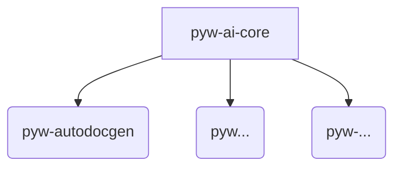

# 🤖 pyw-ai-core

Meta-pacchetto per orchestrare i pacchetti basati su intelligenza artificiale del framework **PythonWoods**.

## Installazione

```bash
pip install pyw-ai-core[autodocgen]
```

## 📦 Pacchetti inclusi (extras)

- `autodocgen`: Generazione documentazione automatica
- (futuri) `pyw...`, `pyw...`, `pyw...`...

## 📈 Architettura



## 📄 Licenza

MIT